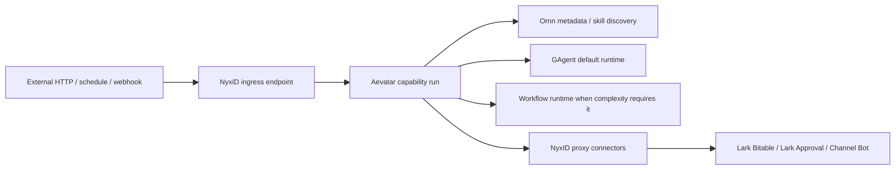

# Aevatar-native S 级能力支持说明

本文说明本仓库新增的两个 S 级能力 artifact 如何按目标边界落地：

- `budget-monitoring`
- `lark-onboarding-email-approval`

这不是把原有流程继续绑定到 n8n，也不是要求所有能力必须使用 workflow。目标结构是：NyxID 负责入口与外部连接，Ornn 负责能力 metadata、skill discovery 与 binding，Aevatar 负责按 metadata 选择最简 runtime 执行；默认优先使用 GAgent + skill，只有复杂到需要 durable run state、多事件 continuation、分支/并行或步骤级审计时才选择 workflow。

## 边界

NyxID 边界：

- 接收外部 HTTP POST、定时触发、webhook、channel bot route 或 service endpoint。
- 持有 Lark、审批、channel bot 等外部 credential，并通过 proxy 注入。
- 负责外部连接、approval policy、通知与回调目标配置。
- 通过 Ornn 托管的 capability metadata 把请求投递到 Aevatar capability run。

Aevatar 边界：

- 读取 Ornn 托管的 capability metadata，并以本仓库 artifact 作为 bootstrap mirror 与 CI 审计样本。
- 默认用 task-scoped GAgent 执行线性 ingress-to-skill-to-connector 能力。
- 仅在需要 durable run state、多事件 continuation、分支/并行或步骤级 retry/audit 时启用 workflow runtime。
- 通过 connector 名称调用 NyxID proxy。
- 通过 `payloadBuilder` contract 和 `tool_call/use_skill` 绑定 Ornn payload 构造能力。
- 不依赖 n8n runtime，不解释 n8n node，不执行 n8n expression。

Ornn 边界：

- 持有 S 级能力 metadata、runtime 选择、skill binding 和 contract reference 的权威副本。
- 通过 `ornnSkillBindings` 声明计算和 payload 构造步骤需要的 skill。
- 运行时通过统一 `use_skill` 工具加载对应 skill 指令。
- 不持有 Aevatar workflow run 状态，也不承担入口或 credential 注入。



## 新增 artifact

- `workflows/aevatar-native/s-capabilities.registry.json`：S capability registry 的 bootstrap mirror，声明 Ornn metadata ref、默认 GAgent runtime、可选 workflow、NyxID ingress、NyxID connector、Ornn skill binding 与 runtime assertion。
- `workflows/aevatar-native/optional-workflows/budget-monitoring.yaml`：预算监控能力在需要 workflow runtime 时的可选 workflow 定义。
- `workflows/aevatar-native/optional-workflows/lark-onboarding-email-approval.yaml`：Lark 入职邮箱审批能力在需要 workflow runtime 时的可选 workflow 定义。
- `workflows/aevatar-native/connectors/aevatar-native-s-capabilities.connectors.json`：NyxID proxy connector 模板，只包含环境变量占位符，不包含真实 secret。
- `tools/workflows/validate_aevatar_native_s_capabilities.py`：静态校验脚本，验证 capability registry 能找到两个能力，artifact 不依赖 n8n runtime，不含真实 secret，NyxID ingress/connector binding 存在，Ornn/tool binding 与 payload builder contract 覆盖 payload 构造步骤。
- `tools/ci/aevatar_native_s_capability_guard.sh`：CI guard，直接执行上述静态校验脚本，防止 registry、binding、secret 或 n8n marker 回归只停留在本地手动验证。

## Bootstrap 方式

最小闭环是 Ornn metadata + GAgent runtime + skill + connector；本仓库 artifact 只提供 bootstrap mirror 和测试样本：

1. Ornn 发布或更新 capability metadata，例如 `ornn://aevatar-native/capabilities/budget-monitoring` 与 `ornn://aevatar-native/capabilities/lark-onboarding-email-approval`。
2. NyxID 侧创建或更新 endpoint、schedule、relay webhook 或 channel bot route，把目标配置为 Aevatar capability callback URL。
3. Aevatar 启动后从 Ornn 拉取 capability metadata；若 metadata 不可用，可用本仓库 registry mirror 做本地 bootstrap 或 CI 校验。
4. 简单线性能力默认由 GAgent 执行：GAgent 读取 metadata，调用 `use_skill` 获取 Ornn skill，随后调用 NyxID connector。
5. 当 metadata 标明需要 durable run state、多事件 continuation、分支/并行或步骤级审计时，Aevatar 使用 `optionalWorkflow.workflowFile` 指向的 workflow 定义。
6. Aevatar connector bootstrap 默认合并 `workflows/aevatar-native/connectors/aevatar-native-s-capabilities.connectors.json` 中的 NyxID connector 模板；部署环境提供 `NYXID_PROXY_BASE_URL` 与相应 service slug 后会注册进 `IConnectorRegistry`。
7. 运行校验脚本：

```bash
python3 tools/workflows/validate_aevatar_native_s_capabilities.py
```

## 审计点

- registry 的 `metadataSource.owner` 必须是 Ornn，`localArtifactRole` 必须是 bootstrap mirror。
- registry 的 `runtimePolicy.defaultRuntime` 必须是 GAgent，`allowedRuntimes` 只能包含 GAgent 与 workflow，禁止 n8n。
- 每个 capability 必须有 `metadataRef` 指向 Ornn。
- 每个 capability 的默认 runtime 必须是 GAgent。
- 可选 workflow 必须只能作为复杂场景 fallback，并引用存在的 workflow YAML。
- 每个 capability 必须有 `nyxidIngress`，且 target 指向同名 Aevatar capability run。
- 每个 capability 声明的 NyxID connector 必须存在于 connector catalog，并被默认或可选执行 artifact 引用。
- 需要计算或 payload 构造的步骤必须有 `ornnSkillBindings`，并通过 `use_skill` 或同一 skill binding 明确关联。
- 每个 capability 必须声明 `payloadBuilder.kind = ornn_skill_binding`、`payloadBuilder.tool = use_skill`、skill 名称和 Ornn contract 引用，避免把 payload 构造伪装成未定义外部 HTTP 服务。
- artifact 不允许出现真实 token、secret、API key 或 credential 值。
- artifact 不允许出现 n8n runtime marker。

## 当前限制

当前实现没有新增 C# runtime primitive，也没有实现 n8n 兼容层。仓库内验证覆盖 capability metadata mirror、可选 workflow parser smoke、connector registry bootstrap 路径、`use_skill` 工具注册和 Ornn remote fetcher 注册；由于当前工作区没有真实 NyxID/Lark/Ornn 服务配置，本 PR 不声称已完成真实外部 E2E。完整业务执行仍要求部署环境提供 NyxID proxy 服务配置，并在 Ornn 发布或绑定 registry 声明的 metadata 与 skill。

⟦AI:AUTO-LOOP⟧
