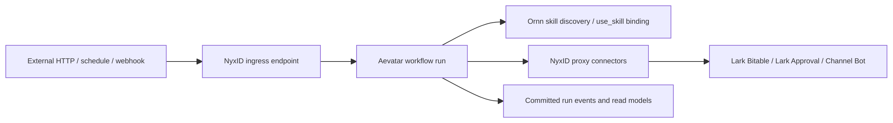

# Aevatar-native S 级 workflow 支持说明

本文说明本仓库新增的两个 S 级 workflow artifact 如何按目标边界落地：

- `budget-monitoring`
- `lark-onboarding-email-approval`

这不是把原有流程继续绑定到 n8n，也不是实现 n8n node interpreter 或 expression engine。新增产物表达的是 Aevatar-native 目标结构：NyxID 负责入口与外部连接，Aevatar 负责 workflow runtime 与状态编排，Ornn 负责 skill discovery 与 binding。

## 边界

NyxID 边界：

- 接收外部 HTTP POST、定时触发、webhook、channel bot route 或 service endpoint。
- 持有 Lark、审批、channel bot 等外部 credential，并通过 proxy 注入。
- 负责外部连接、approval policy、通知与回调目标配置。
- 通过 registry 中的 `nyxidIngress` 把请求投递到 Aevatar workflow run。

Aevatar 边界：

- 使用 `workflows/aevatar-native/s-workflows/*.yaml` 作为 workflow 定义事实。
- 负责 run/session/task 生命周期、状态、步骤顺序、重试、事件发布与审计。
- 通过 connector 名称调用 NyxID proxy。
- 通过 registry 中的 `payloadBuilder` contract 和 workflow 中的 `tool_call/use_skill` 绑定 Ornn payload 构造能力。
- 不依赖 n8n runtime，不解释 n8n node，不执行 n8n expression。

Ornn 边界：

- 通过 `ornnSkillBindings` 声明计算和 payload 构造步骤需要的 skill。
- 运行时通过统一 `use_skill` 工具加载对应 skill 指令。
- Ornn 不拥有 workflow run 状态，也不承担入口或 credential 注入。



## 新增 artifact

- `workflows/aevatar-native/s-workflows.registry.json`：S workflow registry，声明 workflow 文件、NyxID ingress、NyxID connector、Ornn skill binding 与 runtime assertion。
- `workflows/aevatar-native/s-workflows/budget-monitoring.yaml`：Aevatar-native 预算监控 workflow。
- `workflows/aevatar-native/s-workflows/lark-onboarding-email-approval.yaml`：Aevatar-native Lark 入职邮箱审批 workflow。
- `workflows/aevatar-native/connectors/aevatar-native-s-workflows.connectors.json`：NyxID proxy connector 模板，只包含环境变量占位符，不包含真实 secret。
- `tools/workflows/validate_aevatar_native_s_workflows.py`：静态校验脚本，验证 registry 能找到两个 workflow，artifact 不依赖 n8n runtime，不含真实 secret，NyxID ingress/connector binding 存在，Ornn/tool binding 与 payload builder contract 覆盖 payload 构造步骤。
- `tools/ci/aevatar_native_s_workflow_guard.sh`：CI guard，直接执行上述静态校验脚本，防止 registry、binding、secret 或 n8n marker 回归只停留在本地手动验证。

## Bootstrap 方式

最小闭环是 artifact + registry + validator + runtime bootstrap smoke：

1. NyxID 侧创建或更新 endpoint、schedule、relay webhook 或 channel bot route，把目标配置为 Aevatar workflow callback URL。
2. Aevatar workflow capability 默认把 `workflows/aevatar-native/s-workflows/` 加入 workflow definition file source；`WorkflowDefinitionFileLoader` 会把两个 YAML 注册进 `IWorkflowDefinitionCatalog`。
3. Aevatar connector bootstrap 默认合并 `workflows/aevatar-native/connectors/aevatar-native-s-workflows.connectors.json` 中的 NyxID connector 模板；部署环境提供 `NYXID_PROXY_BASE_URL` 与相应 service slug 后会注册进 `IConnectorRegistry`。
4. Aevatar platform composition 默认启用 Skills 与 Ornn skill provider；`use_skill` 来自 Skills provider，Ornn remote fetcher 作为该工具的远程 skill source。真实 skill 内容仍由 Ornn 服务按 registry 声明发布或绑定，例如 `budget-monitoring.variance-payload-builder` 与 `lark-onboarding-email-approval.payload-builder`。
5. 运行校验脚本：

```bash
python3 tools/workflows/validate_aevatar_native_s_workflows.py
```

## 审计点

- registry 的 `runtime.workflowRuntime` 必须是 Aevatar workflow。
- registry 的 `runtime.ingressOwner` 必须是 NyxID。
- registry 的 `runtime.skillDiscoveryOwner` 必须是 Ornn。
- 每个 workflow 必须有 `nyxidIngress`，且 target 指向同名 Aevatar workflow。
- 每个 workflow 声明的 NyxID connector 必须存在于 connector catalog，并被 workflow step 引用。
- 需要计算或 payload 构造的步骤必须有 `ornnSkillBindings`，并通过 `use_skill` 或同一 skill binding 明确关联。
- 每个 workflow 必须声明 `payloadBuilder.kind = ornn_skill_binding`、`payloadBuilder.tool = use_skill`、skill 名称和输入/输出 contract 引用，避免把 payload 构造伪装成未定义外部 HTTP 服务。
- artifact 不允许出现真实 token、secret、API key 或 credential 值。
- artifact 不允许出现 n8n runtime marker。

## 当前限制

当前实现没有新增 C# runtime primitive，也没有实现 n8n 兼容层。仓库内验证覆盖 artifact、workflow catalog bootstrap、connector registry bootstrap 路径、`use_skill` 工具注册和 Ornn remote fetcher 注册；由于当前工作区缺少同级 `../NyxID` 与 `../chrono-ornn` 仓库，也没有真实 NyxID/Lark/Ornn 服务配置，本 PR 不声称已完成真实外部 E2E。完整业务执行仍要求部署环境提供 NyxID proxy 服务配置，并在 Ornn 发布或绑定 registry 声明的 skill。

⟦AI:AUTO-LOOP⟧
