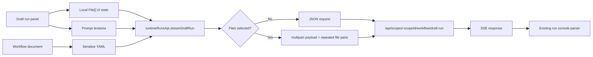

# Draft Run File Upload Frontend Contract Plan

## 背景

Team member workflow editor 右侧 `Draft run` 面板当前只支持一段文本输入。后端已在独立分支设计 `POST /api/scopes/{scopeId}/workflow/draft-run` 的 `multipart/form-data` 契约，用于把上传文件作为某一次 draft run 的调用输入。

本文只规划前端契约适配，不要求当前 `dev` 已包含后端 multipart 实现。前端实现必须保持现有 JSON draft run 行为兼容，并在用户选择文件时切换到后端约定的 multipart 请求。

## 产品语义

上传文件属于一次 run 的输入，而不是 workflow definition 内容。

因此前端不得把上传文件写入：

- workflow YAML
- workflow draft document / layout
- member identity / workflow identity / published service identity
- request headers
- metadata
- JSON `inputParts` 的 base64 或 inline file 字段
- 前端 service 级或页面级 run registry

前端只把浏览器 `File` 对象保存在当前 Draft run panel 的本地 UI 状态中，并在用户点击 `Start draft run` 时随本次请求发送。请求完成后，后端负责 ingress 文件并把 actor-facing input 转成 `WorkflowFileRef`。

文件输入也不得改变或混用 Studio 身份边界：

- path 中的 `memberId` 仍只表示 Team member authority。
- query 中的 `workflowId` 若存在，仍只表示 draft workflow identity hint。
- member summary 中的 `publishedServiceId` 仍只表示 callable service runtime identity。
- draft run 文件不参与上述三类身份的推导、转换、复用或 owner 计算。
- draft run 仍使用当前 path `scopeId` 与 inline workflow YAML 作为运行目标；文件只是同一次 run 的 input part。

## 当前前端状态

当前调用链路：

- `apps/aevatar-console-web/src/pages/team-member-workflow-studio/components/WorkflowStudioDraftRunPanel.tsx`
  - 只展示 draft run input textarea 和 start button。
- `apps/aevatar-console-web/src/pages/team-member-workflow-studio/hooks/useTeamMemberWorkflowStudio.ts`
  - `currentDraftRunMutation` 序列化当前 workflow document 为 YAML。
  - 调用 `runtimeRunsApi.streamDraftRun(scopeId, { prompt, workflowYamls }, signal)`。
- `apps/aevatar-console-web/src/shared/api/runtimeRunsApi.ts`
  - `streamDraftRun` 固定发送 `Content-Type: application/json`。
  - body 包含 `eventFormat: "agui"`、`prompt`、`workflowYamls`、`headers`。

现有无文件 draft run 必须保持上述行为不变。

## 后端契约假设

前端按以下稳定契约对接：

```http
POST /api/scopes/{scopeId}/workflow/draft-run
Accept: text/event-stream
Content-Type: multipart/form-data
```

Form 字段：

| 字段 | 类型 | 必填 | 前端行为 |
|---|---|---:|---|
| `payload` | JSON part | 是 | 放入原 JSON draft-run 请求体。 |
| `file` | file part | 否 | 每个选中文件 append 一次，字段名固定为 `file`。 |

`payload` 内容：

```json
{
  "eventFormat": "agui",
  "prompt": "describe this file",
  "workflowYamls": ["name: main\nsteps: []"],
  "sessionId": "session-1",
  "headers": {
    "x-client": "studio"
  }
}
```

前端不设置 multipart 的 `Content-Type` header，由浏览器生成 boundary。前端只设置 `Accept: text/event-stream`。

JSON 和 multipart 路径必须保持 payload shape 一致。若调用方传入 `sessionId`，两条路径都必须保留。若未来 draft run 支持非文件 JSON `inputParts`，实现时不得因为新增文件上传而删除已有非文件 input parts；但文件 bytes 仍必须只走 multipart `file` part。

## 请求路径选择

`runtimeRunsApi.streamDraftRun` 需要支持双路径：

| 条件 | 请求格式 | 原因 |
|---|---|---|
| 未选择文件 | JSON | 保持现有行为和现有测试稳定。 |
| 至少一个文件 | `multipart/form-data` | 按后端文件 ingress 契约传输 bytes。 |

建议前端 API 类型新增 draft-run 专用 request 和 transport options，而不是污染通用 SDK `ChatRunRequest`，也不把 `File[]` 挂到 chat model 上：

```ts
type ScopeDraftRunStreamRequest = {
  readonly prompt: string;
  readonly workflowYamls: readonly string[];
  readonly metadata?: Record<string, string>;
  readonly sessionId?: string;
};

type ScopeDraftRunStreamOptions = {
  readonly files?: readonly File[];
};
```

推荐调用形态：

```ts
streamDraftRun(scopeId, request, signal, options);
```

注意：`files` 只存在于前端 API boundary 的 transport options，不写入共享 runtime model。

## 交互设计

入口位置：Team member workflow editor 右侧 `Draft run` panel，textarea 下方、`Start draft run` button 上方。

建议 UI：

- 标题：`Run input files`
- 操作按钮：`Add files`
- 列表：展示文件名、大小、媒体类型或浏览器提供的 type。
- 每个文件提供删除按钮。
- 有文件时提供 `Clear` 操作。
- pending 时禁用 `Add files`、删除、清空和 `Start draft run` 重入。

文件选择应支持多选。

第一版不做上传进度，因为当前 endpoint 是一次 SSE request，上传和后续 stream 共用同一请求。若未来需要进度，应作为单独的 artifact upload flow 重新设计，不能在前端临时发明 upload registry。

pending 态覆盖“上传 request body + 等待 SSE frame + 消费 run stream”三段过程。第一个 SSE frame 到达前，沿用现有 running/starting 体验，不显示百分比或假进度。

新增 UI 文案必须进入 locale 文件：

- `apps/aevatar-console-web/src/locales/en-US.ts`
- `apps/aevatar-console-web/src/locales/zh-CN.ts`

按钮和图标操作必须有可访问名称。删除单个文件的按钮建议使用 `Remove {fileName}`，清空按钮使用 `Clear files`。

文件选择建议使用浏览器 `accept` 做软提示，但后端仍是权威校验者。第一版可按后端文档中的默认媒体类型提示图片、PDF、docx、csv、txt、markdown、xlsx、音频和视频。不要把前端 accept 当成业务 allowlist。

重复文件策略必须显式定义。第一版建议按 `name + size + lastModified` 去重，避免用户重复点选同一个本地文件。处理完 `<input type="file">` 的 change 后，应清空 input value，使用户可以再次选择同一个文件。

## 状态设计

在 `useTeamMemberWorkflowStudio` 中增加本地状态：

```ts
const [draftRunFiles, setDraftRunFiles] = React.useState<readonly File[]>([]);
```

对外暴露给 panel：

```ts
readonly draftRunFiles: readonly File[];
readonly addDraftRunFiles: (files: readonly File[]) => void;
readonly removeDraftRunFile: (index: number) => void;
readonly clearDraftRunFiles: () => void;
```

`runCurrentDraft` 发起 mutation 时传入文件快照：

```ts
currentDraftRunMutation.mutate({
  document: editableDocument,
  runMessage: trimOptional(executionRunMessage),
  title: activeMemberTitle,
  files: draftRunFiles,
});
```

mutation 内部只把 `files` 传给 `runtimeRunsApi.streamDraftRun`。文件不参与 `executionId`、`workflowName`、`runMessage`、YAML serialization 或 dirty 判定。

建议完成策略：

- 成功：清空 `draftRunFiles`。
- HTTP 非 OK、SSE parse error、runtime error：保留 `draftRunFiles`，方便用户修正文本后重试。
- 用户主动关闭 Draft run panel：清空 `draftRunFiles`，避免隐藏保留文件导致误发送。
- route scope/member/workflow 变化：必须清空 `draftRunFiles`。
- 切换 node/edge/canvas：若沿用当前行为关闭 panel，也应清空 `draftRunFiles`。
- 用户未来主动 cancel/abort 时：默认保留文件并保持 panel 可见；若 cancel 同时关闭 panel，则按关闭 panel 规则清空。

只有 stream 正常结束且 execution detail 无 error 时，才视为成功并清空文件。不要在 HTTP 200 但 stream 中断、解析失败或 run error 时清空文件。

## 数据流



## 错误处理

前端不需要提前复制后端完整 allowlist。第一版只做轻量提示和请求级错误展示。

建议：

- 浏览器无法提供文件时，不加入列表。
- 文件大小和媒体类型由后端最终校验。
- 前端可以基于当前后端文档的默认 10MB 限制做软提示，例如 `Files over 10 MB may be rejected by the runtime.`，但不得把该值作为业务真相写死到共享模型。
- 后端返回非 OK 时，复用 `readResponseError(response)` 的错误文案。
- `INVALID_FILE_INPUT`：不清空文件，保持 Draft run panel 可见，提示文件输入无效。
- `UNSUPPORTED_MEDIA_TYPE`：提示当前请求格式或后端能力未就绪，仍不清空文件。
- `INVALID_SCOPE_DRAFT_RUN_REQUEST`：提示 draft payload 问题，不归因于文件。
- 其他错误：沿用现有 draft run failed path。

不要在前端把文件转换成 base64 来做预校验或兼容 fallback。

## 测试计划

### API client tests

文件：`apps/aevatar-console-web/src/shared/api/runtimeRunsApi.test.ts`

新增/调整：

1. 无文件 draft run 仍发送 JSON：
   - URL: `/api/scopes/scope-1/workflow/draft-run`
   - `Content-Type: application/json`
   - `Accept: text/event-stream`
   - body 与现有断言一致。
2. 有文件 draft run 发送 `FormData`：
   - 不设置 `Content-Type`
   - 设置 `Accept: text/event-stream`
   - `payload` part 可解析出 `eventFormat/prompt/workflowYamls/headers`
   - 若 request 带 `sessionId`，`payload` part 保留 `sessionId`
   - `file` part 包含所有传入文件，字段名重复为 `file`。

### Team member workflow studio tests

文件：`apps/aevatar-console-web/src/pages/team-member-workflow-studio/index.test.tsx`

新增/调整：

1. Draft run panel 展示 `Run input files` 和 `Add files`。
2. 选择一个文件后，列表展示文件名和大小。
3. 点击 `Start draft run` 时，`runtimeRunsApi.streamDraftRun` 收到 `files`。
4. 删除文件后再运行，不发送该文件。
5. 运行 pending 时，上传和删除操作禁用。
6. 现有无文件 draft run 测试继续通过，不要求 `files` 字段存在。
7. 关闭 Draft run panel 或 route 变化后，已选择文件被清空。
8. 新增文案通过 hardcoded copy / locale 相关测试。

## 验证命令

前端定向验证：

```bash
pnpm --dir apps/aevatar-console-web tsc
pnpm --dir apps/aevatar-console-web test --runInBand
```

可按项目当前 test runner 支持情况追加等价 path/filter，定向覆盖：

```bash
apps/aevatar-console-web/src/shared/api/runtimeRunsApi.test.ts
apps/aevatar-console-web/src/pages/team-member-workflow-studio/index.test.tsx
```

涉及测试新增或修改时，还需要执行：

```bash
bash tools/ci/test_stability_guards.sh
```

## 非目标

本次前端计划不做：

- 后端 multipart parser 实现。
- member stream multipart UI。
- 文件预览、缩略图、上传进度。
- 独立 artifact upload endpoint。
- 把文件写入 JSON `inputParts`、headers、metadata 或 workflow YAML。
- 为当前 `dev` 后端 JSON endpoint 提供 base64 fallback。

## 集成检查项

后端分支可用后，前端联调只检查契约，不依赖后端内部 helper 名称：

- `payload` 字段名是否固定。
- `file` 字段是否允许重复。
- `payload` JSON part 是否接受 `application/json` Blob。
- `payload` JSON part 是否在 multipart 下保留 `sessionId`。
- 有文件 multipart 是否返回 `text/event-stream`。
- 无文件 JSON 是否仍返回 `text/event-stream`。
- 非 OK 文件错误是否能被 `readResponseError` 正确展示。
- SSE frame 仍能被现有 `parseBackendSSEStream` 解析。

## 决策建议

建议先合入前端的双路径契约适配，因为它不会破坏现有 JSON draft run。后端 multipart 分支合入后，再做端到端验证。

只要坚持“无文件走旧 JSON，有文件走 multipart”，该前端改动可以提前落地，并且不会把未合入的后端能力暴露给普通 draft run 用户。
