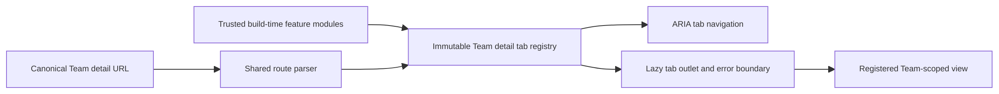

# Team Detail Tab Registry

## Decision

Team Detail uses one immutable, build-time tab registry for built-in and
feature-contributed Team views. The registry is the authority for tab IDs,
declaration order, localized labels, availability, and lazy view loaders.

The canonical resource remains:

```text
/scopes/:scopeId/teams/:teamId?tab=<tabId>
```

A feature adds a Team-scoped view by declaring a tab definition in the trusted
application composition root. It does not add a global route or duplicate the
Team Detail shell.

## Governing Practices

The design applies the Open-Closed Principle through static composition-root
registration. It stays bounded by YAGNI and the Rule of Three: the contract
contains only the variation already required by routing, navigation, lazy
rendering, and availability.

Authorization follows reference-monitor practice. Tab visibility is not an
authorization decision, and every feature API remains responsible for its own
authorization. Availability predicates may consume typed server facts from
`TeamDetailContext`; they must not infer permissions from IDs, display names,
route position, or client-only state. No capability predicate should be added
until a typed authoritative capability contract exists.

The tab bar follows the WAI-ARIA Tabs pattern: `tablist`, `tab`, and `tabpanel`
roles are connected with roving focus, selected state, and horizontal keyboard
navigation.

## Composition



`TeamDetailContext` contains only validated Team platform context:

- `scopeId` and `teamId` from the canonical route parser.
- The typed `StudioTeamSummary` read model when available.
- The canonical Team tab link builder.
- The Team authority refresh hook.

Feature-specific API clients and view models remain owned by their feature
modules. Built-in tabs use private host-prop selectors at the composition root;
those props are not added to `TeamDetailContext`.

## Validation And Fallback

Tab IDs use lowercase, hyphen-separated URL-safe segments and have a maximum
length of 64 characters. Registry construction rejects invalid IDs, duplicate
IDs, missing localized labels, a missing default tab, and a conditional default
tab. The definition list and registry are frozen after construction, and
declaration order is navigation order.

An unknown or unavailable `tab` value resolves to the always-available default
tab and is removed from the canonical URL. Unavailable definitions are omitted
from navigation and are never loaded. A lazy module failure is contained inside
the active `tabpanel`; the Team header and remaining navigation stay available.

## Non-Goals

- Runtime JavaScript or third-party plugin loading.
- A plugin marketplace or server-driven UI model.
- Client-side authorization in place of backend enforcement.
- Generic query-state ownership before a concrete tab needs it.
