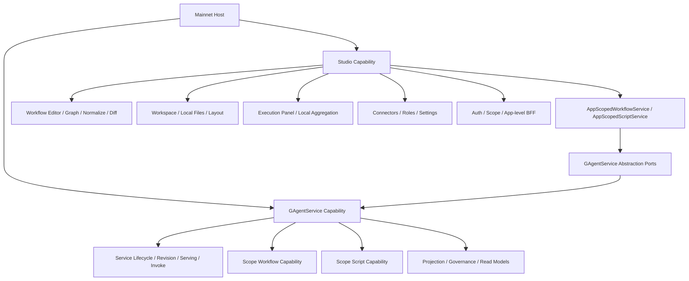
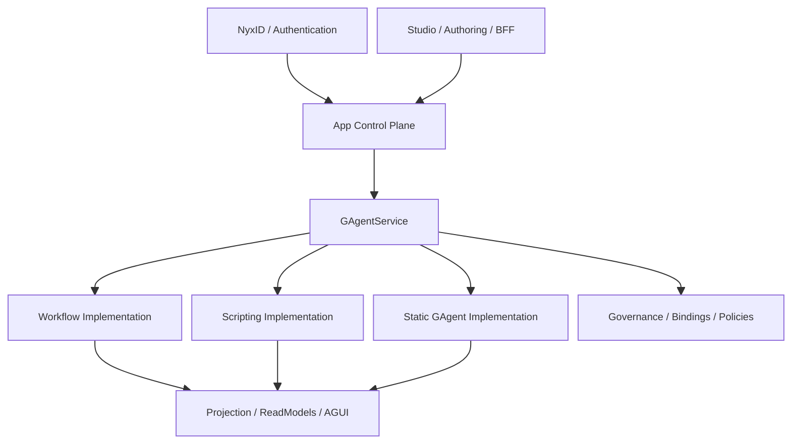
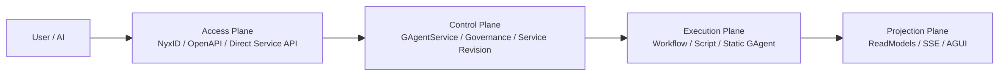

# Aevatar Platform Organization

---

## 1. Studio / GAgentService Boundary

# Studio 独立于 GAgentService 的必要性说明（2026-03-24）

### 1.1 文档目标

- 说明为什么 `Studio` 不应整体合并进 `GAgentService`。
- 明确 `GAgentService` 与 `Studio` 各自的职责边界、事实源边界与依赖方向。
- 给出推荐的组合方式，避免后续在宿主层、应用层和运行时层重新混层。

### 1.2 结论

`Studio` 不应整体并入 `GAgentService`。

更准确地说：

- `GAgentService` 是 `Studio` 在 workflow/script 发布、激活、查询、调用上的正式 capability 内核。
- `Studio` 是面向 authoring、workspace、catalog、execution panel、settings、app-level BFF 的宿主子域。
- 两者应该保持"`Studio` 依赖 `GAgentService` 抽象端口"的单向关系，而不是把 `Studio` 反向吞进 `GAgentService`。

可以收敛的是组合层与少量桥接层，不是把 `Aevatar.Studio.*` 四层整体并进 `Aevatar.GAgentService.*`。

### 1.3 当前代码事实

当前 Mainnet Host 已经采用并列组合，而不是吞并：

- `builder.AddGAgentServiceCapabilityBundle();`
- `builder.AddStudioCapability();`

见：

- `src/Aevatar.Mainnet.Host.Api/Program.cs`

当前依赖方向也已经是单向的：

- `Studio` 通过 `IScopeWorkflowQueryPort / IScopeWorkflowCommandPort / IScopeScriptQueryPort / IScopeScriptCommandPort` 等抽象接入正式能力。
- `Studio` 项目引用 `Aevatar.GAgentService.Abstractions`，而不是 `Aevatar.GAgentService.Core / Hosting / Projection / Governance`。

见：

- `src/Aevatar.Studio.Hosting/StudioCapabilityExtensions.cs`
- `src/Aevatar.Studio.Application/Aevatar.Studio.Application.csproj`
- `src/Aevatar.Studio.Hosting/Aevatar.Studio.Hosting.csproj`

这说明现有结构已经在表达一个清晰事实：

- `GAgentService` 是平台能力边界。
- `Studio` 是产品宿主与 authoring 子域。

### 1.4 GAgentService 的边界

`GAgentService` 的核心职责是把可发布、可激活、可调用的能力组织成统一的 service/runtime 契约。

从代码上看，它的边界包括：

#### 1.4.1 service lifecycle 与 runtime activation

- service 定义
- revision 创建
- prepare / publish / default-serving / activate
- invoke dispatch

见：

- `src/platform/Aevatar.GAgentService.Hosting/Endpoints/ServiceEndpoints.cs`
- `src/platform/Aevatar.GAgentService.Hosting/DependencyInjection/ServiceCollectionExtensions.cs`

#### 1.4.2 scope workflow/script capability 的正式发布面

workflow scope 能力并不是一个编辑器，而是把 scope 下 workflow 作为正式 service revision 管理：

- `ScopeWorkflowCommandApplicationService` 会创建 service definition、创建 revision、prepare、publish、set default serving、activate。

script scope 能力也不是一个 IDE，而是正式 definition/catalog/promotion 主链：

- `ScopeScriptCommandApplicationService` 会 upsert definition snapshot，再 promote catalog revision。

见：

- `src/platform/Aevatar.GAgentService.Application/Workflows/ScopeWorkflowCommandApplicationService.cs`
- `src/platform/Aevatar.GAgentService.Application/Scripts/ScopeScriptCommandApplicationService.cs`

#### 1.4.3 projection / read model / governance

`GAgentService` 还承担：

- projection provider 注册
- service catalog / revision / serving / rollout / traffic 等 read model
- governance capability

见：

- `src/platform/Aevatar.GAgentService.Hosting/DependencyInjection/ServiceCollectionExtensions.cs`

#### 1.4.4 GAgentService 不应承担的职责

按照上述边界，`GAgentService` 不应承担：

- workflow YAML 编辑器
- graph/yaml/diff/normalize 这类 authoring 逻辑
- 本地 workspace 与目录管理
- 本地 execution panel 聚合态
- Studio connectors / roles / settings
- OIDC claim/header/config 混合 scope 解析
- `/api/auth/me`、`/api/app/context` 这类 app-level BFF 协议

这些都不是 service runtime 或 governance 主链语义。

### 1.5 Studio 的边界

`Studio` 的职责不是"再造一套 runtime"，而是提供围绕 runtime capability 的 authoring/product 层。

#### 1.5.1 authoring 语义

`Studio` 拥有明确的编辑器和文档模型语义：

- workflow parse
- graph mapping
- normalize
- validate
- diff

见：

- `src/Aevatar.Studio.Application/Studio/Services/WorkflowEditorService.cs`
- `src/Aevatar.Studio.Domain/Studio/Services/WorkflowDocumentNormalizer.cs`
- `src/Aevatar.Studio.Domain/Studio/Services/WorkflowValidator.cs`

这些逻辑是 authoring domain，不是 `GAgentService` 的 runtime domain。

#### 1.5.2 workspace 与本地文件语义

`Studio` 负责：

- workflow directory 管理
- workflow 文件读写
- 本地 layout 文件
- 本地 workspace settings

见：

- `src/Aevatar.Studio.Application/Studio/Services/WorkspaceService.cs`
- `src/Aevatar.Studio.Infrastructure/Storage/FileStudioWorkspaceStore.cs`

这类文件系统语义天然属于 product workspace，不属于 service capability 内核。

#### 1.5.3 execution panel 聚合态

`Studio` 的 `ExecutionService` 管理的是 UI 面板自己的执行记录：

- 启动执行时先写 `StoredExecutionRecord`
- 后续通过 HTTP 调 runtime
- 本地保存 frames、resume/stop 记录

见：

- `src/Aevatar.Studio.Application/Studio/Services/ExecutionService.cs`

这不是 runtime 分布式权威状态，而是 Studio UI 聚合态。若把它放进 `GAgentService`，会制造"UI 记录 == 业务事实"的误导。

现有架构文档也已明确：

- published workflow 列表、workflow binding、studio catalog、execution panel 状态来自不同事实源
- `ExecutionService + IStudioWorkspaceStore` 只是 Studio execution 面板自己的本地聚合态

见：

- `docs/architecture/2026-03-18-aevatar-console-studio-integration-architecture.md`

#### 1.5.4 connectors / roles / settings 是 Studio authoring 配置

`Studio` 管理：

- connectors catalog
- roles catalog
- settings
- 本地 draft
- Chrono-storage 中的 studio catalog

见：

- `src/Aevatar.Studio.Application/Studio/Services/ConnectorService.cs`
- `src/Aevatar.Studio.Application/Studio/Services/RoleCatalogService.cs`
- `src/Aevatar.Studio.Application/Studio/Services/SettingsService.cs`
- `src/Aevatar.Studio.Infrastructure/DependencyInjection/ServiceCollectionExtensions.cs`
- `src/Aevatar.Studio.Infrastructure/Storage/ChronoStorageConnectorCatalogStore.cs`
- `src/Aevatar.Studio.Infrastructure/Storage/ChronoStorageRoleCatalogStore.cs`

这些配置是 Studio authoring 边界，不等于 runtime 内部 registry，也不等于 `GAgentService` 的 service definition。

#### 1.5.5 app-level BFF / auth / scope 解析

`Studio` 当前还提供：

- `/api/auth/me`
- `/api/app/context`
- `/api/app/scripts/draft-run`
- claim/header/config/env 混合 scope 解析

见：

- `src/Aevatar.Studio.Hosting/Endpoints/StudioEndpoints.cs`
- `src/Aevatar.Studio.Infrastructure/ScopeResolution/AppScopeResolver.cs`

这些都是宿主产品语义，不应下沉到 `GAgentService` 变成 capability core 的职责。

### 1.6 为什么不能把 Studio 整体并进 GAgentService

#### 1.6.1 语义层次不同

`GAgentService` 解决的是：

- 如何把能力发布成 service
- 如何管理 revision / serving / activation
- 如何统一 invoke/query/read model

`Studio` 解决的是：

- 如何编辑
- 如何保存草稿
- 如何组织 workspace
- 如何展示 execution panel
- 如何给前端提供 app-level authoring 协议

两者不是同一层问题。

把 `Studio` 并进 `GAgentService`，相当于把"产品工作台"塞进"平台 capability 内核"，会直接混淆层次。

#### 1.6.2 事实源不同

`GAgentService` 关注的是正式发布态、read model、activation 和 invocation。

`Studio` 里存在多种非 runtime 权威事实：

- 本地 workspace 文件
- 本地 execution records
- connectors/roles draft
- app settings

这些状态不是 service runtime 的权威事实源。

如果它们进入 `GAgentService` 主包，会让模块边界看起来像"都属于 service capability 的正式状态"，这在语义上是错误的。

#### 1.6.3 依赖方向会反转

当前是：

- `Studio -> GAgentService.Abstractions`

如果整体合并，最终结果通常会变成：

- `GAgentService` 反向承担 YAML 编辑、文件存储、settings、OIDC scope 解析、app endpoint

这会把 `GAgentService` 从 capability 内核推成"平台能力 + authoring 产品 + 本地宿主"三合一模块。

这违背了仓库顶层要求里的分层、宿主组合与依赖反转原则。

#### 1.6.4 宿主组合与内核能力会混成一层

`StudioEndpoints` 里有明显的 app-level 组合协议：

- 认证上下文
- app context
- script draft-run

文档也明确说这些 endpoint 只做宿主组合，不承载 scripting 或 workflow 的核心业务编排。

见：

- `docs/2026-03-17-aevatar-app-workflow-scripts-studio.md`

如果把它们并进 `GAgentService`，就会把"宿主组合层"错误地下沉成"能力内核层"。

#### 1.6.5 工程依赖会被污染

当前 `Studio.Infrastructure` 带有明确的宿主与编辑器依赖，例如：

- `YamlDotNet`
- `Microsoft.AspNetCore.Authentication.OpenIdConnect`

见：

- `src/Aevatar.Studio.Infrastructure/Aevatar.Studio.Infrastructure.csproj`

而 `GAgentService.Hosting` 当前关注的是 capability、projection、governance、workflow/scripting capability 组合。

见：

- `src/platform/Aevatar.GAgentService.Hosting/Aevatar.GAgentService.Hosting.csproj`

把两者合并后，`GAgentService` 会被迫承载一批与 service runtime 内核无关的宿主依赖和配置面。

#### 1.6.6 测试与演进节奏也不同

`GAgentService` 的演进重点是：

- capability 契约
- projection
- governance
- service lifecycle correctness

`Studio` 的演进重点是：

- authoring UX
- graph/yaml contract
- workspace 模型
- execution panel 行为
- settings/catalog/import/export

把两者绑成一个模块，会让任一侧的变更都扩大另一侧的回归面。

### 1.7 可以共享什么，不该共享什么

#### 1.7.1 可以共享

可以共享与继续收敛的部分：

- `IScopeWorkflow*` / `IScopeScript*` 这类 capability 端口
- app scope 与 capability 间的桥接 adapter
- 统一 bundle/host 注册入口
- 少量稳定 DTO 或错误模型

例如，后续可以新增一个更高层的宿主组合入口，把：

- `AddGAgentServiceCapabilityBundle()`
- `AddStudioCapability()`

封装成 mainnet 专用 bundle，但内部模块仍保持独立。

#### 1.7.2 不该共享

不应收进 `GAgentService` 主体的部分：

- workflow editor domain
- workspace/file store
- execution panel local aggregation
- connectors/roles/settings authoring store
- `/api/app/*` BFF 协议
- auth/session/scope 产品层逻辑

这些都不属于 service runtime 或 governance 主链。

### 1.8 推荐架构

推荐继续保持如下关系：



对应原则如下：

1. `GAgentService` 保持 capability 内核定位。
2. `Studio` 保持 authoring/product 子域定位。
3. `Studio` 只依赖 `GAgentService` 抽象端口，不依赖其内部实现。
4. Mainnet Host 负责组合二者，而不是让其中一个吞掉另一个。

### 1.9 对未来重构的约束

后续如果继续收敛，建议遵循以下约束：

1. 只合并薄组合层，不合并领域边界。
2. 只上提稳定抽象，不把 Studio 的本地/产品语义下沉进 capability core。
3. 若 `Studio` 中某一能力被证明已成为正式平台能力，应先抽象成新的独立 capability，再被 `Studio` 与其他宿主共同复用。
4. 禁止通过"都跑在同一个 Mainnet Host 里"来证明"应该合并成一个模块"。

### 1.10 最终判断

`Studio` 与 `GAgentService` 的关系应当是：

- `GAgentService` 提供正式 runtime capability。
- `Studio` 站在其上方提供 authoring、workspace、catalog、execution panel 与 app-level BFF。

因此：

- `Studio` 独立存在是必要的。
- `GAgentService` 不应吸收 `Studio`。
- 正确的演进方向是"组合更清晰、抽象更窄、桥接更薄"，不是"把 Studio 整包塞回 GAgentService"。

---

## 2. App Platform Organization

# 基于当前代码现状的 Aevatar AI App 平台组织建议（2026-03-25）

### 2.1 文档目标

基于仓库当前已经落地的代码边界，回答一个更高层的问题：

- 如果 `Aevatar` 要长期作为一个持续运行的 `mainnet`
- 并且希望任何 AI app 都能在这里：
  - 定制自己的 workflow YAML
  - 定制和上传自己的 scripts
  - 部署自己派生自 `AIGAgentBase` / `GAgentBase` 的 GAgent
  - 接上 NyxID 登录
  - 再由平台把请求路由到这个 app 关联的服务

那么系统应该如何组织，才能既复用当前代码，又不把边界重新做乱。

本文只讨论"应该怎么组织"，不直接展开实现细节。

### 2.2 基于现状的结论

当前代码已经具备一个很强的基础，但还没有形成真正的一等 `AI App` 领域对象。

现状里已经成立的是：

- `Aevatar.Mainnet.Host.Api` 已经是长期运行宿主，组合了：
  - `AddAevatarPlatform(...)`
  - `AddGAgentServiceCapabilityBundle()`
  - `AddStudioCapability()`
  - `AddNyxIdAuthentication()`
- `GAgentService` 已经是统一 capability kernel：
  - 能管理 service / revision / deployment / serving / invoke
  - 能承载 `workflow / scripting / static actor` 三种实现类型
  - 能通过 readmodel 查询当前 active deployment 与 primary actor
  - 能通过 governance 管理 binding / endpoint exposure / policy
- `Studio` 已经不是 runtime 本体，而是 authoring/BFF 子域：
  - workflow 编辑
  - script 编辑
  - workspace / execution panel / settings / connectors / roles
  - app-level `/api/auth/me` 与 `/api/app/context`
- `NyxID` 现在已经能把用户身份水位映射到 `scope_id`
- `scope workflow` 与 `scope script` 这两条"按 scope 发布能力"的路径已经打通

但当前还没成立的是：

- "一个 AI app" 的稳定权威模型
- "一个 AI app 发布了哪些能力资产"的正式 release 模型
- "一个 AI app 的公网入口应该打到哪个 service/endpoint" 的正式 route 模型
- "自定义 GAgent 上传部署" 的正式 packaging / trust / activation 模型

所以，当前系统不是"不能做 AI app 平台"，而是：

- `GAgentService` 已经像容器编排内核
- `Studio` 已经像作者工作台
- 但中间缺了一层真正的 `App Control Plane`

### 2.3 现有代码里最应该保留的边界

#### 2.3.1 `GAgentService` 继续做 capability kernel，不升级成"AI App 本体"

这是当前最重要的边界。

`GAgentService` 适合继续负责：

- service identity
- revision 生命周期
- artifact prepare / publish / activate
- serving / rollout / invoke
- service-scoped binding / endpoint / policy
- 统一 readmodel 与 invoke gateway

它不适合直接吞下：

- app catalog
- app release
- app route
- app authoring
- NyxID app-level BFF
- workspace / draft / execution panel

换句话说：

- `GAgentService` 是"服务能力内核"
- 不是"AI app 产品模型"

#### 2.3.2 `Studio` 继续做 authoring 与 BFF，不并进 `GAgentService`

当前 `Studio` 的边界是对的，应该保留：

- workflow graph/yaml/normalize/validate
- script 编辑与 draft run
- workspace / execution panel / settings
- connectors / roles catalog
- app-level auth/context API

未来即使新增 `AI App` 能力，`Studio` 也应该通过新的 app 端口去调用，而不是直接把 Studio 域搬进 `GAgentService`。

#### 2.3.3 `Workflow`、`Scripting`、`Static GAgent` 都继续作为 service implementation kind

这也是一个关键结论。

AI app 不应该再单独定义三套平行 runtime：

- 一套 workflow runtime
- 一套 script runtime
- 一套 custom GAgent runtime

更合理的组织是：

- workflow 只是 `GAgentService` 的一种 service implementation kind
- script 只是 `GAgentService` 的一种 service implementation kind
- static/custom GAgent 只是 `GAgentService` 的一种 service implementation kind

这样 app 层只需要组织"能力组合"，不需要重新发明第二套 runtime 主链。

### 2.4 推荐组织：在 `GAgentService` 之上新增一层 `App Control Plane`

建议新增一个独立 capability，而不是把逻辑继续塞进 `Studio` 或 `GAgentService`。

推荐命名方向：

- `platform/Aevatar.AppPlatform.*`

当前代码已经落下的 Phase 1 bootstrap slice：

- `platform/Aevatar.AppPlatform.Abstractions`
- `platform/Aevatar.AppPlatform.Core`
- `platform/Aevatar.AppPlatform.Application`
- `platform/Aevatar.AppPlatform.Infrastructure`
- `platform/Aevatar.AppPlatform.Hosting`

不要命名成：

- `Aevatar.GAgentService.Apps.*`

因为它不是 `GAgentService` 的内部子概念，而是压在其上的更高一层产品控制面。

#### 2.4.1 这层应该拥有哪些权威对象

最小闭环建议只引入两个长期权威对象：

1. `AppDefinition`
2. `AppRelease`

如果后续确实需要域名/路径路由解耦，再引入：

3. `AppRoute`

##### `AppDefinition`

表达 app 的稳定身份与归属，例如：

- `appId`
- `ownerScopeId`
- `displayName`
- `visibility`
- `description`
- `defaultReleaseId`
- `entryRouteMode`
- `authMode`

这里的核心语义是：

- "这个 app 是谁的"
- "这个 app 叫什么"
- "默认对外暴露哪个 release"

##### `AppRelease`

表达某个 app 某次已发布版本具体挂了哪些能力资产。

建议 release 里不要直接塞 bag，而是强类型引用：

- workflow service refs
- script service refs
- static service refs
- public entry refs
- companion/internal service refs

也就是说：

- `AppRelease` 不直接承载 workflow yaml / script source / actor binary
- 它只引用已经通过正式 capability 发布好的 service/revision

这样不会复制权威事实源。

### 2.5 AI App 的正确分层



对应职责建议如下：

#### 2.5.1 Identity Plane

- NyxID 登录
- 标准 claims 映射
- `scope_id` 解析
- 后续可扩展 `app membership / app role / publisher role`

#### 2.5.2 App Control Plane

- app 定义
- app release
- app 入口选择
- app 级查询
- app 级 publish orchestration
- app route resolve

#### 2.5.3 Capability Plane

由现有 `GAgentService` 继续负责：

- service lifecycle
- revision artifact
- activation / serving / invoke
- governance / binding / policy

#### 2.5.4 Authoring Plane

由现有 `Studio` 继续负责：

- workflow/script 编辑
- draft
- execution panel
- connectors / roles / settings

### 2.6 三类资产的落位建议

#### 2.6.1 Workflow YAML

当前路径已经基本正确：

- `Studio` 编辑 YAML
- `App Control Plane` 决定它属于哪个 app/asset
- 再调用 `GAgentService` 的 workflow capability 发布成一个 workflow service

不要让 app 层自己直接持有 workflow definition actor。

权威主链仍应是：

- `App asset -> GAgentService service/revision -> WorkflowGAgent activation -> WorkflowRunGAgent execution`

#### 2.6.2 Scripts

当前路径也基本可复用：

- `Studio` 编辑 script source
- `App Control Plane` 决定它属于哪个 app/asset
- 再调用 scope/script capability 或其 app-aware 版本，完成：
  - definition snapshot upsert
  - catalog promote
  - scripting service revision publish

不要把 script catalog 直接塞进 app actor 状态里。

#### 2.6.3 自定义 `AIGAgentBase` / `GAgentBase`

这里是当前架构最大的分叉点。

基于代码现状，现在已经存在：

- `StaticServiceRevisionSpec.ActorTypeName`
- `StaticServiceImplementationAdapter`
- `DefaultServiceRuntimeActivator.ActivateStaticAsync(...)`

这说明：

- "部署 host 内已存在的自定义 GAgent 类型" 这条路已经有基础
- 但"让第三方上传任意自定义 GAgent 源码/二进制，然后平台在线安装运行" 还没有正式能力闭环

所以应该把这件事拆成两个阶段：

##### 阶段 A：先支持 trusted static GAgent

即：

- app 团队把自定义 GAgent 编进 mainnet 可加载程序集
- app release 只引用 `actor_type_name`
- 由 static service activation 创建 actor

这条路简单、可控、最符合当前代码。

##### 阶段 B：再做 uploaded custom GAgent packaging

如果你真的希望"任何 app 团队上传自己的 `GAgentBase`/`AIGAgentBase` 实现"，那就必须新增一条独立 capability：

- source package / binary package 上传
- protobuf contract 校验
- dependency / sandbox / trust 校验
- 编译或装载
- 生成可激活的 revision artifact

这件事不应该直接塞进 `GAgentService` 核心，也不应该塞进 `Studio`。

更合理的是以后单独做：

- `platform/Aevatar.AppPackaging.*`

或者等价的 build/package capability。

### 2.7 路由组织

#### 2.7.1 公网入口路由：`AppRoute -> Entry Service`

外部请求不要直接路由到某个 workflow actor 或 script actor。

应该先解析：

- 当前用户是谁
- 当前命中哪个 app
- 当前 app 默认或指定 entry 是哪个 service/endpoint

然后只把请求转发到：

- `GAgentService invoke`
  或
- workflow run capability

也就是说，公网入口应该是：

- `App -> Entry Service`

不是：

- `App -> Internal Actor`

#### 2.7.2 app 内部路由：`Service Binding / Governance`

app 内部多个能力之间的关联，不建议额外造一套 app-internal registry。

应优先复用现有治理面：

- `service binding`
- `endpoint exposure`
- `policy`

推荐的组织方式是：

- 每个 app 至少有一个 public entry service
- 这个 entry service 通过 binding 引用内部 service、connector、secret
- workflow 或 static GAgent 在运行时再根据 binding 决定调用哪些相关能力

这样"app 关联服务"本质上仍然是正式 service graph，而不是宿主里的临时路由表。

### 2.8 service identity 如何映射到 AI app

当前 `scope workflow` 路径把：

- `tenantId`
- `appId`

基本写死成 capability 常量，例如：

- `user-workflows`
- `workflow`

这适合"单一能力发布面"，但不适合"多 AI app 主网平台"。

如果要走 AI app 平台化，建议把 service identity 的四段语义真正用起来：

- `tenantId`：publisher/owner scope 或 org
- `appId`：AI app stable id
- `namespace`：environment / release channel
- `serviceId`：app 内部 service id

一个更适合 app 平台的例子是：

- `tenantId = <owner-scope-token>`
- `appId = copilot`
- `namespace = prod`
- `serviceId = chat-gateway`

以及：

- `tenantId = <owner-scope-token>`
- `appId = copilot`
- `namespace = prod`
- `serviceId = retrieval-script`

这样：

- app 维度天然存在于 service identity 中
- routing、query、governance 都不用再旁造第二套键体系

也就是说，未来不要再把 app 维度藏在硬编码 capability options 里。

### 2.9 Studio 侧收敛方向

当前 `AppScopedWorkflowService` / `AppScopedScriptService` 的方向是对的，但语义上还停留在：

- "scope 下面有 workflow/script"

如果要升级到 AI app 平台，建议变成：

- "app 下面有 workflow/script/static-service asset"

Studio 后续应该依赖的不是零散 capability，而是新的 app 端口，例如：

- `IAppDefinitionCommandPort / IAppDefinitionQueryPort`
- `IAppReleaseCommandPort / IAppReleaseQueryPort`
- `IAppAssetCommandPort / IAppAssetQueryPort`

然后由 app 应用层再去编排：

- workflow capability
- scripting capability
- static service capability

这样可以避免：

- Studio 直接知道太多 GAgentService 细节
- app 逻辑继续散在 BFF 层
- embedded / proxy 的双分派模式持续扩大

### 2.10 建议的实现顺序

#### Phase 1：先补一层 `App Control Plane`

先只做：

- `AppDefinition`
- `AppRelease`
- app query/readmodel
- app 发布编排

但不改 workflow/script runtime 主链。

#### Phase 2：把现有 scope workflow/script 升级成 app-aware asset publish

目标是：

- workflow/script 不再只是 "scope-owned"
- 而是 "app-owned asset"

scope 仍然保留 owner 语义，但 app 变成正式业务主键之一。

#### Phase 3：做 public app route

把：

- `NyxID + app identity + entry service resolve + invoke`

串成真正的 app gateway。

#### Phase 4：再决定是否支持 uploaded custom GAgent

这是最大风险点，必须最后单独做，不要一开始就混到 app 主链里。

### 2.11 必须先拍板的问题

如果只问"现在基于代码现状，应该怎么组织"，建议已经足够明确：

- `Mainnet Host`
- `Studio`
- `App Control Plane`
- `GAgentService`
- `Workflow / Scripting / Static GAgent`

但如果要继续往实现走，必须先拍板一个问题：

#### 你要支持的 custom GAgent，到底是哪一种？

是下面哪种：

1. **Trusted host-bundled GAgent**
   - 开发者把自定义 GAgent 编进 mainnet 部署物
   - 平台只负责 activation / serving / routing

2. **Uploaded source/binary GAgent**
   - 开发者把源码或二进制上传到平台
   - 平台负责校验、编译/装载、隔离、激活、回滚

这两个方向的系统复杂度不是一个量级。

当前代码只天然支持第 1 种；
如果要支持第 2 种，就必须新增 packaging/build/sandbox capability，而不是继续在现有 `GAgentService` 或 `Studio` 上打补丁。

### 2.12 总结

一句话总结：

`Aevatar` 现在最合理的组织，不是把 `GAgentService` 直接包装成"AI app 框架"，而是：

- 把 `GAgentService` 保持为统一 capability kernel
- 把 `Studio` 保持为 authoring/BFF
- 在两者之间新增一层 `App Control Plane`
- 让 `AI App = 一个带 identity / release / route 的 service composition`

这样最符合当前代码，也最适合以后把 `Aevatar` 真的做成长期运行的 `mainnet`。

---

## 3. User-Scoped Service Simplification

# Aevatar User-Scoped Service 极简架构草案（2026-03-26）

### 3.1 文档目标

本文定义一个比当前 `AppPlatform + GAgentService` 更简单的方向：

- `NyxID user id = scope id`
- 在 `GAgentService` 中，`tenant id = scope id`
- 用户的"app"不再单独建模为 `AppDefinition / AppRelease / AppRoute / Function`
- 用户的"app"直接等价为 `GAgentService` 中的一个 `service`
- 用户调用的不是 app function，而是这个 user-scoped service
- 这个 service 预先绑定 workflow、script 或 static gagent
- 本质上这三种实现都统一收敛为：**给某个 GAgent 发 event**

一句话口径：

> 对用户自建能力，我们把"app 层"压扁成"用户作用域下的 service 层"，让 AI 直接围绕 service 做编码、部署、调用和运维。

### 3.2 核心判定

这个方向下，Aevatar 的核心对象从：

- `app`
- `release`
- `route`
- `function`

收敛为：

- `scope`
- `service`
- `service revision`
- `service binding`
- `service policy`
- `operation`

因此统一映射关系如下：

| 用户语义 | 极简架构中的正式对象 |
|----------|----------------------|
| 用户身份 | `scope_id` |
| 用户 app | `service_id` |
| app 版本 | `revision_id` |
| app 调用入口 | `service + endpoint` |
| app 内部组合 | `binding + policy` |

也就是说：

- 用户的 app 就是一条 service definition
- 版本管理不再挂在 `AppRelease`
- 版本管理直接收敛到 `ServiceRevision`

### 3.3 身份与寻址模型

统一约束：

- `NyxID user_id = scope_id`
- `GAgentService tenant_id = scope_id`
- 外部主要寻址键是 `scope_id + service_id`

因此 AI 和用户主要理解下面这套模型即可：

```text
scope_id   = 当前 NyxID 用户
service_id = 用户的 app 名
revision_id = 用户 app 的版本
endpoint_id = 用户 app 暴露的调用入口
```

`GAgentService` 内部原有的 `ServiceIdentity(tenant_id, app_id, namespace, service_id)` 仍可保留，但对外我们只暴露最小必要语义：

- `tenant_id = scope_id`
- `app_id / namespace` 可以收敛为平台默认值或内部实现细节
- 用户和 AI 不需要理解它们

### 3.4 三种实现的统一语义

用户 service 背后的实现只保留三类：

- `workflow`
- `script`
- `static gagent`

但对外不再强调三者差异，而是统一成：

- service 接到请求
- service 把请求翻译成一个 typed event
- event 被投递给目标 GAgent
- GAgent 处理 event，产生日志、状态变化和 committed facts
- facts 进入 projection pipeline

统一主链如下：

```mermaid
%%{init: {"maxTextSize": 100000, "flowchart": {"useMaxWidth": false, "nodeSpacing": 10, "rankSpacing": 50}, "themeVariables": {"fontSize": "10px"}}}%%
flowchart LR
  U["User / AI"] --> A["NyxID Auth"]
  A --> B["Scope = Tenant"]
  B --> C["User-Scoped Service"]
  C --> D["Workflow / Script / Static GAgent"]
  D --> E["Typed Event -> GAgent"]
  E --> F["Committed Facts"]
  F --> G["Projection / ReadModels / SSE"]
```



这里最关键的抽象变化是：

- 不再先 resolve app，再 resolve function
- 而是直接 resolve service，再把请求映射成 event

### 3.5 Access Plane 和 Control Plane 会被砍掉多少

答案是：**会被大幅压缩，但不会完全消失。**

#### 3.5.1 Access Plane 压缩后的职责

Access Plane 不再承担独立 app gateway 语义，只保留：

- `NyxID` 认证
- `OpenAPI` 暴露
- direct service invoke API
- operation/query API

它不再负责：

- app route resolve
- app function catalog
- app bundle
- app release 管理

因此 Access Plane 会从"接入层 + app 入口层"压缩为"认证 + API gateway"。

#### 3.5.2 Control Plane 压缩后的职责

Control Plane 不再以 `AppPlatform` 为核心，而是收敛为 `GAgentService + Governance`：

- service definition
- service revision
- serving/default revision
- binding
- policy
- operation observation

它不再需要独立维护：

- `AppDefinition`
- `AppRelease`
- `AppRoute`
- `AppFunction`
- app-level resource bundle

因此 Control Plane 会从"app control plane + capability kernel"压缩为"service control plane"。

#### 3.5.3 哪些东西不能砍

下面这些不能砍：

- `Execution Plane`
- `Projection Plane`
- `typed event contract`
- `service revision`
- `governance binding / policy`
- `operation observation`

原因很简单：

- 你可以砍掉 app 这一层语义
- 但不能砍掉 execution、projection、版本、权限和观察

### 3.6 极简四层图

这个方向下，四层仍然存在，但 Access/Control 会明显变薄。



对应变化如下：

| 层 | 当前较重模型 | 极简模型 |
|----|--------------|----------|
| Access Plane | auth + studio + app gateway + route resolve | auth + OpenAPI + direct service API |
| Control Plane | AppPlatform + GAgentService + Governance | GAgentService + Governance |
| Execution Plane | 基本不变 | 基本不变 |
| Projection Plane | 基本不变 | 基本不变 |

### 3.7 调用模型

这个方向下，内核仍然统一成 service 级别，但当前用户面先收敛成 scope 级别默认 service，而不是 app/function 级别。

AI 需要理解的最小调用协议：

```text
1. 我是谁：scope_id
2. 我要调用哪个 endpoint：endpoint_id（当前默认是 chat）
3. 我调用哪个版本：revision_id（当前默认 serving，可逐步显式化）
4. 请求 payload 是什么 typed event
```

正式调用主链：

```mermaid
%%{init: {"maxTextSize": 100000, "flowchart": {"useMaxWidth": false, "nodeSpacing": 10, "rankSpacing": 50}, "themeVariables": {"fontSize": "10px"}}}%%
flowchart LR
  A["POST /scopes/{scopeId}/invoke/chat:stream"] --> B["Resolve Default Service Binding"]
  B --> C["Resolve Revision"]
  C --> D["Map Request -> Typed Event"]
  D --> E["Dispatch Event to GAgent"]
  E --> F["Committed Facts"]
  F --> G["Projection / SSE / Query"]
```



这里的关键架构判定是：

#### 3.7.1 当前实现落地口径

当前实现我们已经按这个方向收敛到下面这套入口：

- 一个 `NyxID` 账号只对应一个 `scope`
- 一个 `scope` 当前只对应一个默认对外 service binding，但内核仍保留 `service` 模型以支持后续扩展到多 service
- test run 入口走：
  - `POST /api/scopes/{scopeId}/draft-run`
- binding / publish 入口走：
  - `PUT /api/scopes/{scopeId}/binding`
  - `GET /api/scopes/{scopeId}/binding`
  - `GET /api/scopes/{scopeId}/revisions`
  - `GET /api/scopes/{scopeId}/revisions/{revisionId}`
  - `POST /api/scopes/{scopeId}/binding/revisions/{revisionId}:activate`
  - `POST /api/scopes/{scopeId}/binding/revisions/{revisionId}:retire`
- 正式 workflow 启动主入口走：
  - `POST /api/scopes/{scopeId}/invoke/chat:stream`
- 正式 run 历史 / 恢复 / 审计统一提升到 scope 层默认 service：
  - `GET /api/scopes/{scopeId}/runs`
  - `GET /api/scopes/{scopeId}/runs/{runId}`
  - `GET /api/scopes/{scopeId}/runs/{runId}/audit`
- workflow run control 统一提升到 scope 层默认 service：
  - `POST /api/scopes/{scopeId}/runs/{runId}:resume`
  - `POST /api/scopes/{scopeId}/runs/{runId}:signal`
  - `POST /api/scopes/{scopeId}/runs/{runId}:stop`
- 内部与扩展面仍保留 service-level contract：
  - `POST /api/scopes/{scopeId}/services/{serviceId}/invoke/{endpointId}`
  - `POST /api/scopes/{scopeId}/services/{serviceId}/invoke/{endpointId}:stream`
  - `GET /api/scopes/{scopeId}/services/{serviceId}/revisions`
  - `GET /api/scopes/{scopeId}/services/{serviceId}/revisions/{revisionId}`
  - `POST /api/scopes/{scopeId}/services/{serviceId}/revisions/{revisionId}:retire`
  - `GET /api/scopes/{scopeId}/services/{serviceId}/runs`
  - `GET /api/scopes/{scopeId}/services/{serviceId}/runs/{runId}`
  - `GET /api/scopes/{scopeId}/services/{serviceId}/runs/{runId}/audit`
  - `POST /api/scopes/{scopeId}/services/{serviceId}/runs/{runId}:resume`
  - `POST /api/scopes/{scopeId}/services/{serviceId}/runs/{runId}:signal`
  - `POST /api/scopes/{scopeId}/services/{serviceId}/runs/{runId}:stop`
- `workflowYamls` 的约定是：
  - 第一个 YAML 是主 workflow
  - 后续 YAML 都是 sub workflow
  - `workflow_call` 默认在这组 YAML 内解析
- workflow / script / static gagent 的执行本质仍然是把 typed event 投递给目标 `GAgent`

同时我们不再保留下面这些旧入口作为正式运行时 contract：

- `POST /api/chat`
- `GET /api/ws/chat`
- `POST /api/workflows/resume`
- `POST /api/workflows/signal`
- `POST /api/workflows/stop`
- `POST /api/scopes/{scopeId}/workflow-runs/stop`

workflow、script、static gagent 不再是三个对外入口协议，它们只是三种 event-dispatch implementation。

### 3.8 版本管理如何简化

如果用户 app = service，那么版本管理就不再是 `AppRelease`，而是 `ServiceRevision`。

统一规则如下：

1. `revision_id = 用户 app 的版本号`
2. AI 和外部调用应允许显式指定 `revision_id`
3. 默认 serving revision 只是便捷别名，不是强一致版本语义
4. rollback 本质上是把 serving 指回旧 revision，或基于旧 revision 重新发布
5. 被 `retire` 或不在 active serving 集内的 revision 禁止正式调用
6. read side 必须暴露 revision catalog 的权威水位，如 `CatalogStateVersion / CatalogLastEventId`
7. revision catalog 必须返回 typed implementation 治理信息，而不是把 workflow / script / static gagent 细节塞回泛化 bag

因此版本治理直接收敛为：

- `create revision`
- `publish revision`
- `set default serving revision`
- `rollback to prior revision`
- `retire revision`
- `query revision catalog watermark`
- `query typed implementation governance`

而不需要：

- app release
- app default release
- app function 绑定到 release

### 3.9 Binding 如何表达"用户预先配置的 workflow / script / gagent"

用户 service 的 definition 只负责暴露稳定 endpoint。

实际执行逻辑通过 binding 指向三类能力：

- 绑定某个 workflow definition
- 绑定某个 script definition
- 绑定某个 static gagent type

因此 service 的最小正式模型可以收敛为：

```text
UserService
├── scope_id
├── service_id
├── endpoint_catalog[]
├── current_revision_id
└── revisions[]
    ├── revision_id
    ├── implementation_kind
    ├── implementation_ref
    ├── bindings[]
    ├── policies[]
    └── serving_state
```

这里：

- `implementation_kind = workflow / script / static`
- `implementation_ref` 指向 workflow id、script id 或 actor type
- `bindings` 表达 companion service / connector / secret
- `policies` 表达暴露与调用限制

### 3.10 这条路线对 AI 更友好的地方

对 AI 来说，这个方向的最大价值是认知负担明显下降。

AI 不需要先理解：

- app
- release
- route
- function
- app bundle

AI 只需要理解：

- 当前用户是谁
- 这个用户有哪些 service
- service 暴露哪些 endpoint
- 每个 service 当前绑定的是 workflow、script 还是 gagent
- 当前默认 revision 是什么
- 如果要精确调用，用哪个 revision

因此 AI 的 prompt 和工具链可以直接收敛为：

- list services
- get service
- list revisions
- publish revision
- invoke service
- get operation
- get projection/readmodel

### 3.11 这条路线砍掉了什么

对于"用户自建 app"这条主路径，我们可以直接砍掉：

- 独立 `AppPlatform`
- `AppDefinition`
- `AppRelease`
- `AppRoute`
- `AppFunction`
- app-level bundle 作为核心协议

也就是说，`AppPlatform` 不再是核心必需层，而是：

- 可选 overlay
- 只在需要更高层 packaging 时再叠加

例如：

- 平台官方 app
- 市场化发布
- 多 service 打包发行
- 对外产品化路由

这些场景仍然可以保留重 control plane。

但对于"用户自己通过 AI 在 Aevatar 上跑一个服务"这条主路径，完全可以不走这一层。

### 3.12 代价与边界

这条路线更简单，但也有边界：

1. 多 service 产品化 packaging 能力会变弱
   需要靠 service binding 命名约定补回来。
2. app-level bundle/diff/apply 这类高层协议会被推迟
   先让 AI 用 service 级协议跑起来。
3. route/function 这类对外产品语义不再是核心对象
   更适合"用户自建能力"，不一定适合 marketplace。

因此我们统一判断：

- **对用户自建服务路径**：采用这条极简模型
- **对平台产品化/市场化路径**：以后如有必要，再叠加重 control plane

### 3.13 最终结论

如果我们接受：

- `NyxID user id = scope id`
- `tenant id = scope id`
- `用户 app = GAgentService service`
- `workflow / script / static gagent` 本质统一为"给 GAgent 发 event"

那么结论就是：

1. `Access Plane` 可以明显变薄，压缩成 auth + OpenAPI + direct service API。
2. `Control Plane` 可以明显变薄，压缩成 `GAgentService + Governance + ServiceRevision`。
3. `Execution Plane` 和 `Projection Plane` 基本不动。
4. `AppPlatform` 不再是用户主路径必需层，而是可选 overlay。

最短的一句话口径：

> 对用户自建能力，Aevatar 可以不再先做 app，再做 function；而是直接让 AI 面对 user-scoped service，并把 workflow、script、static gagent 统一成"向 GAgent 投递 event"的执行模型。

---

## 4. GAgentService-Workflow Integration

# GAgentService 与 Workflow 集成方案

### 4.1 目标

我们要把下面这条业务主链真正跑通：

1. 每个 scope 有外部分配的 `ScopeId`
2. scope 上传一份 workflow YAML，最终落到某个 `WorkflowGAgent` 的状态里
3. 同一个 scope 可以拥有多个 workflow definition，并且外部能通过 `ScopeId` 查到当前生效的 definition actor
4. 外部可以指定某个 definition actor，创建 `WorkflowRunGAgent` 并执行
5. 执行过程中可以实时拿到状态和事件，断线后还能继续从 readmodel 查询

### 4.2 合并结论

对比原始方案和当前框架现状后，最优解不是把 `user_id` 扩进 `WorkflowGAgent` 的领域事件或 `WorkflowActorBindingDocument`，而是：

- `GAgentService` 负责 definition 的归属、版本、激活和 scope 维度索引
- `Workflow Capability` 负责 run 的创建、执行、SSE/WS 实时事件和 run readmodel 查询
- scope 维度 API 只做一层薄编排，不直接读取 runtime state，也不在中间层维护 `ScopeId -> ActorId` 进程内字典

实现落点上，这层"用户 workflow 编排"不再放在 `workflow` 模块里，也不直接留在 `Hosting` 端点层。
它现在下沉到 `platform/Aevatar.GAgentService.Application`，由 `platform/Aevatar.GAgentService.Hosting` 只做 HTTP 组合与转发。
原因是它本质上是"GAgentService 控制面 + Workflow 执行面"的跨能力应用编排，不属于 workflow 自身领域，也不该由 Host 承担核心业务流程。

这条路径最贴合现有代码边界：

- `WorkflowGAgent` 本来就只承载 definition 事实
- `DefaultServiceRuntimeActivator` 已经会在激活 workflow revision 时创建并绑定真正的 `WorkflowGAgent`
- `ServiceCatalogReadModel` 已经会把当前激活 deployment 的 `PrimaryActorId` 投影出来
- `/api/chat` 已经能基于 definition actor 创建新的 `WorkflowRunGAgent` 并提供 SSE 实时事件

### 4.3 为什么不把 `user_id` 塞进 workflow 核心事件

原始文档里"给 `BindWorkflowDefinitionEvent / BindWorkflowRunDefinitionEvent / WorkflowActorBindingDocument` 增加 `user_id`"这个做法，不是当前仓库里最合理的主路径，原因有三点：

1. `user -> workflow definition` 是归属和索引语义，更适合落在 `GAgentService` 的 service identity/readmodel，不属于 workflow definition 本身的领域事实。
2. `WorkflowActorBindingDocument` 的职责是 `actorId -> workflow binding`，如果再承载 `user_id -> 多个 definition actor`，会和 `ServiceCatalogReadModel` 形成重复权威源。
3. 如果目标是"通过 GAgentService 跑通"，那就不应该再回退到"API 直接创建/绑定 `WorkflowGAgent`"这条旁路。

保留下来的部分是"面向用户的薄 API"这个思路，这一层是有价值的。

### 4.4 权威模型

#### 4.4.1 用户与 workflow definition 的映射

每个用户的 workflow definition 映射到一个 `GAgentService service`：

- `tenantId`：固定配置，例如 `user-workflows`
- `appId`：固定配置，例如 `workflow`
- `namespace`：`user:{user-scope-token}`
- `serviceId`：外部 workflow 标识，也就是用户 API 里的 `workflowId`

其中：

- `scope-token` 不是原始 `ScopeId`，而是一个可逆需求外、内部稳定的安全 token，用来避免把任意外部 `ScopeId` 直接放进 `service key / actor id`
- 当前实现采用"slug + hash"生成 token，既稳定，又能在 actor/service key 里安全使用

#### 4.4.2 definition actor 的生成

每次激活 workflow revision 时，`GAgentService` 会创建一个真正的 `WorkflowGAgent`。
当前激活 actor id 不是原始业务键，而是 deployment-scoped：

- `definitionActorIdPrefix = user-workflow:{user-token}:{workflow-token}`
- `primaryActorId = {definitionActorIdPrefix}:{deploymentId}`

这意味着：

- 对外稳定业务标识应该是 `workflowId`
- 当前生效的 `actorId` 必须从 readmodel 读取
- actor id 对调用方仍然是不透明地址，不允许客户端自己拼装

### 4.5 最终 API 设计

#### 4.5.1 创建或更新用户 workflow definition

`PUT /api/scopes/{scopeId}/workflows/{workflowId}`

请求体：

```json
{
  "workflowYaml": "name: approval",
  "workflowName": "approval",
  "displayName": "Approval Flow",
  "inlineWorkflowYamls": {
    "child.yaml": "name: child"
  },
  "revisionId": "rev-001"
}
```

内部顺序：

1. 计算 service identity
2. 如果 service 不存在，调用 `CreateService`
3. 如果 display name 变更，调用 `UpdateService`
4. 调用 `CreateRevision(implementationKind = workflow)`
5. `PrepareRevision`
6. `PublishRevision`
7. `SetDefaultServingRevision`
8. `ActivateServiceRevision`

结果：

- YAML 最终通过激活链路绑定进真正的 `WorkflowGAgent.State`
- 返回当前 revision、definition actor prefix、预期 active actor id，以及当前 service summary

#### 4.5.2 查询某个 scope 拥有的 workflow definitions

`GET /api/scopes/{scopeId}/workflows`

内部查询：

1. 通过 `namespace = user:{user-token}` 调用 `IServiceLifecycleQueryPort.ListServicesAsync`
2. 从 `ServiceCatalogSnapshot` 读取：
   - `serviceId`
   - `displayName`
   - `activeServingRevisionId`
   - `deploymentId`
   - `primaryActorId`
   - `deploymentStatus`
3. 如果 `primaryActorId` 存在，再通过 `IWorkflowActorBindingReader.GetAsync(actorId)` 补充 `workflowName`

返回的 `actorId` 是当前生效 definition actor 的权威读值。

#### 4.5.3 从指定 definition actor 启动 run 并以 SSE 实时返回

`POST /api/scopes/{scopeId}/workflow-runs:stream`

请求体：

```json
{
  "actorId": "user-workflow:...:deployment...",
  "prompt": "run it",
  "sessionId": "session-1",
  "headers": {
    "source": "user-api"
  }
}
```

内部顺序：

1. 先用 `ScopeId + actorId` 做 ownership 校验
2. 校验通过后，直接转发到现有 `/api/chat` 主链：
   - `Prompt -> prompt`
   - `ActorId -> agentId`
   - `SessionId -> sessionId`
   - `Headers -> headers`
3. `WorkflowRunActorResolver` 会基于 definition actor 的 binding 创建新的 `WorkflowRunGAgent`
4. SSE 第一帧返回 `aevatar.run.context`，其中包含新的 `runActorId`

这一步没有新造第二套 run 创建逻辑，只是把用户维度的 ownership 校验包在外面。

#### 4.5.4 运行态查询与断线恢复

run 创建后，继续复用现有查询端点：

- `GET /api/actors/{runActorId}`
- `GET /api/actors/{runActorId}/timeline`
- `GET /api/actors/{runActorId}/graph-subgraph`

如果后续需要做用户级 resume/signal，同样建议在用户 API 外层增加 ownership 校验后，再转发到已有 `/api/workflows/resume` 和 `/api/workflows/signal`。

### 4.6 实时事件方案

#### 4.6.1 主路径

继续复用现有 workflow projection/live pipeline：

- `POST /api/chat` 本身就是 SSE
- `WorkflowRunCommandTargetBinder` 会在 dispatch 前挂好 projection session 与 live sink
- `WorkflowExecutionRunEventProjector` 会把 committed workflow events 投影成 `WorkflowRunEventEnvelope`

#### 4.6.2 这次补的增强

现有 mapper 已经覆盖：

- `RUN_STARTED / RUN_FINISHED / RUN_ERROR`
- `STEP_STARTED / STEP_FINISHED`
- `TEXT_MESSAGE_*`
- `TOOL_CALL_*`
- `WAITING_SIGNAL / SIGNAL_BUFFERED`
- 一部分 `custom` 事件

但它之前不会把"未显式映射的 observed event"继续发出来。
这次实现新增了一个兜底行为：

- 如果某个 committed event 没有命中前面的专用 mapper
- 会自动发出一个 `custom` 事件：`aevatar.raw.observed`
- 载荷是强类型的 `WorkflowObservedEnvelopeCustomPayload`

里面包含：

- `eventId`
- `payloadTypeUrl`
- `publisherActorId`
- `correlationId`
- `stateVersion`
- 原始 `payload`

这样就满足了"执行过程中抛出来的任何事件，都能在统一事件流里被监听到"。

### 4.7 当前实现落点

本次代码实现已经落在以下位置：

- `src/platform/Aevatar.GAgentService.Application/Workflows/UserWorkflowCommandApplicationService.cs`
- `src/platform/Aevatar.GAgentService.Application/Workflows/UserWorkflowQueryApplicationService.cs`
- `src/platform/Aevatar.GAgentService.Hosting/Endpoints/UserWorkflowEndpoints.cs`
- `src/workflow/Aevatar.Workflow.Presentation.AGUIAdapter/EventEnvelopeToWorkflowRunEventMapper.cs`
- `src/workflow/Aevatar.Workflow.Application.Abstractions/Runs/workflow_run_events.proto`

### 4.8 验证结果

已完成：

- `dotnet test test/Aevatar.Workflow.Host.Api.Tests/Aevatar.Workflow.Host.Api.Tests.csproj --nologo`
- `bash tools/ci/test_stability_guards.sh`
- `bash tools/ci/workflow_binding_boundary_guard.sh`

### 4.9 后续建议

这次先把主流程跑通了。下一步如果要继续补齐，可以按这个顺序推进：

1. 增加 `GET /api/scopes/{scopeId}/workflows/{workflowId}` 单项查询
2. 增加用户级 `resume/signal` 包装端点
3. 如果外部需要纯 JSON 启动而不是 SSE，再补一个 detached run 启动入口
4. 如果后续要支持非 chat 语义的 workflow run，再扩展 `GAgentService` 的 workflow endpoint 模型，而不是把新语义塞进现有 `invoke/chat`
