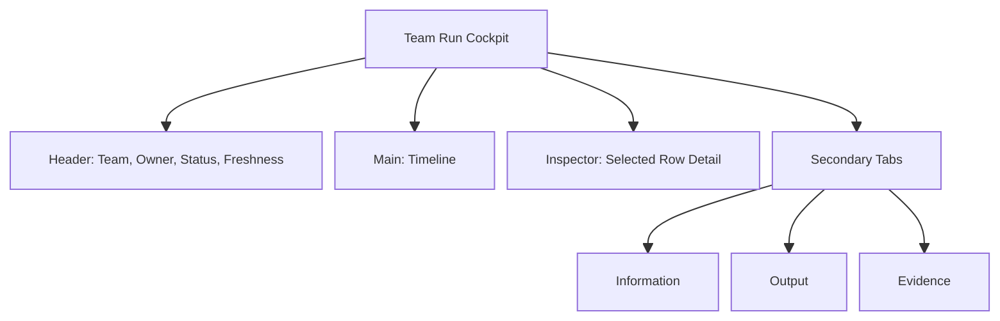
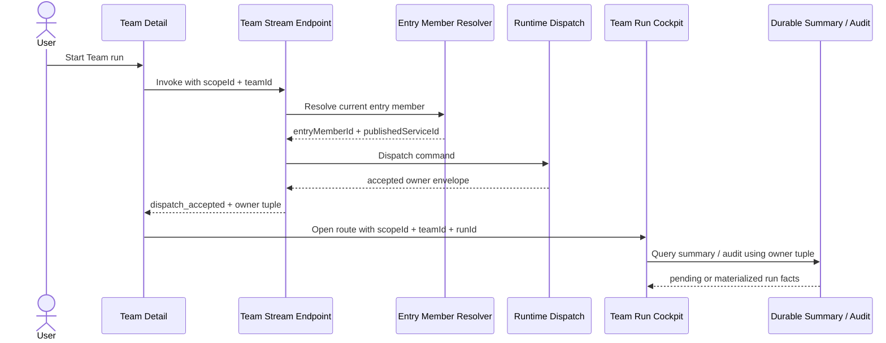
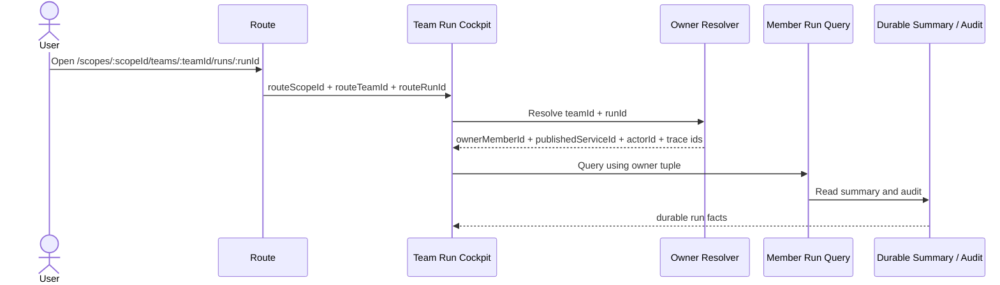

# Team Workflow Realtime Visibility Design

This document turns the agreed PRD into an implementation design. It defines the contracts, ownership boundaries, data flow, frontend state model, UI information architecture, and verification gates for the Team Run Cockpit.

Related documents:

- [Team Workflow Realtime Visibility PRD](2026-06-22-team-workflow-realtime-visibility-prd.md)
- [Team Workflow Realtime Visibility Implementation Plan](2026-06-22-team-workflow-realtime-visibility-implementation-plan.md)

## 1. Design Position

The feature is a Team-context run inspection surface for member-owned workflow execution.

The product sentence is:

> Watch what this Team-entry workflow run is doing now, then reopen the same run later from durable truth.

The implementation sentence is:

> Resolve `scopeId + teamId + runId` into the accepted run owner tuple, then read member-scoped durable run summary and audit, with live AGUI/SSE frames as current-session evidence only.

V1 is intentionally read-only. It is not a generic observability dashboard, not a workflow editor, and not a waiting-action control plane.

## 2. Hard Invariants

### 2.1 Identity Boundaries

These identities must remain separate in routes, DTOs, local variables, tests, and UI labels.

| Identity | Meaning | Allowed Use |
| --- | --- | --- |
| `scopeId` | Workspace boundary | Team route root and permission boundary |
| `teamId` | Studio Team ownership surface | Product context for the cockpit |
| `entryMemberId` | Current Team entry member | Starting new Team runs only |
| `ownerMemberId` | Member that owned the accepted run | Historical run inspection |
| `workflowId` | Draft or definition document identity hint | Editor/draft context only |
| `publishedServiceId` | Callable service runtime identity | Invocation and historical service identity |
| `runId` | One execution instance | Run detail identity |
| `actorId` | Runtime actor address | Diagnostics or typed runtime control where allowed |
| `commandId` | Accepted command trace identity | Diagnostics and correlation |
| `correlationId` | Cross-boundary trace identity | Diagnostics and correlation |

Rules:

- `teamId` is product context, not runtime owner.
- `entryMemberId` must not be reused as the owner of a historical run without durable verification.
- `publishedServiceId` for a historical run is the acceptance-time value, not the member's current binding.
- `workflowId` must never substitute for `memberId`, `publishedServiceId`, `teamId`, or `runId`.
- Tests must use distinct ID shapes such as `team-alpha`, `m-alpha`, `wf-alpha`, `svc-alpha`, and `run-alpha`.

### 2.2 Truth Sources

| Concern | Authority | Non-Authority |
| --- | --- | --- |
| Team identity | Team read model | route label, browser cache |
| New Team run entry member | Team read model plus member read model | old run owner |
| Historical run owner | accepted owner envelope or durable owner resolver | current entry member |
| Historical published service | acceptance-time owner tuple | current member binding |
| Run status | durable run summary/current-state read model | live stream connection |
| Timeline after refresh | durable audit artifact | browser memory |
| Final output | durable audit or durable summary | live output preview |
| Evidence copy safety | typed redaction/sensitivity contract | UI string guessing |
| Waiting actions | typed backend capabilities | status strings or raw payloads |

Live frames are useful evidence. They are not the source of durable truth.

### 2.3 Architecture Boundaries

- Commands enter runtime and eventually produce committed facts.
- Queries read read models or durable run artifacts.
- The owner resolver must not replay events in the query path.
- The owner resolver must not depend on a process-local `runId -> context` dictionary.
- The cockpit must not prime projections during page load.
- Projection and AGUI should converge on the same committed facts rather than create a parallel truth path.
- Backend contracts should use explicit typed fields. Do not hide stable semantics inside a generic bag.

## 3. Target Architecture

```mermaid
%%{init: {"maxTextSize": 100000, "flowchart": {"useMaxWidth": false, "nodeSpacing": 10, "rankSpacing": 50}, "themeVariables": {"fontSize": "10px"}}}%%
flowchart LR
    U["Team Operator"] --> TD["Team Detail"]
    TD --> Start["Start Team Run"]
    Start --> TeamEndpoint["Team Stream Endpoint"]
    TeamEndpoint --> EntryResolver["Entry Member Resolver"]
    EntryResolver --> Dispatch["Runtime Dispatch"]
    Dispatch --> OwnerEnvelope["Accepted Owner Envelope"]
    Dispatch --> Runtime["Member-Owned Run Actor"]
    Runtime --> Committed["Committed Run Facts"]
    Committed --> Projection["Projection / Materialization"]
    Projection --> Summary["Durable Run Summary"]
    Projection --> Audit["Durable Run Audit"]
    OwnerEnvelope --> Cockpit["Team Run Cockpit"]
    TD --> Cockpit
    Cockpit --> OwnerResolver["Team Run Owner Resolver"]
    OwnerResolver --> OwnerTuple["Owner Tuple"]
    OwnerTuple --> MemberQueries["Member-Scoped Run Queries"]
    MemberQueries --> Summary
    MemberQueries --> Audit
    TeamEndpoint -. "current session only" .-> LiveFrames["Live AGUI/SSE Frames"]
    LiveFrames -. "enhancement" .-> Cockpit
```



The central design choice is that Team creates the viewing context, while the accepted run owner tuple creates the query context.

## 4. Backend Design

### 4.1 Accepted Team Run Owner Envelope

When a Team run is accepted for dispatch, the backend must return or stream a typed owner envelope before the frontend pins the cockpit route.

Required shape:

```json
{
  "scopeId": "scope-alpha",
  "teamId": "team-alpha",
  "ownerMemberId": "m-alpha",
  "publishedServiceId": "svc-alpha",
  "runId": "run-alpha",
  "actorId": "actor-alpha",
  "commandId": "cmd-alpha",
  "correlationId": "corr-alpha",
  "invocationSource": "team",
  "ackStage": "dispatch_accepted"
}
```

Contract rules:

- `ackStage = "dispatch_accepted"` means accepted for dispatch only.
- It must not claim completion, audit availability, or read-model visibility.
- `ownerMemberId` is the accepted owner of this run.
- `publishedServiceId` is captured at acceptance time.
- `invocationSource = "team"` is required before Team Detail can label the run as Team work.

### 4.2 Minimal Team Run Owner Resolver

V1 requires a cold-start resolver for a known run link:

```text
GET /api/scopes/:scopeId/teams/:teamId/runs/:runId/owner
```

Equivalent routing is acceptable if it preserves the same resource semantics.

Response shape:

```json
{
  "scopeId": "scope-alpha",
  "teamId": "team-alpha",
  "runId": "run-alpha",
  "ownerMemberId": "m-alpha",
  "publishedServiceId": "svc-alpha",
  "actorId": "actor-alpha",
  "commandId": "cmd-alpha",
  "correlationId": "corr-alpha",
  "invocationSource": "team",
  "acceptedAt": "2026-06-22T10:00:00Z"
}
```

Resolver requirements:

- It resolves only known Team-context runs.
- It returns the acceptance-time owner tuple.
- It must be durable across browser refresh and service restart.
- It must return not found or unavailable honestly when no durable Team ownership is available.
- It must not fall back to current Team `entryMemberId`.
- It must not recompute `publishedServiceId` from current member state.
- It must not query-time replay events or trigger projection priming.
- It must not use process-local state as authority.

### 4.3 Durable Owner Record

If existing durable run summary/audit already contains the required owner metadata, the resolver can read that read model.

If not, implementation must add a typed durable owner record at acceptance time. The record is not a full Team run index; it is a minimal lookup to reopen a known run.

Minimum fields:

| Field | Required | Notes |
| --- | --- | --- |
| `scopeId` | yes | Permission and workspace boundary |
| `teamId` | yes | Team product context |
| `runId` | yes | Lookup key with `teamId` |
| `ownerMemberId` | yes | Historical owner |
| `publishedServiceId` | yes | Acceptance-time service |
| `actorId` | yes | Runtime diagnostic identity |
| `commandId` | yes | Dispatch trace |
| `correlationId` | yes | Cross-boundary trace |
| `invocationSource` | yes | Must be `team` for Team work label |
| `acceptedAt` | yes | Sorting and diagnostics |

### 4.4 Member-Scoped Durable Run Queries

After owner resolution, the cockpit can call existing member-scoped run summary and audit endpoints using:

```text
scopeId + ownerMemberId + publishedServiceId + runId
```

The frontend must not call member-scoped run queries with `teamId`, `workflowId`, or current `entryMemberId` as substitutes.

### 4.5 Error Semantics

The resolver and run queries should distinguish these states:

| State | Meaning | UI Behavior |
| --- | --- | --- |
| `owner_pending` | Accepted envelope exists in session but durable owner lookup is not visible yet | Show accepted/durable pending |
| `owner_not_found` | No durable Team owner record for this `teamId + runId` | Show cannot verify owner |
| `owner_forbidden` | User cannot access Team or run owner | Show access denied |
| `summary_pending` | Owner resolved but run summary not materialized | Continue polling or refresh |
| `audit_unavailable` | Summary exists but audit is not available | Show timeline unavailable without marking run failed |
| `live_disconnected` | SSE/AGUI stream disconnected | Mark source disconnected, not run failed |

## 5. Frontend Design

### 5.1 Routes

Canonical route:

```text
/scopes/:scopeId/teams/:teamId/runs/:runId
```

Route semantics:

- `scopeId`, `teamId`, and `runId` come from path.
- `ownerMemberId` may be carried as a query hint only if verified by the owner resolver.
- `workflowId` is not accepted as a run owner hint.
- Route variables should use names like `routeScopeId`, `routeTeamId`, and `routeRunId`.

Forbidden route behavior:

- Do not generate `/teams/:scopeId...` legacy paths.
- Do not parse path segments by old index positions.
- Do not use a route `workflowId` as member, service, or run identity.

### 5.2 Team Detail Strip

Team Detail remains the operator's starting point.

It may show:

- Team display name and lifecycle.
- Entry member display name.
- Published workflow capability status.
- Latest verified Team run when `invocationSource = "team"` and `teamId` matches.
- Fallback **Entry member latest run** when only member-scoped run history is available.
- Last output or error preview from durable summary.

It must not show:

- Local browser recent runs as Team truth.
- Member-only run history labeled as Team work.
- Current draft workflow state as historical run state.

### 5.3 Cockpit Page Model

The page state has five layers:

| Layer | Owner | Purpose |
| --- | --- | --- |
| `routeContext` | Router | `scopeId + teamId + runId` |
| `acceptedEnvelope` | Current browser session | Immediate just-started owner tuple |
| `resolvedOwner` | Durable owner resolver | Historical owner tuple |
| `durableRun` | Run summary/audit queries | Truth for status, output, timeline |
| `liveSession` | Current SSE/AGUI stream | Current-session evidence and animation |

Derived page states:

| State | Trigger | Display |
| --- | --- | --- |
| `resolving_owner` | Route loaded without verified owner | Skeleton with Team/run context |
| `accepted_pending` | Accepted envelope exists, durable owner not visible | Accepted for dispatch, durable pending |
| `owner_resolved` | Resolver returned owner tuple | Load durable summary/audit |
| `summary_pending` | Owner resolved, summary missing | Run accepted, waiting for materialization |
| `audit_unavailable` | Summary exists, audit missing | Show summary and unavailable timeline state |
| `live_enhanced` | Live frames connected | Add live-only rows/previews |
| `live_disconnected` | Stream ended unexpectedly | Source disconnected, run status unchanged |
| `complete` | Durable terminal status available | Durable output/error wins |

### 5.4 Durable-First Merge

Merge priority:

1. Durable audit event with source version or durable event identity.
2. Durable run summary.
3. Live frame with stable event id.
4. Live frame with composite key.
5. Browser-local sequence for display only.

Recommended row key:

```text
eventId
runId + stepId + eventType + timestamp
localSequence
```

Rules:

- Durable audit rows replace matching live rows.
- Durable status replaces live status.
- Durable final output replaces live preview.
- Durable failure reason replaces live error preview.
- Live disconnected changes source status only.
- Durable summary older than live frames may show a freshness note.
- Unmatched live-only rows must be labeled as session evidence.

### 5.5 Redaction-Safe Evidence

Evidence is a drill-down tab. It is not the default view and not a redaction bypass.

Default copy bundle may include:

- `scopeId`
- `teamId`
- `runId`
- `ownerMemberId`
- `publishedServiceId`
- `actorId`
- `commandId`
- `correlationId`
- event names
- timestamps
- typed redacted previews
- status and error codes

Default copy bundle must exclude:

- raw payload bodies when sensitivity is unknown
- secure human input
- untyped arbitrary JSON bodies
- hidden tool credentials or connector payloads

Raw selected payload copy is allowed only when the contract marks the payload safe, or in a future authorized debug mode.

### 5.6 UI Information Architecture

The cockpit uses an operational layout:

- Header: Team context, owner member, workflow/service identity, run status, freshness.
- Main default view: Timeline.
- Inspector: selected event or step detail.
- Secondary tabs: Information, Output, Evidence.



UI rules:

- Timeline is the default view.
- Graph/map is conditional on authoritative run layout.
- Information sections render only when typed safe data exists.
- Waiting rows are informational in V1 Core.
- Runtime identities are visible but secondary.
- No large marketing hero, generic observability dashboard, or decorative card stack.

## 6. Data Flow

### 6.1 Start Run Flow



### 6.2 Reopen Run Flow



## 7. Waiting Controls

V1 Core does not introduce waiting action buttons.

Waiting rows can display:

- waiting kind when typed
- waiting step
- required actor or role when typed
- redacted prompt or requested input when typed
- unavailable state when no safe typed detail exists

V1.5 may add actions only from typed backend capabilities:

```json
{
  "waitingKind": "human_approval",
  "availableActions": [
    {
      "type": "approve",
      "command": "resume",
      "requiresPayload": false
    }
  ]
}
```

The UI must not infer actions from labels such as `waiting`, `approval`, raw JSON fields, or step names.

## 8. Permissions And Privacy

This design assumes existing Team, member, and run permissions remain authoritative.

Permission checks must apply to:

- Team route access.
- Owner resolver access.
- Member-scoped run summary and audit access.
- Evidence copy/export actions.

Privacy behavior:

- Unknown sensitivity is treated conservatively.
- Secure values are redacted by contract, not by UI string matching.
- Evidence copy is safe by default.
- Support/debug raw export is out of V1.

## 9. Testing Strategy

### 9.1 Backend Tests

Required behavior tests:

- Starting a Team run returns an accepted owner envelope.
- The owner envelope uses distinct `ownerMemberId`, `publishedServiceId`, `runId`, `commandId`, and `correlationId`.
- The owner resolver reopens `scopeId + teamId + runId`.
- Changing the Team entry member after acceptance does not change the historical owner.
- Rebinding the owner member after acceptance does not change historical `publishedServiceId`.
- Missing durable owner record returns an honest not-found/unavailable state.
- Resolver does not query-time replay events.

### 9.2 Frontend Tests

Required behavior tests:

- Route builders create `/scopes/:scopeId/teams/:teamId/runs/:runId`.
- Route parsing keeps `routeTeamId`, `routeRunId`, `ownerMemberId`, and `publishedServiceId` distinct.
- Owner resolver runs before member-scoped run summary/audit queries.
- `workflowId` is not accepted as a run owner.
- Team Detail labels verified Team runs as **Team current work**.
- Team Detail labels member-only history as **Entry member latest run**.
- Durable output replaces live preview.
- Live disconnect does not mark run failed.
- Unknown sensitivity copy-all excludes raw payload bodies.
- Waiting rows render no action buttons without typed capabilities.

### 9.3 Guard Scripts

Run these when the implementation touches corresponding areas:

- `bash tools/ci/test_stability_guards.sh`
- `bash tools/ci/workflow_binding_boundary_guard.sh`
- `bash tools/ci/query_projection_priming_guard.sh`
- `bash tools/ci/projection_state_version_guard.sh`
- `bash tools/ci/projection_state_mirror_current_state_guard.sh`
- `pnpm --dir apps/aevatar-console-web tsc`
- `pnpm --dir apps/aevatar-console-web test --runInBand`

Backend targeted `dotnet test` commands should cover changed endpoint and service tests.

## 10. Non-Goals

V1 must not include:

- global run observability
- full Team run aggregation
- workflow draft graph as historical run truth
- waiting action controls without typed capabilities
- support-only raw debug export
- browser localStorage run authority
- process-local run owner registry
- query-time event replay
- projection priming from page load
- compatibility routes under `/teams/:scopeId...`

## 11. Rollout Shape

Recommended sequence:

1. Read-only contract mapping.
2. Accepted owner envelope and durable owner resolver.
3. Frontend route and owner resolver client.
4. Durable-first cockpit state model.
5. Team Detail strip and cockpit UI.
6. Verification against PRD acceptance criteria.

The feature can be partially shipped only if the cockpit never guesses owner identity. If owner resolution is unavailable, the UI should show an honest unavailable state rather than falling back to current Team/member guesses.

## 12. Open Design Questions

These questions should be answered during `architecture-contract-map` before implementation:

- Which current durable artifact is the best source for the V1 owner resolver?
- Does the current Team stream endpoint already emit enough owner identity to pin a run immediately?
- Is there already a typed Team invocation discriminator, or must it be added?
- Can durable audit expose enough typed Information lineage for V1, or should Information mostly render unavailable states?
- Which existing frontend execution parser can be reused without importing draft-editor semantics into historical run inspection?

None of these questions changes the core invariant: the cockpit must resolve the immutable owner tuple before historical run inspection.
