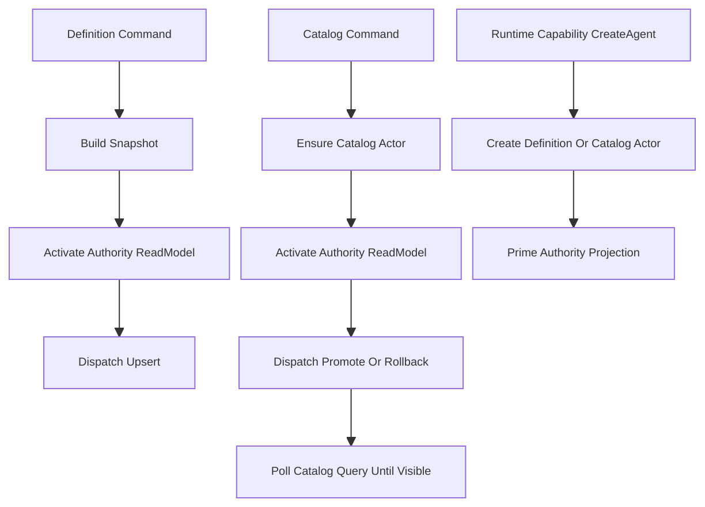
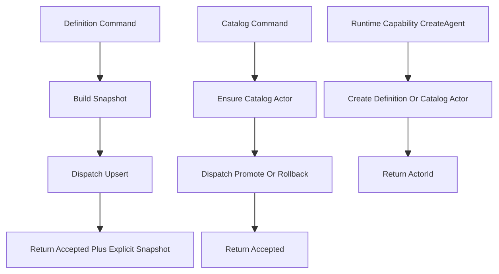
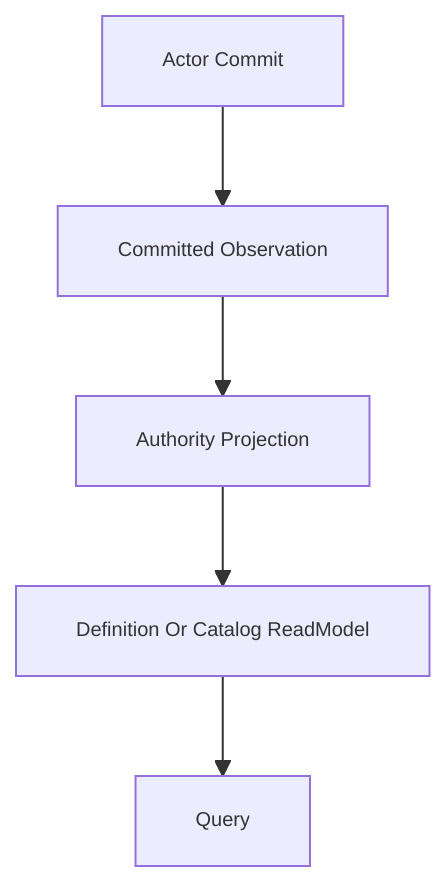

# Scripting Authority 写路径 CQRS 收口设计

> 覆盖 issue `#158` 与 `#159`：统一说明 `scripting authority` 写路径中 authority readmodel lifecycle 与 query-visible success condition 的收口方案；issue 继续拆分，设计统一表达。

---

## 1. 背景

当前 `scripting authority` 链路仍残留两类 CQRS 边界漂移：

1. 写路径直接触发 authority readmodel activation。
2. 写路径将 readmodel/query 追平作为命令成功条件的一部分。

现状表现为：

- definition command service 会在 upsert 前调用 authority readmodel activation。
- catalog command service 会在 promote / rollback 前调用 authority readmodel activation。
- catalog command service 会在 dispatch 后轮询 `IScriptCatalogQueryPort`，等待 readmodel 可见再返回成功。
- runtime capability 的 create path 会在创建 `ScriptDefinitionGAgent` / `ScriptCatalogGAgent` 后主动 prime authority projection。

这与当前仓库既有约束不一致：

- 写路径不控制 readmodel 生命周期。
- 写路径成功不依赖 query/readmodel 追平。
- runtime provisioning 必须依赖 write-side 显式提供的 `ScriptDefinitionSnapshot`。
- committed fact 必须进入统一 observation/projection 主链，query 只读取 readmodel。

## 2. 目标

本设计同时覆盖 `#158` 与 `#159`。

- `#158`：从 scripting 写路径 / runtime capability 中移除 authority readmodel activation。
- `#159`：移除 catalog promote / rollback 成功路径中的 query-port 追平依赖。

目标状态如下：

- definition / catalog / runtime create 写路径不再直接依赖 `IScriptAuthorityReadModelActivationPort`
- scripting authority command path 的同步成功语义统一收口为 `accepted for dispatch`
- definition runtime provisioning 继续通过显式 `ScriptDefinitionSnapshot` 闭环
- authority readmodel 的生命周期不再由 command service 或 runtime capability 承担

## 3. 非目标

本轮不包含以下内容：

- 不重写 authority projector 本身
- 不引入新的平台级通用 projection lifecycle 框架
- 不一次性解决所有 read consumer 的 authority readmodel 预热问题
- 不把 query freshness guarantee 重新塞回 command service

## 3.1 与 `#164` 的关系

本设计与 `#164` 存在原则层重叠，但不属于重复 issue。

`#164` 关注的是平台级通用模式：

- `CommandService -> GAgent -> CommittedStateEventPublished -> Projection Pipeline -> ReadModel`
- `accepted / committed / projected / query-visible` 分层表达
- 读写分离落在 projection pipeline，而不是额外挂 read actor 或 query-time 追平机制

本文关注的是 scripting authority 的定向收口：

- 移除 `IScriptAuthorityReadModelActivationPort` 在 definition/catalog/runtime create path 中的回流使用
- 移除 catalog promote / rollback 对 query-port 追平的成功依赖
- 澄清 `ScopeScriptCommandApplicationService` 等上层返回 DTO 不得偷带 read freshness guarantee
- 明确 authority read bootstrap 不能继续挂在 command path 上

因此：

- 平台级 ACK / Projection 原则，以 `#164` 为通用依据
- scripting authority 的具体收口边界，以本文和 `#158` / `#159` 为定向实施依据

## 4. 当前问题拆解

### 4.1 Definition 写路径

当前链路近似为：

`compile -> build snapshot -> activate authority readmodel -> dispatch upsert`

问题在于：

- activation 属于 projection/read 生命周期控制，不属于 command service 职责
- definition upsert 已经可以在写侧本地构建 `ScriptDefinitionSnapshot`
- 后续 provisioning 所需事实已由写侧显式给出，不应再回退到 authority readmodel

### 4.2 Catalog 写路径

当前链路近似为：

`ensure actor -> activate authority readmodel -> dispatch promote/rollback -> poll catalog query until visible`

问题在于：

- command service 同时承担了 actor ensure、projection lifecycle、query freshness 等多种职责
- 命令成功语义被错误扩展为“readmodel 已可见”
- write-side accepted 与 read-side eventually visible 被混成了一个返回条件

### 4.3 Runtime Capability Create Path

当前 `CreateAgentAsync` 在创建 definition/catalog actor 后，会按 actor type 主动 activation authority projection。

问题在于：

- runtime capability 不应根据 actor type 决定 projection 生命周期
- actor 创建成功不等于 projection 必须由当前调用方立刻启动
- 这会把 read-side 生命周期偷渡回 runtime create path

## 5. 当前链路与目标链路

### 5.1 当前链路

### 5.2 目标链路

核心变化只有两点：

1. 写路径不再控制 authority projection lifecycle。
2. 写路径不再等待 authority readmodel visible 才返回成功。

## 6. 目标链路约束

### 6.1 Definition 写路径

目标链路：

`compile -> build snapshot -> dispatch upsert -> return accepted + explicit snapshot`

约束：

- `RuntimeScriptDefinitionCommandService` 删除对 `IScriptAuthorityReadModelActivationPort` 的依赖
- `UpsertDefinitionWithSnapshotAsync` 只承诺两件事：
  - 本地编译成功并得到合法 `ScriptDefinitionSnapshot`
  - command 已成功 dispatch 到 definition actor
- 返回的 `ScriptDefinitionSnapshot` 是后续 provisioning 的正式输入
- definition readmodel 是否已 activation、是否已 query 可见，不属于该命令返回语义

### 6.2 Catalog 写路径

目标链路：

`ensure actor -> dispatch promote/rollback -> return accepted`

约束：

- `RuntimeScriptCatalogCommandService` 删除对 `IScriptAuthorityReadModelActivationPort` 的依赖
- `PromoteCatalogRevisionAsync` / `RollbackCatalogRevisionAsync` 不再在 command 方法内轮询 `IScriptCatalogQueryPort`
- 同步返回只承诺命令已进入 catalog actor 处理边界
- catalog entry 是否已物化到 readmodel，由异步 observation 或后续 query 单独表达

### 6.3 Runtime Capability Create Path

目标链路：

`runtime.CreateAsync -> return actor id`

约束：

- `ScriptBehaviorRuntimeCapabilities` 与 `ScriptBehaviorRuntimeCapabilityFactory` 删除 `IScriptAuthorityReadModelActivationPort`
- `CreateAgentAsync` 不再根据 actor type prime authority projection
- actor lifecycle 与 projection lifecycle 明确分离

### 6.4 Accepted / Observe 契约

目标约束：

- `accepted for dispatch` 不是无句柄的“口头成功”，而是最少应绑定稳定的 `actorId + commandId + correlationId`
- definition 写路径当前已经通过 dispatch receipt 持有上述标识；catalog 写路径也应补齐等价观察句柄，而不是只保留 `Task`
- 调用方若需要判断后续 `committed / projected / query-visible` 阶段，必须基于该句柄走独立 observation/query 契约
- 禁止因为缺少 observation 句柄而重新把 query poll 塞回 command service

## 7. 权威事实与成功语义

### 7.1 Definition

definition 的权威事实源仍为：

- `ScriptDefinitionGAgent` committed state
- 对应 committed observation 主链

`ScriptDefinitionSnapshotDocument` 是查询副本，不再参与 runtime provisioning 的同步成功判定。

## 8. 后续收尾项

在 `#158` / `#159` 合入之后，剩余的 follow-up 聚焦在 `#160` / `#161` / `#162`：

- 为 scripting 写路径补专属 CQRS 守卫，直接阻断 authority activation / query-port 回流。
- 对 `ScriptBehaviorRuntimeCapabilities._definitionSnapshots` 做边界归类。
- 收紧 `ConcurrentDictionary` 相关架构门禁的检测精度。

### 8.1 `_definitionSnapshots` 的分类结论

`_definitionSnapshots` 保留，但它只允许作为 capability activation-local 的 transient cache：

- 生命周期只跟随单个 `ScriptBehaviorRuntimeCapabilities` 实例。
- 只缓存同一交互内已经由写侧显式拿到的 `ScriptDefinitionSnapshot`。
- 不参与跨请求、跨节点、跨 run 的事实判定。
- miss 时仍然回到 `IScriptDefinitionSnapshotPort` 获取正式查询副本。

因此它不是 authority state，也不是 shadow state；它只是一个受限的 non-durable shortcut cache。若后续出现跨交互复用、命中结果影响业务判定、或 cache 成为唯一事实来源，就应立即重构或删除。

### 8.2 守卫策略

新增/收紧的守卫应表达为：

- scripting write path 不得依赖 `IScriptAuthorityReadModelActivationPort`
- scripting catalog write path 不得依赖 `IScriptCatalogQueryPort`
- concurrent collection 检测应以字段类型为主，而不是只靠字段名命中

### 7.2 Catalog

catalog 的权威事实源仍为：

- `ScriptCatalogGAgent` committed state
- 对应 committed observation 主链

`ScriptCatalogEntryDocument` 仅负责查询，不再作为 promote / rollback 的同步成功条件。

### 7.3 成功语义收口

本轮之后，scripting authority 相关命令的同步返回默认只表达：

- command 已被系统接受
- command 已成功 dispatch 到目标 actor 语义边界
- 调用方已获得稳定 observation handle（至少 `actorId + commandId + correlationId`）
- 后续 committed / projected / query-visible 不再由同一次同步返回暗示

若调用方需要更强保证，例如：

- definition readmodel 已可查
- catalog revision 已对 query 可见

则必须通过独立 query 或异步 observation 契约获取，不能继续由 command service 内联承担。

其中：

- definition path 可继续沿用现有 dispatch receipt 里的 `commandId / correlationId`
- catalog path 不应停留在“fire-and-forget + 事后盲查”；应补齐 accepted receipt，或在更上层返回结果中显式带出可观察标识
- 若上层暂时无法立刻暴露完整 receipt，至少也必须定义稳定 command identity，避免后续无法把 accepted 与 read-side observation 对账

## 8. 为什么 `#158` 与 `#159` 应合并为一个 PR

`#158` 与 `#159` 解决的是同一问题的两个层次：

- `#158`：写路径不控制 authority readmodel lifecycle
- `#159`：写路径不依赖 authority readmodel visibility 判定成功

二者如果只单独理解，很容易出现偏差：

- 只做 `#158`，容易退化成“删 activation 调用”，但成功语义仍依赖 query 追平
- 只做 `#159`，容易留下写路径继续偷管 projection lifecycle

因此：

- 设计上必须统一表达，确保 CQRS 边界一次讲清楚
- 交付上也应收敛为 **一个 PR**
- issue 可以继续拆开跟踪，但 PR 不应再拆成“先删 activation / 再删 query poll”的两段半成品

原因很直接：

- 若 PR 只覆盖 `#158`，调用方仍会从同步返回里偷领 read freshness guarantee
- 若 PR 只覆盖 `#159`，写路径仍会继续控制 read-side lifecycle
- 两个改动只有同时落地，`accepted / committed / projected / query-visible` 的边界才是完整且可解释的

因此推荐的交付单位是：

- **一个 PR**
- **两个 linked issues**
- **同一份设计文档**
- **同一组验证命令**

## 9. 单 PR 范围

本 PR 应同时覆盖 issue `#158` 与 `#159`，但范围必须只围绕 scripting authority 写路径 CQRS 收口，不再混入无关改动。

### 9.0 建议 PR 叙事

建议标题方向：

- `Refactor scripting authority write path accepted semantics`
- 或 `Close scripting authority write-path CQRS gap for #158 and #159`

建议 PR 描述必须明确写清：

- 本 PR 同时关闭 `#158` 与 `#159`
- 写路径不再控制 authority readmodel lifecycle
- 写路径不再把 query-visible 当作同步成功条件
- save/upsert 返回 accepted summary + command handles
- query/detail 仍然走 readmodel，最终一致性语义保持诚实

### 9.1 PR 必含内容

- definition command service 移除 authority activation
- catalog command service 移除 authority activation
- runtime capability factory/capabilities 移除 authority activation 依赖与 priming 行为
- catalog promote / rollback 移除 query-port 轮询成功路径
- catalog 写路径返回稳定 accepted receipt
- `ScopeScriptCommandApplicationService` / Studio save path 返回 accepted summary，而不是伪装成已追平 readmodel 的 summary
- save/upsert HTTP endpoint 返回 `202 Accepted`

### 9.2 PR 必须同步澄清的 API 语义

- 写接口的同步返回只表达 `accepted for dispatch`
- accepted payload 应显式包含：
  - `scopeId`
  - `scriptId`
  - `revisionId`
  - `catalogActorId`
  - `definitionActorId`
  - `sourceHash`
  - `acceptedAt`
  - `definition command handle`
  - `catalog command handle`
- 若返回 `Location` header，该地址不得暗示“此刻 readmodel 必然已可见”
- 在 dedicated observation endpoint 尚未存在前，`Location` 更适合作为 accepted resource / command handle 资源地址；若暂时做不到，当前更安全的策略是 **不返回 `Location` header**

### 9.3 PR 验收标准

- `IScriptAuthorityReadModelActivationPort` 不再出现在上述写路径与 runtime create path
- catalog command service 不再依赖 readmodel 追平后再返回成功
- projection/readmodel 延迟不再阻塞 command path 返回
- definition upsert 仍可返回可用于 provisioning 的 `ScriptDefinitionSnapshot`
- actor create path 不再隐式启动 authority projection
- Studio / Scope save API 的 DTO 与状态码语义和上述 accepted contract 一致
- catalog 可见性验证转入独立 read/observe 测试，而非 command-path 测试

### 9.4 PR 明确不包含的内容

- 无关 issue 的文档清理
- 无关 skill / audit 文件删改
- 新的 query-time bootstrap 机制设计与落地
- projection pipeline 的平台级通用重构
- 任何与 scripting authority write-path 主线无关的“顺手优化”

## 10. 实施顺序建议

推荐在 **一个 PR** 内按以下顺序提交或组织 commit：

1. 先切断 write path 对 authority activation 的依赖
2. 再切断 catalog command 对 query-visible success 的依赖
3. 最后统一上层 DTO / endpoint contract / tests / docs

这样做的好处是：

- 中间每一步都还能单独验证
- 最终交付仍是一个语义完整的 PR
- review 时可以沿着同一条主线看完，不会变成两个互相依赖的半成品 PR

## 11. 对调用方的影响

### 11.1 Definition / Provisioning

definition upsert 后如需继续 provisioning，应直接消费写侧返回的 `ScriptDefinitionSnapshot`。

这与现有 canon 中“runtime provisioning 显式依赖 write-side snapshot”的方向一致。

影响：

- 流程仍能正常运转
- 不再需要 definition authority readmodel 先 activation / 先 query 可见才能 provisioning

### 11.2 Scope Script Command

`ScopeScriptCommandApplicationService` 不应再把“catalog readmodel 已追平”当作返回前提。

影响：

- definition 侧可继续依赖 write-side returned snapshot
- catalog 侧不再应把“写后立即 query 可见”当作 command guarantee
- 现有 `ScopeScriptUpsertResult.Script` 若继续保留 `ScopeScriptSummary` 形态，则必须明确它是：
  - 要么“best-effort read snapshot，允许旧值”
  - 要么“由 command input + accepted receipt 组装出的 accepted summary”，不再伪装成已追平 readmodel
- 更推荐的收口方式是把 `RevisionId / CatalogActorId / DefinitionActorId / accepted command handle` 作为写路径主返回，把 query summary 降级为可选补充信息
- 如短时间内 catalog readmodel 尚未追平，应由调用方接受最终一致，或改走显式 observation/query 策略

也就是说，本轮不只是下沉 `RuntimeScriptCatalogCommandService` 的轮询逻辑，还需要同步澄清 `ScopeScriptCommandApplicationService` 的返回 DTO 语义，避免上层继续通过一次 command 返回“偷领” read-side 新鲜度保证。

### 11.2.1 HTTP accepted contract

对于 Scope / Studio save endpoint，需要补充一条更具体的约束：

- `202 Accepted` 是对 command accepted 的表达，不是对 detail query fresh 的表达
- 因此返回体应优先表达 accepted summary + command handles
- 若设置 `Location`，该 URI 不能把 readmodel detail endpoint 伪装成“已经可读的新状态”

换句话说：

- `GET /scripts/{scriptId}` 仍然是 readmodel query
- promotion/query-visible 判断应直接复用现有 `GET /scripts/{scriptId}/catalog` 一类 readmodel endpoint，对 `activeRevision / proposalId` 是否追平做独立确认
- 若现有 readmodel query 已足够表达“catalog 是否切到目标 revision”，则不再额外引入 dedicated promotion observation endpoint
- `PUT/POST save script` 的 accepted 响应不能借这个 query endpoint 暗示强保证

否则会出现表面上“我们已经把 success 语义收窄为 accepted”，实际上 HTTP 契约又把调用方引回 query poll 路径的问题。

### 11.3 Runtime Capability Create Path

`CreateAgentAsync` 去掉 authority projection priming 后，actor 仍能正常创建。

影响：

- 不再顺手帮 definition/catalog actor 启动 readmodel materialization
- actor create 成功语义变得更窄、更诚实

### 11.4 Query 侧

query 侧若需要 authority readmodel 已经存在，应通过 read-side 自己的 lifecycle/bootstrap 策略解决，而不是再回流到写路径解决。

这是本轮改动后最重要的行为变化：

- 写路径继续工作
- 读路径不能再隐式依赖“写路径帮我把 readmodel 预热好了”

bootstrap 归属需要进一步明确：

- authority readmodel activation 若继续保留，应归属于 read-side 专用 activation port / query bootstrap flow / projection lease owner
- 该 owner 负责“需要时确保投影 scope 已建立”，而不是由 definition/catalog command service 或 runtime capability 代劳
- query path 禁止在方法体内同步做 query-time priming；若确有“首次读取前确保 lease 存在”的需求，也必须通过显式 activation/lease 协议完成，而不是隐式夹带在 command path 中
- 后续若 scripting 需要更细粒度区分 definition authority / catalog authority 的 read bootstrap，也应在 read-side 端口层建模，而不是回退到通用 command path 注入 activation

## 12. 测试策略

`#158` 需要覆盖：

- definition command service 不再调用 authority activation
- catalog command service 不再调用 authority activation
- runtime capability create definition/catalog actor 时不再 activation
- definition upsert 与 runtime create 在无 authority activation 情况下仍正常工作

`#159` 需要覆盖：

- catalog command service dispatch 后立即返回
- promote / rollback 不再 query poll
- projection 延迟情况下命令仍返回 accepted
- catalog query 可见性测试独立存在，不再作为 command-path 成功条件

## 13. 后续治理建议

本轮完成后，建议补一条 scripting 专属架构守卫：

- 禁止 definition/catalog/runtime command path 依赖 authority projection activation
- 禁止 scripting authority command service 直接依赖 `IScriptCatalogQueryPort` 作为同步成功判定依据
- 禁止把 query visible 作为 command service 的同步成功条件
- 禁止 `ScopeScriptCommandApplicationService` 等上层应用服务在 command 返回 DTO 中暗示“readmodel 已追平”，除非显式声明为 accepted summary 或 best-effort query snapshot
- 要求 scripting command accepted 结果具备稳定 `commandId / correlationId`，避免通过 query poll 补齐观察能力
- 要求 authority readmodel bootstrap 只能由 read-side activation / lease 入口承担，禁止回流到 runtime create / command path

这样可以把本次边界收口固化为自动化门禁，而不是依赖人工记忆。

## 14. 结论

`#158` 与 `#159` 可以继续作为两个 issue 跟踪，但交付上应合并为 **一个 PR**。

原因不是管理偏好，而是语义闭环：

- `#158` 负责切断 write path 对 read lifecycle 的控制
- `#159` 负责切断 write path 对 read visibility 的成功依赖
- 二者必须同时成立，accepted / committed / projected / query-visible 的边界才真正收口

因此最终建议是：

- issue 保持拆分
- 设计保持统一
- 实现与 review 收敛为一个 PR
- PR 范围只围绕 scripting authority write-path CQRS closure，不混入无关改动
