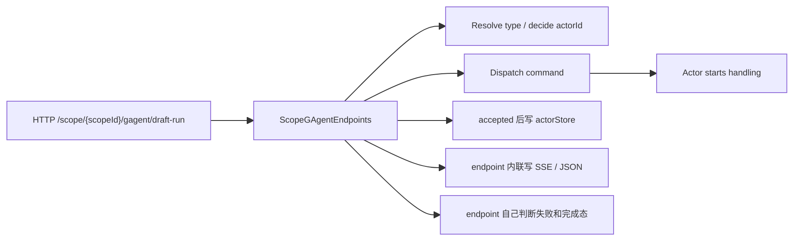
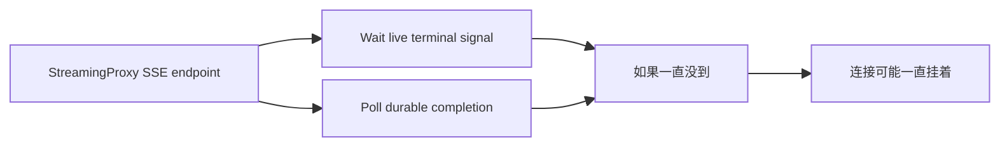
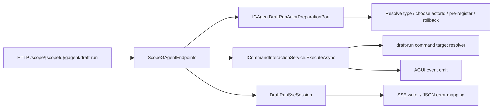

# Issue 204：AGUI / SSE Projection Session Pipeline 落地说明

> 本文档位于 `docs/history/2026-04/`，保留的是一份“落地后回看版”说明，不再保留最初那版大而全的设计推演。当前权威口径仍以 [ADR-0015：AGUI / SSE Projection Session Pipeline](../../adr/0015-agui-sse-projection-session-pipeline.md) 为准；本文只回答三件事：原来哪里有问题，这次代码具体怎么收了，哪些还没做。

## 1. 这次到底在修什么

Issue 204 的核心不是“把 SSE 写法统一一下”，而是把以下边界收紧：

- Host 只做 HTTP 请求解析、SSE 输出和错误映射
- actor 生命周期准备、复用判断、失败回滚放回 Application
- 完成态判定不能再靠 endpoint 内部临时 `TCS/Delay/while` 猜测
- live stream 和 durable completion 必须有明确 owner，不能无限挂住

这次真正落到代码上的重点是两条链路：

1. `ScopeGAgent draft-run`
2. `StreamingProxy completion finalize`

---

## 2. 原来的问题点

### 2.1 ScopeGAgent draft-run

旧实现里，[ScopeGAgentEndpoints.cs](../../../src/platform/Aevatar.GAgentService.Hosting/Endpoints/ScopeGAgentEndpoints.cs) 同时承担了：

- 校验 HTTP 请求
- 解析 actor type
- 决定 actorId
- 判断复用还是新建
- dispatch 命令
- accepted 后写 actor store
- 失败时兜底写 JSON / SSE

这会带来三个具体问题：

1. **先 dispatch、后注册**
   - 如果命令已经发出去，但 `actorStore.AddActorAsync(...)` 失败，就可能产生“actor 已经活了，但 scope catalog 里没有”的 orphan actor。

2. **复用 `preferredActorId` 时没有先校验类型**
   - 如果 `preferredActorId` 指向的是别的 actor type，旧代码仍可能继续复用，并把这个 `actorId` 记到错误的 type catalog 下面。

3. **Host 直接拥有 draft-run 生命周期**
   - 这会让 endpoint 同时负责 HTTP 协议和业务资源语义，违反仓库里 `Host/API 不承载核心编排` 的要求。

### 2.2 StreamingProxy completion

旧实现里，`StreamingProxy` 的 finalize loop 如果同时遇到这两件事：

- live terminal signal 一直没到
- durable completion snapshot 也一直查不到

那么 SSE 可能一直挂着，没有自己的 hard stop。

---

## 3. 旧链路长什么样

### 3.1 Draft-run 旧链路

问题不在“它能不能跑”，而在于：

- dispatch 和 registry 写入不是一个原子语义
- Host 同时拥有资源准备和输出协议
- 一旦失败，清理责任不明确

### 3.2 StreamingProxy 旧链路

---

## 4. 现在的代码怎么分层

### 4.1 Draft-run 新链路

新的职责边界是：

- **Host**
  - 校验 HTTP 请求
  - 调用应用端口
  - 组装 `GAgentDraftRunCommand`
  - 把 `AGUIEvent` 写回 SSE
  - 把应用错误映射成 HTTP JSON

- **Application**
  - 解析 actor type
  - 决定最终 `actorId`
  - 判断 actor 是否已存在
  - 新 actor 先预注册到 `actorStore`
  - pre-response 失败时负责 rollback

- **Interaction / Resolver**
  - 校验复用 actor 的真实类型是否匹配请求 type
  - 输出 `ActorTypeMismatch` 等强语义错误

### 4.2 StreamingProxy 新链路

`StreamingProxy` 这次没有做“大重构”，只补了一个必须有的完成语义：

- live signal 先等
- durable completion 再查
- 两边都拿不到时，超时后明确发 `RUN_ERROR`

这意味着它现在至少具备了“会结束”的诚实语义。

---

## 5. 这次新增的关键代码点

### 5.1 Draft-run actor preparation 抽象

- [GAgentDraftRunPreparationContracts.cs](../../../src/platform/Aevatar.GAgentService.Abstractions/ScopeGAgents/GAgentDraftRunPreparationContracts.cs)
- [GAgentDraftRunActorPreparationService.cs](../../../src/platform/Aevatar.GAgentService.Application/ScopeGAgents/GAgentDraftRunActorPreparationService.cs)

这里新增了一个很窄的应用端口：

- `PrepareAsync(...)`
- `RollbackAsync(...)`

它负责的不是“执行 draft-run”，而是**在真正 dispatch 前把 actor 生命周期准备好**。

### 5.2 Draft-run type mismatch 防线

- [GAgentDraftRunInteraction.cs](../../../src/platform/Aevatar.GAgentService.Application/ScopeGAgents/GAgentDraftRunInteraction.cs)

这里补的是：

- 复用 `preferredActorId` 前先校验真实 actor type
- 不匹配就返回 `ActorTypeMismatch`

这一步的作用不是“报错更友好”，而是**防止错误 actorId 污染 catalog**。

### 5.3 Host 侧只保留 HTTP/SSE 适配

- [ScopeGAgentEndpoints.cs](../../../src/platform/Aevatar.GAgentService.Hosting/Endpoints/ScopeGAgentEndpoints.cs)

现在 Host 里仍然有一些代码，但这些代码的性质已经变了。保留下来的主要是：

- `TryValidateDraftRunRequest(...)`
- `BuildDraftRunCommandAsync(...)`
- `DraftRunSseSession`
- HTTP JSON 错误映射

这些都属于协议适配层职责，不再是 actor lifecycle owner。

### 5.4 StreamingProxy 完成超时

- [StreamingProxyEndpoints.cs](../../../agents/Aevatar.GAgents.StreamingProxy/StreamingProxyEndpoints.cs)
- [StreamingProxyDefaults.cs](../../../agents/Aevatar.GAgents.StreamingProxy/StreamingProxyDefaults.cs)

新增的是 completion deadline，而不是第二套新框架。

---

## 6. 这次真实消掉了什么风险

本次代码改动真正带来的收益有 4 个：

1. **避免 orphan actor**
   - 新 actor 会先注册；如果 dispatch 在 SSE 开始前失败，会 rollback。

2. **避免 actor catalog 错绑**
   - 复用旧 actor 时必须先过类型校验。

3. **避免 SSE 无限挂住**
   - `StreamingProxy` completion 现在有 hard timeout。

4. **把 draft-run lifecycle owner 从 Host 挪回 Application**
   - endpoint 不再直接控制 runtime/store 的资源语义。

---

## 7. 为什么代码变多，但体感收益没那么强

这是一个正常现象，原因有三层：

1. **原来缺的不是 if/else，而是职责落点**
   - 之前没有专门的 lifecycle preparation 抽象，所以修正确只能先长出一个 port 和一个 service。

2. **这次修的是一致性问题，不是新功能**
   - 用户界面看起来可能没大变化，但正确性边界变了。

3. **新增代码里有相当一部分是测试**
   - 这些不是运行时新逻辑，而是在把“预注册、rollback、type mismatch、timeout”这些行为固定下来。

更直白地说：

- 这次加的代码里，最值钱的是“语义被明确了”
- 不是“页面看起来多了什么”

---

## 8. 这次没有做什么

这份修复并没有完成 Issue 204 的全部理想终态。

目前还**没有**一起做掉的事情包括：

- `ScopeService` 全部 streaming 入口统一迁到同一 interaction skeleton
- `NyxIdChat` 完整迁回 projection-owned session owner
- 所有 Host SSE 入口共用一套最小响应 helper

所以这次应理解为：

- `draft-run` 生命周期边界修正：已完成
- `StreamingProxy completion` 终止语义修正：已完成
- 全仓所有 streaming 入口完全统一：未完成

---

## 9. 当前验证方式

本轮相关验证包括：

- `dotnet test test/Aevatar.GAgentService.Tests/Aevatar.GAgentService.Tests.csproj --nologo --filter "GAgentDraftRunInteractionTests|GAgentDraftRunActorPreparationServiceTests"`
- `dotnet test test/Aevatar.GAgentService.Integration.Tests/Aevatar.GAgentService.Integration.Tests.csproj --nologo --filter ScopeGAgentEndpointsTests`
- `dotnet test test/Aevatar.AI.Tests/Aevatar.AI.Tests.csproj --nologo --filter StreamingProxyCoverageTests`

---

## 10. 一句话结论

这次变更的本质不是“加了一个新 feature”，而是把原本散落在 Host 里的三类语义补齐并归位：

- actor 生命周期准备
- actor 复用一致性校验
- stream 完成态终止语义

如果后面继续想“减少代码量”，正确方向不是再压一层业务抽象，而是继续把 Host 里剩下的 SSE 响应辅助逻辑做轻量收口。
