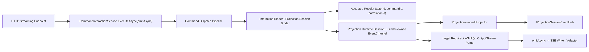

# Issue 204：统一 AGUI / SSE 到 Projection Session Pipeline 技术设计

> 本文档归档于 `docs/history/2026-04/`，用于记录 Issue #204 在 2026-04-17 的设计快照。仓库权威口径已固化到 [ADR-0011：AGUI / SSE Projection Session Pipeline](../../decisions/0011-agui-sse-projection-session-pipeline.md)；最终 owner、guard、验收口径与 merge gate 以 ADR 为准，本文仅保留设计推演、迁移拆分与当时判断的历史上下文。

## 1. 文档目标

本文最初基于 `origin/dev` 在 **2026-04-17** 的快照起草；本次补充已按 **2026-04-20** 本地最新同步状态重新对照受影响入口与现有 workflow skeleton（本地 `git rev-parse --short=8 origin/dev = 8861b4ca`，且当前 `HEAD` 同步为 `8861b4ca`）。以下设计判断、文件定位与可复用骨架均以该快照为准。

目标不是一次性重写所有 streaming 入口，而是把以下用户可见流式入口收敛到统一的 **Projection Session Pipeline**：

- `agents/Aevatar.GAgents.NyxidChat/NyxIdChatEndpoints.cs`
- `agents/Aevatar.GAgents.StreamingProxy/StreamingProxyEndpoints.cs`
- `src/platform/Aevatar.GAgentService.Hosting/Endpoints/ScopeGAgentEndpoints.cs`
- `src/platform/Aevatar.GAgentService.Hosting/Endpoints/ScopeServiceEndpoints.cs`

并满足仓库的硬性架构要求：

- Host/API 不直接承载核心业务编排
- CQRS 与 AGUI 走同一套 Projection Pipeline
- 投影运行态由 Projection Runtime / Actor 承载，不在 Host 中维护事实状态
- 读写分离，命令受理与流式观察分离

本次设计以目标重构形态为准，不为历史 endpoint 行为、旧首帧协议或过渡期双轨实现保留兼容壳。

---

## 1.1 决策摘要

为方便评审与开工，先把本次设计的最终落点收敛为 5 条：

1. 受影响 streaming 入口统一回到 `ICommandInteractionService.ExecuteAsync(emitAsync)` 或等价订阅生命周期端口，不再直接订阅 raw `EventEnvelope`
2. runtime / projection 命名统一沿用现有 `RootActorId + SessionId`；HTTP 租户 `scopeId` 不进入 projection session key
3. `accepted/context` 首帧固定为 `AGUIEvent.Custom("aevatar.run.context") + typed payload`，由 interaction 层发出，Host 不得手搓
4. `StreamingProxy room chat stream` 的 completion 由 projection-owned session controller 推进，再通过 completion policy / finalize emitter 接回现有 interaction skeleton
5. `StreamingProxy room message stream` 使用 subscription-scoped session，不伪造命令语义 key

---

## 2. 问题归纳

当前 `dev` 分支中，上述 streaming 入口普遍存在同构问题：

1. **直接订阅原始 `EventEnvelope`**
   - `SubscribeAsync<EventEnvelope>(actorId, ...)`
2. **在 endpoint 内联做事件映射**
   - `MapAndWriteEventAsync(...)`
   - `TryMapEnvelopeToAguiEvent(...)`
3. **在 endpoint 内联管理完成态**
   - `TaskCompletionSource(...)`
   - 以 `TextMessageEnd` / `RunError` / 自定义 signal 作为终止条件
4. **在 endpoint 内联管理 actor 生命周期与 dispatch**
   - `actorRuntime.CreateAsync(...)`
   - `actor.HandleEventAsync(envelope, ct)`

这导致 Host 同时承担了：

- 请求解析
- actor 创建 / 查找
- 命令派发
- 流式订阅
- 事件到表现层协议的映射
- 完成态判定

这与仓库要求的分层、投影统一入口、运行态 Actor 化相冲突。

---

## 3. 当前可复用基线

仓库并不是没有正确方向，但三条相关主线的成熟度并不相同：

### 3.1 已存在的统一能力

- `IProjectionSessionEventHub<TEvent>`
- `ProjectionSessionEventProjectorBase<TContext, TEvent>`
- `EventSinkProjectionLifecyclePortBase<TLease, TRuntimeLease, TEvent>`
- `ProjectionSessionEventHub<TEvent>`

### 3.2 已存在的“正确链路”

`workflow` 已经走通：

`Command / Interaction Service -> Projection Port -> Session Event Hub -> SSE/WebSocket writer`

对齐到仓库当前可执行骨架，command-scoped streaming 的权威 interaction skeleton 进一步收敛为：

`ICommandInteractionService.ExecuteAsync(emitAsync) -> binder-owned EventChannel<TEvent> -> target.RequireLiveSink() -> output stream pump -> writer`

代表实现：

- `src/workflow/Aevatar.Workflow.Projection/Orchestration/WorkflowExecutionProjectionPort.cs`
- `src/workflow/Aevatar.Workflow.Presentation.AGUIAdapter/WorkflowExecutionRunEventProjector.cs`
- `src/platform/Aevatar.GAgentService.Hosting/Endpoints/ScopeWorkflowEndpoints.cs`

这说明 Issue #204 的核心不是重新发明框架，而是把现有能力扩展到 GAgent / NyxId / StreamingProxy 的 streaming 入口。

### 3.3 当前实现成熟度与缺口

为避免把 `workflow`、`scripting`、`NyxIdChat` 误判为“已经同样接好”，这里补充当前代码现状：

1. **workflow：已基本打通 command-scoped Projection Session 主干**
   - 已有 `ICommandInteractionService.ExecuteAsync(...)`
   - binder 已分配内部 `EventChannel<TEvent>` 并 attach projection lease
   - projector 已把 committed `EventEnvelope` 映射为 `WorkflowRunEventEnvelope`
   - Host 侧 `workflow` / `agui` 两种输出都消费 interaction 主链，而不是自己再订阅 raw `EventEnvelope`

2. **scripting：已有 projection/session 基础设施，但当前 host-side chat stream 入口尚未切到同一 interaction skeleton**
   - `Aevatar.Scripting.Projection` 已提供 `ScriptExecutionProjectionPort`、`ScriptExecutionSessionEventProjector`、`ScriptExecutionSessionEventCodec`
   - 但 `ScopeService` 的 static / scripting chat stream 入口当前仍直接 `SubscribeAsync<EventEnvelope>`、直接 `HandleEventAsync(...)`，并在 endpoint 内用 `TaskCompletionSource + Task.Delay` 判定完成
   - 因此本次文档中把 `scripting` 视为“有可复用基建”，但**不能**把它表述成“已经和 workflow 一样完成 host-side 主链收敛”

3. **NyxIdChat：业务能力已跑通，但当前仍是 host-owned orchestration**
   - bearer token、memory、connected-services、tool approval、media content、relay webhook 等业务能力都已存在，不是“从零重写”
   - 需要重构的是命令受理、流式订阅、完成态与首帧协议的 owner，而不是把 NyxId 业务协议整体推翻
   - 当前 `:stream` / `:approve` 仍直接订阅 raw `EventEnvelope`、直接 `HandleEventAsync(...)`、直接在 endpoint 中做 Nyx frame 映射与 timeout/TCS 收口

4. **“Projection transport 序列化”与“HTTP SSE 写回序列化”是两层不同语义**
   - workflow/scripting 在 projection session 内部传输层已经通过 `IProjectionSessionEventCodec<TEvent>` 进行 protobuf 序列化
   - 对外 HTTP SSE 写回仍各自走 writer 层 JSON 格式化：`WorkflowRunEventEnvelope -> JSON SSE`、`AGUIEvent -> JSON SSE`、`Nyx frame object -> JSON SSE`
   - 因此本 issue 统一的重点是 **observation pipeline / owner / session lifecycle**，不是要求所有外部 SSE 输出复用同一个 writer 或同一份 JSON 外壳

---

## 4. 设计原则

### 4.1 统一的是“链路模式”，不是“单一事件类型”

本次统一的对象是：

`Committed EventEnvelope -> Projection-owned projector -> SessionEventHub<TEvent> -> live sink -> SSE`

而不是强行把所有前端流式协议压成同一个万能事件类型。

因此：

- `AGUI` 入口可以使用 `AGUIEvent`
- `NyxIdChat` 可以复用 `AGUIEvent` 再转 Nyx SSE
- `StreamingProxy` 应保留自己强类型的 room stream event

统一链路，不统一语义载荷。

### 4.2 命令受理与流式观察拆开

Host 允许做两件事：

1. 把 HTTP 请求翻译为应用层命令请求
2. 把投影 session event 写回 HTTP SSE

Host 不再直接负责：

- actor 创建 / 获取
- 直接 `HandleEventAsync`
- 直接订阅 actor 原始流
- 在原始 envelope 上做映射

### 4.3 Projection Session Key 语义收紧

为了避免把 `sessionId`、`commandId`、`actorId` 与仓库现有 HTTP `scopeId`（租户/范围语义）混成一团，本次统一不再把所有 stream 都压成同一种 key，而是显式拆成两类 projection session。

但这里**不新增第三套 runtime 命名**。本次实现必须直接对齐仓库现有 projection/runtime 契约：

- 文中所说的“projection root”只是解释性术语；进入代码后统一落到现有 `ProjectionScopeStartRequest.RootActorId`
- `IProjectionSessionEventHub<TEvent>.PublishAsync(scopeId, sessionId, ...)` / `SubscribeAsync(scopeId, sessionId, ...)` 中的 `scopeId`，在本 issue 范围内语义上等同于 `RootActorId`
- HTTP 路径里的租户/范围 `scopeId` 仍然只表示 host 输入边界上的 scope 语义，**不得**直接透传成 projection hub 的 `scopeId`
- 因此本次实现中，新增 port / context / lease / projector / controller 一律沿用现有 runtime 命名：`RootActorId + SessionId`；文档后文若提到“projection root”，都应理解为 `RootActorId`

在这个前提下，两类 projection session 的键语义如下：

- `RootActorId`：projection session 的权威根标识；在 AI chat 主线中等于目标 actor id，在 `StreamingProxy` 主线中等于 room id
- `command-scoped SessionId`：一次命令受理对应的稳定 `commandId`
- `subscription-scoped SessionId`：一次被动订阅受理对应的稳定 `subscriptionId`

两类 key 的边界如下：

1. **command-scoped stream**
   - 适用于 `ScopeGAgent draft-run`、`ScopeService static/scripting stream`、`NyxIdChat`、`StreamingProxy room chat stream`
   - session 主键固定为 `(RootActorId, commandId)`
   - `commandId` 只来自受理 receipt，不得伪造

2. **subscription-scoped stream**
   - 适用于 `StreamingProxy room message stream` 这类“只订阅、不派发命令”的被动长连接
   - session 主键固定为 `(RootActorId, subscriptionId)`
   - `subscriptionId` 是订阅生命周期端口生成的 typed 订阅键，只服务于 projection/runtime lease，不承担业务 command 语义

补充约束：

- 客户端传入的业务 `SessionId` 仍保留在命令 payload 中，只服务业务语义，不作为 Projection Session 主键
- `commandId` 是追踪命令受理的标识，不得复用为被动订阅主键
- Host 不生成 `subscriptionId`，只提交 typed subscription request；`subscriptionId` 的创建、持有与释放统一归订阅生命周期端口负责
- Host 不得额外维护 `subscriptionId -> runtime context` 事实状态字典

---

## 5. 方案对比

### 方案 A：只提取 Host 侧共享 helper

做法：

- 把 `SubscribeAsync<EventEnvelope> + Map + TCS` 提取成公共 helper
- endpoint 继续直接操作 `actorRuntime` / `HandleEventAsync`

优点：

- 改动小

缺点：

- 只是把违规逻辑搬家
- 没有进入 Projection 主链
- Host 仍然同时拥有 dispatch 与 observation

结论：**不采用**

### 方案 B：按类型引入 Projection-owned Session Event 链路

做法：

- 为 AGUI / room stream 分别建立 projector + projection port
- endpoint 只做 receipt 驱动的流启动与 sink 写回
- dispatch 进入应用服务 / command port / invocation port

优点：

- 与仓库目标主干一致
- 能满足 issue 的全部验收条件
- 可以渐进迁移，不要求一次吃掉全仓

缺点：

- 需要新增 1~2 组 projection port / projector / codec 注册
- 要补一层命令受理应用服务

结论：**推荐方案**

### 方案 C：直接抽象成全仓统一 `ICommandInteractionService` for everything

做法：

- 为 GAgent、NyxId、StreamingProxy、service invocation 一次性建立完整的 command interaction framework

优点：

- 长期形态最整齐

缺点：

- 超出 Issue #204 最小必要范围
- 需要同时触碰多个子域应用服务
- 风险明显高于本 issue 的目标

结论：**作为后续演进方向，不纳入本次实现**

---

## 6. 推荐架构

### 6.1 总体链路



### 6.2 关键分责

- **Application / Infrastructure**
  - 负责命令受理、目标解析、actor dispatch、receipt 生成
  - 对于 command-scoped streaming 入口，统一使用 interaction skeleton：binder 分配内部 `EventChannel<TEvent>`，建立 projection lease，并通过 `target.RequireLiveSink()` 暴露 live sink
  - `ICommandInteractionService.ExecuteAsync` 继续以 `emitAsync` 作为对 Host writer 的唯一输出契约，不在本次 issue 中发明新的 sink-factory 基础抽象
- **Projection**
  - 负责 committed `EventEnvelope` 到用户可见 stream event 的映射
  - 负责 session 级 live observation
- **Host**
  - 负责 HTTP 输入校验、SSE 启动、writer 写出、错误转 HTTP
  - 对于 command-scoped streaming，只向 `ICommandInteractionService.ExecuteAsync` 提供 `emitAsync` / writer callback，不拥有 live sink
  - 不负责 projection session ensure/attach/detach，不拥有 observation lifecycle

### 6.3 两条迁移主线

1. **AI Chat / AGUI 主线**
   - 覆盖 `ScopeGAgent draft-run`、`ScopeService static/scripting stream`、`NyxIdChat`
2. **StreamingProxy 主线**
   - 覆盖 room chat stream / room message stream

---

## 7. AI Chat / AGUI 主线设计

### 7.1 新增 Projection 侧能力

建议新增一个 AI streaming projection 适配层，职责与 `workflow` 的 AGUI adapter 对齐：

- `IProjectionSessionEventCodec<AGUIEvent>`
- `IProjectionSessionEventHub<AGUIEvent>`
- `AIChatSessionProjectionPort`
- `AIChatSessionRuntimeLease`
- `AIChatSessionEventProjector`
- `IEventEnvelopeToAGUIEventMapper`

本次实现直接钉死 owner：

- `AGUIEvent` projector / mapper / adapter / run-context builder 统一放在新增 `src/Aevatar.AI.Presentation.AGUIAdapter/`
- `Aevatar.AI.Projection` 继续只负责 projection/readmodel 侧语义，不拥有面向 AGUI 的展示协议映射

原因：

- 输出契约已经是 `AGUIEvent`
- 与现有 `src/workflow/Aevatar.Workflow.Presentation.AGUIAdapter/` 保持对称
- 避免把 presentation-facing contract 混入通用 AI projection 项目

### 7.2 Projector 职责

`AIChatSessionEventProjector` 继承：

- `ProjectionSessionEventProjectorBase<AIChatProjectionContext, AGUIEvent>`

职责：

1. 只消费 committed `EventEnvelope`
2. 调用 mapper 把 AI/runtime event 转为 `AGUIEvent`
3. 用现有 runtime 命名 `(RootActorId = actorId, SessionId = commandId)` 发布到 `IProjectionSessionEventHub<AGUIEvent>`；即调用 hub 时使用 `PublishAsync(scopeId: actorId, sessionId: commandId, ...)`

### 7.3 受理路径

#### ScopeGAgent draft-run

新增应用层端口，例如：

- `IGAgentDraftRunCommandPort`

返回：

- `GAgentDraftRunAcceptedReceipt`

职责：

- 解析 `ActorTypeName`
- 根据 `PreferredActorId` 获取或创建 actor
- 必要时写入 `IGAgentActorStore`
- 组装 `ChatRequestEvent`
- 通过 `IActorDispatchPort` 派发
- 返回 receipt

这样 `ScopeGAgentEndpoints.HandleDraftRunAsync` 不再直接操作 `actorRuntime.CreateAsync(...)` 与 `actor.HandleEventAsync(...)`。

现状说明：

- `ScopeGAgent draft-run` 当前已经具备用户可见 AGUI SSE 输出与 NyxID access-token / model preference 等 metadata 注入能力，因此本次不需要重写其业务输入语义
- 需要调整的是 owner 分层：当前 endpoint 仍自己写 `RunStarted`、自己 `SubscribeAsync<EventEnvelope>`、自己调用 `TryMapEnvelopeToAguiEvent(...)`、自己用 `TaskCompletionSource + timeout` 判完成，并在同一方法中直接 `actorRuntime.CreateAsync(...)` / `actor.HandleEventAsync(...)`
- 因此重构目标应与 NyxIdChat 一致：保留现有 draft-run 的业务输入输出表面，收口 host-owned orchestration，把命令受理、projection attach、live observation 与 completion 迁入 command port + interaction service + projection session 主链
- 当前 `TryMapEnvelopeToAguiEvent(...)` 中仍存在 host-side 映射和 `ToolApprovalRequestEvent -> Struct/CustomEvent` 兜底逻辑；若本次把 `ScopeGAgent` 纳入统一主线，这些 presentation-facing contract 也应从 endpoint helper 迁出，进入 projection-owned mapper 或明确的 interaction/presentation adapter，而不是继续滞留在 endpoint

#### ScopeService static / scripting stream

静态服务与脚本服务不再自己拿 `actorRuntime` 做流式 dispatch，统一改为：

- 目标解析仍走 `ServiceInvocationResolutionService`
- 命令受理统一走 `IServiceInvocationPort`

这样可以把 service invocation 收口到单一命令受理入口，而不是在 endpoint 中自己重复造一套。

#### NyxIdChat

新增应用层端口，例如：

- `INyxIdConversationCommandPort`
- `INyxIdApprovalContinuationCommandPort`

返回：

- `NyxIdConversationAcceptedReceipt`
- `NyxIdApprovalAcceptedReceipt`

职责：

- 接收已经归一化的 `NyxIdConversationCommand`
- 接收已经由 Host/adapter 解析完成的 `NyxIdConversationRequestContext`
- 获取或创建 `NyxIdChatGAgent`
- 派发 `ChatRequestEvent`
- 返回 `(actorId, commandId, correlationId)` 等 receipt tracing 数据

`INyxIdApprovalContinuationCommandPort` 职责：

- 接收已经归一化的 `NyxIdApprovalContinuationCommand`
- 校验 `request_id` 与目标 actor 的 continuation 语义
- 派发 `ToolApprovalDecisionEvent`
- 返回 `(actorId, commandId, correlationId)` 等 typed receipt 数据

现状说明：

- `NyxIdChat` 当前业务链路已经可运行，包括 access-token 注入、user config / memory 注入、connected-services context、tool approval continuation、media content 输出与 relay webhook
- 因此本次重构目标不是重写这些业务能力，而是把它们从 `endpoint owns actor + raw subscription + inline mapping + TCS/timeout` 收口到 command port + interaction service + projection session 主链
- 也就是说，应尽量保持已有业务输入输出语义不变，只调整 owner、receipt、session key 与完成态推进方式

补充约束：

- `POST .../{actorId}:stream` 与 `POST .../{actorId}:approve` 都属于用户可见 command-scoped stream，必须共享同一条 `ICommandInteractionService.ExecuteAsync(emitAsync)` 主链
- `:approve` 不得继续停留在 raw `SubscribeAsync<EventEnvelope> + HandleEventAsync + TaskCompletionSource + Host timeout` 路径
- `NyxIdApprovalAcceptedReceipt.CommandId` 必须来自 approval continuation 的真实 dispatch receipt；禁止回退到 `request.SessionId ?? scopeId`

边界要求：

- bearer token / header / 原始 transport metadata 的解析必须停在 Host/adapter 边界
- 进入应用层端口后，只允许出现 typed command / typed request context，不再继续传播 HTTP 头语义
- 若外部协议需要保留开放扩展信息，应先在 adapter 层映射为按职责命名的 typed 结构，再传入 command port

### 7.4 SSE 写回方式

AGUI 入口直接订阅 `AGUIEvent`。

NyxIdChat 不再订阅 `EventEnvelope`，而是：

1. 订阅 `AGUIEvent`
2. 用一个纯展示层 adapter 将 `AGUIEvent` 映射到 `NyxIdChatSseWriter` 所需帧

这会让 NyxIdChat 与 host-side AGUI 落到同一套 projection/session 链路，而不是各自维持一套 host-side 映射分支。

这里要明确区分两层“序列化”：

1. **projection session 内部 transport**
   - 继续由 `IProjectionSessionEventCodec<TEvent>` 负责 protobuf 编解码
   - command-scoped live observation 在 `ProjectionSessionEventHub<TEvent>` 内部传输的是 typed session event，而不是裸 HTTP 文本

2. **HTTP SSE 对外写回**
   - AGUI writer 继续负责 `AGUIEvent -> JSON SSE`
   - Nyx writer 继续负责 `Nyx frame object -> JSON SSE`
   - 是否使用同一个 HTTP writer 不是本 issue 的目标；关键是它们都只能消费 projection / interaction 主链给出的 typed event，而不能各自回去读 raw `EventEnvelope`

但这里不能只写“AGUIEvent -> Nyx SSE adapter”，必须把 Nyx 专属帧契约钉死；否则实现时仍会退回 host-side bag 映射。当前 Nyx writer 至少需要以下用户可见帧：

- `RUN_STARTED`
- `TEXT_MESSAGE_START`
- `TEXT_MESSAGE_CONTENT`
- `TEXT_MESSAGE_END`
- `RUN_FINISHED`
- `RUN_ERROR`
- `TOOL_CALL_START`
- `TOOL_CALL_END`
- `TOOL_APPROVAL_REQUEST`
- `MEDIA_CONTENT`

其中前 8 类可以直接映射到现有 `AGUIEvent` 标准事件；后 2 类必须显式定义固定 contract，推荐如下：

1. **不为 Nyx 专属能力扩展第二套 Host 侧 bag 协议**
   - 不允许在 `NyxIdChatSseWriter` 前临时拼匿名 JSON
   - 不允许沿用“读 raw Any bytes -> Struct”这类 host-side decode 作为目标形态

2. **统一走固定 custom-event name + typed payload**
   - `AGUIEvent.Custom("aevatar.tool.approval.request") + ToolApprovalRequestPayload`
   - `AGUIEvent.Custom("aevatar.media.chunk") + MediaContentPayload`

3. **owner 固定在 AI presentation-facing contract 层**
   - `ToolApprovalRequestPayload` / `MediaContentPayload` 统一由 `src/Aevatar.AI.Presentation.AGUIAdapter/` 拥有
   - Nyx SSE adapter 只消费这些固定 custom event，不直接读取 AI event 原始 proto

也就是说，NyxId 的目标不是“继续保留 Nyx 私有原始 frame 逻辑，只是换个订阅源”，而是“收敛到固定 `AGUIEvent`/`CustomEvent + typed payload` 契约，再由 Nyx writer 纯展示层输出”。

### 7.5 初始事件与 receipt

`RunStarted` 与 accepted-context 必须严格分离：

- `RunStarted` 只来自 committed business event
- receipt 到达后的“已受理/追踪上下文”统一使用固定事件名 `AGUIEvent.Custom("aevatar.run.context")`
- 不新增新的裸 `Accepted` 协议名，也不允许由 Host 合成 `RunStarted`

这里的关键约束是：**事件外壳可以继续复用现有 `AGUIEvent.Custom`，但 payload 语义必须强类型，不能退回字符串 / bag / 匿名 JSON。**

为避免后续每个 streaming 入口各自产生一版 run-context，本次直接把 contract 定死为：

- 对外事件名固定：`aevatar.run.context`
- 对内 payload 固定：`google.protobuf.Any.Pack(<TypedRunContextPayload>)`
- 该 payload 的 owner 固定在 application / presentation-facing contract 层，不放在 Host endpoint 内联匿名构造

推荐契约形态如下：

```proto
enum AIChatStreamProtocol {
  AI_CHAT_STREAM_PROTOCOL_UNSPECIFIED = 0;
  AI_CHAT_STREAM_PROTOCOL_AGUI = 1;
  AI_CHAT_STREAM_PROTOCOL_NYX_SSE = 2;
}

message AIChatRunContextPayload {
  string actor_id = 1;
  string command_id = 2;
  string correlation_id = 3;
  AIChatStreamProtocol stream_protocol = 4;
}
```

约束如下：

- `actor_id` / `command_id` / `correlation_id` 是最小必需 tracing 语义，必须稳定提供
- `stream_protocol` 只用于明确当前 frame 面向哪类展示层 adapter；它必须是 closed enum，禁止继续使用自由字符串
- `message_id` / `conversation_id` **不进入共享 run-context payload**
- 若 workflow 已有现成 payload（例如现有 `WorkflowRunContextPayload`），可以直接沿用该模式；AI chat / NyxIdChat 若字段集合不同，则新增自己的 typed payload，而不是继续复用 workflow 名字承载跨域语义

原因：

- 当前 NyxId direct stream 并没有稳定的 `conversation_id` 输入语义
- 当前 NyxId `message_id` 仍是 host/writer 侧生成与映射的展示字段，不是 dispatch receipt 的稳定事实
- 当前 `:approve` continuation 甚至可能把 `SessionId` 回退到 `scopeId`；在这一现实收敛之前，不应把 `message_id` / `conversation_id` 冒充成 receipt-owned run context

若后续确实需要在 Nyx SSE 首帧里暴露 `message_id` / `conversation_id`，应采用两条规则：

1. 先把它们建模为独立 typed contract，并明确 owner/source-of-truth
2. 与 `aevatar.run.context` 分离，避免把 receipt tracing 与展示层会话标识混成一个 payload

推荐做法：

- receipt 到达时，由 interaction 层通过 `onAcceptedAsync` / 初始 `emitAsync` 发布一个轻量 `aevatar.run.context` frame，且其 `payload` 必须是 typed proto payload
- `RunStarted` 仍只来自后续 committed business event，不得由 accepted receipt 伪造
- projection 层对该 accepted-context frame 保持 unaware，不额外生成第二套 bootstrap event
- Host 只负责把该 session event 写回 SSE，不再额外手搓用户可见起始帧
- 后续正文 / tool / error / completion 全部来自 projection session event

owner 分责固定如下：

- `command port / dispatch pipeline`：生成 typed receipt
- `interaction mapper`：负责 `receipt -> AIChatRunContextPayload -> AGUIEvent.Custom("aevatar.run.context")`
- `projection projector`：只负责 committed business event，不生成 accepted-context
- `Host writer`：只负责把现成 `AGUIEvent` 写出，不得自己拼 `CustomEvent.Name/Payload`

这意味着本次实现建议显式新增一个 mapper / builder，例如：

- `AIChatAguiEventMapper.BuildRunContextEvent(receipt)`
- `NyxIdChatAguiEventMapper.BuildRunContextEvent(receipt)`
- `NyxIdApprovalAguiEventMapper.BuildRunContextEvent(receipt)`

而不是把这段构造散落在 endpoint lambda 里。

原因：

- 用户可立即收到 feedback，但该反馈的语义明确限定为 `accepted/trace context`
- 不需要等待 actor 首个 committed event 才能开始 SSE
- `accepted` 与 `started` 语义继续分离，避免弱 ACK 冒充业务开始态
- 统一首帧协议为 `AGUIEvent.Custom("aevatar.run.context") + typed payload`，避免不同 streaming 入口再长出第二套首帧协议
- bootstrap frame 的 owner 唯一落在 interaction 层，避免不同入口各自选择 interaction/projection 两条路径
- 用户可见帧仍然全部通过“interaction emit + projection event”这条显式主链发出，避免 Host 自己再长出第二套表现层协议分支

---

## 8. StreamingProxy 主线设计

### 8.1 不复用 AGUIEvent

`StreamingProxy` 的语义不是通用 AI chat：

- `TopicStarted`
- `AgentMessage`
- `ParticipantJoined`
- `ParticipantLeft`

因此不建议把它硬塞进 `AGUIEvent.Custom`，否则会把稳定语义重新降级为 bag。

建议新增强类型 session event，例如：

- `StreamingProxyRoomStreamEvent`

建议放在 feature-scoped abstraction 层，而不是通用 `Aevatar.GAgentService.Abstractions` 或具体 agent 实现层，例如：

- `src/platform/Aevatar.GAgentService.StreamingProxy.Abstractions/Protos/streaming_proxy_stream_events.proto`

约束：

- Host / Projection / Presentation 可以依赖该 contract
- `Aevatar.GAgentService.Abstractions` 继续只承载通用 service / binding / query 抽象，不承载 `StreamingProxy` room-stream 语义
- `agents/Aevatar.GAgents.StreamingProxy` 只负责产出 committed business event，不作为 session stream output contract 的拥有者

本次实现 owner 直接固定为：

- `StreamingProxyRoomStreamEvent`、`StreamingProxyChatSessionTerminalStateChanged`、`StreamingProxyChatSessionTerminalSnapshot` 及其 proto/query contract 放在 `src/platform/Aevatar.GAgentService.StreamingProxy.Abstractions/`
- `StreamingProxySessionProjectionPort` / `StreamingProxySessionEventProjector` / `StreamingProxyChatSessionController` / `StreamingProxyChatSessionTerminalProjector` 放在 `src/platform/Aevatar.GAgentService.StreamingProxy.Projection/`
- `agents/Aevatar.GAgents.StreamingProxy/` 不得拥有 session stream contract / projector / session controller

### 8.2 新增 Projection 侧能力

- `IProjectionSessionEventCodec<StreamingProxyRoomStreamEvent>`
- `IProjectionSessionEventHub<StreamingProxyRoomStreamEvent>`
- `StreamingProxySessionProjectionPort`
- `StreamingProxySessionEventProjector`
- `StreamingProxyChatSessionTerminalProjector`
- `IStreamingProxyChatSessionTerminalQueryPort`

### 8.3 命令受理分离

新增应用层端口，例如：

- `IStreamingProxyChatCommandPort`

返回：

- `StreamingProxyChatAcceptedReceipt`

职责：

- 校验 room 是否存在
- 派发 `ChatRequestEvent`
- 必要时触发 participant coordinator 的后续动作
- 返回 receipt

`HandleChatAsync` 本身不再：

- 直接订阅 `EventEnvelope`
- 直接 `HandleEventAsync`
- 直接用 `Channel + raw signal` 判定是否结束

对于 command-scoped chat stream，继续对齐现有 skeleton：

- `IStreamingProxyChatCommandPort` 负责受理命令
- interaction/binder 内部分配 `EventChannel<StreamingProxyRoomStreamEvent>`
- projection port attach 后，通过 `RequireLiveSink()` 暴露给 interaction service
- Host 只提供 `emitAsync`

### 8.4 两类流的完成策略

#### room chat stream

这是一次性会话流，需要 completion 语义。

这里不能再使用纯 `Observe(TEvent)` 风格的 terminal policy；否则 idle window 只能回退到 Host timer / `TaskCompletionSource` / `Channel`。

推荐把完成态收口到 projection-owned session controller，例如：

- `StreamingProxyChatSessionController`
- `StreamingProxyChatSessionState`
- `StreamingProxyChatSessionSignal.IdleTimeoutFired`

为了避免这个 controller 继续停留在概念层，本次实现契约明确收口如下：

1. **owner 与落位**
   - `StreamingProxyRoomStreamEvent` 与 terminal snapshot/query contract 统一落在 `Aevatar.GAgentService.StreamingProxy.Abstractions`
   - `StreamingProxySessionProjectionPort`、`StreamingProxyChatSessionController`、`StreamingProxyChatSessionTerminalProjector` 落在 `Aevatar.GAgentService.StreamingProxy.Projection`
   - `StreamingProxyChatCompletionPolicy`、`StreamingProxyChatDurableCompletionResolver` 依赖窄接口 `IStreamingProxyChatSessionTerminalQueryPort`，不得直接读取 runtime lease/context 或 projection actor 内部状态
   - `agents/Aevatar.GAgents.StreamingProxy/` 只继续拥有 committed business event 生产职责，不拥有 session controller、completion policy 或 projection lease 生命周期

2. **activation 入口**
   - `IStreamingProxyChatCommandPort` 在命令受理成功后返回 `StreamingProxyChatAcceptedReceipt(roomId, commandId, correlationId, ...)`
   - dispatch pipeline 基于 receipt 调用 `StreamingProxySessionProjectionPort.EnsureRoomChatProjectionAsync(roomId, commandId)`
   - 其内部必须直接对齐现有 runtime request：

```csharp
new ProjectionScopeStartRequest
{
    RootActorId = roomId,
    ProjectionKind = StreamingProxyProjectionKinds.RoomChatSession,
    Mode = ProjectionRuntimeMode.SessionObservation,
    SessionId = commandId,
}
```

   - activation service 打开该 session scope 时，同时实例化 `StreamingProxyChatSessionController`，使其生命周期与同一个 projection runtime lease 绑定

3. **controller 的输入 / 输出**
   - `StreamingProxySessionEventProjector` 负责把 committed room event 映射为 `StreamingProxyRoomStreamEvent`
   - 同一个 session scope 内，controller 消费这些 `StreamingProxyRoomStreamEvent`
   - controller 在收到活跃事件后，只能通过 runtime-owned scheduler 安排下一次 `IdleTimeoutFired` 内部 signal；scheduler 到点时只投递 signal，不直接改状态
   - controller 在消费 `IdleTimeoutFired` 后，对账当前 session 是否仍为最新活跃窗口；若确认完成，则先把 terminal state 写入同一个 session-scope projection actor 的权威状态，再发布 committed `StreamingProxyChatSessionTerminalStateChanged`
   - `StreamingProxyChatSessionTerminalProjector` 再把该 committed terminal event 物化为 `(RootActorId, SessionId)` 作用域下的 `StreamingProxyChatSessionTerminalSnapshot`
   - 用户可见终止帧 `StreamingProxyRoomStreamEvent.SessionCompleted` / `SessionFailed` 只是 session stream output；durable completion 的权威事实源是 `StreamingProxyChatSessionTerminalStateChanged -> StreamingProxyChatSessionTerminalSnapshot`，不是 channel close、timer 或 lease 内存态

4. **接入现有 `ICommandInteractionService` 完成链**
   - interaction target 继续持有 projection lease + `EventChannel<StreamingProxyRoomStreamEvent>`；`target.RequireLiveSink()` 读取的就是这个 session channel
   - `StreamingProxyChatCompletionPolicy` 只从终止事件 `SessionCompleted` / `SessionFailed` 解析 `StreamingProxyProjectionCompletionStatus`
   - `StreamingProxyChatDurableCompletionResolver` 在 live pump 结束但尚未观察到终止事件时，只允许通过 `IStreamingProxyChatSessionTerminalQueryPort.GetAsync(rootActorId, sessionId)` 读取 `StreamingProxyChatSessionTerminalSnapshot`，补足 durable completion
   - `StreamingProxyChatDurableCompletionResolver` 不得读取 lease/context、不得 query-time priming、不得回放 event store；若 terminal snapshot 尚不可见，只能诚实返回 `NotObserved`/`Unknown`，不得臆造 completed
   - `StreamingProxyChatFinalizeEmitter` 再把 `StreamingProxyProjectionCompletionStatus` 映射为最终对外 SSE close/error frame
   - Host 只消费 `emitAsync` 输出，**永不**根据 idle timer、`TaskCompletionSource` 或 `Channel` 自行推断 completion

5. **cleanup 责任**
   - `ReleaseAfterInteractionAsync` 统一释放 projection lease、撤销未触发的 idle timeout 调度并清理 session controller
   - 客户端断开、writer 失败或 emit 失败只触发 cleanup，不允许在 Host 中直接改写 session terminal state

也就是说，`StreamingProxyChatSessionController` 的最小职责就是：

1. 在 projection/runtime lease 内持有 chat session 的短生命周期运行态
2. 消费 `StreamingProxyRoomStreamEvent`
3. 在收到 `AgentMessage` 等活跃事件后，调度下一次 idle timeout signal
4. timeout 到达时，只发布内部 signal，不直接改状态
5. 由同一个 session controller 消费 `IdleTimeoutFired` signal 后，对账当前 session 是否仍活跃，再决定 `Completed` / `Failed`，并通过同一条 session event 主链发出 terminal event

这样 idle window 的推进链路变成：

`room stream event -> projection-owned session controller -> schedule timeout signal -> controller consumes signal -> complete session`

而不是：

`endpoint -> timer/tcs/channel -> endpoint decides finish`

补充约束：

- timeout / delay 必须事件化，不能在回调线程直接改 session 状态
- 回调线程只负责投递 `IdleTimeoutFired`
- completion 判定必须由 projection-owned runtime/session 处理，并通过 `completion policy -> durable completion resolver -> finalize emitter` 接回现有 interaction skeleton，不得回退到 Host 中间层
- durable completion 的查询路径只能读取 dedicated terminal readmodel，不得读取 runtime lease/context、不得侧读 projection actor state

#### room message stream

这是长连接订阅流，不需要 terminal completion。

它不走 `ICommandInteractionService`，而是显式走一个独立的订阅生命周期端口，例如：

- `IStreamingProxyMessageStreamSubscriptionPort`
- `StreamingProxyMessageStreamSubscriptionRequest`

该端口的 owning contract 必须固定为：

1. 生成 typed `subscriptionId`
2. 在端口内部创建 subscription-scoped `EventChannel<StreamingProxyRoomStreamEvent>`
3. 调用 `IEventSinkProjectionLifecyclePort<...>` 或等价 projection lifecycle 抽象完成 `ensure + attach`
4. 在端口内部把 event channel pump 到 `emitAsync`
5. 在 `ct` 取消、客户端断开或 pump 失败时，由该端口统一执行 detach / release cleanup

Host 不直接调用 projection lifecycle port，也不直接持有 detach/release 责任。

也就是说，`room message stream` 与 `room chat stream` 共享同一条 projection observation 主干，但不共享同一种 session key，也不共享 completion 语义。

---

## 9. 最小共享抽象

Issue #204 要求识别“最小共享抽象”，推荐只引入以下两层：

### 9.1 共享抽象：Projection Observation

统一复用：

- `IEventSinkProjectionLifecyclePort<TLease, TEvent>`
- `EventSinkProjectionLifecyclePortBase<...>`

它已经解决：

- projection session 的 ensure / attach / detach
- sink 生命周期与订阅绑定

### 9.2 不新增跨域通用 Terminal Policy

本次不建议再抽一个跨 `AGUIEvent` 与 `StreamingProxyRoomStreamEvent` 共享的通用 `IStreamTerminalPolicy<TEvent>`。

原因：

- `AGUIEvent` 的完成语义更接近“收到终止事件即可结束”
- `StreamingProxy room chat stream` 的完成语义需要 idle window、timeout signal、活跃态对账
- 若强行抽成一个纯事件接口，最终只会把 scheduler / timer / continuation 偷渡回 Host 或中间层

因此推荐分层如下：

1. **共享层只保留 observation lifecycle**
   - `IEventSinkProjectionLifecyclePort<TLease, TEvent>`
   - `EventSinkProjectionLifecyclePortBase<...>`

2. **AGUI 主线**
   - 使用轻量 terminal classifier
   - 基于 `RunFinished / RunError / TextMessageEnd` 等强类型事件做结束判定

3. **StreamingProxy room chat 主线**
   - 使用 projection-owned `StreamingProxyChatSessionController`
   - timeout / continuation 通过内部 signal 推进

这样共享抽象仍然最小，但不会牺牲 `AGENTS.md` 要求的事件化 timeout 与 actor/projection-owned 推进模型。

---

## 10. 迁移后的入口形态

### 10.1 ScopeGAgent / ScopeService / NyxIdChat

目标形态：

1. 调用 command port / invocation port 得到 receipt
2. 由 interaction service / binder 基于 `(RootActorId = actorId, SessionId = commandId)` 分配内部 `EventChannel<AGUIEvent>`，建立 projection lease，并通过 `RequireLiveSink()` 暴露给 interaction service
3. Host 仅向 `ICommandInteractionService.ExecuteAsync` 提供 AGUI SSE writer / Nyx writer 对应的 `emitAsync`
4. 将 `AGUIEvent` 直接写到 AGUI SSE，或经 adapter 写到 Nyx SSE
5. completion 由 AGUI terminal classifier 判定；`accepted/context` 帧由 interaction 层发出，完成帧来自 projection / finalize 链路

### 10.2 StreamingProxy

目标形态：

1. 调用 `IStreamingProxyChatCommandPort`
2. 由 interaction/binder 基于 `(RootActorId = roomId, SessionId = commandId)` 分配内部 `EventChannel<StreamingProxyRoomStreamEvent>`，建立 command-scoped `StreamingProxySessionProjectionPort` 绑定
3. interaction service 通过 `RequireLiveSink()` 消费 event channel，Host 只提供 `StreamingProxySseWriter` 对应的 `emitAsync`
4. 用 `StreamingProxySseWriter` 写回
5. completion 由 projection-owned `StreamingProxyChatSessionController` 发布 terminal room-stream event，再由 `StreamingProxyChatCompletionPolicy` / `StreamingProxyChatFinalizeEmitter` 收口

`room message stream` 的目标形态单独如下：

1. Host 调用 `IStreamingProxyMessageStreamSubscriptionPort.SubscribeAsync(...)`
2. 该 port 在内部生成 typed `subscriptionId`，建立 `(RootActorId = roomId, SessionId = subscriptionId)` 的 subscription-scoped projection session
3. 该 port 在内部创建 event channel，并将 stream pump 到 `emitAsync`
4. 取消、断开、异常时由该 port 统一 detach / release cleanup
5. 不引入 chat completion controller

---

## 11. 影响范围建议

### 11.1 新增模块

建议新增或扩展：

- 新增 `src/Aevatar.AI.Presentation.AGUIAdapter/`
- 新增 `src/platform/Aevatar.GAgentService.StreamingProxy.Abstractions/`
- 新增 `src/platform/Aevatar.GAgentService.StreamingProxy.Projection/`

其中分层要求如下：

- `agents/Aevatar.GAgents.StreamingProxy/` 仅保留 committed business event 的生产者职责
- `StreamingProxyRoomStreamEvent`、`StreamingProxyChatSessionTerminalStateChanged`、`StreamingProxyChatSessionTerminalSnapshot` 由 feature-scoped abstraction 项目拥有，而不是 `Aevatar.GAgentService.Abstractions`
- `StreamingProxy` 的 codec、projector、session port、terminal projector 不再由 agent 项目拥有
- `NyxIdChat` 的 AGUI mapper / custom payload contract / Nyx SSE adapter mapping 不落在 Host endpoint 或 agent 项目中，而统一落在 `Aevatar.AI.Presentation.AGUIAdapter`

### 11.2 主要修改文件

- `agents/Aevatar.GAgents.NyxidChat/NyxIdChatEndpoints.cs`
- `agents/Aevatar.GAgents.StreamingProxy/StreamingProxyEndpoints.cs`
- `src/platform/Aevatar.GAgentService.Hosting/Endpoints/ScopeGAgentEndpoints.cs`
- `src/platform/Aevatar.GAgentService.Hosting/Endpoints/ScopeServiceEndpoints.cs`
- 相应 `ServiceCollectionExtensions.cs`

### 11.3 测试新增重点

- projector / mapper 单测
- projection port attach/detach 行为测试
- endpoint 集成测试：验证不再依赖 `SubscribeAsync<EventEnvelope>`
- receipt + stream start 行为测试
- NyxId `:stream` 与 `:approve` 共用 interaction skeleton 的集成测试
- `aevatar.run.context` payload 字段收缩测试：仅允许 `actor_id / command_id / correlation_id / stream_protocol`
- Nyx custom event mapping 测试：`aevatar.tool.approval.request` 与 `aevatar.media.chunk` 必须都是 typed payload
- command-scoped / subscription-scoped session key 测试
- `StreamingProxyChatSessionController` timeout signal / continuation 测试
- `StreamingProxyChatSessionTerminalProjector` 与 `IStreamingProxyChatSessionTerminalQueryPort` 测试：terminal snapshot 只来自 committed terminal event，不读取 runtime lease/context
- `IStreamingProxyMessageStreamSubscriptionPort` 的 cancellation / detach / release 行为测试

---

## 12. 迁移步骤建议

### Phase 1：先打通 AI Chat / AGUI 共享主线

范围：

- `ScopeGAgent draft-run`
- `ScopeService static stream`
- `ScopeService scripting stream`
- `NyxIdChat :stream`
- `NyxIdChat :approve`

目标：

- 让 NyxIdChat 与至少一个 host-side streaming 入口共享同一套 `AGUIEvent` projection/session 观察链路
- 同时把 NyxId approval continuation 收回同一条 command-scoped interaction 主链

### Phase 2：收敛 StreamingProxy

范围：

- room chat stream
- room message stream

目标：

- 把 `StreamingProxy` 迁移到 projection-owned room stream event
- 同时落地 command-scoped 与 subscription-scoped 两种 session key
- 用 `StreamingProxyChatSessionController` 收口 room chat 的 idle timeout / completion

### Phase 3：补 guard 与文档

建议增加 guard：

- Host / agent streaming endpoint 禁止新增 `SubscribeAsync<EventEnvelope>`
- Host / agent streaming endpoint 禁止在 stream 方法内直接 `actorRuntime.CreateAsync(...)`
- Host / agent streaming endpoint 禁止在 stream 方法内直接 `HandleEventAsync(...)`
- Host / agent 被动订阅入口禁止伪造 `commandId` 充当 `subscriptionId`
- Host / agent streaming endpoint 禁止用 `TaskCompletionSource` / `Channel` / `Timer` 直接管理用户可见 completion

这样可以把本次设计从“约定”提升为“门禁”。

### Phase 4：落地前验证矩阵

本次设计一旦进入实现，提交前至少执行以下命令。

注意：本设计正文已明确引入 `StreamingProxyChatSessionTerminalSnapshot` 与 `IStreamingProxyChatSessionTerminalQueryPort`，因此 `projection_state_version_guard.sh`、`projection_state_mirror_current_state_guard.sh` 以及 `query_projection_priming_guard.sh` 都是默认强制门禁，不存在“按需执行”口径。

```bash
dotnet build aevatar.slnx --nologo
dotnet test aevatar.slnx --nologo
bash tools/ci/test_stability_guards.sh
bash tools/ci/architecture_guards.sh
bash tools/ci/workflow_binding_boundary_guard.sh
bash tools/ci/query_projection_priming_guard.sh
bash tools/ci/projection_state_version_guard.sh
bash tools/ci/projection_state_mirror_current_state_guard.sh
```

若本次同时新增 streaming endpoint guard，则还应把 guard 脚本纳入提交前验证，并在 PR 中贴出执行结果，例如：

```bash
bash tools/ci/streaming_endpoint_guard.sh
```

PR 验证描述至少包含：

- build / test 命令
- 本次实际触发的架构 guard 命令
- NyxId `:stream` / `:approve` 与至少一个 host-side streaming 入口的共享链路验证结果

---

## 13. 验收映射

Issue #204 的验收条件可映射为：

### 验收条件 1

> 受影响 streaming 入口不再直接为用户可见 SSE/AGUI 订阅 raw `EventEnvelope`

设计对应：

- command-scoped 入口继续走 `ICommandInteractionService.ExecuteAsync(emitAsync)`
- observation 绑定由 binder / projection lifecycle 持有，而不是由 endpoint 直接订阅 `IProjectionSessionEventHub<TEvent>`

### 验收条件 2

> AGUI / SSE 映射由 projection-session projector 或等价 projection-owned 组件处理

设计对应：

- `AIChatSessionEventProjector`
- `StreamingProxySessionEventProjector`
- `IEventEnvelopeToAGUIEventMapper`
- interaction-owned `aevatar.run.context`

### 验收条件 3

> Host endpoint 不再在同一方法内同时拥有 actor lifecycle + dispatch + stream observation

设计对应：

- dispatch 进入 command port / invocation port
- command-scoped observation 进入 binder-owned event channel + projection port
- passive subscription observation 进入 `IStreamingProxyMessageStreamSubscriptionPort`
- timeout / continuation 进入 projection-owned session controller

### 验收条件 4

> 替换路径至少被 NyxIdChat 与一个 host-side streaming 入口共享

设计对应：

- NyxIdChat 与 `ScopeGAgent`/`ScopeService static|scripting` 共享 `AGUIEvent` projection/session 主线

### 验收条件 5

> 被动订阅流不得伪造命令语义 key，timeout 不得回退到 Host 中间层

设计对应：

- `room message stream` 使用 `(RootActorId = roomId, SessionId = subscriptionId)` 的 subscription-scoped session
- `room chat stream` 的 idle timeout 由 projection-owned `StreamingProxyChatSessionController` 通过内部 signal 推进
- durable completion 只读取 `StreamingProxyChatSessionTerminalSnapshot`，其权威来源是 controller 提交的 terminal event，而不是 Host/lease 内存态

---

## 14. 风险与边界

### 14.1 本次不解决的内容

- `agents` 下 actor-backed store 的持久化问题
- `StreamingProxyGAgent` 影子状态机问题
- 全仓所有 endpoint 的 streaming 重构
- workflow 之外所有 command interaction service 的统一框架化

这些问题重要，但不应与 Issue #204 的主目标绑死。

### 14.2 需要明确的实现约束

- 不允许把 `sessionId` 继续混用为“客户端会话号 + 投影订阅主键”
- 不允许把 `commandId` 伪装成被动订阅流的 `subscriptionId`
- 不允许为了偷快把 `StreamingProxy` 事件塞进 `AGUIEvent.Custom`
- 不允许在 Host 中保留新的 `Dictionary<actorId, tcs/channel/context>` 事实状态
- 不允许把 bearer/header/json transport 解析继续塞进应用层 command port
- 不允许在 Host 中用 `Timer` / `TaskCompletionSource` / `Channel` 直接推进用户可见 completion
- 不允许把 `StreamingProxy` 的 durable completion 建在 runtime lease/context marker 或 projection actor 侧读上；必须走 committed terminal event -> terminal readmodel

---

## 15. 结论

Issue #204 的正确落点不是“抽一个公共 SSE helper”，而是把 GAgent / NyxId / StreamingProxy 的用户可见流式输出拉回到和 workflow 一致的主干上：

- **命令受理走应用层 / invocation port**
- **流式映射走 projection-owned projector**
- **实时观察走 session event hub + projection port**
- **Host 只做 HTTP 与 writer**

推荐按“两条主线、分阶段迁移”推进：

1. 先落 `AGUIEvent` 主线，覆盖 NyxIdChat + host-side streaming
2. 再落 `StreamingProxyRoomStreamEvent` 主线，同时补齐 subscription-scoped session key
3. 最后补 guard，防止回退到 raw envelope subscription

这条路径既满足 issue 的验收条件，也与仓库现有架构方向一致，风险和收益比最合适。
