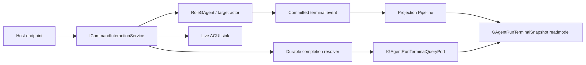

# Issue 370：GAgent durable terminal completion 设计

> 本文面向 [Issue 370](https://github.com/aevatarAI/aevatar/issues/370)：`GAgentDraftRunInteraction` 与 `GAgentApprovalInteraction` 的 durable completion resolver 仍是占位实现。当前权威架构口径仍以 [ADR-0015：AGUI / SSE Projection Session Pipeline](../../adr/0015-agui-sse-projection-session-pipeline.md) 为准；本文只把 GAgent draft-run / approval 这条缺口落成可实现设计。

## 1. 问题判断

最新 `dev` 上仍有两个明确占位点：

- `GAgentDraftRunDurableCompletionResolver.ResolveAsync(...)` 直接返回 `CommandDurableCompletionObservation<GAgentDraftRunCompletionStatus>.Incomplete`
- `GAgentApprovalDurableCompletionResolver.ResolveAsync(...)` 直接返回 `CommandDurableCompletionObservation<GAgentApprovalCompletionStatus>.Incomplete`

这意味着 live stream happy path 可以结束，但以下场景没有 durable terminal source：

1. SSE/AGUI 连接断开后重连。
2. live sink 因释放、网络或进程切换错过 terminal event。
3. approval continuation 已经完成，但前端只看到 `Unknown` / `Incomplete`。

这个问题不是“多补一次轮询”能解决。终态必须来自 committed fact 经 Projection Pipeline 物化出的 readmodel，而不是 session hub、runtime lease、actor 内部状态侧读或 query-time replay。

## 2. 目标

本设计目标是给 draft-run 与 approval 共用一条 durable terminal completion 主链：

1. Actor 串行处理 `ChatRequestEvent` / `ToolApprovalDecisionEvent`。
2. Actor 持久化 committed terminal domain event。
3. Projection Pipeline 将终态物化为 actor-scoped current-state readmodel。
4. Durable completion resolver 只读取窄 query port。
5. Interaction service 在 missed-live-event 场景下能恢复 `Completed` / `Failed`。

非目标：

- 不把 `IGAgentDraftRunProjectionPort` 扩成查询端口。
- 不在 resolver 中读取 event store、actor state、runtime lease 或 session event hub。
- 不在 Host 中补 fallback 编排。
- 不引入 `Metadata` / string bag 承载 terminal status。
- 不改变 accepted ACK 语义；同步 accepted 仍只代表 command 已被接收用于 dispatch。

## 3. 总体链路



关键口径：

- live AGUI sink 只负责实时输出，不是事实源。
- durable resolver 只补“live 没看到终态”这一段，不重新执行业务。
- readmodel 是 actor-scoped current-state replica，版本来自权威 actor committed version 或等价 committed envelope 水位。

## 4. 与 Workflow / Scripting 的共同模式

本设计确实参考了当前已有的两个 durable completion 落点：

| 能力 | Resolver | Receipt 稳定键 | Durable source | Query/read port | Completion 映射 |
|---|---|---|---|---|---|
| Workflow run | `WorkflowRunDurableCompletionResolver` | `ActorId` | `WorkflowActorSnapshot` current-state readmodel | `IWorkflowExecutionCurrentStateQueryPort` | `WorkflowRunCompletionStatus` -> `WorkflowProjectionCompletionStatus` |
| Script evolution | `ScriptEvolutionDurableCompletionResolver` | `ProposalId` | `ScriptEvolutionReadModel` terminal promotion decision | `IScriptEvolutionDecisionReadPort` | `ScriptPromotionDecision` -> `ScriptEvolutionInteractionCompletion` |
| GAgent draft-run / approval | 本设计新增 resolver 实现 | `ActorId + CorrelationId/SessionId` | `GAgentRunTerminalReadModel` current-state readmodel | `IGAgentRunTerminalQueryPort` | `GAgentRunTerminalStatus` -> draft-run / approval completion |

三条链路的共同点是：

1. `ICommandDurableCompletionResolver<TReceipt, TCompletion>` 是 CQRS Core 已经抽好的公共扩展点。
2. receipt 必须携带足够稳定的定位键，resolver 不临时发明查询上下文。
3. resolver 只读 capability 自己的 read/query port。
4. query port 后面只能是 readmodel / durable decision document，不是 actor state、event replay、runtime lease 或 live session hub。
5. resolver 的职责只是把 durable terminal fact 映射成 interaction completion。
6. 缺失 terminal fact 时返回 `Incomplete` 或按 capability 既有语义抛出 timeout，不在 resolver 内重试业务。

这说明 #370 要补的是缺失的 GAgent terminal readmodel/query port，而不是一条新并行机制。

## 5. 是否需要进一步抽象

### 5.1 暂不抽象统一 terminal snapshot

不建议现在新增类似 `ICommandTerminalSnapshot`、`ITerminalCompletionQueryPort<TReceipt, TSnapshot>` 或 `TerminalStatus` 的跨能力统一模型。

原因：

1. Workflow 的终态是 workflow run 生命周期，包含 `Completed/TimedOut/Failed/Stopped/NotFound/Disabled` 等语义。
2. Scripting 的终态是 promotion decision，核心结果是 `Accepted`、`Status`、`DefinitionActorId`、`ValidationReport` 等领域决策。
3. GAgent 的终态是 AGUI/chat interaction 终态，核心是 `TextMessageCompleted/RunFinished/Failed`，且 session id 与 command id 的关系更强。
4. 这些终态名字相似，但业务完成含义不同；强行共用一个 terminal snapshot 会把领域语义压扁成泛化 status bag。

仓库当前已经在 CQRS Core 抽象了正确的公共层：`ICommandDurableCompletionResolver<TReceipt, TCompletion>` 与 `CommandDurableCompletionObservation<TCompletion>`。再往下的 durable source、query port、snapshot 与 mapping 应保持 capability-owned。

### 5.2 可以抽象小型模式，不抽象领域语义

允许的后续小抽象：

1. 一个 `DurableCompletionResolverSupport` 静态 helper，用于统一“非取消异常返回 Incomplete、取消异常继续抛出”的样板。
2. 一个测试 fixture pattern，用来验证 resolver 不吞取消、不从 missing snapshot 伪造 completion。
3. 文档/guard 规则：新增 interaction durable resolver 不得固定返回 `Incomplete`，必须说明 durable terminal source。

不建议的抽象：

1. 泛型 terminal readmodel 基类。
2. 泛型 `Status` enum。
3. 在 CQRS Core 中引入“按 actorId 查询 terminal snapshot”的接口。
4. 把 `ActorId/CorrelationId/SessionId/ProposalId` 等定位键揉成通用 key-value bag。

一句话：**抽象交互骨架，不抽象领域终态。** #370 应该把 GAgent 补齐到 Workflow/Scripting 已经遵守的模式，而不是把三者拉进一个过早统一的 terminal 框架。

## 6. 工程 review 结论

这份设计可以进入开发，但需要按下面三条约束开发；否则会实现到错误事实源或卡在 projection runtime 装配上。

### 6.1 Durable source 必须是 committed event

`RoleGAgent` 当前执行顺序是：

1. live 发布 `TextMessageEndEvent`
2. best-effort 持久化 `RoleChatSessionCompletedEvent`

因此 durable terminal projector 不能消费 live `TextMessageEndEvent` 作为事实源。`TextMessageEndEvent` 可以作为实时输出，但不满足 durable recovery 的事实要求。

可开发口径固定为：

- durable terminal readmodel 只从 `CommittedStateEventPublished.StateEvent.EventData` 中的 `RoleChatSessionCompletedEvent` 或后续新增的强类型 committed terminal event 物化。
- 目标实现应优先使用 typed terminal status / reason 字段或专用 committed terminal event；`Content` 中的 legacy failure marker 只能作为过渡兼容口径，不得成为长期事实协议。
- `TextMessageEndEvent`、synthetic `RunFinished`、live `RunError` 只用于 live completion policy，不作为 durable resolver 的事实源。
- 如果 `RoleChatSessionCompletedEvent` 因 best-effort persist 失败而不存在，resolver 必须诚实返回 `Incomplete`；不能回退读取 live stream 或 actor state。

### 6.2 Lookup key 使用 correlation/session，不把 commandId 当事实键

当前 `RoleChatSessionCompletedEvent` 没有 `command_id` 字段。Committed envelope 可以从 inbound command envelope 继承 `EnvelopePropagation.CorrelationId`，但不能可靠还原 CQRS `CommandId`。

因此首版实现不要设计 `GetByCommandIdAsync(...)`。resolver 查找顺序固定为：

1. `actorId + correlationId`
2. `actorId + sessionId`

`CommandId` 仍然保留在 receipt 中作为 accepted ACK 与追踪 id，但不作为 durable terminal readmodel 的主查询键。后续如果确实需要按 `commandId` 查询，必须先把 `command_id` 作为 typed proto field 加到 `ChatRequestEvent` 与 `RoleChatSessionCompletedEvent` 或专用 terminal event 中，禁止把 `commandId` 塞进 `Metadata` 或假设它等于 `CorrelationId`。

### 6.3 Durable materialization 必须显式 activation

现有 `GAgentDraftRunProjectionPort` 是 `SessionObservation` port，只负责 live session sink；新增 terminal readmodel 需要 `DurableMaterialization` scope。

开发时必须新增一个 activation port，例如：

- `IGAgentRunTerminalProjectionPort`
- `GAgentRunTerminalProjectionPort`
- `GAgentRunTerminalProjectionContext`
- `GAgentRunTerminalRuntimeLease`

draft-run / approval binder 在 dispatch 前同时做两件事：

1. activate durable terminal materialization：`EnsureActorProjectionAsync(actorId)`
2. attach live session observation：`EnsureAndAttachAsync(...)`

这不是 query-time priming，因为它发生在 command dispatch 前的 write-side binding 阶段；resolver/query path 仍然只读已物化 readmodel。

## 7. 新增契约

### 7.1 Abstractions：terminal snapshot

新增位置建议：

- `src/platform/Aevatar.GAgentService.Abstractions/ScopeGAgents/GAgentRunTerminalModels.cs`
- `src/platform/Aevatar.GAgentService.Abstractions/ScopeGAgents/IGAgentRunTerminalQueryPort.cs`

核心模型：

```csharp
public enum GAgentRunTerminalStatus
{
    Unknown = 0,
    TextMessageCompleted = 1,
    RunFinished = 2,
    Failed = 3,
}

public enum GAgentRunTerminalInteractionKind
{
    Unknown = 0,
    DraftRun = 1,
    Approval = 2,
}

public sealed record GAgentRunTerminalSnapshot(
    string ActorId,
    string SessionId,
    string CorrelationId,
    GAgentRunTerminalInteractionKind InteractionKind,
    GAgentRunTerminalStatus Status,
    string ReasonCode,
    string ReasonMessage,
    long StateVersion,
    string LastEventId,
    DateTimeOffset ObservedAt);

public interface IGAgentRunTerminalQueryPort
{
    Task<GAgentRunTerminalSnapshot?> GetByCorrelationIdAsync(
        string actorId,
        string correlationId,
        CancellationToken ct = default);

    Task<GAgentRunTerminalSnapshot?> GetBySessionIdAsync(
        string actorId,
        string sessionId,
        CancellationToken ct = default);
}
```

字段语义：

- `ActorId`：权威 actor 地址。
- `SessionId`：AI chat session id；draft-run 默认来自 command correlation id，approval approved continuation 会生成新的 continuation session id。
- `CorrelationId`：追踪 id，不作为 actor identity。
- `InteractionKind`：区分 draft-run 与 approval，避免同一 readmodel 混淆入口语义。
- `Status`：强类型终态，不放入 bag。
- `ReasonCode` / `ReasonMessage`：失败、拒绝、超时等用户可见或审计相关原因；首选强类型 code，message 只承载展示文本，不作为控制流依据。
- `StateVersion` / `LastEventId`：来自 committed source 的版本/事件标识，用于诚实暴露读模型水位。
- `ObservedAt`：投影观察时间，不冒充 actor commit time。

### 7.2 Projection readmodel proto

在 `src/platform/Aevatar.GAgentService.Projection/service_projection_read_models.proto` 中新增：

```proto
message GAgentRunTerminalReadModel {
  string id = 1;
  string actor_id = 2;
  int64 state_version = 3;
  string last_event_id = 4;
  string session_id = 5;
  string correlation_id = 6;
  int32 interaction_kind = 7;
  int32 status = 8;
  string reason_code = 9;
  string reason_message = 10;
  google.protobuf.Timestamp observed_at_utc_value = 11;
}
```

`id` 建议使用稳定复合键：

```text
gagent-run-terminal:{actorId}:{correlationId}
```

如果事件只有 `session_id` 没有 `correlation_id`，投影可以写入 session-keyed 文档：

```text
gagent-run-terminal-session:{actorId}:{sessionId}
```

但 resolver 查询优先级必须固定为：

1. `actorId + correlationId`
2. `actorId + sessionId`

这能兼容 draft-run 默认 session，也能覆盖 approval approved continuation。approval continuation 会生成新的 `ChatRequestEvent.SessionId`，但 self-message 仍应继承 approval command 的 `CorrelationId`，因此 correlation 是更稳定的恢复键。

## 8. Terminal fact 来源

### 8.1 Draft-run

draft-run durable 终态来自目标 actor committed 的 `RoleChatSessionCompletedEvent` 或后续专用 typed terminal event。

目标映射规则：

| 输入 | durable status |
|---|---|
| committed terminal fact 明确成功 | `TextMessageCompleted` |
| committed terminal fact 明确失败 | `Failed` |

过渡期若只能消费现有 `RoleChatSessionCompletedEvent`，可以把正常内容映射为 `TextMessageCompleted`，并临时识别 `Content` 中的 `[[AEVATAR_LLM_ERROR]]` / `LLM request failed:` legacy marker 为 `Failed`。但 failure marker 只能作为 legacy fallback；实现应尽快前移为 typed status/reason 字段或专用 committed terminal event，禁止把内容字符串格式固化为长期事实协议。

`RunFinished` 是 interaction finalize 阶段为 `TextMessageCompleted` 补发的 AGUI frame，不是首版 durable readmodel 的事实输入。

### 8.2 Approval

approval 的终态不是 `ToolApprovalDecisionEvent` 本身。`ToolApprovalDecisionEvent` 只是 command 输入；真正终态必须是 actor 处理审批后持久化出的 committed terminal fact：

- approval 被批准后，actor continuation 继续执行并持久化 `RoleChatSessionCompletedEvent`。
- approval 被拒绝或超时后，actor 必须持久化可映射为 `Failed` 的 terminal fact。

当前代码中 denied / remote timeout 路径只持久化 `ClearPendingApprovalEvent`。这还不能开发成完整 #370，因为 `ClearPendingApprovalEvent` 只表示 pending approval 被清掉，不等价于用户会话终态。

开发前置项：

- 要么在 denied / timeout 路径持久化一个失败的 `RoleChatSessionCompletedEvent`。
- 要么新增一个强类型 `ToolApprovalTerminalEvent` / `GAgentRunTerminalEvent`，字段包含 `request_id/session_id/correlation_id/status/reason_code/reason_message`，并由 terminal projector 消费。

这是 approval durable completion 的 blocker：如果 denied / timeout 的 committed terminal fact 没有补齐，approval 部分不得声明完成，只能保持 `Incomplete`。不允许把 `ClearPendingApprovalEvent` 直接投影成 terminal failure。

## 9. Projection 设计

新增投影组件建议：

- `GAgentRunTerminalProjectionContext`
- `GAgentRunTerminalRuntimeLease`
- `GAgentRunTerminalProjectionPort`
- `GAgentRunTerminalReadModelMetadataProvider`
- `GAgentRunTerminalProjector`
- `GAgentRunTerminalQueryReader`

其中 `GAgentRunTerminalProjector` 应实现 current-state materializer，写入 `GAgentRunTerminalReadModel`。它可以参考 `ServiceRunCurrentStateProjector` 的覆盖写入模型：

1. 只消费 `CommittedStateEventPublished` 中的 committed terminal payload。
2. 首版只处理 `RoleChatSessionCompletedEvent` 与后续显式 terminal event。
3. 使用权威版本写 `StateVersion`，不自增本地版本。
4. 旧版本不得覆盖新版本，重复写入必须幂等。
5. projector 可以读取 committed envelope 的 `Propagation.CorrelationId`，但不得把 `CorrelationId` 当成 `CommandId`。

最小实现可以先复用现有 GAgent projection runtime 装配方式：

- session live projector 继续保留 `GAgentDraftRunSessionEventProjector`。
- durable terminal projector 新增为 independent durable materialization projector。
- 二者消费同一 Projection Pipeline 输入，一对多分发

这样 CQRS 与 AGUI 仍然是统一入口，区别只在输出：一个写 live session hub，一个写 durable readmodel。

## 10. Resolver 设计

`GAgentDraftRunDurableCompletionResolver` 改为依赖 `IGAgentRunTerminalQueryPort`：

```csharp
internal sealed class GAgentDraftRunDurableCompletionResolver
    : ICommandDurableCompletionResolver<GAgentDraftRunAcceptedReceipt, GAgentDraftRunCompletionStatus>
{
    private readonly IGAgentRunTerminalQueryPort _queryPort;

    public async Task<CommandDurableCompletionObservation<GAgentDraftRunCompletionStatus>> ResolveAsync(
        GAgentDraftRunAcceptedReceipt receipt,
        CancellationToken ct = default)
    {
        var snapshot = await _queryPort.GetByCorrelationIdAsync(receipt.ActorId, receipt.CorrelationId, ct);
        return Map(snapshot);
    }
}
```

`GAgentApprovalDurableCompletionResolver` 同样依赖 `IGAgentRunTerminalQueryPort`，优先 `correlationId`，若 receipt 扩展携带原始 `SessionId`，再 fallback 到 `sessionId`。

映射规则：

| snapshot status | draft-run completion | approval completion |
|---|---|---|
| `TextMessageCompleted` | `TextMessageCompleted` | `TextMessageCompleted` |
| `RunFinished` | `RunFinished` | `RunFinished` |
| `Failed` | `Failed` | `Failed` |
| missing / non-terminal / query error | `Incomplete` | `Incomplete` |

异常策略：

- `OperationCanceledException` 且 `ct.IsCancellationRequested`：继续抛出。
- projection/read store 临时异常：返回 `Incomplete`，保持 interaction service 的现有容错语义。
- 结构性异常，例如 receipt 缺 actor id：抛参数异常。

## 11. Receipt 与 session id

当前 receipt：

- `GAgentDraftRunAcceptedReceipt(ActorId, ActorTypeName, CommandId, CorrelationId)`
- `GAgentApprovalAcceptedReceipt(ActorId, CommandId, CorrelationId)`

draft-run envelope 的 `ChatRequestEvent.SessionId` 默认使用 `context.CorrelationId`。因此 durable resolver 按 `CorrelationId` 查询，必要时再按同值 `SessionId` fallback。

approval command 模型已有 `SessionId`，但 `GAgentApprovalAcceptedReceipt` 当前没有携带它。建议把 receipt 扩展为：

```csharp
public sealed record GAgentApprovalAcceptedReceipt(
    string ActorId,
    string CommandId,
    string CorrelationId,
    string SessionId);
```

这不是兼容性负担，仓库规则允许删除/调整无价值兼容壳。补上后 resolver 能在 correlation lookup 缺失时 fallback 到 `actorId + sessionId`。但 approved continuation 可能会生成新的 continuation `SessionId`，所以 `CorrelationId` 必须是主键。

## 12. 不能做的实现

以下实现路径禁止：

1. Resolver 中读取 `IEventStore` 并 replay `RoleGAgentState`。
2. Resolver 中调用 `IActorRuntime.GetAsync(actorId)` 后读取 actor 内部 state。
3. 在 `IGAgentDraftRunProjectionPort` 上加 `actorId -> context` 查询。
4. 在 Host endpoint 中保存 `Dictionary<commandId, terminalStatus>`。
5. 用 `ConcurrentDictionary` / `HashSet` 在中间层缓存 terminal fact。
6. 用 `Metadata["status"]`、`Headers["completion"]` 或 arbitrary string key 承载终态。
7. 把 `ToolApprovalDecisionEvent` 或 `ClearPendingApprovalEvent` 直接当成 approval 完成。
8. 查询前同步 activate projection 或 query-time priming。
9. 假设 `CommandId == CorrelationId`，或从 `CorrelationId` 反推出 `CommandId`。
10. 把 live `TextMessageEndEvent` 当成 durable terminal fact。

## 13. 本次明确不做项

本次实现只补齐 #370 所需的 durable terminal completion 主链，不同时重做 terminal reason 协议。下面两个点保留为后续演进项，原因是它们不影响当前 durable completion 的正确性，但会扩大 committed event/proto 协议面。

### 13.1 不把 legacy failure marker 立刻替换为 typed terminal event

当前 `RoleChatSessionCompletedEvent.Content` 中的 `[[AEVATAR_LLM_ERROR]]` / `LLM request failed:` marker 只作为 legacy fallback 使用。它可以让既有 committed fact 映射为 `Failed`，从而覆盖 approval denied / timeout / failure 等 missed-live-event 恢复路径。

后续更完整的方向是新增专用 typed terminal event，或在现有 terminal committed event 中补 typed `status/reason_code/reason_message` 字段。该改动会触及 `RoleGAgent` committed event 契约与 projector 输入协议，应该单独设计和迁移，不混进 #370 的 resolver/readmodel 修复。

### 13.2 不把 `ReasonCode` 改成 enum

`ReasonCode` 本次保持为 string，是因为它当前只用于 durable readmodel 的失败原因记录与展示映射，不作为跨模块控制流或稳定过滤条件。它比开放 bag 更收敛，也避免在 legacy marker 过渡期过早冻结 enum 值集合。

如果后续 terminal reason 参与控制流、查询过滤、API 稳定契约或外部 SDK 类型生成，应随 typed terminal event 一起演进为 proto enum / typed code，并补充对应兼容迁移测试。

## 14. 实施步骤

建议按以下顺序实现：

1. 在 Abstractions 新增 `GAgentRunTerminalStatus`、`GAgentRunTerminalInteractionKind`、`GAgentRunTerminalSnapshot`、`IGAgentRunTerminalQueryPort`。
2. 在 Projection proto 新增 `GAgentRunTerminalReadModel`，补 partial、metadata provider、query reader。
3. 新增 durable materialization context/runtime lease/projection port。
4. 新增 durable terminal projector，消费 committed `RoleChatSessionCompletedEvent` 并只写 terminal readmodel。
5. 注册 projection materializer、metadata provider、query port、activation port。
6. 修改 draft-run / approval binder，在 dispatch 前 activate terminal materialization。
7. 修改 draft-run / approval durable resolver 注入 query port。
8. 扩展 approval receipt 携带 `SessionId`。
9. 补 approval denied / timeout committed terminal fact。
10. 移除“resolver always incomplete”测试，改为 durable terminal recovery 测试。

## 15. 测试矩阵

单元测试：

1. `GAgentDraftRunDurableCompletionResolver` 读取 `TextMessageCompleted` snapshot 后返回 terminal completion。
2. `GAgentDraftRunDurableCompletionResolver` 读取 `Failed` snapshot 后返回 failed completion。
3. `GAgentApprovalDurableCompletionResolver` 优先按 correlation id 查询。
4. `GAgentApprovalDurableCompletionResolver` correlation id miss 后按 session id 查询。
5. query port 返回 null 或抛非取消异常时 resolver 返回 `Incomplete`。
6. 取消 token 触发的 `OperationCanceledException` 不被吞掉。

投影测试：

1. committed `RoleChatSessionCompletedEvent` 正常内容物化 `TextMessageCompleted`。
2. committed `RoleChatSessionCompletedEvent` 失败 marker 物化 `Failed`。
3. live `TextMessageEndEvent` 不写 durable readmodel。
4. `ClearPendingApprovalEvent` 不写 durable terminal readmodel。
5. 旧 `StateVersion` 不覆盖新 readmodel。
6. 非 terminal payload 不写 readmodel。

交互测试：

1. live stream 未收到 terminal event，但 durable readmodel 已有 `TextMessageCompleted`，interaction finalize 返回 completed。
2. live stream 未收到 terminal event，但 durable readmodel 已有 `Failed`，interaction finalize 返回 failed。
3. approval continuation 完成后，resolver 可以通过 receipt/session 恢复 terminal 状态。
4. approval denied / timeout 后，resolver 可以通过 committed terminal fact 恢复 failed 状态。
5. `CommandId != CorrelationId` 时，live session 与 durable resolver 都仍能按 correlation/session 正常完成。
6. draft-run binder 在 dispatch 前 activate terminal materialization，再 attach live session observation。
7. approval binder 在 dispatch 前 activate terminal materialization，再 attach live session observation。
8. resolver/query path 不触发 projection activation，防止 query-time priming 回潮。

## 16. 验证命令

涉及 current-state readmodel、projection query path 与测试新增，提交前至少执行：

```bash
dotnet build aevatar.slnx --nologo
dotnet test test/Aevatar.GAgentService.Tests/Aevatar.GAgentService.Tests.csproj --nologo --filter "GAgentDraftRunInteraction|GAgentApprovalInteraction|GAgentRunTerminal"
dotnet test test/Aevatar.GAgentService.Integration.Tests/Aevatar.GAgentService.Integration.Tests.csproj --nologo --filter "ScopeGAgent|ScopeService"
bash tools/ci/test_stability_guards.sh
bash tools/ci/query_projection_priming_guard.sh
bash tools/ci/projection_state_version_guard.sh
bash tools/ci/projection_state_mirror_current_state_guard.sh
bash tools/ci/projection_route_mapping_guard.sh
```

若实现同时调整 projection runtime 注册或 actor binding 边界，也必须执行：

```bash
bash tools/ci/architecture_guards.sh
bash tools/ci/workflow_binding_boundary_guard.sh
```

## 17. 验收口径

Issue 370 可关闭的条件：

1. 两个 resolver 不再返回固定 `Incomplete`。
2. resolver 只依赖 `IGAgentRunTerminalQueryPort` 这类 readmodel query contract。
3. draft-run 和 approval missed-live-event 场景可从 durable readmodel 恢复 terminal completion。
4. 没有 query-time replay、query-time priming、runtime lease 侧读或中间层内存事实映射。
5. 测试不再断言占位行为，而是覆盖 durable terminal recovery。
6. durable readmodel 只由 committed terminal fact 物化，不消费 live-only terminal payload。
7. `CommandId` 与 `CorrelationId` 语义保持分离，测试覆盖二者不相等的情况。
8. 文档与 ADR related 链接同步更新。
