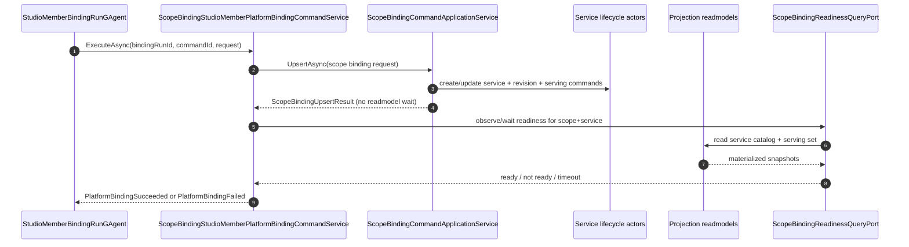

# Issue 616：Scope binding readiness observation 设计

> 本文面向 [Issue 616](https://github.com/aevatarAI/aevatar/issues/616)：`ScopeBindingCommandApplicationService` 在 binding command path 中用 bounded polling 等待 service catalog / serving-set readmodel 可见，导致 `UpsertAsync` ACK 语义隐含“readmodel observed / immediate invoke safe”。本文把这个隐式等待改成显式 readiness observation 设计。

## 1. 背景

PR [#548](https://github.com/aevatarAI/aevatar/pull/548) 已经把 StudioMember binding 改成 async run protocol：

1. `PUT /api/scopes/{scopeId}/members/{memberId}/binding` 返回 `202 Accepted + bindingRunId`。
2. `StudioMemberBindingRunGAgent` 负责 binding admission、platform binding、terminal notification。
3. 前端通过 binding-run status endpoint 观察 accepted / admitted / pending / succeeded / failed。

但是底层 platform binding 仍调用：

```csharp
IScopeBindingCommandPort.UpsertAsync(...)
```

当前 `ScopeBindingCommandApplicationService.UpsertAsync(...)` 在完成 service / revision / serving lifecycle commands 后，会调用内部方法：

```csharp
WaitForBindingVisibleAsync(identity, ct)
```

该方法轮询：

- `IServiceLifecycleQueryPort.GetServiceAsync(identity)`
- `IServiceServingQueryPort.GetServiceServingSetAsync(identity)`

直到 service catalog 可见且 serving set 中有 active target，或超时 / fast-fail。

这解决了早期 bind 后立即 invoke 的 race，但语义不诚实：command service 的返回值不再只是 command orchestration 结果，而是偷偷包含 readmodel readiness。

## 2. 问题判断

当前代码混合了三个不同阶段：

| 阶段 | 当前承载位置 | 问题 |
|---|---|---|
| command accepted / committed | `ScopeBindingCommandApplicationService.UpsertAsync` | 合理 |
| readmodel materialized | `WaitForBindingVisibleAsync` hidden polling | 不应藏在 command path |
| invoke safe | `WaitForBindingVisibleAsync` 返回后隐含成立 | 缺少显式 contract |

具体风险：

1. `UpsertAsync` 调用者无法判断它返回时到底保证了什么。
2. Studio binding run 的 `succeeded` 依赖底层 hidden polling，而不是 actor/run protocol 中的显式状态。
3. 非 Studio caller 也被迫承担 readmodel polling cost，即使它只需要 command result。
4. 测试 stub 需要知道 command service 内部 polling 细节，说明边界已经泄漏。
5. 如果后续要做统一 async operation contract，当前 hidden polling 会成为反模式。

## 3. 目标

本设计目标：

1. `ScopeBindingCommandApplicationService.UpsertAsync` 只负责 binding command orchestration，不再等待 readmodel 可见。
2. binding readiness 由显式 query / observation contract 表达。
3. Studio platform binding adapter 可以在 `UpsertAsync` 后显式等待 readiness，再通知 binding run terminal success。
4. `StudioMemberBindingRunGAgent` 的 `succeeded` 语义保持用户友好：达到 succeeded 后，bind-then-invoke 不应 race service catalog / serving-set materialization。
5. readiness 判断仍使用现有事实源：service catalog readmodel + serving set readmodel。
6. 不引入通用 operation framework；#616 只解决 scope binding readiness 这个具体缺口。

非目标：

- 不重做 GAgentService command architecture。
- 不引入 event-store side read、actor state side read 或 query-time replay。
- 不让前端直接理解 service catalog / serving set 内部细节。
- 不新增第二套 Studio binding protocol。
- 不把所有 async write/readmodel freshness 问题一次性抽象成全局框架；那属于 #592 / #594。

## 4. 设计原则

### 4.1 Command ACK 语义必须诚实

`UpsertAsync` 返回只代表 scope binding orchestration 已完成到当前 command ports 能确认的阶段。它不应隐含 readmodel freshness。

### 4.2 Readiness 是显式 observation

“可以安全 invoke”是比 command accepted 更强的条件，应有明确命名的 query/observe contract。

### 4.3 Studio binding run 可以封装 readiness 等待

用户视角下，Studio binding run 的 `succeeded` 可以代表“平台 binding 已完成且 readiness 已观察”。这个等待属于 Studio binding run 的 platform-binding adapter 阶段，而不是底层 `UpsertAsync` 的隐藏副作用。

### 4.4 Projection 仍是事实副本，不驱动业务

readiness observation 只读取 projection readmodel 判断是否 materialized；它不触发 replay、priming 或业务修复。

## 5. 总体链路



关键变化：

- `Binding` 不再执行 readiness/readmodel-materialization polling；保留 command orchestration 需要的既有 lifecycle/revision 查询。
- `Adapter` 显式调用 `Ready`，并决定 run terminal status。
- `Run` 仍只通过 continuation 消费 terminal result，不阻塞 actor turn。

## 6. 新增模型

建议放在：

```text
src/platform/Aevatar.GAgentService.Abstractions/ScopeBindings/ScopeBindingReadinessModels.cs
```

```csharp
namespace Aevatar.GAgentService.Abstractions;

public enum ScopeBindingReadinessStatus
{
    Unknown = 0,
    ServiceCatalogMissing = 1,
    ServingSetMissing = 2,
    EligibleServingTargetMissing = 3,
    Ready = 4,
}

public sealed record ScopeBindingReadinessRequest(
    string ScopeId,
    string ServiceId,
    string? AppId = null);

public sealed record ScopeBindingReadinessSnapshot(
    string ScopeId,
    string ServiceId,
    ScopeBindingReadinessStatus Status,
    bool ServiceCatalogVisible,
    bool ServingSetVisible,
    bool EligibleServingTargetVisible,
    bool InvokeReady,
    string? RevisionId = null,
    string? DeploymentId = null,
    DateTimeOffset? ObservedAtUtc = null);
```

说明：

- `ScopeId + ServiceId + AppId` 足够复建 `ServiceIdentity`；Studio member binding 当前使用默认 AppId，非默认 AppId caller 若未来也要显式 readiness，应把 resolved app identity 贯穿到 readiness request。
- `InvokeReady` 是派生字段，等价于 `Status == Ready`。
- `RevisionId / DeploymentId` 来自 eligible serving target，便于日志和诊断。
- `ObservedAtUtc` 使用读取时刻，不作为 readmodel 权威时间。

## 7. 新增 port

建议放在：

```text
src/platform/Aevatar.GAgentService.Abstractions/Ports/IScopeBindingReadinessQueryPort.cs
```

```csharp
namespace Aevatar.GAgentService.Abstractions.Ports;

public interface IScopeBindingReadinessQueryPort
{
    Task<ScopeBindingReadinessSnapshot> GetReadinessAsync(
        ScopeBindingReadinessRequest request,
        CancellationToken ct = default);
}
```

实现放在：

```text
src/platform/Aevatar.GAgentService.Application/Bindings/ScopeBindingReadinessQueryService.cs
```

依赖：

- `IServiceLifecycleQueryPort`
- `IServiceServingQueryPort`
- `IOptions<ScopeWorkflowCapabilityOptions>`

判断逻辑：

1. normalize `ScopeId`。
2. 用 `ScopeWorkflowCapabilityConventions.BuildServiceIdentity(...)` 复建 identity。
3. 读取 service catalog。
4. 如果 service missing，返回 `ServiceCatalogMissing`。
5. 读取 serving set。
6. 如果 serving set missing，返回 `ServingSetMissing`。
7. 如果没有 eligible serving target，返回 `EligibleServingTargetMissing`。
8. 否则返回 `Ready`。

eligible target 需要与当前 invoke resolver 的可用目标语义保持一致，至少满足：

```csharp
Enum.TryParse<ServiceServingState>(target.ServingState, ignoreCase: true, out var state)
&& state == ServiceServingState.Active
&& target.AllocationWeight > 0
```

endpoint-specific readiness 不纳入 #616 最小范围；只有当后续 contract 明确要求“某个 endpoint 立即可 invoke”时才扩展。

## 8. 修改 ScopeBindingCommandApplicationService

当前：

```csharp
await _serviceCommandPort.ActivateServiceRevisionAsync(...);
await WaitForBindingVisibleAsync(identity, ct);
return desiredBinding.BuildResult(...);
```

改为：

```csharp
await _serviceCommandPort.ActivateServiceRevisionAsync(...);
return desiredBinding.BuildResult(...);
```

删除：

- `ReadModelVisibilityTimeout`
- `ReadModelVisibilityPollInterval`
- `WaitForBindingVisibleAsync(...)`
- `IsTargetActivationVisible(...)`，如果只被该 wait 使用

`ScopeBindingUpsertResult` 需要携带足够信息让 Studio adapter 等待**本次绑定激活的目标**，而不是任意旧的 active target：

- `ScopeId`
- `ServiceId`
- `RevisionId`
- `ExpectedDeploymentId`
- `ExpectedActorId`

`IScopeBindingReadinessQueryPort` 的 request 应携带 expected revision/deployment；readiness predicate 必须确认 service catalog 已反映本次 active revision/deployment，并且 serving-set 中存在匹配 `Active && AllocationWeight > 0` 的同一 revision/deployment target。注意：`ScopeBindingUpsertRequest` 支持 `AppId`，但 `ScopeBindingUpsertResult` 当前不携带 resolved `AppId`；#616 不把所有非 Studio / 非默认 AppId caller 的 readiness contract 一次性泛化。若未来要让这些 caller 复用 readiness wait，应补充 resolved identity（例如在 result 中携带 `AppId` 或由 caller 传入原 request 的 AppId）。

## 9. 修改 Studio platform binding adapter

文件：

```text
src/Aevatar.Studio.Projection/CommandServices/ScopeBindingStudioMemberPlatformBindingCommandService.cs
```

新增依赖：

```csharp
IScopeBindingReadinessQueryPort _readinessQueryPort
```

在 `RunBindingAsync(...)` 中：

```csharp
result = await _scopeBindingCommandPort.UpsertAsync(...);
var readiness = await WaitForBindingReadyAsync(result, ct);
if (!readiness.InvokeReady)
{
    log readiness timeout;
    return; // keep binding run pending for watchdog recovery
}
dispatch StudioMemberPlatformBindingSucceeded(...);
```

bounded wait 参数建模为 Studio platform binding typed options，默认值先保持：

```csharp
internal sealed class StudioMemberPlatformBindingOptions
{
    public const string SectionName = "Studio:MemberPlatformBinding";
    public TimeSpan BindingReadinessTimeout { get; set; } = TimeSpan.FromSeconds(5);
    public TimeSpan BindingReadinessPollInterval { get; set; } = TimeSpan.FromMilliseconds(50);
}
```

这里保留 polling 是可接受的，因为：

- 它不再隐藏在 command port 中。
- 它是 Studio binding run 的显式 readiness observation 阶段。
- 它不会阻塞 HTTP request；运行在 detached platform binding execution 中。
- timeout 不应变成 terminal binding failure；command side 已完成时，bounded observation lag 不代表绑定失败。
- timeout 时 adapter 只记录 warning 并返回，让 binding run 保持 `PlatformBindingPending`，由现有 watchdog/recovery 机制后续重试。

readiness query 本身异常仍可派发 terminal observation failure，因为这代表 adapter 无法完成 readiness observation，而不是正常 projection lag。

## 10. DI 注册

需要在 GAgentService application DI 中注册，并跟随现有 application/query port lifetime。当前 `IScopeBindingCommandPort`、`IServiceLifecycleQueryPort`、`IServiceServingQueryPort` 以及 Studio platform binding adapter 都是 singleton，因此 readiness query port 也应使用 singleton，避免 singleton adapter 捕获 scoped dependency：

```csharp
services.TryAddSingleton<IScopeBindingReadinessQueryPort, ScopeBindingReadinessQueryService>();
```

Studio projection / hosting 已经能解析 GAgentService application ports；新增 adapter constructor 参数后，测试和 host composition 需要同步。

## 11. 测试计划

### 11.1 ScopeBindingCommandApplicationService 不再 polling readmodel

修改：

```text
test/Aevatar.GAgentService.Tests/Application/ScopeBindingCommandApplicationServiceTests.cs
```

新增/调整 fake：

- `RecordingServiceServingQueryPort` 记录 `GetServiceServingSetAsync` 调用次数。

断言：

```text
UpsertAsync(...) completes without querying serving readiness.
```

现有注释中关于 “fast-fails 8 consecutive no-progress polls” 的内容需要删除，因为不再成立。

### 11.2 ScopeBindingReadinessQueryService 状态判断

新增测试文件：

```text
test/Aevatar.GAgentService.Tests/Application/ScopeBindingReadinessQueryServiceTests.cs
```

覆盖：

1. service catalog missing -> `ServiceCatalogMissing`, `InvokeReady == false`
2. serving set missing -> `ServingSetMissing`, `InvokeReady == false`
3. serving set has no eligible target -> `EligibleServingTargetMissing`, `InvokeReady == false`
4. serving set has active target with `AllocationWeight > 0` -> `Ready`, `InvokeReady == true`
5. serving set has active target with `AllocationWeight == 0` -> `EligibleServingTargetMissing`, `InvokeReady == false`
6. appId/serviceId normalization 与 existing identity convention 一致

### 11.3 Studio adapter 显式等待 readiness

修改：

```text
test/Aevatar.Studio.Tests/ScopeBindingStudioMemberPlatformBindingCommandServiceTests.cs
```

覆盖：

1. `UpsertAsync` 返回后 readiness ready -> dispatch `StudioMemberPlatformBindingSucceeded`
2. readiness timeout -> 不 dispatch terminal continuation，保持 binding run pending 给 watchdog/recovery 重试
3. `UpsertAsync` exception 仍 dispatch existing failure code，不被 readiness 逻辑吞掉

为了避免测试使用真实 sleep，fake readiness port 可按调用次数返回 not-ready / ready；adapter wait helper 应注入 delay/clock 或 deterministic waiter，测试中不要依赖真实短 `Task.Delay`。这也避免触发 test stability guard 对非确定性 delay 的限制。

推荐把 wait 参数与 delay delegate 通过 internal constructor 或 options 注入，测试中使用可控 delay 立即推进轮询。

### 11.4 Existing Studio binding run tests

跑：

```bash
dotnet test test/Aevatar.Studio.Tests/Aevatar.Studio.Tests.csproj --no-restore --nologo --filter "ScopeBindingStudioMemberPlatformBindingCommandServiceTests|StudioMemberBindingRunGAgentStateTests|StudioMemberBindingRunCurrentStateProjectorTests|StudioMemberServiceBindingTests"
```

### 11.5 GAgentService binding tests

跑：

```bash
dotnet test test/Aevatar.GAgentService.Tests/Aevatar.GAgentService.Tests.csproj --no-restore --nologo --filter "ScopeBindingCommandApplicationServiceTests|ScopeBindingReadinessQueryServiceTests"
```

### 11.6 Stability guard

如果新增/修改测试中涉及 bounded wait / delay，跑：

```bash
bash tools/ci/test_stability_guards.sh
```

## 12. 迁移步骤

建议按以下顺序实现：

1. 新增 readiness models + `IScopeBindingReadinessQueryPort`。
2. 实现 `ScopeBindingReadinessQueryService` 与 DI 注册。
3. 给 readiness service 写独立单测。
4. 从 `ScopeBindingCommandApplicationService` 删除 hidden polling。
5. 更新 scope binding command service 测试与 fake 注释。
6. 在 `ScopeBindingStudioMemberPlatformBindingCommandService` 中注入 readiness port，并在 success continuation 前显式 wait。
7. 更新 Studio adapter 测试。
8. 跑相关测试与 architecture guards。

## 13. Open questions

### 13.1 Readiness timeout 应该是 failed 还是 non-terminal pending？

采用 non-terminal pending：readiness timeout 只表示 bounded observation window 内没有看到 readmodel 追上，不表示 binding command 失败。Adapter 记录 warning 后返回，binding-run actor 保持 `PlatformBindingPending`，现有 watchdog 会在 execution stale 后重新驱动同一 command。这样既避免误报 failed，也不引入新的 proto/status。

### 13.2 是否需要 public readiness endpoint？

本设计暂不新增。

理由：Studio 已经有 binding-run status endpoint，前端不应该直接知道 service catalog / serving set readiness 细节。非 Studio caller 如未来需要 bind-then-invoke readiness，可另开 endpoint。

### 13.3 是否复用 rollout command observation？

不复用。

rollout command observation 是 rollout command 的状态观察；scope binding readiness 是 service catalog + serving set 是否足以支持 invoke 的派生条件。两者相关但不是同一个 contract。

### 13.4 是否应该等待 traffic view 而不仅是 serving set？

当前 hidden polling 只要求 service catalog + active serving target；为避免 `succeeded` 后 immediate invoke 仍因 zero-weight target 失败，readiness predicate 应至少对齐 invoke resolver 的 eligible target 条件（active 且 allocation weight > 0）。#616 不扩大到 traffic view。若 invoke path 实际还依赖 traffic view，应该单独验证并扩展 readiness 条件。

## 14. 完成标准

- `ScopeBindingCommandApplicationService.UpsertAsync` 不再包含 readmodel polling。
- 存在显式 `IScopeBindingReadinessQueryPort`。
- Studio platform binding adapter 在 dispatch success 前显式 observe readiness。
- readiness timeout 不派发 terminal failure，binding run 保持 pending 并依赖 watchdog/recovery 重试。
- readiness query exception 有明确 failure code / message。
- 相关 tests 覆盖 command service 不 polling、readiness 状态判断、Studio adapter success/timeout。
- bind-run `succeeded` 对用户保持诚实：成功后 immediate invoke 不应因为 service catalog / serving-set readmodel 未 materialize 而 race。
