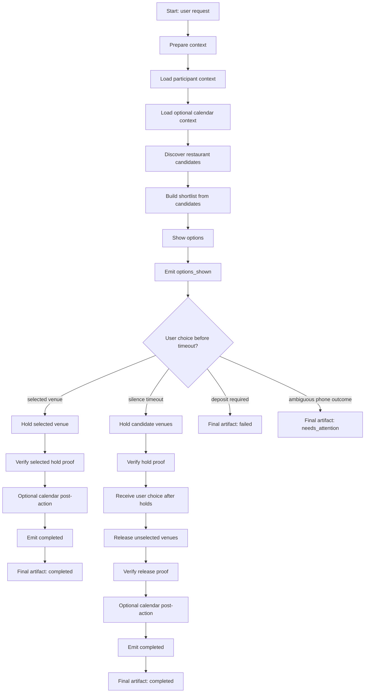

# Dinner Date Workflow Spec Draft

This document is a non-authoritative implementation note for the UC5 dinner-date workflow. It focuses on the executable workflow shape, connector replacement points, and external dependencies.

## Main Flow



## Current Template Nodes

The executable template is `workflows/dinner_date_mock.yaml`. These nodes are intentionally named as connector boundaries even though they currently use deterministic `assign` mock outputs.

| Boundary node | Current implementation | Replace with real connector? | Notes |
|---|---|---:|---|
| `load_participant_context` | `assign` mock | Optional | Can read Gmail, user memory, or profile data. Not required for core success. |
| `load_optional_calendar_context` | `assign` mock | Optional | Calendar read only. Must not block the core workflow. |
| `discover_restaurant_candidates` | `assign` mock | Recommended | Replace with search and page-fetch connectors. |
| `build_shortlist_from_candidates` | `assign` mock | Maybe | Can remain LLM/internal planner if candidate discovery returns structured data. |
| `hold_selected_*` | `assign` mock | Required | Replace with phone hold connector for selected-only path. |
| `hold_candidate_*` | `assign` mock | Required | Replace with phone hold connector for timeout hold-all path. |
| `release_unselected_*` | `assign` mock | Required | Replace with phone release connector. |
| `handle_ambiguous_hold_outcome` | `assign` mock | Required behavior | Can become an output branch of the real phone connector rather than a separate tool. |
| `decide_optional_calendar_selected_only` | `assign` skip | Optional | Replace with Calendar create/readback only after selected hold succeeds. |
| `decide_optional_calendar_after_holds` | `assign` skip | Optional | Replace with Calendar create/readback only after final hold/release proof succeeds. |

## External Dependencies

### Required For Real Core Flow

| Dependency | NyxID service | Used by template node(s) | Required output fields |
|---|---|---|---|
| Outbound restaurant calls | `api-twilio` | `hold_selected_*`, `hold_candidate_*`, `release_unselected_*` | `twilio_call_record`, call status, call duration, error reason if failed |
| Voice agent / transcript extraction | `api-elevenlabs` | `hold_selected_*`, `hold_candidate_*`, `release_unselected_*` | `elevenlabs_transcript`, extracted hold/release status, extracted payment request flag |
| Restaurant phone endpoint | Not a NyxID service | `hold_selected_*`, `hold_candidate_*`, `release_unselected_*` | Real phone number, reachable status, restaurant-side answer |

Required phone connector result shape:

```yaml
venue: string
venue_id: string
action: hold | release
external_effect: confirmed | unverified | failed
twilio_call_record: string
elevenlabs_transcript: string
payment_requested: boolean
confirmed_time: string | null
allergy_answer: string | null
failure_reason: string | null
```

If `payment_requested` is true, the workflow must stop that path and return `deposit_required_failed`; it must not attempt payment or silently treat the reservation as free.

### Recommended For Candidate Discovery

| Dependency | NyxID service | Used by template node(s) | Purpose |
|---|---|---|---|
| Web search | `tavily-search-chrono-ai` or equivalent | `discover_restaurant_candidates` | Find candidate restaurants, phone sources, hours, and venue-owned pages. |
| Page fetch / extraction | `api-firecrawl` | `discover_restaurant_candidates`, possibly `build_shortlist_from_candidates` | Fetch menu, location, phone, allergy hints, reservation pages, and source evidence. |

Candidate discovery result should provide enough structured data for downstream calls:

```yaml
venues:
  - id: string
    name: string
    location: string
    phone: string
    requested_time: string
    source_urls: [string]
    menu_or_allergy_hint: string | null
    hold_status: not_started
```

### Optional Google Context And Post-Action

| Dependency | NyxID service | Used by template node(s) | Core success dependency? |
|---|---|---|---:|
| Gmail/history read | `api-google` | `load_participant_context` | No |
| Calendar read | `api-google` | `load_optional_calendar_context` | No |
| Calendar write/readback | `api-google` | `decide_optional_calendar_selected_only`, `decide_optional_calendar_after_holds` | No |

Observed `api-google` default scopes were only:

```text
openid
email
profile
```

Those scopes are not enough for Gmail or Calendar. Enabling Google context requires explicit Gmail read and/or Calendar read/write scopes. Calendar write must remain an optional post-action: failure to create or verify a calendar event must not change a completed reservation flow into a failed workflow.

## Non-Connector Workflow Rules

These nodes represent orchestration or policy and should generally stay stable when replacing mocks:

| Node | Rule |
|---|---|
| `validate_no_external_effect_before_options` | No restaurant call, hold, release, or payment before visible options. |
| `mark_options_shown` / `emit_options_shown` | Establish the boundary after which no-cost phone holds are allowed. |
| `route_user_choice_before_timeout` | Route selected, timeout, deposit-required, and ambiguous outcomes. |
| `assert_only_selected_hold_allowed` | If the user chooses before timeout, only the selected venue may be held. |
| `assert_hold_all_policy_after_timeout` | If the user is silent until timeout, no-cost holds may be attempted for all candidates. |
| `verify_*` | Confirm that effect-capable connector outputs include proof and do not imply payment. |
| `final_artifact_*` | Report completed, failed, or needs-attention outcomes without hiding uncertainty. |

## Current NyxID Availability Notes

Observed during local testing:

| Service | Status |
|---|---|
| `api-firecrawl` | Connected/available. |
| `tavily-search-chrono-ai` | Connected/available. |
| `api-twilio` | Catalog exists, not observed connected in the current service list. |
| `api-elevenlabs` | Catalog exists, not observed connected in the current service list. |
| `api-google` | Catalog exists; observed default scopes are insufficient for Gmail/Calendar. |

## Open Questions

1. Should candidate discovery require connected search/Firecrawl, or allow user-provided candidate restaurants as a fallback?
2. Should `hold_selected_*` / `hold_candidate_*` remain per-venue nodes, or collapse into one connector node once workflow support for array outputs and iteration is sufficient?
3. Should ambiguous phone outcomes be represented as a separate workflow branch or only as `external_effect: unverified` from the phone connector?
4. What exact Google OAuth scopes should be requested if optional Gmail/Calendar features are enabled?
5. Should calendar creation be user-triggered after the final artifact, or automatic when Calendar write is connected?
