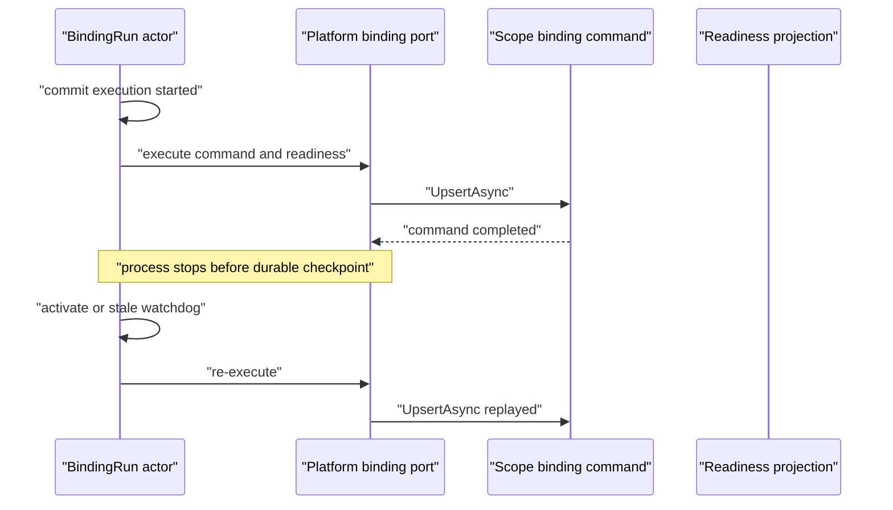
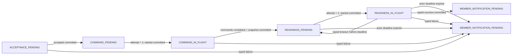

# Studio binding durable readiness recovery 设计

## 1. 背景与故障序列

Studio member binding 同时包含两类语义不同的工作：

1. 通过 `IScopeBindingCommandPort.UpsertAsync` 提交 platform binding command。
2. 通过 `IScopeBindingReadinessQueryPort` 等待 service catalog、serving set 与 endpoint 投影可调用。

旧实现把两类工作放在一次 detached execution 中。`UpsertAsync` 已成功但 readiness 尚未完成时，如果进程重启、continuation 丢失或 actor 在超时后恢复，持久态只能证明“整个 execution 曾启动”，不能证明 command 是否完成。恢复路径因此可能再次调用 `UpsertAsync`，把一次 readiness 恢复错误地变成 command replay。

典型故障窗口如下：



这里不能用“Upsert 通常幂等”作为恢复保证。workflow、GAgent 与 script 的 revision、owner context、deployment identity 和 endpoint contract 都可能让重放产生不同结果；actor 必须依据已提交事实决定下一步。

## 2. 目标与非目标

本次调整保证：

- command 与 readiness 是两个独立、可持久恢复的 execution stage。
- readiness 只能在 command completion checkpoint committed 后启动。
- checkpoint 之后的恢复只查询 readiness，不再次执行 `UpsertAsync`。
- 每次 execution 使用 protocol version 与递增 attempt fencing，旧 callback 和旧 continuation 无副作用。
- command checkpoint 由 actor 建立六分钟 readiness 总预算，到期后以稳定错误码终结，不能无限回到 pending。
- member terminal notification 使用持久化 attempt 与 durable watchdog 恢复，发送丢失不会让 run 永久卡住。
- 无法证明 command 是否完成的状态 fail closed，不猜测、不重放。
- recovery snapshot 在进入 query port 前按 binding request 做完整 typed validation。

本次不引入通用 operation framework，不改变 `UpsertAsync` 的业务契约，也不把 readmodel 变成 write-side 权威事实。

## 3. 两阶段 committed 状态机



| Stage | 允许的外部工作 | committed 后的恢复 |
|---|---|---|
| `ACCEPTANCE_PENDING` | `StartAsync` 取得 fenced accepted receipt | 重发 start request |
| `COMMAND_PENDING` | 无 | 调度 command execution |
| `COMMAND_IN_FLIGHT` | 恰好一次 `UpsertAsync` | fresh 时只恢复 watchdog；stale 时 fail closed |
| `READINESS_PENDING` | 无 | deadline 前调度 readiness execution；到期后 fail closed |
| `READINESS_IN_FLIGHT` | 只读 readiness query | deadline 前 fresh 时只恢复 watchdog、stale 时新 attempt 重试 query；到期后 fail closed |

`StudioMemberPlatformBindingCommandsCompleted` 是两阶段边界。它携带 `StudioMemberPlatformBindingRecoverySnapshot`，只有 event-store commit 完成后 actor 才调度 readiness。成功和失败都会清除 snapshot、stage started timestamp 与 deprecated in-flight bit。成功把 typed stage 置为 `UNSPECIFIED` 并记录 `READY`；失败保留失败发生时的 typed stage、execution attempt 与最后一次 readiness status，供 read model 和 API 诊断。

## 4. Attempt fencing

持久态保存以下 fence：

- `platform_binding_command_id`
- `platform_binding_protocol_version`
- `platform_execution_attempt`
- `platform_execution_stage`

所有 execute/watchdog callback ID 都包含 `v{protocol}:a{attempt}`。所有 command completion、readiness timeout、success 与 failure continuation 都必须同时匹配 binding run、command、protocol、attempt 和预期 stage。

readiness stale recovery 从 attempt `N` 提交新的 `StudioMemberPlatformBindingStageStarted(N+1)` 后才执行 query。因此 attempt `N` 的 timeout、success 或 failure 即使晚到，也不能覆盖 attempt `N+1` 的状态。

command stage 不做同样的重试：`COMMAND_IN_FLIGHT` stale 表示系统无法从 committed state 证明 `UpsertAsync` 是否已经完成，必须以 `STUDIO_MEMBER_PLATFORM_BINDING_CHECKPOINT_UNAVAILABLE` 结束。重复执行 command 会把不确定性扩散到 platform write side。

### 4.1 Actor-owned readiness deadline

actor 接收并验证 `StudioMemberPlatformBindingCommandsCompleted` 后，以自己的当前时间建立 `UtcNow + 6 分钟` 的 `platform_readiness_deadline_at_utc`。入站 `completed_at_utc` 和 `readiness_deadline_at_utc` 都不能延长或缩短 live run 的预算；reducer 只为没有该字段的历史 event 保留确定性的 replay fallback，依次使用 event timestamp、committed stage timestamp、committed `updated_at_utc` 和 committed `accepted_at_utc`。这些时间全部缺失时写入 Unix epoch deadline，使恢复确定性 fail closed；reducer 不读取 wall clock。旧 snapshot 的 live recovery 同样只读取 committed `updated_at_utc`、stage timestamp 和 `accepted_at_utc`，全部缺失时把 deadline 解析为 Unix epoch，不会继续创建无界 readiness attempt。

readiness execute、watchdog、timeout continuation 和 success continuation 都在当前 attempt fence 下检查该 deadline。deadline 后到达的 success 即使携带更早的 `completed_at_utc` 也不能抢先提交成功；actor 统一提交 `STUDIO_MEMBER_PLATFORM_BINDING_READINESS_TIMEOUT`。activation 发现已过期时发送带当前 attempt 的 self watchdog，由普通 handler 提交失败，不在 lifecycle hook 内直接推进状态。

### 4.2 Terminal notification recovery 与可观测性

platform outcome committed 后先进入 `MEMBER_NOTIFICATION_PENDING`。每次通知前 actor 先为 attempt `N+1` 调度 30 秒 durable watchdog，再提交 `StudioMemberBindingTerminalNotificationAttemptStarted(N+1)`，最后发送 completed/failed notification。watchdog 只接受 scheduled attempt 与 committed `member_notification_attempt` 差值为 `0` 或 `1`：差值 `1` 恢复 schedule 成功但 commit 尚未发生的窗口，差值 `0` 恢复 commit 成功但 send 未完成的窗口；更旧或更远期的 callback 无副作用。若 platform outcome 已提交、首次 watchdog schedule 失败，runtime 对完全相同 success/failure outcome 的重投会验证 command、protocol、attempt、result/failure 和完成时间，再重新进入通知；非精确或已被 member authority 覆盖的 outcome 仍无副作用。该 watchdog handler 同时声明 `AllowSelfHandling` 与 `OnlySelfHandling`，外部 direct envelope 不能触发重发。

member 删除 active binding 时，在同一 commit 中写入 `StudioMemberBindingFailedEvent(STUDIO_MEMBER_DELETED)` 与 tombstone，再向 binding-run 发送 typed `StudioMemberBindingAuthorityTerminated`。该 continuation 的 durable intent 来自 member 已提交的 binding failure state：delete commit 后、send 前崩溃时，同一 delete request 或 member activation 都会从 tombstone 重建并重发 continuation，不新增 domain event；因此恢复不依赖 transport 必然重投原 delete envelope。普通 tombstone replay 仍无副作用。

binding-run 只接受 binding run、scope、member、失败码和失败时间都匹配，且真实 envelope publisher 是 canonical member actor 的 termination。它持久化 member authority 的终止事实，进入 `MEMBER_NOTIFICATION_PENDING`，清除未 ACK 的 platform result、in-flight timestamp 与 recovery snapshot，同时保留 platform stage/attempt/readiness 和现有 notification attempt 诊断。activation 恢复该状态只依赖 committed `platform_result` 或 `failure`，不要求 admission snapshot 或 platform command ID，因此 admission pending/admitted 阶段发生删除也能恢复通知。若 platform success/failure 已先进入通知阶段，termination 仍以 member authority 为准覆盖它；若 termination 先到，迟到 platform outcome 因状态 fence 无副作用。同一 termination replay 不重复持久化，但会推进通知到 `N+1`，使旧 watchdog 失效。deleted member 仅对与 authoritative deletion failure 完全一致的 failed notification 返回 ACK；旧 success 或不匹配的旧 failure 会重发 termination，避免 termination 首次发送失败时由 status-only ACK 抢先终结 run。binding-run 最终进入 `FAILED` 后，遗留 watchdog 不再发送。termination 与 terminal ACK 的真实 envelope 都必须来自 canonical member actor；foreign ACK 不能提前终止 watchdog。

binding-run read model 和查询/API 暴露 `platformExecutionStage`、`platformExecutionAttempt` 与 `lastReadinessStatus`。失败终态保留这些诊断字段，因此调用方可区分 command、readiness 和具体 activation 阶段，而不需要解析脱敏错误文案；成功终态的 stage 为 `UNSPECIFIED`，`lastReadinessStatus` 为 `READY`。

### 4.3 Deployment activation 与 workflow authority

`ServiceDeploymentManagerGAgent` 先提交 pending activation，再注册 durable retry callback。callback scheduler 是唤醒机制，不是权威状态；pending commit 后若 scheduler 调用失败，除调用方已经取消的 `OperationCanceledException` 外，actor 抛出实现 `IRuntimeEnvelopeRetryableException` 的 `ServiceDeploymentActivationRetrySchedulePendingException`，要求 runtime 重投同一 envelope。重投使用 committed activation attempt、operation ID 和 phase 恢复，不依赖进程内标记。

serving target ACK 的成功边界由 deployment manager 的 inbox 观察顺序决定。只有 manager 在 actor-owned deadline 之前处理到 canonical ACK 才能提交成功；恰好 deadline 或 deadline 之后均由 timeout fence 获胜。ACK 携带的 `AppliedAt` 来自另一执行节点，只保留为诊断字段，不能用更早的时间绕过 manager deadline。

workflow runtime provisioning 允许 projection lag 导致重复派发 bind，但 `WorkflowGAgent` 是定义 authority。每次 bind 仍先完成 YAML、inline workflow、execution mode、identity 和 capability admission plan 的完整校验，再用同一个 reducer 计算 canonical next state；将候选版本恢复为当前版本后，若 protobuf state 完全相等则直接返回，不追加 `BindWorkflowDefinitionEvent`。因此 bind 已提交但调用方失败、进程重启或 read model 持续滞后时，相同 activation operation 只产生一个 authoritative bind event，不需要 singleton 或进程内幂等字典。

activation checkpoint reducer 不读取 wall clock。缺失 optional timestamp 时，依次使用事件内已提交时间、现有 pending record 的已提交时间；链路仍为空时使用 Unix epoch。相同 event stream 在不同进程和不同时间重放必须得到逐字节相同的 `ServiceDeploymentState`。

## 5. Recovery snapshot 契约

snapshot 不是通用 bag，而是 command completion 的 typed、committed 结果。readiness 执行前必须验证：

| 公共字段 | 不变量 |
|---|---|
| `published_service_id` | canonical，且等于 admitted published service |
| `revision_id` | canonical，且等于本 binding command 解析出的 revision |
| `implementation_kind` | 同时匹配 request 与 admitted snapshot |
| `expected_deployment_id` | canonical 且非空 |
| `expected_actor_id` | canonical，且匹配 implementation 的 runtime actor 规则 |
| `expected_endpoint_ids` | 已去重排序，并与 implementation-specific sealed endpoint 集合精确相等 |

implementation-specific 约束：

- workflow：`workflow_id`、`workflow_revision`、`definition_actor_id_prefix` 必须 canonical；actor 必须等于 `{definition_actor_id_prefix}:{deploymentId}`；endpoint 精确为 `chat`。
- script：`script_id` 与 request 相等；显式 revision 必须相等；actor 精确为 `gagent-service:script-runtime:{deploymentId}`；committed `ScopeBindingUpsertResult.Script.EndpointIds` 必须至少包含一个 command endpoint，规范化后同时封入 script ref 与 `expected_endpoint_ids`。command result 为 null/empty 时不生成 checkpoint；recovery 要求两份非空集合精确一致，readiness query 使用该 sealed 集合。
- GAgent：committed `agent_kind` 必须 canonical 且与 request 相等；actor 精确为 `gagent-service:static-runtime:{deploymentId}`；endpoint 镜像实际 binding 的 effective-set 规则：去空、Ordinal 去重排序，并按 `OrdinalIgnoreCase` 检查 `chat`，缺失时补 canonical `chat`。recovery 与 readiness 必须使用该精确集合。`actor_type_name` 仅为诊断展示字段，不参与 recovery 控制或准入。

snapshot 缺失、字段形状错误或身份不一致统一产生 `STUDIO_MEMBER_PLATFORM_BINDING_RECOVERY_SNAPSHOT_INVALID`，不会进入 readiness query。

## 6. Wire compatibility 与 legacy 状态

协议版本从 `1` 开始，当前二进制只执行精确等于 `1` 的协议。legacy `StudioMemberPlatformBindingStartRequested` 的 field 6 `recovery_snapshot` 保持 reserved；legacy `StudioMemberPlatformBindingExecuteRequested` 的 field 3 `recovery_execution` 保持原 wire 定义。protocol v1 不再向这些 legacy payload 增加 fence 字段，而是使用独占的新 TypeUrl：

- `StudioMemberPlatformBindingExecutionStartRequested`
- `StudioMemberPlatformBindingExecutionStartAccepted`
- `StudioMemberPlatformBindingStageExecuteRequested`
- `StudioMemberPlatformBindingExecutionWatchdogFired`
- `StudioMemberPlatformBindingStageStarted`

上述 legacy start/accepted/execute/watchdog payload 都没有 live inbox handler；legacy start/accepted/execution-started reducer 只用于 protocol0 event-stream replay 与下面的 rollback fence。v1 durable callback 落到旧 binary 时是未知 TypeUrl，不会因缺失字段默认成 legacy `recovery_execution=false` 后进入旧 command handler。

新逻辑使用 field 19 `platform_execution_stage` 与 field 20 `platform_execution_stage_started_at_utc` 判断 stage 和 stale deadline。field 14 `platform_execution_in_flight` 与 field 15 `platform_execution_started_at_utc` 均保留为 deprecated，但不再表达新状态机的真实 in-flight 状态。

为了让旧 binary 读取 protocol v1 snapshot 时不重放 command，所有非终态 v1 platform stage 都向 field 14/15 写入 legacy compatibility fence：

- `platform_execution_in_flight = true`
- `platform_execution_started_at_utc = 9999-01-01T00:00:00Z`

旧恢复逻辑据此只会继续调度 watchdog，不会把状态判断为 stale，也不会再次调用 `UpsertAsync`。新逻辑完全忽略这两个 deprecated 字段，使用 field 20 的真实 stage start time；终态再清除 legacy fence。

snapshot fence 不能单独保护无 snapshot event-stream replay。首次处理 v1 start 时，actor 必须在任何 platform port 调用之前，以一次原子 event-store commit 按顺序写入：

1. `StudioMemberPlatformBindingExecutionStartRequested`：新 reader 进入 v1 `ACCEPTANCE_PENDING`。
2. legacy `StudioMemberPlatformBindingStartRequested`：旧 reader 进入 `PLATFORM_BINDING_PENDING`。
3. legacy `StudioMemberPlatformBindingExecutionStarted`：field 3 `started_at_utc` 固定写入 `9999-01-01T00:00:00Z`。

新 reducer 在第一项后已处于 protocol v1 pending，因而忽略后两项 legacy event；dfe98c8 reader 忽略第一项未知 TypeUrl，再顺序应用后两项，得到 `in_flight=true` 与 year-9999 poison。`PersistDomainEventsAsync` 将三项作为一个 commit，event stream 不存在只看到 legacy start、尚未看到 poison 的已提交中间点。port `StartAsync` 和后续 command execution 只能发生在该 commit 返回之后。

后续 accepted、execute callback、watchdog callback 与 stage-start 都使用上述 v1 独占 TypeUrl。真实 stage 起始时间只写入 `StudioMemberPlatformBindingStageStarted.stage_started_at_utc`，由新 reducer 投影到 state field 20；旧 reader 忽略所有后续 v1 control/stage event，因此持续保留 initial batch 写入的 poison。

readiness timeout 不能复用旧 `StudioMemberPlatformBindingReadinessTimedOut` TypeUrl。protocol v1 只提交新的 `StudioMemberPlatformBindingReadinessObservationTimedOut`；旧 timeout message 仅为 wire compatibility 保留，其 field 5-7 均 reserved，且没有 live inbox handler。新 reducer 只在 protocol0 event-stream replay 中应用旧 timeout，以还原历史 pending 状态；v1 不发送也不提交旧 timeout。这样旧 binary 遇到 v1 timeout 会保留 compatibility fence，不会再次进入 command recovery。

terminal outcome 同样不能复用旧 `StudioMemberPlatformBindingSucceeded` / `StudioMemberPlatformBindingFailed` TypeUrl。旧 reducer 不认识 protocol/attempt fence，可能让迟到的 attempt `N` outcome 覆盖 attempt `N+1`。protocol v1 只发送、处理和提交新的 `StudioMemberPlatformBindingExecutionSucceeded` / `StudioMemberPlatformBindingExecutionFailed`；legacy messages 仅保留原 wire fields，新增 field number/name 均 reserved，且没有 live inbox handler。新 reducer 只在 protocol0 replay state 应用 legacy success/failure，确保无 snapshot 的旧短 event stream 仍能重建原终态。

protocol0 pending activation 的 checkpoint conversion 是唯一 terminal TypeUrl 例外：新 actor 直接 committed 一条旧 reader 可见的 legacy `StudioMemberPlatformBindingFailed`，随后发送 member failure notification。若只提交新 `ExecutionFailed`，旧 binary 会忽略该未知事件；旧 timeout 已把 deprecated `in_flight` 清为 false，之后迁回旧 pod 会再次 `UpsertAsync`。该 conversion 只允许在 protocol `0`、attempt `0`、stage `UNSPECIFIED` 下发生；v1 的 port-unavailable、checkpoint-unavailable 与其他失败仍只使用新 failure TypeUrl。

非 protocol0 的 checkpoint-unavailable 仍使用新的 failure TypeUrl，但不能只发送 self continuation。actor 直接以一次原子 commit 写入 legacy start fence、legacy execution-started(year-9999) 和 typed `StudioMemberPlatformBindingExecutionFailed`，再通知 member。正常 v1 run 已有 initial fence时，重复 legacy event 对新旧 reducer都不改变安全状态；future protocol、非法 v1 attempt 或缺失 initial batch 的历史 stream 则借此前两项把 dfe98c8 reader 从 `ADMITTED` 推进到 poisoned pending，再由新 reader应用第三项 fail closed。

旧版本持久态的 protocol 默认为 `0`，且没有可验证 stage/snapshot；未来版本 protocol 也可能包含当前二进制不理解的恢复语义。protocol 不等于当前版本，或当前版本携带 `UNSPECIFIED`/未知 stage 时，`PLATFORM_BINDING_PENDING` 激活或 callback 都不会猜测 execution 进度，而是 fail closed：

- error code：`STUDIO_MEMBER_PLATFORM_BINDING_CHECKPOINT_UNAVAILABLE`
- command port 调用次数：`0`
- readiness query 调用次数：`0`

event-stream replay 也遵守相同规则。只有精确 protocol `1` + attempt `0` 的 persisted `StudioMemberPlatformBindingExecutionStartRequested` 进入当前状态机；protocol0 legacy start 走 legacy replay，其他 future protocol 或非法 v1 attempt 都保守重建为 `PLATFORM_BINDING_PENDING`，保存原 protocol/attempt、设置 stage `UNSPECIFIED` 且不带 snapshot，激活后提交匹配 fence 的 checkpoint failure。禁止把这类历史 start 忽略后留在 `ADMITTED`，否则 activation 会重新发送 v1 start 并产生新的 platform write。

### 6.1 部署与回滚约束

legacy compatibility fence 只保证旧 reader 不重放 protocol v1 command，不代表新旧 binary 可以长期混跑：

- 旧 binary 不认识 v1 start/accepted/execute/watchdog/stage-start、`StudioMemberPlatformBindingCommandsCompleted`、timeout 与 terminal TypeUrl 时，`StateTransitionMatcher.OrCurrent` 会忽略 payload但仍推进 event version，并不会“停止消费”。安全性来自 initial atomic batch 中两个 legacy event 写入的 year-9999 poison；旧 reader 在每个后续 committed cut point 都保持 pending 且不满足 command recovery 条件。
- compatibility snapshot fence、initial atomic event-stream fence，以及后续 v1 独占 TypeUrl 只保证旧 binary 不会重复 platform write或错误提交迟到终态；它们不保证旧 binary 能推进 protocol v1 run。
- 发布必须采用有界的协调滚动升级；全部新 workload Ready 后，才能把新版本 production validation 结果作为有效证据。
- protocol v1 binding state/event 一旦写入，禁止直接回滚到旧 binary 继续处理这些 run。故障处置应 roll forward；只有在确认尚未接收任何 v1 binding request 时，才允许回到旧版本。
- 滚动窗口内若旧 pod 读取到 v1 pending snapshot，它最多产生无效 watchdog；不得把“未重复写”解读为该 run 已成功恢复。

## 7. 失败语义

| 失败点 | 稳定错误码或行为 | 是否重试 write |
|---|---|---|
| platform port 未注册 | `STUDIO_MEMBER_PLATFORM_BINDING_PORT_UNAVAILABLE` | 否 |
| command/upsert 或 command result mapping 失败 | `STUDIO_MEMBER_PLATFORM_BINDING_FAILED` | 否 |
| recovery snapshot 不可信 | `STUDIO_MEMBER_PLATFORM_BINDING_RECOVERY_SNAPSHOT_INVALID` | 否 |
| readiness query 抛错 | `STUDIO_MEMBER_PLATFORM_BINDING_READINESS_FAILED` | 否 |
| 单次 readiness observation 超时且总预算未到 | committed timeout，回到 `READINESS_PENDING` | 否，只重试 query |
| actor-owned readiness 总预算到期 | `STUDIO_MEMBER_PLATFORM_BINDING_READINESS_TIMEOUT` | 否 |
| activation admission rejected/evaluation failed | `STUDIO_MEMBER_PLATFORM_BINDING_ACTIVATION_ADMISSION_REJECTED` / `STUDIO_MEMBER_PLATFORM_BINDING_ACTIVATION_ADMISSION_EVALUATION_FAILED` | 否 |
| runtime activation/serving delivery/dependency failure | `STUDIO_MEMBER_PLATFORM_BINDING_RUNTIME_ACTIVATION_FAILED` / `STUDIO_MEMBER_PLATFORM_BINDING_SERVING_TARGET_DELIVERY_FAILED` / `STUDIO_MEMBER_PLATFORM_BINDING_ACTIVATION_DEPENDENCY_UNAVAILABLE` | 否 |
| command in-flight stale 或 legacy checkpoint 缺失 | `STUDIO_MEMBER_PLATFORM_BINDING_CHECKPOINT_UNAVAILABLE` | 否 |
| continuation dispatch 失败 | 记录一次错误，由 committed actor stage + watchdog 恢复 | 否 |

command service 对每次 execution 最多派发一个 typed outcome。若 outcome dispatch 失败，不在 adapter 内构造第二个 outcome；否则同一 attempt 可能出现竞争终态。actor 的 durable watchdog 负责后续恢复或 fail closed。

## 8. 验证矩阵

测试覆盖以下关键不变量：

- checkpoint commit 前不启动 readiness，activation 只从 committed state 恢复。
- duplicate execute 只调用一次 port，stale execute/watchdog/continuation 无副作用。
- command-in-flight stale、legacy protocol `0`、future protocol 与当前协议非法 stage 均 fail closed，且 failure 自身能在相同 fence 下提交。
- readiness retry 递增 attempt，旧 attempt 的 timeout/success/failure 均被 fencing。
- actor 接收 command checkpoint 时建立六分钟 deadline，不信任伪造的远期 completion/deadline；deadline 后 timeout、watchdog、execute 和迟到 success 均产生稳定 timeout failure。
- activation 恢复的旧 attempt watchdog 在新 attempt 开始后无副作用。
- terminal transition 清除 snapshot、stage timestamp 与 deprecated bit；failure 保留 typed stage、attempt 和 last readiness，success 记录 `READY` 并把 stage 置为 `UNSPECIFIED`。
- member notification 先调度 attempt `N+1` watchdog、再提交 attempt、最后发送；callback 覆盖 schedule→commit 与 commit→send 两个 crash window，exact terminal outcome 重投覆盖 outcome commit→schedule failure，外部 envelope 被 self-only gate 拒绝，ACK 后旧 watchdog 无副作用。
- member delete 先原子提交 active binding 的 typed failure 与 tombstone，再发送可由 delete replay 或 activation 从 tombstone 重建的 typed authority termination；binding-run 在 admission pending/admitted/platform pending 任一阶段都能从 committed failure 恢复，以删除失败覆盖未 ACK 的 platform outcome，拒绝 foreign/stale continuation、foreign ACK 与迟到 platform outcome；termination 首次发送失败后，deleted member 对旧 success/failure 均重发 termination，只对 exact deletion failure ACK，并在 canonical ACK 后停止 watchdog。
- legacy deadline fallback 只读取 event/committed state timestamp；时间全部缺失时 reducer 和 live recovery 都使用 Unix epoch，并对相同输入 replay 出相同 bytes。
- read model/query/API 投影 `platformExecutionStage`、`platformExecutionAttempt`、`lastReadinessStatus`。
- DeploymentManager activation failure 4-8 分别映射为 admission rejected、admission evaluation failed、runtime activation failed、serving target delivery failed 与 activation dependency unavailable，不回退为笼统错误。
- workflow/script/GAgent snapshot identity、revision、actor 与 endpoint 契约精确验证。
- durable workflow owner 直接复用 committed admission plan，不重建 caller credentials。
- command 与 readiness 的 success/failure continuation dispatch failure 均只尝试一个 outcome。
- protobuf roundtrip 保留 field 14/15 legacy snapshot fence 与 field 20 typed timestamp，并证明旧 reader 对五个 pending stage 都不会触发 command recovery。
- v1 start 的单次原子 commit 顺序精确为 new start、legacy start、legacy execution-started(year-9999)；模拟 dfe98c8 reader 只能看到完整 committed batch，不能观察到未 poisoned 的中间点。
- v1 start/accepted/execute/watchdog/stage-start TypeUrl 均与 legacy payload 不同；按 dfe98c8 reducer 在 accepted、command started、commands completed、readiness started、timeout/retry 与 success/failure 每个 committed cut point 回放，始终保持 initial poison 且不触发 command recovery。
- protocol v1 readiness timeout 使用旧 binary 未知的新 TypeUrl；legacy timeout 没有 live handler，仅供 protocol0 event-stream replay reducer 还原历史 pending 状态，v1 从不发送或提交旧 timeout。
- protocol v1 success/failure 使用旧 binary 未知的新 TypeUrl；legacy timeout/terminal 没有 live handler，仅由 protocol0 replay reducer使用，迟到 legacy outcome 不改变 v1 retry state。
- dfe98c8 protocol0 wire event stream 可重建 pending、success、failure 与 acknowledged 终态；pending activation 直接 committed legacy checkpoint failure，旧 reader replay conversion 后也不会进入 command recovery。
- future protocol 与非法 v1-attempt 的 persisted v1 start replay 为 fenced unknown-stage pending，激活只提交 checkpoint failure且 platform port 调用为零。
- future protocol、非法 v1-attempt 与其他 non-protocol0 checkpoint failure 的原子 conversion batch 会让 dfe98c8 replay 停在 poisoned pending，同时让当前 reader进入 typed failure 终态。
- script checkpoint 对 committed Upsert endpoint IDs 去空、去重、排序，并证明任一副本被篡改或不规范时不会进入 readiness query；合法 sealed endpoints 会进入 readiness request。
- legacy StartRequested field 6 保持 reserved；v1 start 的 protocol/attempt 位于独占的新 message，不复用 legacy TypeUrl。

提交前执行：

```bash
dotnet test test/Aevatar.Studio.Tests/Aevatar.Studio.Tests.csproj --no-restore --nologo
dotnet test test/Aevatar.GAgentService.Tests/Aevatar.GAgentService.Tests.csproj --no-restore --nologo
bash tools/ci/test_stability_guards.sh
bash tools/ci/workflow_binding_boundary_guard.sh
bash tools/docs/lint.sh
git diff --check
```
