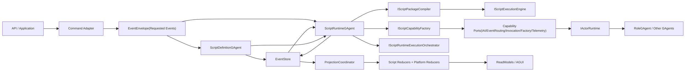
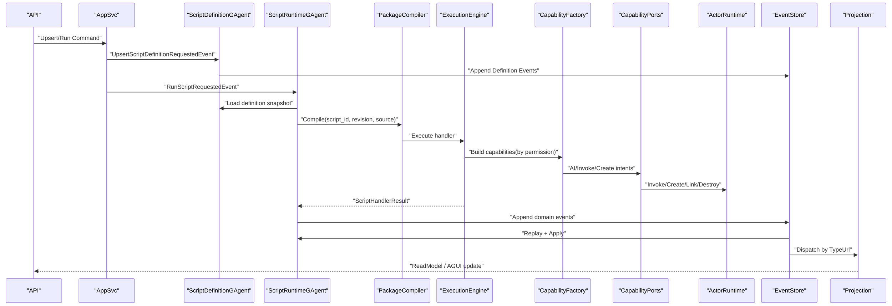

# C# Script GAgent V2 重规划（Best Practices）

## 1. 文档元信息
- 状态: Approved-For-Execution
- 版本: v2.0
- 日期: 2026-03-01
- 适用范围: `src/Aevatar.Scripting.*` 全子系统（Abstractions/Core/Projection/Hosting）
- 决策约束: 无兼容性包袱，删除优于兼容，按最终正确架构重构

## 2. 为什么要重规划（问题归因）
当前脚本体系能跑通，但工程质量不足，核心问题不是“功能缺失”，而是“抽象和职责边界混乱”，导致可维护性与可演进性差。主要症状：

1. 脚本契约语义过窄：主入口长期围绕 `Decide`，难以表达“像静态 GAgent 一样”的完整能力面（事件处理、状态演进、读模型定义、外部能力调用）。
2. 运行时职责膨胀：`ScriptRuntimeGAgent` 同时承担编译、执行、结果归一化、状态写回、能力路由，违背单一职责。
3. 编译执行链耦合：编译器内含大量运行时行为分支，测试和调试成本高。
4. 能力面缺少协议化治理：AI 调用、跨 GAgent 调用、创建/销毁等能力虽可用，但权限模型、审计维度、最小暴露策略不统一。
5. 文档与实施路径偏“补洞式”：先实现后修正，缺乏稳定的分阶段重构主线。

## 3. V2 设计原则（必须满足）
1. 单一主链不变：`Application Command -> Requested Event(EventEnvelope) -> Domain Event -> Apply -> State`。
2. 双 GAgent 架构不变：`ScriptDefinitionGAgent` 管定义事实，`ScriptRuntimeGAgent` 管运行事实。
3. 脚本能力等价静态 GAgent：脚本必须能定义“处理请求事件 + 领域状态演进 + 读模型 reducer + 受控外部能力调用”。
4. 严格 Event Sourcing：状态不可被脚本直接持久化，只能通过领域事件驱动演进。
5. 受控能力面：脚本调用 AI/其他 GAgent/工厂行为必须经受限能力端口，默认最小权限。
6. Actor 边界优先：运行事实仅在 Actor 事件处理线程推进，禁止回调线程改状态。
7. 删除优于兼容：V2 迁移过程中允许删除 V1 冗余抽象和过渡实现。

## 4. V2 目标架构

### 4.0 V2 架构总览图

### 4.0.1 V2 运行时交互图

### 4.1 脚本包模型（Script Package）
把“脚本源码字符串”升级为“脚本包语义”，但仍以字符串持久化为事实源：

1. `manifest`:
- `script_id`
- `revision`
- `entry_handlers`（请求事件 -> 处理器映射）
- `state_schema_version`
- `readmodel_schema_version`
- `capability_permissions`

2. `handlers`:
- `HandleRequestedEvent`（业务编排入口，可输出领域事件与副作用意图）
- `ApplyDomainEvent`（纯函数状态演进）
- `ReduceReadModel`（读侧 reducer，可选）

3. `types`:
- `ScriptRequestedEventEnvelope`
- `ScriptDomainEventEnvelope`
- `ScriptStateSnapshot`
- `ScriptReadModelProjectionInput`

V2 目标不是新增 DSL，而是在 C# 脚本内提供清晰且完整的契约面。

### 4.2 运行时分层（Core 内部重构）
把当前“大而全”的运行时拆成可替换组件：

1. `IScriptPackageCompiler`: 仅负责编译和合约校验，不做运行态编排。
2. `IScriptExecutionEngine`: 仅负责执行 `IScriptPackageRuntime`，并强制运行时契约校验。
3. `IScriptCapabilityFactory`: 基于权限生成受控能力对象。
4. `IScriptRuntimeExecutionOrchestrator`: 统一执行 `HandleRequestedEvent + ApplyDomainEvent + ReduceReadModel`。
5. `ScriptExecutionReadModelProjector`: 统一接入读侧 reducer 与平台 reducer。

`ScriptRuntimeGAgent` 只负责 orchestration：
1. 读取 definition snapshot。
2. 构建执行上下文。
3. 调用 orchestrator 执行脚本运行时契约。
4. 持久化领域事件。
5. 通过 `TransitionState` 演进运行态（包含 state/readmodel 载荷）。

### 4.3 标准执行结果模型
统一脚本执行输出，禁止隐式字符串约定：

1. `DomainEvents`: 需要提交的领域事件集合。
2. `StatePatch` 或 `NextState`: 由 `ApplyDomainEvent` 统一演进，禁止脚本越权直写存储。
3. `InternalIntents`: timeout/retry/requeue 等内部触发意图（事件化）。
4. `SideEffectIntents`: `InvokeAgent/CreateAgent/AIAsk` 等受控副作用请求。
5. `Diagnostics`: 脚本级审计字段（handler、decision_reason、risk_tags 等）。

### 4.4 能力端口治理
能力按域拆分，不再单接口堆叠：

1. `IScriptAICapability`
2. `IScriptAgentInvocationCapability`
3. `IScriptAgentFactoryCapability`
4. `IScriptTimerCapability`
5. `IScriptTelemetryCapability`

每个能力都要有：
1. 权限声明（manifest）
2. 运行时校验（deny by default）
3. 审计日志（run_id/correlation_id/capability/action/result）

### 4.5 状态与读侧重构
1. 运行状态演进改为“事件驱动 + Apply 函数”，避免把 `state_payload_json` 当作万能黑盒。
2. 读模型规则从“硬编码 reducer”转为“脚本 reducer + 平台 reducer 组合”。
3. 投影继续使用统一 Projection Pipeline，不允许双轨。

## 5. 反模式清单（V2 明确禁止）
1. 继续扩展“仅 `Decide`”模型承载全部业务语义。
2. 在 `ScriptRuntimeGAgent` 继续叠加编译/执行/能力治理/状态序列化细节。
3. 用字符串事件名作为主契约。
4. 用 IOC `Scope` 承担任何 actor 生命周期事实。
5. 为业务场景在 `src` 写硬编码分支。

## 6. 实施路线图（无兼容性重构）

### Phase 0: Freeze 与删除准备
1. 冻结 V1 契约新增。
2. 标记并删除无价值过渡抽象。
3. 产出删除清单和影响矩阵。

DoD:
1. 无新增 V1 能力开发。
2. 删除清单评审通过。

### Phase 1: 契约重建（Abstractions）
1. 定义 V2 脚本包契约与标准执行结果。
2. 重新定义执行上下文和能力分域接口。
3. 补齐契约合约测试（正向/反向）。

DoD:
1. 新契约可表达静态 GAgent 核心能力面。
2. 旧 `Decide-only` 路径标记弃用。

### Phase 2: Core 引擎拆分
1. 落地编译器/执行引擎/运行编排器分层。
2. `ScriptRuntimeGAgent` 精简为 orchestrator。
3. side-effect intents 全量事件化。

DoD:
1. 运行时核心类职责单一、可替换。
2. 回放同态测试通过。

### Phase 3: Projection 重构
1. 落地脚本 reducer 适配层。
2. 保持 TypeUrl 精确路由。
3. 读模型 schema/version 策略落地。

DoD:
1. 投影测试覆盖脚本 reducer + 平台 reducer 组合路径。
2. `projection_route_mapping_guard` 持续通过。

### Phase 4: 能力治理与安全
1. 权限模型和 deny-by-default 机制落地。
2. 沙箱策略从“黑名单正则”升级为“语义分析 + 权限约束”双层。
3. 能力调用审计与指标落地。

DoD:
1. 安全/审计测试通过。
2. 观测维度完整（script/revision/run/correlation/capability）。

### Phase 5: 场景回归与切换
1. 复杂理赔多智能体场景迁移到 V2 契约。
2. 全量回归、门禁、性能基线通过。
3. 删除 V1 路径代码和文档。

DoD:
1. `dotnet test aevatar.slnx` 通过。
2. `architecture_guards.sh`、`projection_route_mapping_guard.sh`、`test_stability_guards.sh` 通过。
3. V1 入口删除完成。

## 7. 质量门禁（V2）
1. 契约门禁: 所有脚本入口必须实现 V2 标准结果模型。
2. 架构门禁: 禁止 runtime 膨胀回归（新增 guard 扫描大类依赖耦合）。
3. 安全门禁: 权限声明缺失即编译失败。
4. 测试门禁: 复杂业务场景必须覆盖 A/B/C + replay + lifecycle。
5. 文档门禁: 架构变更必须同步 `docs/architecture` 与 `docs/plans`。

## 8. 风险与缓解
1. 风险: 大重构带来短期交付波动。
缓解: 分 phase 合并，每 phase 可独立验收。
2. 风险: 删除兼容路径时误删必要能力。
缓解: 删除前先补回归测试与快照基线。
3. 风险: 权限模型过严影响开发效率。
缓解: 提供本地 dev profile，但生产默认严格模式。

## 9. 本轮落地动作（立即执行）
1. 将 V1 文档标记为“由 V2 规划接管”。
2. 以本计划为唯一实施主线，后续任务拆分到新的实施计划文档。
3. 禁止继续在 V1 路径上做增量“补洞式”优化。

## 10. 验收结论
本规划作为脚本系统后续重构唯一基线。后续所有开发以“契约重建 + 引擎分层 + 能力治理 + 删除兼容路径”为主线推进。

## 11. 现状能力差距审计（2026-03-01）

本节基于当前代码事实，对“脚本是否具备静态 GAgent 同等能力”做差距审计。结论：当前实现仍属于“脚本决策执行器”，不满足“脚本化 GAgent”目标。

### 11.1 静态 GAgent 能力基线（对齐目标）
1. 统一事件处理管线（`[EventHandler] + Module + Hook`）：
证据：`src/Aevatar.Foundation.Core/GAgentBase.cs`。
2. 严格 Event Sourcing 生命周期（Replay/Confirm/Snapshot/Transition）：
证据：`src/Aevatar.Foundation.Core/GAgentBase.TState.cs`。
3. 原生发布与点对点发送语义（`PublishAsync/SendToAsync` + Envelope 传播）：
证据：`src/Aevatar.Foundation.Core/GAgentBase.cs`。
4. AI/Role 组合运行时（ChatRuntime、ToolLoop、Middleware、HookPipeline）：
证据：`src/Aevatar.AI.Core/AIGAgentBase.cs`、`src/Aevatar.AI.Core/RoleGAgent.cs`。

### 11.2 当前脚本实现主要缺口（按严重级别）
1. P0: 脚本入口退化为 `Decide` 反射约定，非事件处理器模型，无法直接表达多事件处理面。
证据：`src/Aevatar.Scripting.Core/Compilation/RoslynScriptExecutionEngine.cs`。
2. P0: 领域事件被二次封装为 `ScriptRunDomainEventCommitted`，未进入原生事件语义链路。
证据：`src/Aevatar.Scripting.Core/Runtime/ScriptRuntimeExecutionOrchestrator.cs`、`src/Aevatar.Scripting.Core/ScriptRuntimeGAgent.cs`、`src/Aevatar.Scripting.Core/script_host_messages.proto`。
3. P0: 自定义状态仅以 `state_payload_json` 承载，缺少脚本侧显式 `ApplyDomainEvent` 契约与可治理 schema 演进面。
证据：`src/Aevatar.Scripting.Core/script_host_messages.proto`、`src/Aevatar.Scripting.Abstractions/Definitions/ScriptHandlerResult.cs`。
4. P1: 能力面明显缩水，脚本侧未暴露 `Publish/Send/Hook/Module/Lifecycle` 等等价能力，仅提供少量端口封装。
证据：`src/Aevatar.Scripting.Abstractions/Definitions/IScriptRuntimeCapabilities.cs`。
5. P1: 合约发现机制依赖注释正则和方法名约定，非强类型脚本契约。
证据：`src/Aevatar.Scripting.Core/Compilation/RoslynScriptPackageCompiler.cs`、`src/Aevatar.Scripting.Core/Compilation/RoslynScriptExecutionEngine.cs`。
6. P1: 安全沙箱仍是正则黑名单，不足以覆盖语义绕过与能力最小化治理。
证据：`src/Aevatar.Scripting.Core/Compilation/ScriptSandboxPolicy.cs`。

### 11.3 审计结论
1. 当前实现达成“脚本 = 静态 GAgent 能力等价”的程度不足。
2. V2 必须从“Decide 结果模型”升级为“脚本声明完整事件处理/状态演进/读模型规约/能力权限”的模型。
3. 后续开发不再接受“继续增强 Decide-only”路线。

## 12. V2 强制验收门槛（新增）

以下条款为 V2 完成判定硬门槛，缺一不可：
1. 脚本契约必须支持多 handler（RequestedEvent -> Handler）而非单 `Decide` 入口。
2. 脚本必须声明 `ApplyDomainEvent`（或等价显式状态演进契约），禁止仅靠 `state_payload_json` 黑盒推进。
3. 脚本读侧必须声明 reducer 接口并接入统一 Projection Pipeline。
4. 脚本能力面必须覆盖发布、发送、AI 调用、GAgent 调用、GAgent 创建与生命周期操作，并受权限声明约束。
5. 运行态必须在 EventEnvelope 语义内保持相关键传播（`run_id/correlation_id/causation`），不得退化为局部“事件字符串编排”。
6. 安全策略必须升级到“编译期语义分析 + 运行时权限校验”双层治理。
