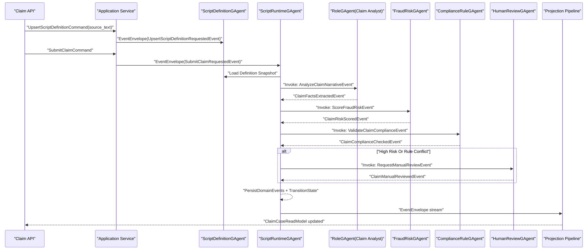

# 多智能体脚本业务集成 TDD 测试用例设计（保险理赔反欺诈）

## 1. 文档目标
- 日期: 2026-03-01
- 状态: Done
- 目标: 定义一个具备真实业务意义的“脚本多智能体协同 + RoleGAgent/AI 集成”测试用例，并作为后续实现的 TDD 基线。
- 对齐文档:
  - `docs/architecture/csharp-script-gagent-requirements.md`
  - `docs/architecture/csharp-script-gagent-detailed-architecture.md`
  - `docs/plans/2026-03-01-csharp-script-gagent-implementation-plan.md`

## 1.1 实现边界（强约束）
1. 本场景业务逻辑必须由开发者自定义脚本实现（脚本字符串内嵌并编译执行）。
2. 场景特定行为只允许在 `test/` 与 `docs/` 落地，不允许在 `src/` 写业务特例。
3. 若发现框架级通用能力缺失，可在 `src/Aevatar.Scripting.*` 做通用补齐，但必须由先失败测试驱动，且不得硬编码场景分支。

## 2. 业务场景
场景名称: 保险理赔反欺诈自动审核

业务价值:
1. 将理赔文本、票据 OCR 与历史保单信息进行自动归一化与审核。
2. 通过 AI 角色分析 + 风险评分 + 合规校验，减少人工审核负载。
3. 对高风险案件自动升级到人工复核，低风险案件自动给出赔付建议。

业务输入:
1. 报案信息（事故描述、就诊记录、票据摘要）。
2. 保单与被保人基础信息。
3. 外部信号（黑名单、历史理赔次数）。

业务输出:
1. 理赔决策建议（Approve/Reject/ManualReview）。
2. 可审计事件链（谁做了什么决策、基于哪些事实）。
3. 查询侧 `ClaimCaseReadModel`（前端与运营后台统一读取）。

## 3. 多智能体拓扑
1. `ScriptDefinitionGAgent`（脚本定义宿主）:
负责接收脚本字符串定义、持久化 `source_text/source_hash/revision`，作为定义事实权威源。
2. `ScriptRuntimeGAgent`（理赔编排脚本运行宿主）:
负责流程推进、事件提交、状态迁移与回放一致性；运行前从 Definition 读取脚本定义快照。
3. `RoleGAgent`（Claim Analyst）:
通过 `IAICapability`/`IRoleAgentPort` 对理赔描述进行结构化事实提取与初步判断。
4. `FraudRiskGAgent`（反欺诈评分）:
结合历史行为输出风险分与风险标签。
5. `ComplianceRuleGAgent`（合规校验）:
校验保单条款、等待期、除外责任等规则。
6. `HumanReviewGAgent`（人工复核工作台适配）:
仅在高风险或规则冲突时触发。

边界约束:
1. 所有 agent 调用必须通过 `IGAgentInvocationPort`。
2. 动态创建/销毁/链接子 agent 必须通过 `IGAgentFactoryPort` + `IActorRuntime`。
3. 脚本不得直接注入 `IServiceProvider` 获取具体 agent 实例。
4. 脚本必须以字符串形式传入 Definition GAgent 并持久化，运行与回放只能从定义事实读取源码。

## 4. 端到端事件主链

## 5. 状态与读模型定义（测试关注）
`ScriptDefinitionState` 关注字段:
1. `script_id`
2. `revision`
3. `source_text`
4. `source_hash`
5. `last_applied_event_version`
6. `last_event_id`

`ScriptRuntimeState` 关注字段:
1. `script_id`
2. `revision`
3. `state_payload_json`（含 `claim_case_id`、`risk_level`、`decision_status`、`review_path`）
4. `last_applied_event_version`
5. `last_event_id`

`ClaimCaseReadModel` 建议字段:
1. `claim_case_id`
2. `policy_id`
3. `ai_summary`
4. `risk_score`
5. `compliance_status`
6. `decision_status`（Pending/Approved/Rejected/ManualReview）
7. `manual_review_required`
8. `updated_at`

## 6. TDD 测试清单（先红后绿）

### 6.1 合约与决策单测
1. `ClaimScriptDecisionTests.Should_emit_facts_risk_and_compliance_requests_in_order`
2. `ClaimScriptDecisionTests.Should_require_manual_review_when_high_risk`
3. `ClaimScriptDecisionTests.Should_emit_approve_when_low_risk_and_compliant`
4. `RoslynScriptAgentCompilerTests.DecideAsync_ShouldAllowScriptToUseCapabilities_AndReturnStatePayload`

先写失败断言:
1. 事件类型与顺序必须精确匹配。
2. 同一输入在同一 revision 下输出事件序列必须稳定。

### 6.2 AI 集成单测（RoleGAgent 组合）
1. `ClaimRoleIntegrationTests.Should_delegate_to_IAICapability_with_correlation_id`
2. `ClaimRoleIntegrationTests.Should_map_ai_output_to_ClaimFactsExtractedEvent`

先写失败断言:
1. `run_id/correlation_id` 必须传递到 AI 调用端口。
2. AI 输出映射字段缺失时必须发失败领域事件，而不是直接改状态。

### 6.3 多智能体编排集成测试
1. `ClaimOrchestrationIntegrationTests.Should_invoke_risk_and_compliance_agents_via_invocation_port`
2. `ClaimOrchestrationIntegrationTests.Should_create_manual_review_agent_via_factory_port_only_when_needed`
3. `ClaimOrchestrationIntegrationTests.Should_not_resolve_agents_from_IServiceProvider`

先写失败断言:
1. 所有调用都通过 `IGAgentInvocationPort` 记录到 runtime fake。
2. 人工复核 agent 创建必须只发生在高风险分支。
3. 不允许出现脚本直接解析具体 agent 的路径。

### 6.4 回放与确定性测试
1. `ClaimReplayTests.Should_rebuild_same_state_from_event_stream`
2. `ClaimReplayTests.Should_rebuild_same_readmodel_from_event_stream`
3. `ClaimReplayTests.Should_reject_stale_internal_events`
4. `ClaimReplayTests.Should_recompile_from_definition_source_without_external_repository`
5. `ScriptRuntimeGAgentReplayContractTests.HandleRunRequested_ShouldCarryStatePayloadBetweenRuns_FromScriptResult`

先写失败断言:
1. `last_applied_event_version` 与最终状态哈希一致。
2. 回放结果与在线执行结果完全一致。

### 6.5 投影测试
1. `ClaimReadModelProjectorTests.Should_route_by_exact_type_url`
2. `ClaimReadModelProjectorTests.Should_update_decision_status_on_manual_review`
3. `ClaimReadModelProjectorTests.Should_noop_for_unmapped_events`

先写失败断言:
1. 禁止 `TypeUrl.Contains(...)`。
2. 未路由事件必须 no-op，不得抛错或误更新。

### 6.6 生命周期边界测试
1. `ClaimLifecycleBoundaryTests.Should_use_runtime_for_create_destroy_link`
2. `ClaimLifecycleBoundaryTests.Should_not_treat_scope_as_actor_lifecycle_authority`

先写失败断言:
1. create/destroy/link/unlink/restore 均通过 `IActorRuntime`。
2. Scope 释放不会隐式销毁 actor 事实状态。

## 7. 测试数据集（业务语义）
1. Case-A（低风险快速赔付）:
`risk_score=0.12`，`compliance=pass`，预期 `Approved`。
2. Case-B（高风险人工复核）:
`risk_score=0.91`，`compliance=pass`，预期 `ManualReview`。
3. Case-C（规则冲突拒赔）:
`risk_score=0.35`，`compliance=fail(waiting_period)`，预期 `Rejected`。

## 8. 验收标准
1. 三条业务路径（A/B/C）均形成完整事件链与读模型输出。
2. `RoleGAgent` 集成路径真实走 `IAICapability`/`IRoleAgentPort`，非直连脚本 mock。
3. 任何分支都不得绕开 EventEnvelope 或直接改宿主状态。
4. 回放测试证明相同事件流产生相同状态和读模型。
5. 生命周期测试证明 Runtime 是唯一生命周期权威来源。
6. 生产代码仅允许框架通用能力补齐，不允许添加任何理赔场景特例分支。
7. 脚本源码字符串在 Definition 状态可完整重建，回放不依赖外部脚本仓库。

## 9. 推荐测试文件与命令
推荐测试文件:
1. `test/Aevatar.Integration.Tests/Fixtures/ScriptDocuments/ClaimScriptScenarioDocument.cs`（测试内嵌字符串常量）
2. `test/Aevatar.Integration.Tests/ClaimScriptDocumentDrivenFlexibilityTests.cs`
3. `test/Aevatar.Integration.Tests/ScriptGAgentEndToEndTests.cs`

扩展候选测试文件:
1. `test/Aevatar.Scripting.Core.Tests/Business/ClaimScriptDecisionTests.cs`
2. `test/Aevatar.Scripting.Core.Tests/AI/ClaimRoleIntegrationTests.cs`
3. `test/Aevatar.Integration.Tests/ClaimOrchestrationIntegrationTests.cs`
4. `test/Aevatar.Integration.Tests/ClaimReplayTests.cs`
5. `test/Aevatar.CQRS.Projection.Core.Tests/ClaimReadModelProjectorTests.cs`
6. `test/Aevatar.Integration.Tests/ClaimLifecycleBoundaryTests.cs`

推荐验证命令:
1. `dotnet test test/Aevatar.Scripting.Core.Tests/Aevatar.Scripting.Core.Tests.csproj --filter "FullyQualifiedName~Claim" --nologo`
2. `dotnet test test/Aevatar.Integration.Tests/Aevatar.Integration.Tests.csproj --filter "FullyQualifiedName~Claim" --nologo`
3. `dotnet test test/Aevatar.CQRS.Projection.Core.Tests/Aevatar.CQRS.Projection.Core.Tests.csproj --filter "FullyQualifiedName~Claim" --nologo`
4. `bash tools/ci/architecture_guards.sh`
5. `bash tools/ci/projection_route_mapping_guard.sh`
6. `bash tools/ci/test_stability_guards.sh`
7. `rg -n "Case-A|Case-B|Case-C|ClaimManualReviewRequestedEvent" src/Aevatar.Scripting.* -S`（仅允许通用框架能力出现，不得硬编码业务分支）

## 10. 非目标
1. 不在本测试用例中实现新的外部 DSL。
2. 不放宽脚本沙箱能力。
3. 不引入新的投影主链或读写双轨。

## 11. 当前落地结果（2026-03-01）
1. 已落地“测试内嵌字符串常量 -> 脚本字符串 -> 编译 -> DefinitionState 持久化”测试闭环。
2. 已落地复杂场景内嵌脚本驱动测试，覆盖脚本集合完整性、编译与持久化。
3. 已落地 `Claim*` 编排/回放/投影/生命周期测试集，并通过运行。
4. 已落地脚本能力上下文：脚本可通过 `ScriptExecutionContext.Capabilities` 调用 AI/跨 GAgent 调用与创建能力。
5. 已落地脚本状态回传：脚本可返回 `ScriptDecisionResult.StatePayloadJson`，运行态与投影均按脚本状态载荷推进。
