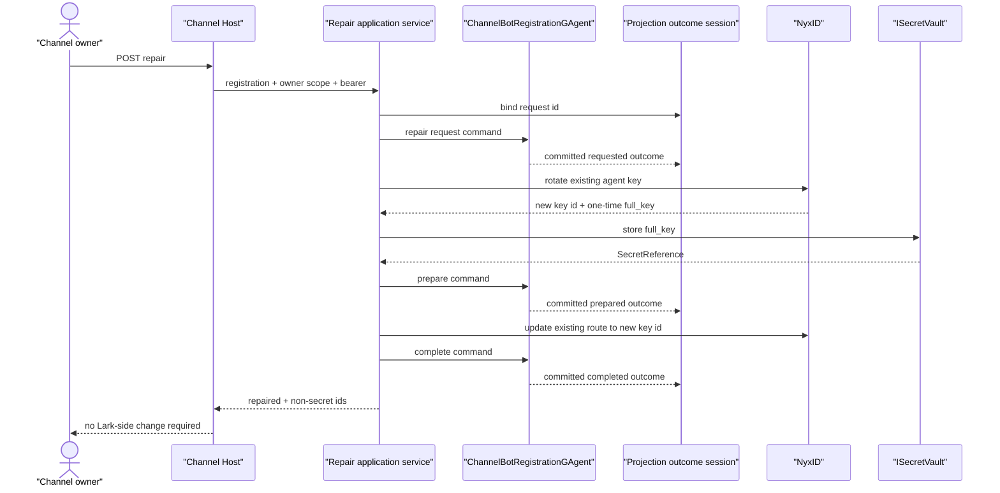

# Channel Workflow Result Delivery In-Place Repair Implementation Plan

> **For agentic workers:** REQUIRED SUB-SKILL: Use superpowers:subagent-driven-development (recommended) or superpowers:executing-plans to implement this plan task-by-task. Steps use checkbox (`- [ ]`) syntax for tracking.

**Goal:** Repair an existing owner-scoped Lark channel registration's workflow result delivery capability without changing its Lark bot, NyxID channel bot, conversation route, webhook URL, permissions, event subscriptions, or default skill binding.

**Architecture:** `ChannelBotRegistrationGAgent` remains the sole authority for the active NyxID agent key id, typed vault handle, and repair phase. One owner-facing application service coordinates the existing NyxID rotate/update APIs, `ISecretVault`, the standard registration command skeleton, and a bounded committed-outcome Projection Pipeline session; HTTP and `/channels` only adapt that typed state. Tool recovery consumes the exact `AgentToolReceipt.ErrorCode` so `channel_workflow_delivery_unavailable` produces repair guidance instead of an unrelated Ornn skill search.

**Tech Stack:** .NET 10, C#, Protobuf, event-sourced GAgents, CQRS Projection Pipeline, `ISecretVault`, NyxID REST client, ASP.NET Core minimal APIs, embedded HTML/JavaScript, xUnit, FluentAssertions, NSubstitute.

## Global Constraints

- Preserve `nyx_channel_bot_id`, `nyx_conversation_route_id`, webhook URL, Lark app configuration, permissions, event subscriptions, scope, provider slug, creation time, inbound activation time, tombstone fields, and `default_skill_name`.
- Rotate only the existing NyxID agent key, immediately store the returned one-time `full_key` in `ISecretVault`, update the existing route to the rotated key id, and commit the new key id plus typed `SecretReference` through `ChannelBotRegistrationGAgent`.
- Never persist or log the bearer token or `full_key`; never serialize `full_key` or a raw `SecretReference` into a browser response.
- Use `EventEnvelope` plus the existing committed-state Projection Pipeline. Do not add query polling, query-time replay/priming, stream request-reply, a process-local registration/session map, or a second projection path.
- Bind the committed-outcome observation session before dispatching each repair phase; accepted dispatch receipts are not completion receipts.
- Repairs are forward-only after rotation because NyxID deactivates the old key immediately. Retry from actor-owned typed state and never infer progress from logs.
- `channel_workflow_delivery_unavailable` remains a pre-dispatch fail-closed gate. The repair does not weaken or bypass it.
- Owner scope is mandatory. Platform-admin visibility does not authorize mutation of another owner's NyxID key.
- No test may add `Task.Delay(...)` or polling. Use committed event sinks, `TaskCompletionSource`, or `Channel<T>` only as lease-scoped transport mechanics.
- Recent receipt/redaction work in `ChatRuntime.cs`, `SkillRecoveryOrchestrator.cs`, `StreamingToolExecutor.cs`, and related AI tests is part of the current committed baseline. Preserve that behavior; if new overlapping user edits appear during execution, inspect the combined diff and stage only repair-owned hunks.
- Run `bash tools/ci/test_stability_guards.sh` for all test changes and update canonical architecture documentation with the repair sequence.

## File Map

- `agents/Aevatar.GAgents.Channel.Runtime/protos/channel_bot_registration.proto`: authoritative repair state, commands, domain outcomes, and public capability enum.
- `agents/Aevatar.GAgents.Channel.Runtime/ChannelBotRegistrationGAgent.cs`: request/prepare/complete/fail validation and event-sourced transitions.
- `agents/Aevatar.GAgents.Channel.Runtime/ChannelWorkflowResultDeliveryCapability.cs`: one typed capability-status evaluator shared by API and application code.
- `agents/Aevatar.GAgents.Channel.Runtime/ChannelWorkflowResultDeliveryRepairObservation.cs`: request-scoped committed-outcome session, projector, codec, and lease.
- `agents/Aevatar.GAgents.Channel.Runtime/ChannelBotRegistrationProjector.cs` and `ChannelBotRegistrationQueryPort.cs`: copy actor-owned repair state into the current-state read model and back into the internal query DTO.
- `agents/channels/Aevatar.GAgents.Channel.NyxIdRelay/ChannelWorkflowResultDeliveryRepairCommandPort.cs`: four narrow repair commands over the standard CQRS command skeleton.
- `agents/channels/Aevatar.GAgents.Channel.NyxIdRelay/ChannelWorkflowResultDeliveryRepairNyxPort.cs`: typed adapter for NyxID key rotation, key discovery, and route rebinding.
- `agents/channels/Aevatar.GAgents.Channel.NyxIdRelay/ChannelWorkflowResultDeliveryRepairService.cs`: owner authorization, resumable orchestration, bounded secret storage, and non-secret result mapping.
- `agents/channels/Aevatar.GAgents.Channel.NyxIdRelay/ChannelCallbackEndpoints.cs`: authenticated/audited repair endpoint and honest registration status fields.
- `agents/channels/Aevatar.GAgents.Channel.NyxIdRelay/channels.html`: capability status, repair command, disabled/in-progress state, and no-Lark-change success copy.
- `src/Aevatar.AI.Abstractions/ToolProviders/AgentToolFailureCodes.cs`: shared exact error-code constant.
- `src/Aevatar.AI.Abstractions/LLMProviders/ToolResultViews.cs`: process-local typed failure view used by recovery planning.
- `src/Aevatar.AI.ToolProviders.AevatarInvocation/AevatarInvocationToolTags.cs` and `AevatarInvocationJson.cs`: provider-owned error receipt classification.
- `src/Aevatar.AI.Core/Chat/SkillRecoveryPlanner.cs`: non-recoverable-by-skill-discovery decision.
- `docs/canon/lark-reply-completion-semantics.md` and `docs/canon/aevatar-channel-architecture.md`: canonical repair ownership and sequence.

---

### Task 1: Protobuf Repair Contract And Actor State Machine

**Files:**
- Modify: `agents/Aevatar.GAgents.Channel.Runtime/protos/channel_bot_registration.proto`
- Modify: `agents/Aevatar.GAgents.Channel.Runtime/ChannelBotRegistrationGAgent.cs`
- Modify: `test/Aevatar.GAgents.ChannelRuntime.Tests/ChannelBotRegistrationProtoCompatibilityTests.cs`
- Modify: `test/Aevatar.GAgents.ChannelRuntime.Tests/ChannelBotRegistrationStoreTests.cs`

**Interfaces:**
- Consumes: existing `ChannelBotRegistrationEntry`, `SecretReference`, and `GAgentBase<TState>.PersistDomainEventAsync`.
- Produces: `ChannelWorkflowResultDeliveryRepairState`, four repair commands, five committed outcome events, `ChannelBotWorkflowResultDeliveryRepairOutcome`, and actor handlers named `HandleWorkflowResultDeliveryRepairRequest`, `HandleWorkflowResultDeliveryRepairPrepare`, `HandleWorkflowResultDeliveryRepairComplete`, and `HandleWorkflowResultDeliveryRepairFail`.

- [x] **Step 1: Add failing descriptor and state-transition tests**

Add descriptor assertions for entry field `17`, document field `18`, all enum values, and all command/event fields. Add actor tests using distinct identities:

```csharp
private static ChannelBotRegisterCommand HistoricalRegistration() => new()
{
    RequestedId = "reg-alpha",
    Platform = "lark",
    ScopeId = "scope-alpha",
    NyxProviderSlug = "api-lark-bot",
    WebhookUrl = "https://nyx.example/api/v1/webhooks/channel/lark/bot-alpha",
    NyxChannelBotId = "bot-alpha",
    NyxAgentApiKeyId = "key-old-alpha",
    NyxConversationRouteId = "route-alpha",
    DefaultSkillName = "team-entry-alpha",
};

private static SecretReference PreparedReference() => new()
{
    Ref = "sec-repair-alpha",
    Purpose = CredentialSecretPurposes.ChannelWorkflowResultDeliveryAgentKey,
    OwnerScopeKey = "scope-alpha",
    Version = 1,
};
```

Cover these exact behaviors:

```csharp
await _agent.HandleRegister(HistoricalRegistration());
await _agent.HandleWorkflowResultDeliveryRepairRequest(new()
{
    RegistrationId = "reg-alpha",
    RequestId = "repair-alpha",
    ExpectedApiKeyId = "key-old-alpha",
    ExpectedConversationRouteId = "route-alpha",
    RequestedBySubjectId = "user-alpha",
    RequestedAtUnixMs = 1784563200000,
});

var requested = _agent.State.Registrations.Single().WorkflowResultDeliveryRepair;
requested.Status.Should().Be(ChannelWorkflowResultDeliveryRepairStatus.Requested);
requested.ExpectedApiKeyId.Should().Be("key-old-alpha");

await _agent.HandleWorkflowResultDeliveryRepairPrepare(new()
{
    RegistrationId = "reg-alpha",
    RequestId = "repair-alpha",
    ExpectedApiKeyId = "key-old-alpha",
    RotatedApiKeyId = "key-new-alpha",
    PreparedSecretReference = PreparedReference(),
    UpdatedAtUnixMs = 1784563201000,
});

await _agent.HandleWorkflowResultDeliveryRepairComplete(new()
{
    RegistrationId = "reg-alpha",
    RequestId = "repair-alpha",
    ExpectedApiKeyId = "key-old-alpha",
    RotatedApiKeyId = "key-new-alpha",
    PreparedSecretReference = PreparedReference(),
    UpdatedAtUnixMs = 1784563202000,
});

var completed = _agent.State.Registrations.Single();
completed.NyxAgentApiKeyId.Should().Be("key-new-alpha");
completed.WorkflowResultDeliveryCredential.Should().Be(PreparedReference());
completed.WorkflowResultDeliveryRepair.Should().BeNull();
completed.NyxChannelBotId.Should().Be("bot-alpha");
completed.NyxConversationRouteId.Should().Be("route-alpha");
completed.WebhookUrl.Should().Contain("bot-alpha");
completed.DefaultSkillName.Should().Be("team-entry-alpha");
```

Also assert duplicate identical commands preserve the same business facts, stale expected key ids commit a rejected outcome without overwriting state, a different concurrent request id is rejected, failed route/completion phases retain prepared key/reference, and non-Lark or tombstoned registrations never enter repair state.

- [x] **Step 2: Run the actor tests and verify RED**

Run:

```bash
dotnet test test/Aevatar.GAgents.ChannelRuntime.Tests/Aevatar.GAgents.ChannelRuntime.Tests.csproj --nologo --no-restore --filter "FullyQualifiedName~ChannelBotRegistrationProtoCompatibilityTests|FullyQualifiedName~ChannelBotRegistrationGAgentTests"
```

Expected: compilation fails because the repair protobuf types, fields, and actor handlers do not exist.

- [x] **Step 3: Add the exact protobuf contracts**

Add field `workflow_result_delivery_repair = 17` to `ChannelBotRegistrationEntry` and field `workflow_result_delivery_repair = 18` to `ChannelBotRegistrationDocument`. Add these definitions without reusing reserved fields:

```proto
enum ChannelWorkflowResultDeliveryCapabilityStatus {
  CHANNEL_WORKFLOW_RESULT_DELIVERY_CAPABILITY_STATUS_UNSPECIFIED = 0;
  CHANNEL_WORKFLOW_RESULT_DELIVERY_CAPABILITY_STATUS_ENABLED = 1;
  CHANNEL_WORKFLOW_RESULT_DELIVERY_CAPABILITY_STATUS_REPAIR_REQUIRED = 2;
  CHANNEL_WORKFLOW_RESULT_DELIVERY_CAPABILITY_STATUS_REPAIRING = 3;
  CHANNEL_WORKFLOW_RESULT_DELIVERY_CAPABILITY_STATUS_REPAIR_FAILED = 4;
}

enum ChannelWorkflowResultDeliveryRepairStatus {
  CHANNEL_WORKFLOW_RESULT_DELIVERY_REPAIR_STATUS_UNSPECIFIED = 0;
  CHANNEL_WORKFLOW_RESULT_DELIVERY_REPAIR_STATUS_REQUESTED = 1;
  CHANNEL_WORKFLOW_RESULT_DELIVERY_REPAIR_STATUS_CREDENTIAL_PREPARED = 2;
  CHANNEL_WORKFLOW_RESULT_DELIVERY_REPAIR_STATUS_FAILED = 3;
}

enum ChannelWorkflowResultDeliveryRepairPhase {
  CHANNEL_WORKFLOW_RESULT_DELIVERY_REPAIR_PHASE_UNSPECIFIED = 0;
  CHANNEL_WORKFLOW_RESULT_DELIVERY_REPAIR_PHASE_REQUEST_ADMISSION = 1;
  CHANNEL_WORKFLOW_RESULT_DELIVERY_REPAIR_PHASE_ROTATED_KEY_RECOVERY = 2;
  CHANNEL_WORKFLOW_RESULT_DELIVERY_REPAIR_PHASE_API_KEY_ROTATION = 3;
  CHANNEL_WORKFLOW_RESULT_DELIVERY_REPAIR_PHASE_VAULT_STORAGE = 4;
  CHANNEL_WORKFLOW_RESULT_DELIVERY_REPAIR_PHASE_CREDENTIAL_PREPARATION = 5;
  CHANNEL_WORKFLOW_RESULT_DELIVERY_REPAIR_PHASE_ROUTE_REBINDING = 6;
  CHANNEL_WORKFLOW_RESULT_DELIVERY_REPAIR_PHASE_ACTOR_COMPLETION = 7;
}

enum ChannelWorkflowResultDeliveryRepairFailureReason {
  CHANNEL_WORKFLOW_RESULT_DELIVERY_REPAIR_FAILURE_REASON_UNSPECIFIED = 0;
  CHANNEL_WORKFLOW_RESULT_DELIVERY_REPAIR_FAILURE_REASON_REGISTRATION_NOT_FOUND = 1;
  CHANNEL_WORKFLOW_RESULT_DELIVERY_REPAIR_FAILURE_REASON_UNAUTHORIZED_OWNER = 2;
  CHANNEL_WORKFLOW_RESULT_DELIVERY_REPAIR_FAILURE_REASON_UNSUPPORTED_PLATFORM = 3;
  CHANNEL_WORKFLOW_RESULT_DELIVERY_REPAIR_FAILURE_REASON_ALREADY_ENABLED = 4;
  CHANNEL_WORKFLOW_RESULT_DELIVERY_REPAIR_FAILURE_REASON_INVALID_REQUEST = 5;
  CHANNEL_WORKFLOW_RESULT_DELIVERY_REPAIR_FAILURE_REASON_REQUEST_CONFLICT = 6;
  CHANNEL_WORKFLOW_RESULT_DELIVERY_REPAIR_FAILURE_REASON_STALE_ACTIVE_KEY = 7;
  CHANNEL_WORKFLOW_RESULT_DELIVERY_REPAIR_FAILURE_REASON_ROTATION_FAILED = 8;
  CHANNEL_WORKFLOW_RESULT_DELIVERY_REPAIR_FAILURE_REASON_VAULT_STORAGE_FAILED = 9;
  CHANNEL_WORKFLOW_RESULT_DELIVERY_REPAIR_FAILURE_REASON_ROUTE_UPDATE_FAILED = 10;
  CHANNEL_WORKFLOW_RESULT_DELIVERY_REPAIR_FAILURE_REASON_COMPLETION_FAILED = 11;
  CHANNEL_WORKFLOW_RESULT_DELIVERY_REPAIR_FAILURE_REASON_AMBIGUOUS_ROTATED_KEY_RECOVERY = 12;
  CHANNEL_WORKFLOW_RESULT_DELIVERY_REPAIR_FAILURE_REASON_OBSERVATION_UNAVAILABLE = 13;
}

message ChannelWorkflowResultDeliveryRepairState {
  string request_id = 1;
  ChannelWorkflowResultDeliveryRepairStatus status = 2;
  string expected_api_key_id = 3;
  string expected_conversation_route_id = 4;
  string rotated_api_key_id = 5;
  aevatar.credentials.SecretReference prepared_secret_reference = 6;
  ChannelWorkflowResultDeliveryRepairPhase failure_phase = 7;
  ChannelWorkflowResultDeliveryRepairFailureReason failure_reason = 8;
  string requested_by_subject_id = 9;
  int64 requested_at_unix_ms = 10;
  int64 updated_at_unix_ms = 11;
}

message ChannelBotWorkflowResultDeliveryRepairRequestCommand {
  string registration_id = 1;
  string request_id = 2;
  string expected_api_key_id = 3;
  string expected_conversation_route_id = 4;
  string requested_by_subject_id = 5;
  int64 requested_at_unix_ms = 6;
}

message ChannelBotWorkflowResultDeliveryRepairPrepareCommand {
  string registration_id = 1;
  string request_id = 2;
  string expected_api_key_id = 3;
  string rotated_api_key_id = 4;
  aevatar.credentials.SecretReference prepared_secret_reference = 5;
  int64 updated_at_unix_ms = 6;
}

message ChannelBotWorkflowResultDeliveryRepairCompleteCommand {
  string registration_id = 1;
  string request_id = 2;
  string expected_api_key_id = 3;
  string rotated_api_key_id = 4;
  aevatar.credentials.SecretReference prepared_secret_reference = 5;
  int64 updated_at_unix_ms = 6;
}

message ChannelBotWorkflowResultDeliveryRepairFailCommand {
  string registration_id = 1;
  string request_id = 2;
  string expected_api_key_id = 3;
  string rotated_api_key_id = 4;
  aevatar.credentials.SecretReference prepared_secret_reference = 5;
  ChannelWorkflowResultDeliveryRepairPhase failure_phase = 6;
  ChannelWorkflowResultDeliveryRepairFailureReason failure_reason = 7;
  int64 updated_at_unix_ms = 8;
}

message ChannelBotWorkflowResultDeliveryRepairRequestedEvent {
  string registration_id = 1;
  ChannelWorkflowResultDeliveryRepairState repair = 2;
}

message ChannelBotWorkflowResultDeliveryRepairPreparedEvent {
  string registration_id = 1;
  ChannelWorkflowResultDeliveryRepairState repair = 2;
}

message ChannelBotWorkflowResultDeliveryRepairCompletedEvent {
  string registration_id = 1;
  string request_id = 2;
  string expected_api_key_id = 3;
  string rotated_api_key_id = 4;
  aevatar.credentials.SecretReference prepared_secret_reference = 5;
  int64 completed_at_unix_ms = 6;
}

message ChannelBotWorkflowResultDeliveryRepairFailedEvent {
  string registration_id = 1;
  ChannelWorkflowResultDeliveryRepairState repair = 2;
}

message ChannelBotWorkflowResultDeliveryRepairRejectedEvent {
  string registration_id = 1;
  string request_id = 2;
  ChannelWorkflowResultDeliveryRepairPhase phase = 3;
  ChannelWorkflowResultDeliveryRepairFailureReason reason = 4;
  int64 rejected_at_unix_ms = 5;
}

message ChannelBotWorkflowResultDeliveryRepairOutcome {
  oneof outcome {
    ChannelBotWorkflowResultDeliveryRepairRequestedEvent requested = 1;
    ChannelBotWorkflowResultDeliveryRepairPreparedEvent prepared = 2;
    ChannelBotWorkflowResultDeliveryRepairCompletedEvent completed = 3;
    ChannelBotWorkflowResultDeliveryRepairFailedEvent failed = 4;
    ChannelBotWorkflowResultDeliveryRepairRejectedEvent rejected = 5;
  }
}
```

- [x] **Step 4: Implement actor validation and transitions**

Add all five events to `TransitionState`. Each command must emit either its corresponding committed event or `ChannelBotWorkflowResultDeliveryRepairRejectedEvent`; never silently return after a valid request id has been supplied.

Use these invariants in the handlers:

```csharp
private static bool IsLark(ChannelBotRegistrationEntry entry) =>
    string.Equals(entry.Platform, "lark", StringComparison.OrdinalIgnoreCase);

private static bool IsPreparedReferenceUsable(
    ChannelBotRegistrationEntry entry,
    SecretReference? reference) =>
    reference is not null &&
    !string.IsNullOrWhiteSpace(reference.Ref) &&
    string.Equals(
        reference.Purpose,
        CredentialSecretPurposes.ChannelWorkflowResultDeliveryAgentKey,
        StringComparison.Ordinal) &&
    string.Equals(reference.OwnerScopeKey, entry.ScopeId, StringComparison.Ordinal);

private static bool SamePreparedFacts(
    ChannelWorkflowResultDeliveryRepairState repair,
    string rotatedApiKeyId,
    SecretReference? reference) =>
    string.Equals(repair.RotatedApiKeyId, rotatedApiKeyId, StringComparison.Ordinal) &&
    Equals(repair.PreparedSecretReference, reference);
```

`Apply...Requested` replaces only `WorkflowResultDeliveryRepair`. `Apply...Prepared` replaces only that repair sub-message. `Apply...Failed` retains any non-empty rotated key id and prepared reference while setting typed failure phase/reason. `Apply...Completed` changes only the following fields and clears repair state:

```csharp
entry.NyxAgentApiKeyId = evt.RotatedApiKeyId;
entry.WorkflowResultDeliveryCredential = evt.PreparedSecretReference.Clone();
entry.WorkflowResultDeliveryRepair = null;
```

Identical request/prepare/fail commands may recommit the same business snapshot so a newly attached observer receives an outcome; conflicting request ids, stale active key ids, mismatched route ids, invalid purpose/owner, or invalid prior phases must commit rejection without changing the registration.

- [x] **Step 5: Run the actor tests and verify GREEN**

Run the Task 1 test command. Expected: all selected tests pass, including duplicate/stale cases and preservation assertions.

- [x] **Step 6: Commit Task 1**

```bash
git add agents/Aevatar.GAgents.Channel.Runtime/protos/channel_bot_registration.proto agents/Aevatar.GAgents.Channel.Runtime/ChannelBotRegistrationGAgent.cs test/Aevatar.GAgents.ChannelRuntime.Tests/ChannelBotRegistrationProtoCompatibilityTests.cs test/Aevatar.GAgents.ChannelRuntime.Tests/ChannelBotRegistrationStoreTests.cs
git commit -m "Model channel workflow delivery repair state"
```

### Task 2: Capability Read Model And Committed Outcome Observation

**Files:**
- Create: `agents/Aevatar.GAgents.Channel.Runtime/ChannelWorkflowResultDeliveryCapability.cs`
- Create: `agents/Aevatar.GAgents.Channel.Runtime/ChannelWorkflowResultDeliveryRepairObservation.cs`
- Modify: `agents/Aevatar.GAgents.Channel.Runtime/ChannelBotRegistrationProjector.cs`
- Modify: `agents/Aevatar.GAgents.Channel.Runtime/ChannelBotRegistrationQueryPort.cs`
- Modify: `agents/Aevatar.GAgents.Channel.Runtime/DependencyInjection/ChannelRuntimeServiceCollectionExtensions.cs`
- Modify: `test/Aevatar.GAgents.ChannelRuntime.Tests/ChannelBotRegistrationProjectorTests.cs`
- Modify: `test/Aevatar.GAgents.ChannelRuntime.Tests/RegistrationQueryPortTests.cs`
- Create: `test/Aevatar.GAgents.ChannelRuntime.Tests/ChannelWorkflowResultDeliveryRepairObservationTests.cs`

**Interfaces:**
- Consumes: Task 1 repair state/events and the existing `ProjectionSessionScopeGAgent<TContext>` runtime.
- Produces: `ChannelWorkflowResultDeliveryCapability.Resolve(ChannelBotRegistrationEntry)`, `IChannelWorkflowResultDeliveryRepairObservationPort.BindAsync`, and an observation lease whose `WaitAsync(expectedCase, ct)` completes only from committed repair events.

- [x] **Step 1: Write failing capability, projection, and observation tests**

Assert the status matrix exactly:

```csharp
ChannelWorkflowResultDeliveryCapability.Resolve(enabledEntry)
    .Should().Be(ChannelWorkflowResultDeliveryCapabilityStatus.Enabled);
ChannelWorkflowResultDeliveryCapability.Resolve(missingCredentialEntry)
    .Should().Be(ChannelWorkflowResultDeliveryCapabilityStatus.RepairRequired);
ChannelWorkflowResultDeliveryCapability.Resolve(requestedEntry)
    .Should().Be(ChannelWorkflowResultDeliveryCapabilityStatus.Repairing);
ChannelWorkflowResultDeliveryCapability.Resolve(failedEntry)
    .Should().Be(ChannelWorkflowResultDeliveryCapabilityStatus.RepairFailed);
```

Project an entry containing a failed repair and assert `ChannelBotRegistrationDocument.WorkflowResultDeliveryRepair` is an equal clone. Read it through `ChannelBotRegistrationQueryPort` and assert the internal entry retains request id, rotated key id, prepared reference, phase, and reason.

For observation, create a runtime lease and recording event hub, feed a committed envelope carrying `ChannelBotWorkflowResultDeliveryRepairPreparedEvent`, and assert the projector publishes only when `event.repair.request_id == context.session_id`. Verify the codec round-trips every outcome case and rejects mismatched event type/payload. Verify disposing a bound lease unsubscribes and releases the projection scope.

- [x] **Step 2: Run focused projection tests and verify RED**

Run:

```bash
dotnet test test/Aevatar.GAgents.ChannelRuntime.Tests/Aevatar.GAgents.ChannelRuntime.Tests.csproj --nologo --no-restore --filter "FullyQualifiedName~ChannelBotRegistrationProjectorTests|FullyQualifiedName~RegistrationQueryPortTests|FullyQualifiedName~ChannelWorkflowResultDeliveryRepairObservationTests"
```

Expected: compilation fails because the capability evaluator, repair document mapping, and observation types do not exist.

- [x] **Step 3: Implement the typed capability evaluator**

Create:

```csharp
public static class ChannelWorkflowResultDeliveryCapability
{
    public static ChannelWorkflowResultDeliveryCapabilityStatus Resolve(
        ChannelBotRegistrationEntry entry)
    {
        ArgumentNullException.ThrowIfNull(entry);
        return entry.WorkflowResultDeliveryRepair?.Status switch
        {
            ChannelWorkflowResultDeliveryRepairStatus.Failed =>
                ChannelWorkflowResultDeliveryCapabilityStatus.RepairFailed,
            ChannelWorkflowResultDeliveryRepairStatus.Requested or
                ChannelWorkflowResultDeliveryRepairStatus.CredentialPrepared =>
                ChannelWorkflowResultDeliveryCapabilityStatus.Repairing,
            _ when IsEnabled(entry) =>
                ChannelWorkflowResultDeliveryCapabilityStatus.Enabled,
            _ => ChannelWorkflowResultDeliveryCapabilityStatus.RepairRequired,
        };
    }

    public static bool IsEnabled(ChannelBotRegistrationEntry entry)
    {
        ArgumentNullException.ThrowIfNull(entry);
        var reference = entry.WorkflowResultDeliveryCredential;
        return !string.IsNullOrWhiteSpace(entry.NyxAgentApiKeyId) &&
               reference is not null &&
               !string.IsNullOrWhiteSpace(reference.Ref) &&
               string.Equals(
                   reference.Purpose,
                   CredentialSecretPurposes.ChannelWorkflowResultDeliveryAgentKey,
                   StringComparison.Ordinal) &&
               string.Equals(reference.OwnerScopeKey, entry.ScopeId, StringComparison.Ordinal);
    }
}
```

- [x] **Step 4: Copy repair state through the existing current-state projector**

Add only clone mappings:

```csharp
WorkflowResultDeliveryRepair = entry.WorkflowResultDeliveryRepair?.Clone(),
```

and in `ChannelBotRegistrationQueryPort.ToEntry`:

```csharp
WorkflowResultDeliveryRepair = document.WorkflowResultDeliveryRepair?.Clone(),
```

Do not query actor state, replay events, or create a second repair document.

- [x] **Step 5: Implement the request-scoped outcome session**

Define these exact public ports and internal runtime types:

```csharp
public interface IChannelWorkflowResultDeliveryRepairObservationPort
{
    Task<IChannelWorkflowResultDeliveryRepairObservationLease> BindAsync(
        string requestId,
        CancellationToken ct = default);
}

public interface IChannelWorkflowResultDeliveryRepairObservationLease : IAsyncDisposable
{
    Task<ChannelBotWorkflowResultDeliveryRepairOutcome> WaitAsync(
        ChannelBotWorkflowResultDeliveryRepairOutcome.OutcomeOneofCase expected,
        CancellationToken ct = default);
}
```

Use a lease-owned `Channel<ChannelBotWorkflowResultDeliveryRepairOutcome>` only as event transport. `WaitAsync` must return the requested case or `Rejected`, skip other committed phases for the same request, and honor cancellation without polling. The projector must use `CommittedStateEventEnvelope.TryGetObservedPayload`, exact protobuf descriptors, and request-id equality. The codec serializes the whole protobuf outcome and validates `OutcomeCase.ToString()` as its event type.

Register the chain in `AddChannelRuntime`:

```csharp
services.AddEventSinkProjectionRuntimeCore<
    ChannelWorkflowResultDeliveryRepairProjectionContext,
    ChannelWorkflowResultDeliveryRepairRuntimeLease,
    ChannelBotWorkflowResultDeliveryRepairOutcome,
    ProjectionSessionScopeGAgent<ChannelWorkflowResultDeliveryRepairProjectionContext>>(
    static key => new ChannelWorkflowResultDeliveryRepairProjectionContext
    {
        SessionId = key.SessionId,
        RootActorId = key.RootActorId,
        ProjectionKind = key.ProjectionKind,
    },
    static context => new ChannelWorkflowResultDeliveryRepairRuntimeLease(context));
services.TryAddSingleton<
    IProjectionSessionEventCodec<ChannelBotWorkflowResultDeliveryRepairOutcome>,
    ChannelWorkflowResultDeliveryRepairOutcomeCodec>();
services.TryAddSingleton<
    IProjectionSessionEventHub<ChannelBotWorkflowResultDeliveryRepairOutcome>,
    ProjectionSessionEventHub<ChannelBotWorkflowResultDeliveryRepairOutcome>>();
services.TryAddEnumerable(ServiceDescriptor.Singleton<
    IProjectionProjector<ChannelWorkflowResultDeliveryRepairProjectionContext>,
    ChannelWorkflowResultDeliveryRepairOutcomeProjector>());
services.TryAddSingleton<
    IChannelWorkflowResultDeliveryRepairObservationPort,
    ChannelWorkflowResultDeliveryRepairObservationPort>();
```

- [x] **Step 6: Run focused projection tests and verify GREEN**

Run the Task 2 command. Expected: all selected tests pass without delays or read-model priming.

- [x] **Step 7: Commit Task 2**

```bash
git add agents/Aevatar.GAgents.Channel.Runtime/ChannelWorkflowResultDeliveryCapability.cs agents/Aevatar.GAgents.Channel.Runtime/ChannelWorkflowResultDeliveryRepairObservation.cs agents/Aevatar.GAgents.Channel.Runtime/ChannelBotRegistrationProjector.cs agents/Aevatar.GAgents.Channel.Runtime/ChannelBotRegistrationQueryPort.cs agents/Aevatar.GAgents.Channel.Runtime/DependencyInjection/ChannelRuntimeServiceCollectionExtensions.cs test/Aevatar.GAgents.ChannelRuntime.Tests/ChannelBotRegistrationProjectorTests.cs test/Aevatar.GAgents.ChannelRuntime.Tests/RegistrationQueryPortTests.cs test/Aevatar.GAgents.ChannelRuntime.Tests/ChannelWorkflowResultDeliveryRepairObservationTests.cs
git commit -m "Observe committed channel repair outcomes"
```

### Task 3: Standard Repair Commands And NyxID Adapter

**Files:**
- Create: `agents/channels/Aevatar.GAgents.Channel.NyxIdRelay/ChannelWorkflowResultDeliveryRepairCommandPort.cs`
- Create: `agents/channels/Aevatar.GAgents.Channel.NyxIdRelay/ChannelWorkflowResultDeliveryRepairNyxPort.cs`
- Modify: `agents/channels/Aevatar.GAgents.Channel.NyxIdRelay/ChannelRegistrationCommandFacade.cs`
- Modify: `agents/channels/Aevatar.GAgents.Channel.NyxIdRelay/DependencyInjection/NyxIdRelayChannelServiceCollectionExtensions.cs`
- Modify: `test/Aevatar.GAgents.ChannelRuntime.Tests/ChannelRegistrationCommandFacadeTestSupport.cs`
- Create: `test/Aevatar.GAgents.ChannelRuntime.Tests/ChannelWorkflowResultDeliveryRepairCommandPortTests.cs`
- Create: `test/Aevatar.GAgents.ChannelRuntime.Tests/ChannelWorkflowResultDeliveryRepairNyxPortTests.cs`

**Interfaces:**
- Consumes: Task 1 commands, existing `ICommandDispatchService` skeleton, `NyxIdApiClient.RotateApiKeyAsync`, `ListApiKeysAsync`, and `UpdateConversationRouteAsync`.
- Produces: `IChannelWorkflowResultDeliveryRepairCommandPort`, `IChannelWorkflowResultDeliveryRepairNyxPort`, redaction-safe rotated credentials, and typed key summaries.

- [x] **Step 1: Write failing command-envelope and Nyx adapter tests**

For each repair command, capture the dispatched `EventEnvelope` and assert its payload descriptor, direct route target `channel-bot-registration-store`, non-empty command/correlation ids, and accepted-only receipt.

Use a recording `HttpMessageHandler` for NyxID and assert:

```text
POST /api/v1/api-keys/key-old-alpha/rotate
GET  /api/v1/api-keys
PUT  /api/v1/channel-conversations/route-alpha
```

The PUT body must deserialize to `agent_api_key_id = "key-new-alpha"` and `default_agent = true`. Rotation must parse `id`, `full_key`, and `created_at`; list parsing must retain only typed `id`, `name`, `is_active`, and `created_at`. Assert `rotated.ToString()` and all logger records do not contain `nyxid_ag_secret_alpha`.

- [x] **Step 2: Run focused adapter tests and verify RED**

Run:

```bash
dotnet test test/Aevatar.GAgents.ChannelRuntime.Tests/Aevatar.GAgents.ChannelRuntime.Tests.csproj --nologo --no-restore --filter "FullyQualifiedName~ChannelWorkflowResultDeliveryRepairCommandPortTests|FullyQualifiedName~ChannelWorkflowResultDeliveryRepairNyxPortTests"
```

Expected: compilation fails because both narrow ports are absent and the envelope factory supports only register/unregister.

- [x] **Step 3: Add the narrow standard-command port**

Define:

```csharp
public interface IChannelWorkflowResultDeliveryRepairCommandPort
{
    Task<ChannelRegistrationCommandAcceptedReceipt> RequestAsync(
        ChannelBotWorkflowResultDeliveryRepairRequestCommand command,
        CancellationToken ct = default);
    Task<ChannelRegistrationCommandAcceptedReceipt> PrepareAsync(
        ChannelBotWorkflowResultDeliveryRepairPrepareCommand command,
        CancellationToken ct = default);
    Task<ChannelRegistrationCommandAcceptedReceipt> CompleteAsync(
        ChannelBotWorkflowResultDeliveryRepairCompleteCommand command,
        CancellationToken ct = default);
    Task<ChannelRegistrationCommandAcceptedReceipt> FailAsync(
        ChannelBotWorkflowResultDeliveryRepairFailCommand command,
        CancellationToken ct = default);
}
```

Implement it with four typed `ICommandDispatchService<..., ChannelRegistrationCommandAcceptedReceipt, ChannelRegistrationCommandStartError>` dependencies and the same `ResolveReceipt` semantics as `ChannelRegistrationCommandFacade`. Extend `ChannelBotRegistrationCommandEnvelopeFactory` to implement `ICommandEnvelopeFactory<T>` for all four commands. Register a target resolver, envelope factory, dispatch pipeline, and dispatch service for every command in `AddNyxIdRelayChannel`; do not call `IActorDispatchPort` directly from the repair service.

- [x] **Step 4: Add the typed NyxID repair adapter**

Define:

```csharp
internal interface IChannelWorkflowResultDeliveryRepairNyxPort
{
    Task<ChannelRotatedNyxAgentCredential> RotateAgentKeyAsync(
        string accessToken,
        string apiKeyId,
        CancellationToken ct);
    Task<IReadOnlyList<ChannelNyxAgentKeySummary>> ListAgentKeysAsync(
        string accessToken,
        CancellationToken ct);
    Task RebindConversationRouteAsync(
        string accessToken,
        string routeId,
        string apiKeyId,
        CancellationToken ct);
}

internal sealed record ChannelNyxAgentKeySummary(
    string ApiKeyId,
    string Name,
    bool IsActive,
    DateTimeOffset CreatedAtUtc);

internal sealed class ChannelRotatedNyxAgentCredential
{
    public ChannelRotatedNyxAgentCredential(
        string apiKeyId,
        string fullKey,
        DateTimeOffset createdAtUtc)
    {
        ApiKeyId = apiKeyId;
        FullKey = fullKey;
        CreatedAtUtc = createdAtUtc;
    }

    public string ApiKeyId { get; }
    public string FullKey { get; }
    public DateTimeOffset CreatedAtUtc { get; }
    public override string ToString() =>
        $"ChannelRotatedNyxAgentCredential {{ ApiKeyId = {ApiKeyId}, FullKey = [REDACTED] }}";
}
```

Reject Nyx error envelopes, missing/empty ids, missing `full_key`, invalid JSON, and invalid timestamps with controlled exceptions that contain no response body. Build the deterministic relay-key name with exactly the provisioning convention:

```csharp
internal static string RelayKeyName(string registrationId)
{
    var normalized = registrationId.Trim();
    return $"aevatar-lark-relay-{normalized[..Math.Min(12, normalized.Length)]}";
}
```

- [x] **Step 5: Run focused adapter tests and verify GREEN**

Run the Task 3 command. Expected: all selected tests pass and no assertion can observe `full_key` outside the sensitive object/vault handoff.

- [x] **Step 6: Commit Task 3**

```bash
git add agents/channels/Aevatar.GAgents.Channel.NyxIdRelay/ChannelWorkflowResultDeliveryRepairCommandPort.cs agents/channels/Aevatar.GAgents.Channel.NyxIdRelay/ChannelWorkflowResultDeliveryRepairNyxPort.cs agents/channels/Aevatar.GAgents.Channel.NyxIdRelay/ChannelRegistrationCommandFacade.cs agents/channels/Aevatar.GAgents.Channel.NyxIdRelay/DependencyInjection/NyxIdRelayChannelServiceCollectionExtensions.cs test/Aevatar.GAgents.ChannelRuntime.Tests/ChannelRegistrationCommandFacadeTestSupport.cs test/Aevatar.GAgents.ChannelRuntime.Tests/ChannelWorkflowResultDeliveryRepairCommandPortTests.cs test/Aevatar.GAgents.ChannelRuntime.Tests/ChannelWorkflowResultDeliveryRepairNyxPortTests.cs
git commit -m "Add channel delivery repair ports"
```

### Task 4: Owner-Scoped Resumable Repair Service

**Files:**
- Create: `agents/channels/Aevatar.GAgents.Channel.NyxIdRelay/ChannelWorkflowResultDeliveryRepairService.cs`
- Modify: `agents/channels/Aevatar.GAgents.Channel.NyxIdRelay/DependencyInjection/NyxIdRelayChannelServiceCollectionExtensions.cs`
- Create: `test/Aevatar.GAgents.ChannelRuntime.Tests/ChannelWorkflowResultDeliveryRepairServiceTests.cs`

**Interfaces:**
- Consumes: Tasks 2-3 capability/query/observation/command/Nyx ports and `ISecretVault`.
- Produces: `IChannelWorkflowResultDeliveryRepairService.RepairAsync` and a browser-safe `ChannelWorkflowResultDeliveryRepairResult` with no bearer, full key, or secret reference.

- [x] **Step 1: Write failing orchestration tests with deterministic fakes**

Build fakes that record the exact operation order and complete observation from explicit outcomes. Cover:

```text
request command
committed requested outcome
Nyx rotate old key
vault put full_key
prepare command
committed prepared outcome
Nyx route update
complete command
committed completed outcome
```

Assert all of the following:

- owner scope succeeds; another scope returns not found/unauthorized without calling Nyx, vault, command, or observation ports;
- platform admin is not an input and cannot bypass owner scope;
- non-Lark returns `unsupported_platform` before side effects;
- already-enabled returns `already_enabled` without rotating;
- cancellation before rotation leaves state untouched;
- after a successful rotation the vault/prepare/route/complete sequence uses a detached bounded token;
- vault storage is attempted exactly three times with no delay, then failure state records the rotated key id but no prepared reference;
- `CREDENTIAL_PREPARED` and route/completion failures retry route+complete without another rotation or vault write;
- vault failure retries by rotating the recorded replacement key, never the inactive original;
- requested state first lists active keys and verifies whether the expected key is still active; zero replacement candidates rotate the expected key only when NyxID explicitly reports it active, one exact-name replacement created at/after `requested_at_unix_ms` rotates that candidate, and an inactive expected key with zero replacements or multiple replacements commits `AMBIGUOUS_ROTATED_KEY_RECOVERY` without guessing;
- the final result and logger records contain registration/request/non-secret key ids but not `user-bearer-alpha`, `nyxid_ag_secret_alpha`, or `sec-repair-alpha`;
- every command uses the same `request_id`, expected original key id, and existing route id.

- [x] **Step 2: Run service tests and verify RED**

Run:

```bash
dotnet test test/Aevatar.GAgents.ChannelRuntime.Tests/Aevatar.GAgents.ChannelRuntime.Tests.csproj --nologo --no-restore --filter "FullyQualifiedName~ChannelWorkflowResultDeliveryRepairServiceTests"
```

Expected: compilation fails because the service/result contract is absent.

- [x] **Step 3: Add the non-secret application contract**

Define:

```csharp
public enum ChannelWorkflowResultDeliveryRepairResultStatus
{
    Repaired = 0,
    AlreadyEnabled = 1,
    Repairing = 2,
    RepairFailed = 3,
    NotFound = 4,
    UnsupportedPlatform = 5,
}

public sealed record ChannelWorkflowResultDeliveryRepairResult(
    ChannelWorkflowResultDeliveryRepairResultStatus Status,
    string RequestId,
    string RegistrationId,
    string NyxAgentApiKeyId,
    ChannelWorkflowResultDeliveryRepairPhase FailurePhase =
        ChannelWorkflowResultDeliveryRepairPhase.Unspecified,
    ChannelWorkflowResultDeliveryRepairFailureReason FailureReason =
        ChannelWorkflowResultDeliveryRepairFailureReason.Unspecified);

public interface IChannelWorkflowResultDeliveryRepairService
{
    Task<ChannelWorkflowResultDeliveryRepairResult> RepairAsync(
        string registrationId,
        string callerScopeId,
        string requestedBySubjectId,
        string accessToken,
        CancellationToken ct = default);
}
```

The bearer is a method argument only. Do not place it in a record, field, exception, command, event, or log scope.

- [x] **Step 4: Implement request admission and committed observation**

Read the registration once from `IChannelBotRegistrationQueryPort`. Return `NotFound` for missing, tombstoned, empty caller scope, or scope mismatch. Return `UnsupportedPlatform` unless platform is exactly Lark. Return `AlreadyEnabled` only when `ChannelWorkflowResultDeliveryCapability.IsEnabled(entry)` and no repair is pending.

For a new repair, generate one request id, bind observation before dispatch, dispatch `RequestAsync`, and wait for `Requested` or `Rejected`. For an existing requested/prepared/failed repair, reuse its actor-owned request id and facts rather than inventing a new request.

- [x] **Step 5: Implement forward-only rotation, vault storage, and resume**

Use these constants and exact vault request:

```csharp
private const int VaultStoreAttempts = 3;
private static readonly TimeSpan CriticalCompletionTimeout = TimeSpan.FromSeconds(30);
private static readonly TimeSpan FailureObservationTimeout = TimeSpan.FromSeconds(10);

new StoreSecretRequest(
    CredentialSecretPurposes.ChannelWorkflowResultDeliveryAgentKey,
    registration.ScopeId,
    rotated.ApiKeyId,
    rotated.FullKey,
    $"channel-workflow-result-delivery-repair:{registration.Id}:{requestId}")
```

Before rotation, honor caller cancellation. Immediately after rotation returns, create a new bounded `CancellationTokenSource(CriticalCompletionTimeout)` and use only that token for vault storage, prepare observation, route update, completion observation, and failure recording.

Resume rules must be encoded as typed branches:

```csharp
if (HasPreparedCredential(repair))
    return await RebindAndCompleteAsync(registration, repair, accessToken, observation, criticalCt);

var rotationSourceKeyId = await ResolveRotationSourceKeyIdAsync(
    registration,
    repair,
    accessToken,
    ct);
var rotated = await _nyxPort.RotateAgentKeyAsync(accessToken, rotationSourceKeyId, ct);
using var critical = new CancellationTokenSource(CriticalCompletionTimeout);
var stored = await PutWithBoundedRetriesAsync(
    registration,
    requestId,
    rotated,
    critical.Token);
```

`ResolveRotationSourceKeyIdAsync` uses `repair.RotatedApiKeyId` after vault failure. For plain requested state it lists keys and filters by exact deterministic name, `IsActive`, `CreatedAtUtc >= requested_at`, and id different from the expected original. Zero returns the expected key, one returns that candidate, and more than one returns the typed ambiguous failure.

- [x] **Step 6: Implement failure commits without secret leakage**

For rotation, vault, route, and completion failures, dispatch `FailAsync` with stable phase/reason, request id, expected key id, and only the non-secret rotated id/prepared `SecretReference` already owned by the repair. Wait for the committed failed outcome with a fresh bounded token. If failure observation itself is unavailable, return `RepairFailed` with `OBSERVATION_UNAVAILABLE`; log only phase, reason, request id, registration id, and non-secret resource ids.

- [x] **Step 7: Run service tests and verify GREEN**

Run the Task 4 command. Expected: all service tests pass with exact ordering and zero delay/polling calls.

- [x] **Step 8: Commit Task 4**

```bash
git add agents/channels/Aevatar.GAgents.Channel.NyxIdRelay/ChannelWorkflowResultDeliveryRepairService.cs agents/channels/Aevatar.GAgents.Channel.NyxIdRelay/DependencyInjection/NyxIdRelayChannelServiceCollectionExtensions.cs test/Aevatar.GAgents.ChannelRuntime.Tests/ChannelWorkflowResultDeliveryRepairServiceTests.cs
git commit -m "Repair channel workflow delivery in place"
```

### Task 5: Authenticated API And Honest `/channels` Status

**Files:**
- Modify: `agents/channels/Aevatar.GAgents.Channel.NyxIdRelay/ChannelCallbackEndpoints.cs`
- Modify: `agents/channels/Aevatar.GAgents.Channel.NyxIdRelay/channels.html`
- Modify: `test/Aevatar.GAgents.ChannelRuntime.Tests/ChannelCallbackEndpointsTests.cs`
- Modify: `test/Aevatar.GAgents.ChannelRuntime.Tests/ChannelsEndpointsTests.cs`

**Interfaces:**
- Consumes: Task 2 capability evaluator and Task 4 repair service/result.
- Produces: `POST /api/channels/registrations/{registrationId}/workflow-result-delivery/repair` plus `enabled`, `repair_required`, `repairing`, and `repair_failed` fields in registration HTTP responses.

- [x] **Step 1: Write failing endpoint/auth/serialization tests**

Assert the new route requires authorization and carries endpoint audit operation `channel.registration.workflow-result-delivery.repair`. Invoke the private handler with a substituted service and assert:

- missing bearer returns 401;
- missing authenticated scope returns 404/forbidden before service invocation;
- caller scope and first non-empty `uid`, `sub`, `ClaimTypes.NameIdentifier`, or `user_id` are passed to the service;
- repaired/already-enabled return 200, repairing returns 202, owner-hidden not found returns 404, unsupported platform returns 409, and failed repair returns 502;
- response JSON contains only `status`, `repair_request_id`, `registration_id`, `nyx_agent_api_key_id`, `workflow_result_delivery_status`, optional `failure_phase`, optional `failure_reason`, and safe `note`;
- response JSON does not contain bearer text, `full_key`, `secret_reference`, `owner_scope_key`, or a test secret ref;
- list and create responses expose an honest workflow-delivery status.

- [x] **Step 2: Write failing embedded-page contract tests**

Extend `EmbeddedPage_PreservesContractMarkers` to require:

```csharp
html.Should().Contain("workflow-result-delivery/repair");
html.Should().Contain("Repair workflow replies");
html.Should().Contain("workflow_result_delivery_status");
html.Should().Contain("无需修改 Lark 后台配置");
```

Also assert the UI has no field or DOM copy action for `workflow_result_delivery_credential` or `secret_reference`.

- [x] **Step 3: Run API/UI contract tests and verify RED**

Run:

```bash
dotnet test test/Aevatar.GAgents.ChannelRuntime.Tests/Aevatar.GAgents.ChannelRuntime.Tests.csproj --nologo --no-restore --filter "FullyQualifiedName~ChannelCallbackEndpointsTests|FullyQualifiedName~ChannelsEndpointsTests"
```

Expected: route, status fields, and page markers are missing.

- [x] **Step 4: Add the authenticated/audited endpoint**

Map:

```csharp
group.MapPost(
        "/registrations/{registrationId}/workflow-result-delivery/repair",
        HandleRepairWorkflowResultDeliveryAsync)
    .WithEndpointAudit(
        "channel.registration.workflow-result-delivery.repair",
        AuditSensitivityLevel.Confidential,
        "channel-registration",
        EndpointAuditTargetResolvers.FromRouteValue("channel-registration", "registrationId"),
        EndpointAuditSanitizers.WithRouteValues("registrationId"))
    .RequireAuthorization();
```

The handler resolves bearer/scope/subject, calls only `IChannelWorkflowResultDeliveryRepairService`, and maps enums through explicit switch expressions. Do not use `Enum.ToString()` as an HTTP contract. Map capability values exactly to `enabled`, `repair_required`, `repairing`, and `repair_failed`; map phases/reasons to stable snake-case values.

Add the same capability fields to create, list, and live-status payloads. Return failure phase/reason only when status is `repair_failed`. Never serialize `ChannelBotRegistrationEntry` directly.

- [x] **Step 5: Add the focused manage action and partial-registration state**

In `channels.html`:

- retain the existing navigation and manage layout;
- show workflow reply capability separately from the bot's inbound `active/pending` status;
- change new registration success copy to a partial configuration warning when the response says `repair_required`;
- show `Repair workflow replies` only for owned Lark registrations in `repair_required` or `repair_failed`;
- disable the button and label status `repairing` while the request is in flight;
- on success update the in-memory row to `enabled`, rerender, and show `工作流回传已恢复，无需修改 Lark 后台配置。`;
- on failure retain the committed phase/reason and keep the action retryable;
- never display, copy, or log a vault reference.

Use one request function:

```javascript
async function repairWorkflowReplies(registration) {
  if (!registration || !registration.id || state.workflowRepairing[registration.id]) return;
  state.workflowRepairing[registration.id] = true;
  render();
  const result = await apiSend(
    "/api/channels/registrations/" + encodeURIComponent(registration.id) +
      "/workflow-result-delivery/repair",
    "POST",
    null);
  state.workflowRepairing[registration.id] = false;
  if (result.ok) {
    registration.workflow_result_delivery_status = "enabled";
    registration.workflow_result_delivery_failure_phase = null;
    registration.workflow_result_delivery_failure_reason = null;
    state.workflowRepairNotice = "工作流回传已恢复，无需修改 Lark 后台配置。";
  } else {
    registration.workflow_result_delivery_status =
      (result.data && result.data.workflow_result_delivery_status) || "repair_failed";
    registration.workflow_result_delivery_failure_phase =
      result.data && result.data.failure_phase;
    registration.workflow_result_delivery_failure_reason =
      result.data && result.data.failure_reason;
  }
  render();
}
```

- [x] **Step 6: Run API/UI contract tests and verify GREEN**

Run the Task 5 command. Expected: all selected tests pass and HTTP/page contracts contain no secret handle.

- [x] **Step 7: Commit Task 5**

```bash
git add agents/channels/Aevatar.GAgents.Channel.NyxIdRelay/ChannelCallbackEndpoints.cs agents/channels/Aevatar.GAgents.Channel.NyxIdRelay/channels.html test/Aevatar.GAgents.ChannelRuntime.Tests/ChannelCallbackEndpointsTests.cs test/Aevatar.GAgents.ChannelRuntime.Tests/ChannelsEndpointsTests.cs
git commit -m "Expose channel workflow reply repair"
```

### Task 6: Typed Tool Failure Classification And Skill-Recovery Stop

**Files:**
- Create: `src/Aevatar.AI.Abstractions/ToolProviders/AgentToolFailureCodes.cs`
- Modify: `src/Aevatar.AI.Abstractions/LLMProviders/ToolResultViews.cs`
- Modify: `src/Aevatar.AI.ToolProviders.AevatarInvocation/AevatarInvocationDispatcher.cs`
- Modify: `src/Aevatar.AI.ToolProviders.AevatarInvocation/AevatarInvocationJson.cs`
- Modify: `src/Aevatar.AI.ToolProviders.AevatarInvocation/AevatarInvocationToolTags.cs`
- Modify: `src/Aevatar.AI.Core/Chat/SkillRecoveryToolResultViews.cs`
- Modify: `src/Aevatar.AI.Core/Tools/ToolCallLoop.cs`
- Modify: `src/Aevatar.AI.Core/Chat/ChatRuntime.cs`
- Modify: `src/Aevatar.AI.Core/Chat/SkillRecoveryOrchestrator.cs`
- Modify: `src/Aevatar.AI.Core/Chat/SkillRecoveryPlanner.cs`
- Modify: `test/Aevatar.AI.ToolProviders.AevatarInvocation.Tests/AevatarInvocationToolSourceTests.cs`
- Modify: `test/Aevatar.AI.Tests/SkillRecoveryPlannerTests.cs`
- Modify: `test/Aevatar.AI.Tests/SkillRecoveryToolResultViewsTests.cs`

**Interfaces:**
- Consumes: `InvocationToolError`, `AgentToolReceipt`, current `ToolResultView`, and the exact dispatcher failure.
- Produces: `AgentToolFailureCodes.ChannelWorkflowResultDeliveryUnavailable`, provider-owned error receipts, `ToolFailureResultView`, and a planner decision that refuses Ornn discovery for this code.

- [x] **Step 1: Write failing provider-receipt and recovery tests**

Discover `aevatar_invoke_team`, execute a dispatcher result containing:

```json
{
  "error": {
    "code": "channel_workflow_delivery_unavailable",
    "message": "Open /channels and choose Repair workflow replies."
  }
}
```

Call `CreateResultReceipt` and assert `Status=Error`, the exact code/message, and safe result JSON. Add a success result assertion proving normal accepted invocation behavior is unchanged.

In AI Core, build a transcript containing `use_skill`, then a tool message whose typed failure view has the channel code. Pass final content containing both Chinese and English blocker phrases and assert:

```csharp
SkillRecoveryPlanner.TryPlanNextDirective(
    recovery,
    messages,
    "当前 channel workflow delivery 不可用。",
    recoveryAttempts: 0,
    callIdPrefix: "request-alpha",
    out _).Should().BeFalse();
```

Add a control case with identical display text but `ErrorCode = "backend_unavailable"`; it must retain the existing blocker-search behavior. This proves the exception is based on the typed code, not phrase matching.

- [x] **Step 2: Run focused AI tests and verify RED**

Run:

```bash
dotnet test test/Aevatar.AI.ToolProviders.AevatarInvocation.Tests/Aevatar.AI.ToolProviders.AevatarInvocation.Tests.csproj --nologo --no-restore --filter "FullyQualifiedName~AevatarInvocationToolSourceTests"
dotnet test test/Aevatar.AI.Tests/Aevatar.AI.Tests.csproj --nologo --no-restore --filter "FullyQualifiedName~SkillRecoveryPlannerTests|FullyQualifiedName~SkillRecoveryToolResultViewsTests"
```

Expected: the invocation tool returns no typed error receipt, the tool-result transcript drops the receipt code, and the planner still searches from phrase matches.

- [x] **Step 3: Centralize the exact error code and repair guidance**

Create:

```csharp
public static class AgentToolFailureCodes
{
    public const string ChannelWorkflowResultDeliveryUnavailable =
        "channel_workflow_delivery_unavailable";
}
```

Replace the dispatcher's private code literal with this constant. Change only the safe message to:

```text
This channel bot is not provisioned for workflow result delivery, so the workflow was not started. Open /channels, select this registration, and choose Repair workflow replies. No Lark developer-console changes are required. You can also start the workflow from a surface that can observe its result.
```

- [x] **Step 4: Make Aevatar invocation tools produce provider-owned error receipts**

Add `AevatarInvocationJson.TryReadError` using `JsonDocument` and exact `error.code` / `error.message` fields. Give `IAevatarInvocationTool` a default `CreateResultReceipt` implementation that returns:

```csharp
new AgentToolReceipt
{
    CallId = callId ?? string.Empty,
    ToolName = string.IsNullOrWhiteSpace(toolName) ? Name : toolName,
    Status = AgentToolReceiptStatus.Error,
    ApprovalMode = AgentToolReceiptApprovalMode.NeverRequire,
    SideEffectKind = SideEffectKind,
    ErrorCode = error.Code,
    ErrorMessage = error.Message,
    ResultJson = resultJson ?? string.Empty,
}
```

When no error is present, delegate to the tool's existing `CreateSuccessReceipt`; do not classify arbitrary JSON outside the Aevatar invocation boundary.

- [x] **Step 5: Carry a narrow typed failure view into recovery history**

Extend the process-local result view without changing durable protobuf contracts:

```csharp
public sealed record ToolFailureResultView(
    AgentToolReceiptStatus Status,
    string ErrorCode,
    string SafeMessage);

public sealed record ToolResultView(
    string ToolName,
    SkillSearchToolResultView? SkillSearch,
    SkillLoadToolResultView? SkillLoad,
    ToolFailureResultView? Failure = null);
```

Add an optional `AgentToolReceipt? receipt` parameter to `SkillRecoveryToolResultViews.Attach` and `ToolCallLoop.BuildToolResultMessage`. Populate `Failure` only for `Error`, `Denied`, or `AuthorizationRequired`, cloning only status/code/safe message. Pass `result.Receipt` at every `BuildToolResultMessage` call in `ToolCallLoop`, `ChatRuntime`, and `SkillRecoveryOrchestrator`.

The AI files named above already contain committed receipt/redaction behavior. Apply these argument additions around the current code; do not replace the current assistant-message cloning, failure normalization, or `FailedToolCallArgumentRedactor` calls.

- [x] **Step 6: Stop skill discovery for the exact configuration code**

Replace the boolean text-only blocker helper with a typed disposition:

```csharp
private enum SkillDiscoveryBlockerDisposition
{
    None = 0,
    Recoverable = 1,
    ConfigurationRequired = 2,
}

private static SkillDiscoveryBlockerDisposition ClassifyToolBlocker(ChatMessage message)
{
    if (string.Equals(
            message.ToolResultView?.Failure?.ErrorCode,
            AgentToolFailureCodes.ChannelWorkflowResultDeliveryUnavailable,
            StringComparison.Ordinal))
    {
        return SkillDiscoveryBlockerDisposition.ConfigurationRequired;
    }

    if (message.ToolResultView?.SkillSearch?.Status == ToolResultViewStatus.Error ||
        message.ToolResultView?.SkillLoad?.Status is
            ToolResultViewStatus.Error or ToolResultViewStatus.NotFound ||
        ContainsAny(message.Content, BlockerPhrases))
    {
        return SkillDiscoveryBlockerDisposition.Recoverable;
    }

    return SkillDiscoveryBlockerDisposition.None;
}
```

Scan tool messages after the latest Ornn search from newest to oldest. Return `false` immediately for `ConfigurationRequired`; return `true` for `Recoverable`; only inspect `finalContent` when no typed configuration-required outcome exists. Do not add English or Chinese phrase exceptions.

- [x] **Step 7: Run focused AI tests and verify GREEN**

Run both Task 6 commands. Expected: all selected tests pass, the typed channel error produces no `ornn_search_skills` directive, and other blocker behavior remains unchanged.

- [x] **Step 8: Commit Task 6 without disturbing overlapping AI behavior**

Inspect the combined diff first:

```bash
git diff -- src/Aevatar.AI.Core/Chat/ChatRuntime.cs src/Aevatar.AI.Core/Chat/SkillRecoveryOrchestrator.cs src/Aevatar.AI.Core/Tools/StreamingToolExecutor.cs test/Aevatar.AI.Tests/SkillRecoveryPlannerTests.cs
```

Stage new and otherwise clean files normally. Stage only Task 6 hunks from overlapping files, verify `git diff --cached`, then commit:

```bash
git commit -m "Stop skill search for channel repair errors"
```

### Task 7: Cross-Module Contract, Canonical Docs, And Full Verification

**Files:**
- Modify: `agents/Aevatar.GAgents.Channel.Runtime/protos/channel_bot_registration.proto` (repair semantics comment)
- Modify: `agents/channels/Aevatar.GAgents.Channel.NyxIdRelay/ChannelWorkflowResultDeliveryRepairService.cs` (interrupted-rotation recovery safety)
- Modify: `test/Aevatar.GAgents.ChannelRuntime.Tests/ChannelWorkflowResultDeliveryContractTests.cs`
- Modify: `test/Aevatar.GAgents.ChannelRuntime.Tests/ChannelWorkflowResultDeliveryRepairServiceTests.cs`
- Modify: `docs/canon/lark-reply-completion-semantics.md`
- Modify: `docs/canon/aevatar-channel-architecture.md`
- Modify: `docs/superpowers/plans/2026-07-21-channel-workflow-delivery-repair.md`

**Interfaces:**
- Consumes: Tasks 1-6 complete repair path.
- Produces: an end-to-end contract proving a repaired historical registration can dispatch and deliver a workflow result, plus canonical ownership/retry documentation and repository verification evidence.

- [x] **Step 1: Add the repaired-registration cross-module contract test**

Extend `ChannelWorkflowResultDeliveryContractTests` with a historical Lark registration that has `key-old-alpha` and no credential. Store `nyxid_ag_repaired_alpha` in `InMemorySecretVault`, then drive request/prepare/complete commands through `ChannelBotRegistrationGAgent` so the production projector updates the registration document.

Assert the projected registration retains `bot-alpha`, `route-alpha`, webhook URL, scope, and default skill while exposing `key-new-alpha` plus the typed handle. Build a real `ChannelConversationTurnRunner` tool context from that read model, dispatch a workflow Team entry through `AevatarInvocationDispatcher`, and assert:

```csharp
result.ErrorCode.Should().BeEmpty();
result.Status.Should().Be("streaming");
deliveryAgent.State.Status.Should().Be(WorkflowRunDeliveryStatus.Delivered);
relayHandler.Requests.Single().Authorization.Should().Be("Bearer nyxid_ag_repaired_alpha");
```

Assert actor state, projected document, repair result, logs, and any HTTP-shaped JSON do not contain the raw key.

- [x] **Step 2: Run the cross-module contract and verify GREEN**

Run:

```bash
dotnet test test/Aevatar.GAgents.ChannelRuntime.Tests/Aevatar.GAgents.ChannelRuntime.Tests.csproj --nologo --no-restore --filter "FullyQualifiedName~ChannelWorkflowResultDeliveryContractTests"
```

Expected: both original provisioning and historical in-place repair contracts pass.

- [x] **Step 3: Update canonical semantics and architecture diagram**

Replace the re-registration-only migration statement in `lark-reply-completion-semantics.md` with the owner-initiated in-place repair contract, including forward-only rotation, vault-first prepare, existing-route update, actor completion, and retry states.

Add this compact sequence to `aevatar-channel-architecture.md` using the repository-required Mermaid init line and quoted labels:



Document that `channel_workflow_delivery_unavailable` is configuration-required and not recoverable by Ornn skill discovery.

- [x] **Step 4: Run focused tests and mandatory guards**

Run:

```bash
dotnet test test/Aevatar.GAgents.ChannelRuntime.Tests/Aevatar.GAgents.ChannelRuntime.Tests.csproj --nologo --no-restore
dotnet test test/Aevatar.AI.ToolProviders.AevatarInvocation.Tests/Aevatar.AI.ToolProviders.AevatarInvocation.Tests.csproj --nologo --no-restore --filter "FullyQualifiedName~AevatarInvocationToolSourceTests"
dotnet test test/Aevatar.AI.Tests/Aevatar.AI.Tests.csproj --nologo --no-restore --filter "FullyQualifiedName~SkillRecoveryPlannerTests|FullyQualifiedName~SkillRecoveryToolResultViewsTests"
bash tools/ci/test_stability_guards.sh
bash tools/ci/query_projection_priming_guard.sh
bash tools/ci/projection_state_version_guard.sh
bash tools/ci/projection_state_mirror_current_state_guard.sh
bash tools/ci/projection_route_mapping_guard.sh
bash tools/ci/architecture_guards.sh
bash tools/docs/lint.sh
```

Expected: every command exits 0; no guard reports polling, query priming, local state-version invention, projector side reads, string TypeUrl routing, or architecture violations.

- [x] **Step 5: Build and run the full owned suite**

Run:

```bash
dotnet build aevatar.slnx --nologo --no-restore
dotnet test aevatar.slnx --nologo --no-build --no-restore
```

Expected: build succeeds and all tests pass with zero failures. If unrelated pre-existing dirty work fails, record the exact failing project/test and rerun every task-owned project independently before reporting.

- [ ] **Step 6: Verify `/channels` visually**

Start the configured mainnet/dev host on an allowed non-`5000`/non-`5050` port, open `/channels` in the in-app browser, and inspect desktop and mobile widths. Confirm status text fits, no controls overlap, the repair button is keyboard reachable, repairing disables it without layout shift, failed state shows a retry, enabled state contains no repair button, and no secret reference appears in the DOM or network response.

Blocked on 2026-07-21: the in-app browser runtime reported no available browser instances. Standalone browser automation is not an approved substitute for this verification step; endpoint/UI behavior remains covered by automated tests.

- [x] **Step 7: Commit Task 7**

```bash
git add agents/Aevatar.GAgents.Channel.Runtime/protos/channel_bot_registration.proto agents/channels/Aevatar.GAgents.Channel.NyxIdRelay/ChannelWorkflowResultDeliveryRepairService.cs test/Aevatar.GAgents.ChannelRuntime.Tests/ChannelWorkflowResultDeliveryContractTests.cs test/Aevatar.GAgents.ChannelRuntime.Tests/ChannelWorkflowResultDeliveryRepairServiceTests.cs docs/canon/lark-reply-completion-semantics.md docs/canon/aevatar-channel-architecture.md docs/superpowers/plans/2026-07-21-channel-workflow-delivery-repair.md
git commit -m "Verify channel workflow delivery repair"
```

## Completion Criteria

- The same Lark webhook URL and NyxID channel bot/route ids remain active after repair.
- The registration read model reports `enabled` only after the completed actor event is committed and observed.
- Interrupted repairs resume from typed actor state, including prepared-route retries, an explicitly active original-key retry, and ambiguous post-rotation recovery refusal when no active source can be proven.
- No raw key, bearer, or vault reference reaches state, events, logs, audit summaries, or browser responses beyond the approved typed handle inside internal actor/read-model contracts.
- A repaired channel can invoke a workflow-backed Team entry and receive terminal delivery.
- `channel_workflow_delivery_unavailable` never triggers `ornn_search_skills`; the user-facing guidance points to `/channels` -> `Repair workflow replies` and explicitly says no Lark-side change is needed.
