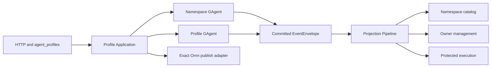

# Agent Profile Phase 1 Implementation Plan

> **For agentic workers:** REQUIRED SUB-SKILL: Use
> `superpowers:subagent-driven-development` (recommended when repository policy
> permits delegation) or `superpowers:executing-plans` to implement this plan
> task-by-task. Steps use checkbox (`- [ ]`) syntax for tracking.

**Goal:** Add the actor-owned Agent Profile authority and owner-management
surface, including exact Ornn skill sealing, three current-state read models,
HTTP and agent-tool management, and reusable system Profile bootstrap, without
changing any live conversation or channel runtime behavior.

**Architecture:** `AgentProfileNamespaceGAgent` is the namespace/catalog
authority and provisions opaque Profile identities through an eventized
continuation with `AgentProfileGAgent`, which owns draft and published state.
Both actors publish committed state into the existing Projection Pipeline;
one namespace document and two Profile documents serve catalog, owner
management, and protected execution consumers. Application services resolve
read models and perform exact Ornn preflight outside Actor turns, while Host and
agent tools remain protocol adapters over the same command/query contracts.

**Tech Stack:** .NET 10, C#, Protobuf, Aevatar GAgent/Event Sourcing,
Aevatar CQRS Projection Pipeline, ASP.NET Core minimal APIs, xUnit,
FluentAssertions, NyxID-proxied Ornn REST.

## Global Constraints

- Phase 1 adds no Profile field to Chat, WebSocket, NyxID, conversation, member,
  or channel contracts and does not change `workflow: "studio"` or
  `default_skill_name`; those migrations belong to Phases 2-4.
- Human references are exactly two fields rendered as
  `ownerHandle/profileSlug`; each segment is 1-63 lowercase ASCII letters,
  digits, or single hyphens, and `system` is reserved.
- `profileId` and Actor addresses are opaque identities. No caller derives,
  parses, authorizes, or routes from a handle, slug, prefix, or string equality.
- A user Profile carries a typed NyxID subject plus a separate required
  `owningScopeId`; a system Profile carries typed platform authority and no
  scope.
- The only accepted skill dependency is `ExactOrnnSkillReference` with a
  canonical lower-case GUID, literal `<major>.<minor>` version, expected
  canonical name, and expected stable publisher id. Reject names, `latest`,
  ranges, patch versions, inline bodies, and generic bags.
- `operationId` is the stable semantic idempotency identity. Every dispatch
  attempt receives its own `commandId`; `correlationId` remains tracing
  identity and must not be reused as the target Actor or Profile identity.
- Mutating HTTP operations return `202 Accepted` only after inbox admission.
  They never claim Actor handling, event commit, publication, or read-model
  visibility.
- Actors perform no Ornn/network IO and write no document/index store. Queries
  read read models only and never prime, activate, replay, or synchronously
  repair a projection.
- Profile creation is `Namespace -> Profile initialize -> Namespace
  continuation`; no Application service waits synchronously for the Profile
  Actor and no service-level dictionary coordinates provisioning.
- All durable commands, events, state, sealed skills, and read models are
  Protobuf. External JSON exists only in HTTP/tool/Ornn adapters.
- Normalize authored text to Unicode NFC and LF, sort bindings by `bindingId`,
  and sort/deduplicate tool names, tool-set refs, declared dependencies, and
  named assets with `StringComparer.Ordinal` before hashing Protobuf bytes with
  SHA-256.
- `purpose` and `displayName` are catalog/display facts, never prompt layers.
  They participate in the draft/source digest but are cleared when computing
  the execution snapshot digest.
- Default publish limits are: 256 UTF-8 bytes for display name, 4,096 for
  purpose, 128 for one binding/tool/tool-set identifier, 64 for expected Ornn
  name, 256 for publisher id, 32 bindings, 128 explicit tool names, 32 tool-set
  refs, 32,768 UTF-8 bytes of Profile instructions, a 65,536-byte aggregate
  prompt limit and 65,536-token model-independent upper bound computed
  conservatively as one token per UTF-8 byte, 262,144 UTF-8 bytes per text asset,
  1,048,576 serialized bytes per sealed skill, 4,194,304 serialized bytes per
  published snapshot, 64 diagnostics, and 512 UTF-8 bytes per diagnostic
  message.
- Published sealed payloads contain no bearer, access token, API key, cookie,
  credential, raw remote error, arbitrary JSON, or untyped `Metadata` bag.
- Test identities remain visibly distinct: `prof-alpha`, `bind-beta`,
  `2d05bf2e-88ee-4f76-9998-728ba2f9db10`, `scope-gamma`, and `reg-delta` never
  alias one another.
- Any changed or new test batch must run
  `bash tools/ci/test_stability_guards.sh`; current-state/query changes must also
  run the repository projection state-version, state-mirror, route-mapping, and
  query-priming guards.

---

## File Map

The following ownership map is normative for the implementation. Generated
Protobuf `.cs` files are build output and are never edited or committed.

| Responsibility | Files |
|---|---|
| Stable Profile semantics, commands, events, ports, request/result DTOs, normalization and digests | `src/platform/Aevatar.GAgentService.Abstractions/AgentProfiles/`, `src/platform/Aevatar.GAgentService.Abstractions/Protos/AgentProfiles/agent_profiles.proto` |
| Authoritative namespace/Profile state machines | `src/platform/Aevatar.GAgentService.Core/AgentProfiles/` |
| Actor creation and accepted-only envelope dispatch | `src/platform/Aevatar.GAgentService.Infrastructure/AgentProfiles/` |
| Exact Ornn GUID/version adapter and package normalization | `src/Aevatar.AI.ToolProviders.Ornn/AgentProfiles/` |
| Draft validation, publish sealing, command/query application services | `src/platform/Aevatar.GAgentService.Application/AgentProfiles/` |
| Namespace, owner-management, and protected-execution projections | `src/platform/Aevatar.GAgentService.Projection/AgentProfiles/` plus existing Projection registration files |
| HTTP/auth/ETag mapping and system Profile bootstrap | `src/platform/Aevatar.GAgentService.Hosting/AgentProfiles/` |
| Model-facing owner management tool | `src/Aevatar.AI.ToolProviders.AgentCatalog/AgentProfiles/` |
| Aevatar/Ornn management playbook source | `skills/aevatar-agent-profile-management/SKILL.md` |
| Canonical architecture and phase boundary | `docs/canon/agent-profiles.md`, `docs/canon/module-placement-map.md` |

### Task 1: Stable Profile Contracts And Deterministic Identity

**Files:**

- Create: `src/platform/Aevatar.GAgentService.Abstractions/Protos/AgentProfiles/agent_profiles.proto`
- Create: `src/platform/Aevatar.GAgentService.Abstractions/AgentProfiles/AgentProfileContracts.cs`
- Create: `src/platform/Aevatar.GAgentService.Abstractions/AgentProfiles/AgentProfilePolicies.cs`
- Create: `src/platform/Aevatar.GAgentService.Abstractions/AgentProfiles/AgentProfileDeterminism.cs`
- Create: `src/platform/Aevatar.GAgentService.Abstractions/AgentProfiles/IAgentProfileApplicationServices.cs`
- Create: `src/platform/Aevatar.GAgentService.Abstractions/Ports/IAgentProfileActorPort.cs`
- Create: `src/platform/Aevatar.GAgentService.Abstractions/Ports/IAgentProfileQueryPorts.cs`
- Create: `src/platform/Aevatar.GAgentService.Abstractions/Ports/IExactOrnnSkillResolver.cs`
- Modify: `src/platform/Aevatar.GAgentService.Abstractions/Aevatar.GAgentService.Abstractions.csproj`
- Test: `test/Aevatar.GAgentService.Tests/Abstractions/AgentProfileContractsTests.cs`

**Interfaces:**

- Produces `AgentProfileReference`, `AgentProfileOwnerIdentity`,
  `AgentProfileContent`, `ExactOrnnSkillReference`,
  `SealedAgentProfileSkill`, and `AgentProfilePublishedSnapshot` Protobuf types.
- Produces `IAgentProfileCommandService`, `IAgentProfileQueryService`,
  `IAgentProfileActorPort`, `IAgentProfileNamespaceQueryPort`,
  `IAgentProfileManagementQueryPort`,
  `IAgentProfileExecutionSnapshotQueryPort`, and
  `IExactOrnnSkillResolver` signatures consumed by every following task.
- Produces `AgentProfileDeterminism.Normalize*`, `Compute*Sha256`,
  `CreateOperationId`, and `CreateProfileId`; no later task defines another
  canonicalization or identity algorithm.

- [ ] **Step 1: Add failing contract and deterministic-hash tests**

Write tests that prove:

1. `eanzhao/xiaomi-home-assistant` and `system/studio` are valid, while uppercase,
   repeated hyphens, `.`, `..`, embedded slash, 64-character segments, and an
   ordinary claim on `system` fail with stable validation codes.
2. `1.4` is a valid literal version while `latest`, `v1.4`, `1`, `1.4.0`,
   `1.x`, and `01.4` fail.
3. Reordered tool names/assets and CRLF versus LF normalize to identical digest
   bytes; different expected publisher ids produce different bytes. Changing
   purpose changes the draft digest but not the execution snapshot digest.
4. The same create idempotency key/owner/scope produces the same `operationId`
   and `profileId`; a different owner or key changes both; a new dispatch always
   receives a different `commandId`.
5. Reflection finds no field named `Metadata`, `Headers`, `Items`,
   `AccessToken`, `Bearer`, `ApiKey`, `Cookie`, or `Credential` on sealed or
   published Protobuf messages.

The core assertions should read as follows:

```csharp
AgentProfilePolicies.ValidateReference(new AgentProfileReference
{
    OwnerHandle = "eanzhao",
    ProfileSlug = "xiaomi-home-assistant",
}).Should().BeEmpty();

AgentProfilePolicies.ValidateExactSkillReference(new ExactOrnnSkillReference
{
    SkillGuid = "2d05bf2e-88ee-4f76-9998-728ba2f9db10",
    LiteralVersion = "1.4.0",
    ExpectedName = "xiaomi-home-control",
    ExpectedPublisherId = "publisher-alpha",
}).Should().ContainSingle(x => x.Code == "INVALID_LITERAL_VERSION");
```

- [ ] **Step 2: Run the contract tests and verify RED**

```bash
dotnet test test/Aevatar.GAgentService.Tests/Aevatar.GAgentService.Tests.csproj --nologo --no-restore --filter "FullyQualifiedName~AgentProfileContractsTests"
```

Expected: compilation fails because the Profile Protobuf and policy helpers do
not exist.

- [ ] **Step 3: Define the Protobuf semantic surface**

Add the Protobuf include with `ProtoRoot="Protos"`. Use the following message
shape and allocate monotonically increasing field numbers; do not use maps in
digest-bearing messages:

```proto
message AgentProfileReference {
  string owner_handle = 1;
  string profile_slug = 2;
}

message AgentProfileUserOwnerIdentity {
  string identity_provider = 1; // canonical value: nyxid
  string subject_id = 2;
}

message AgentProfileSystemOwnerIdentity {
  string platform_id = 1; // canonical value: aevatar
}

message AgentProfileOwnerIdentity {
  oneof owner {
    AgentProfileUserOwnerIdentity user = 1;
    AgentProfileSystemOwnerIdentity system = 2;
  }
}

enum AgentProfileSkillActivationMode {
  AGENT_PROFILE_SKILL_ACTIVATION_MODE_UNSPECIFIED = 0;
  AGENT_PROFILE_SKILL_ACTIVATION_MODE_ALWAYS = 1;
  AGENT_PROFILE_SKILL_ACTIVATION_MODE_ROUTED = 2;
  AGENT_PROFILE_SKILL_ACTIVATION_MODE_DEFAULT_FOR_UNMATCHED_TURN = 3;
}

message ExactOrnnSkillReference {
  string skill_guid = 1;
  string literal_version = 2;
  string expected_name = 3;
  string expected_publisher_id = 4;
}

message AgentProfileSkillBinding {
  string binding_id = 1;
  AgentProfileSkillActivationMode activation_mode = 2;
  ExactOrnnSkillReference skill = 3;
}

enum AgentProfileToolPolicyMode {
  AGENT_PROFILE_TOOL_POLICY_MODE_UNSPECIFIED = 0;
  AGENT_PROFILE_TOOL_POLICY_MODE_INHERIT_ROUTE_MAXIMUM = 1;
  AGENT_PROFILE_TOOL_POLICY_MODE_EXPLICIT_ALLOWLIST = 2;
}

message AgentProfileToolPolicy {
  AgentProfileToolPolicyMode mode = 1;
  repeated string tool_names = 2;
  repeated string tool_set_refs = 3;
}

message AgentProfileContent {
  string display_name = 1;
  string purpose = 2;
  string instructions = 3;
  repeated AgentProfileSkillBinding skill_bindings = 4;
  AgentProfileToolPolicy tool_policy = 5;
}
```

Add typed named-text, workflow, script, resolved-package, sealed-skill, sealed
binding, Profile identity, published snapshot, safe diagnostic, operation fact,
mutation outcome, command, continuation, and domain-event messages. The exact
sealed core is:

```proto
message AgentProfileNamedTextAsset {
  string path = 1;
  string content = 2;
}

message ResolvedOrnnSkillPackage {
  string skill_guid = 1;
  string literal_version = 2;
  string canonical_name = 3;
  string publisher_id = 4;
  string upstream_skill_hash = 5;
  string description = 6;
  string instructions = 7;
  string arguments = 8;
  string when_to_use = 9;
  bool model_invocable = 10;
  bool user_invocable = 11;
  repeated string declared_tool_names = 12;
  repeated AgentProfileWorkflowAsset workflows = 13;
  repeated AgentProfileScriptAsset scripts = 14;
  repeated AgentProfileNamedTextAsset references = 15;
  repeated AgentProfileNamedTextAsset assets = 16;
}

message SealedAgentProfileSkill {
  ExactOrnnSkillReference exact_reference = 1;
  ResolvedOrnnSkillPackage package = 2;
  bytes content_sha256 = 3;
}

message AgentProfilePublishedSnapshot {
  AgentProfileIdentity identity = 1;
  string display_name = 2;
  string purpose = 3;
  string instructions = 4;
  AgentProfileToolPolicy tool_policy = 5;
  repeated SealedAgentProfileSkillBinding skill_bindings = 6;
  int64 published_revision = 7;
  bytes source_draft_sha256 = 8;
  bytes snapshot_sha256 = 9;
}
```

Commands must include `AgentProfileOperationFact` with separate
`operation_id/input_sha256/command_id/correlation_id`, typed owner identity,
expected authoritative version where required, and exact payload fields. Define
these distinct protocol messages rather than a generic command bag:

```text
CreateAgentProfileCommand
InitializeAgentProfileCommand
AgentProfileInitializedContinuation
AgentProfileInitializationRejectedContinuation
UpdateAgentProfileDraftCommand
UpsertAgentProfileSkillBindingCommand
RemoveAgentProfileSkillBindingCommand
PublishAgentProfileCommand
ObserveAgentProfilePublishedSummaryCommand

AgentProfileProvisioningStartedEvent
AgentProfileProvisioningCompletedEvent
AgentProfileProvisioningFailedEvent
AgentProfilePublishedSummaryObservedEvent
AgentProfileInitializedEvent
AgentProfileDraftUpdatedEvent
AgentProfileSkillBindingUpsertedEvent
AgentProfileSkillBindingRemovedEvent
AgentProfilePublishedEvent
AgentProfilePublishNoChangeEvent
AgentProfileMutationNoChangeEvent
AgentProfileMutationRejectedEvent
```

- [ ] **Step 4: Add the exact C# application and port contracts**

Use these signatures verbatim so HTTP and agent tools share the same surface:

```csharp
public sealed record AgentProfileCallerContext(
    AgentProfileUserOwnerIdentity Owner,
    string ScopeId,
    string? Username,
    string? NyxIdAccessToken);

public sealed record AgentProfileAcceptedReceipt(
    bool Accepted,
    string AckStage,
    string OperationId,
    string CommandId,
    string CorrelationId,
    string ActorId,
    string ProfileId,
    string ResourceUrl);

public interface IAgentProfileCommandService
{
    Task<AgentProfileAcceptedReceipt> CreateAsync(
        AgentProfileCallerContext caller,
        CreateAgentProfileRequest request,
        string idempotencyKey,
        CancellationToken ct = default);

    Task<AgentProfileAcceptedReceipt> UpdateDraftAsync(
        AgentProfileCallerContext caller,
        string profileSlug,
        long expectedAuthorityStateVersion,
        UpdateAgentProfileDraftRequest request,
        string? idempotencyKey,
        CancellationToken ct = default);

    Task<AgentProfileAcceptedReceipt> UpsertSkillBindingAsync(
        AgentProfileCallerContext caller,
        string profileSlug,
        string bindingId,
        long expectedAuthorityStateVersion,
        UpsertAgentProfileSkillBindingRequest request,
        string? idempotencyKey,
        CancellationToken ct = default);

    Task<AgentProfileAcceptedReceipt> RemoveSkillBindingAsync(
        AgentProfileCallerContext caller,
        string profileSlug,
        string bindingId,
        long expectedAuthorityStateVersion,
        string? idempotencyKey,
        CancellationToken ct = default);

    Task<AgentProfileValidationReport> ValidateAsync(
        AgentProfileCallerContext caller,
        string profileSlug,
        CancellationToken ct = default);

    Task<AgentProfileAcceptedReceipt> PublishAsync(
        AgentProfileCallerContext caller,
        string profileSlug,
        long expectedAuthorityStateVersion,
        string? idempotencyKey,
        CancellationToken ct = default);
}

public interface IAgentProfileQueryService
{
    Task<AgentProfileManagementSnapshot?> GetOwnedAsync(
        AgentProfileCallerContext caller,
        string profileSlug,
        CancellationToken ct = default);

    Task<AgentProfileDiscoverySnapshot?> ResolveVisibleAsync(
        AgentProfileCallerContext caller,
        AgentProfileReference reference,
        CancellationToken ct = default);
}
```

`IAgentProfileActorPort` exposes one exact method per command and returns
`DispatchAdmission`. Query ports return clone-safe records, not generated
projection document types. `IExactOrnnSkillResolver.ResolveAsync` takes only a
caller bearer plus `ExactOrnnSkillReference` and returns either a cloned
`ResolvedOrnnSkillPackage` or a bounded typed failure:

```csharp
public interface IExactOrnnSkillResolver
{
    Task<ExactOrnnSkillResolutionResult> ResolveAsync(
        string nyxIdAccessToken,
        ExactOrnnSkillReference reference,
        CancellationToken ct = default);
}
```

- [ ] **Step 5: Implement normalization, digest, and id factories**

Implement a single normalizer that validates before transforming, normalizes
NFC/LF, sorts repeated fields, and computes lowercase SHA-256 or `ByteString`
digests over clones whose digest field is cleared. Use domain-separated length
prefixes for opaque ids. `input_sha256` covers operation kind, typed target, and
normalized semantic payload; it excludes ETag/expected version,
operation/command/correlation ids, timestamps, and bearer credentials, so a
transport retry of the same payload remains the same semantic operation:

```csharp
private static byte[] HashIdentity(string domain, params string[] values)
{
    using var hash = IncrementalHash.CreateHash(HashAlgorithmName.SHA256);
    Append(hash, domain);
    foreach (var value in values)
        Append(hash, value);
    return hash.GetHashAndReset();
}

public static string CreateProfileId(
    AgentProfileUserOwnerIdentity owner,
    string scopeId,
    string idempotencyKey) =>
    $"prof_{Base64Url(HashIdentity(
        "aevatar.agent-profile.profile-id.v1",
        owner.IdentityProvider,
        owner.SubjectId,
        scopeId,
        idempotencyKey).AsSpan(0, 18))}";
```

Do not silently lowercase invalid handles, slugs, GUIDs, names, publishers, or
versions. Reject first; trim only boundary whitespace where the field contract
permits it.

- [ ] **Step 6: Run tests and verify GREEN**

```bash
dotnet test test/Aevatar.GAgentService.Tests/Aevatar.GAgentService.Tests.csproj --nologo --no-restore --filter "FullyQualifiedName~AgentProfileContractsTests"
bash tools/ci/test_stability_guards.sh
```

- [ ] **Step 7: Commit Task 1**

```bash
git add \
  src/platform/Aevatar.GAgentService.Abstractions/Protos/AgentProfiles/agent_profiles.proto \
  src/platform/Aevatar.GAgentService.Abstractions/AgentProfiles/AgentProfileContracts.cs \
  src/platform/Aevatar.GAgentService.Abstractions/AgentProfiles/AgentProfilePolicies.cs \
  src/platform/Aevatar.GAgentService.Abstractions/AgentProfiles/AgentProfileDeterminism.cs \
  src/platform/Aevatar.GAgentService.Abstractions/AgentProfiles/IAgentProfileApplicationServices.cs \
  src/platform/Aevatar.GAgentService.Abstractions/Ports/IAgentProfileActorPort.cs \
  src/platform/Aevatar.GAgentService.Abstractions/Ports/IAgentProfileQueryPorts.cs \
  src/platform/Aevatar.GAgentService.Abstractions/Ports/IExactOrnnSkillResolver.cs \
  src/platform/Aevatar.GAgentService.Abstractions/Aevatar.GAgentService.Abstractions.csproj \
  test/Aevatar.GAgentService.Tests/Abstractions/AgentProfileContractsTests.cs
git commit -m "Add typed agent profile contracts"
```

### Task 2: Exact Ornn Resolution And Server Sealing

**Files:**

- Create: `src/Aevatar.AI.ToolProviders.Ornn/AgentProfiles/OrnnExactAgentProfileSkillResolver.cs`
- Create: `src/Aevatar.AI.ToolProviders.Ornn/AgentProfiles/OrnnAgentProfileSkillPackageMapper.cs`
- Create: `src/platform/Aevatar.GAgentService.Application/AgentProfiles/AgentProfileSkillSealer.cs`
- Create: `src/platform/Aevatar.GAgentService.Application/AgentProfiles/AgentProfileValidationLimits.cs`
- Modify: `src/Aevatar.AI.ToolProviders.Ornn/OrnnSkillClient.cs`
- Modify: `src/Aevatar.AI.ToolProviders.Ornn/ServiceCollectionExtensions.cs`
- Modify: `src/Aevatar.AI.ToolProviders.Ornn/Aevatar.AI.ToolProviders.Ornn.csproj`
- Test: `test/Aevatar.AI.ToolProviders.Ornn.Tests/OrnnExactAgentProfileSkillResolverTests.cs`
- Test: `test/Aevatar.GAgentService.Tests/Application/AgentProfileSkillSealerTests.cs`

**Interfaces:**

- Consumes `IExactOrnnSkillResolver`, `ResolvedOrnnSkillPackage`,
  `SealedAgentProfileSkill`, and deterministic helpers from Task 1.
- Produces this exact method, which Task 6 and system bootstrap use for validate
  and publish:

  ```csharp
  Task<AgentProfileSealingResult> ResolveAndSealAsync(
      AgentProfileIdentity identity,
      AgentProfileContent content,
      string? nyxIdAccessToken,
      CancellationToken ct = default);
  ```

  The token may be null only when `content.SkillBindings` is empty; it is never
  copied into the result.
- The Ornn provider is the only production implementation of
  `IExactOrnnSkillResolver`; runtime projects never reference it.

- [ ] **Step 1: Restore exact endpoint tests as failing Profile tests**

Port the useful cases from historical commit `a39e6b345`, but target the new
Profile resolver and add package/policy coverage. Assert exactly these two URLs
and no fallback request:

```text
/api/v1/skills/2d05bf2e-88ee-4f76-9998-728ba2f9db10?version=1.4
/api/v1/skills/2d05bf2e-88ee-4f76-9998-728ba2f9db10/json?version=1.4
```

Cover canonical GUID/version rejection before HTTP, missing bearer, 403, 404,
timeout, invalid JSON, null data, detail GUID mismatch, JSON version mismatch,
detail/JSON/expected name mismatch, expected publisher mismatch, missing
`skillHash`, duplicate/missing `SKILL.md`, unsafe paths, invalid workflow YAML,
invalid scripts, caller cancellation, stable asset ordering, and raw-error
redaction. Verify the resolver never calls the existing name-capable
`GetSkillJsonAsync` or `IRemoteSkillFetcher`.

Add sealer tests for exact-reference preservation, stable SHA-256,
acceptance of each specified activation mode, rejection of UNSPECIFIED,
`DEFAULT_FOR_UNMATCHED_TURN` duplication, preservation of ROUTED descriptor and
`whenToUse` facts, explicit allowlist dependency failure, unknown tool-set ref,
every numeric limit in Global Constraints, and proof that the input package
remains unmodified. `ALWAYS` is sealed as instructions/descriptors only; no
publish-side code invokes its workflow, script, or tool effects.

- [ ] **Step 2: Run focused tests and verify RED**

```bash
dotnet test test/Aevatar.AI.ToolProviders.Ornn.Tests/Aevatar.AI.ToolProviders.Ornn.Tests.csproj --nologo --no-restore --filter "FullyQualifiedName~OrnnExactAgentProfileSkillResolverTests"
dotnet test test/Aevatar.GAgentService.Tests/Aevatar.GAgentService.Tests.csproj --nologo --no-restore --filter "FullyQualifiedName~AgentProfileSkillSealerTests"
```

- [ ] **Step 3: Add exact reads without changing name-based legacy reads**

Add internal exact result DTOs and these client methods. Use the existing
NyxID proxy, per-call timeout, and safe error unwrapping. Inject `TimeProvider`
so timeout tests advance virtual time without sleeping:

```csharp
internal Task<OrnnExactSkillReadResult<OrnnExactSkillDetail>>
    GetExactSkillDetailAsync(
        string accessToken,
        string guid,
        string literalVersion,
        CancellationToken ct = default) =>
    GetExactAsync<OrnnExactSkillDetail>(
        accessToken,
        $"/api/v1/skills/{Uri.EscapeDataString(guid)}?version={Uri.EscapeDataString(literalVersion)}",
        guid,
        ct);

internal Task<OrnnExactSkillReadResult<OrnnSkillJson>>
    GetExactSkillJsonAsync(
        string accessToken,
        string guid,
        string literalVersion,
        CancellationToken ct = default) =>
    GetExactAsync<OrnnSkillJson>(
        accessToken,
        $"/api/v1/skills/{Uri.EscapeDataString(guid)}/json?version={Uri.EscapeDataString(literalVersion)}",
        guid,
        ct);
```

Add `Version` to `OrnnSkillJson` and `Guid/Name/SkillHash/CreatedBy` to
`OrnnExactSkillDetail`. Preserve existing `GetSkillJsonAsync(nameOrId)` behavior
for non-Profile callers; exact Profile code must not call it.

- [ ] **Step 4: Map external JSON immediately into a typed package**

The resolver verifies the requested, detail, and JSON identities before mapping.
Parse the leading YAML frontmatter with YamlDotNet into a typed private DTO;
never split array-valued `tool-list`, runtime, or asset fields by hand. Then use
`SkillFrontmatterParser`, `SkillWorkflowExtractor`, `SkillScriptExtractor`,
`OrnnSkillAssetPathPolicy`, and `OrnnSkillPublishValidationPipeline`; reconstruct
an `OrnnSkillPublishRequest` so registered Workflow and Script validators run on
the fetched assets. Add the centrally-versioned `YamlDotNet` package reference
to the Ornn project. Return only stable diagnostics such as
`ORNN_SKILL_NOT_FOUND`, `ORNN_SKILL_IDENTITY_MISMATCH`,
`ORNN_SKILL_PUBLISHER_MISMATCH`, `INVALID_SKILL_PACKAGE`, and
`ORNN_DEPENDENCY_UNAVAILABLE`.

The mapper output must be a fully normalized `ResolvedOrnnSkillPackage`:

```csharp
return ExactOrnnSkillResolutionResult.Success(new ResolvedOrnnSkillPackage
{
    SkillGuid = detail.Guid,
    LiteralVersion = json.Version,
    CanonicalName = detail.Name,
    PublisherId = detail.CreatedBy,
    UpstreamSkillHash = detail.SkillHash,
    Description = parsed.Description ?? json.Description ?? string.Empty,
    Instructions = parsed.Body,
    Arguments = parsed.Arguments ?? string.Empty,
    WhenToUse = parsed.WhenToUse ?? string.Empty,
    ModelInvocable = parsed.IsModelInvocable,
    UserInvocable = parsed.IsUserInvocable,
    // repeated typed fields are appended in ordinal path/name order
});
```

Do not put the external `files` dictionary or raw JSON in the result. Convert
each retained file into a typed named asset and reject duplicate normalized
paths. Collapse validator/remote details to stable code plus a normalized asset
path; do not return compiler source excerpts or upstream text.

- [ ] **Step 5: Seal Profile skills and the complete snapshot**

`AgentProfileSkillSealer` resolves bindings sequentially in normalized
`bindingId` order, bounds diagnostics, checks the Profile tool policy, and
computes each content hash after clearing `ContentSha256`. For
`EXPLICIT_ALLOWLIST`, every declared dependency must occur in normalized
`tool_names`; `tool_set_refs` are additionally validated as registered refs but
do not excuse an unlisted declared dependency. For
`INHERIT_ROUTE_MAXIMUM`, record dependencies without claiming route
availability.

Build the snapshot candidate with revision `0`; the Actor assigns the next
published revision. Compute execution snapshot SHA-256 with revision, digest,
source draft digest, display name, and purpose cleared. The last two fields are
published discovery facts but are not execution behavior:

```csharp
var canonical = snapshot.Clone();
canonical.PublishedRevision = 0;
canonical.SnapshotSha256 = ByteString.Empty;
canonical.SourceDraftSha256 = ByteString.Empty;
canonical.DisplayName = string.Empty;
canonical.Purpose = string.Empty;
snapshot.SnapshotSha256 = AgentProfileDeterminism.Sha256(canonical);
```

- [ ] **Step 6: Register the exact provider and verify GREEN**

Add the GAgentService Abstractions project reference to the Ornn project and
register the resolver with `Replace`, so a host that enables Ornn replaces the
typed unavailable fallback regardless of registration order:

```csharp
services.Replace(ServiceDescriptor.Singleton<
    IExactOrnnSkillResolver,
    OrnnExactAgentProfileSkillResolver>());
```

Run:

```bash
dotnet test test/Aevatar.AI.ToolProviders.Ornn.Tests/Aevatar.AI.ToolProviders.Ornn.Tests.csproj --nologo --no-restore --filter "FullyQualifiedName~OrnnExactAgentProfileSkillResolverTests"
dotnet test test/Aevatar.GAgentService.Tests/Aevatar.GAgentService.Tests.csproj --nologo --no-restore --filter "FullyQualifiedName~AgentProfileSkillSealerTests"
bash tools/ci/test_stability_guards.sh
```

- [ ] **Step 7: Commit Task 2**

```bash
git add \
  src/Aevatar.AI.ToolProviders.Ornn/AgentProfiles/OrnnExactAgentProfileSkillResolver.cs \
  src/Aevatar.AI.ToolProviders.Ornn/AgentProfiles/OrnnAgentProfileSkillPackageMapper.cs \
  src/platform/Aevatar.GAgentService.Application/AgentProfiles/AgentProfileSkillSealer.cs \
  src/platform/Aevatar.GAgentService.Application/AgentProfiles/AgentProfileValidationLimits.cs \
  src/Aevatar.AI.ToolProviders.Ornn/OrnnSkillClient.cs \
  src/Aevatar.AI.ToolProviders.Ornn/ServiceCollectionExtensions.cs \
  src/Aevatar.AI.ToolProviders.Ornn/Aevatar.AI.ToolProviders.Ornn.csproj \
  test/Aevatar.AI.ToolProviders.Ornn.Tests/OrnnExactAgentProfileSkillResolverTests.cs \
  test/Aevatar.GAgentService.Tests/Application/AgentProfileSkillSealerTests.cs
git commit -m "Seal exact Ornn profile skills"
```

### Task 3: Namespace And Profile Authority Actors

**Files:**

- Create: `src/platform/Aevatar.GAgentService.Core/AgentProfiles/agent_profile_state.proto`
- Create: `src/platform/Aevatar.GAgentService.Core/AgentProfiles/AgentProfileActorIds.cs`
- Create: `src/platform/Aevatar.GAgentService.Core/AgentProfiles/AgentProfileNamespaceGAgent.cs`
- Create: `src/platform/Aevatar.GAgentService.Core/AgentProfiles/AgentProfileGAgent.cs`
- Create: `src/platform/Aevatar.GAgentService.Core/AgentProfiles/AgentProfileActorInvariants.cs`
- Modify: `src/platform/Aevatar.GAgentService.Core/Aevatar.GAgentService.Core.csproj`
- Test: `test/Aevatar.GAgentService.Tests/Core/AgentProfileNamespaceGAgentTests.cs`
- Test: `test/Aevatar.GAgentService.Tests/Core/AgentProfileGAgentTests.cs`
- Modify: `test/Aevatar.GAgentService.Tests/TestSupport/GAgentServiceTestKit.cs`

**Interfaces:**

- Consumes Task 1 commands/events/deterministic helpers.
- Produces two `[GAgent]` authority types and committed state roots consumed by
  Task 5 projectors.
- Emits initialization and published-summary continuation messages through
  `SendToAsync`; it never calls `IActorRuntime`, Ornn, or a query/read-model port.

- [ ] **Step 1: Write failing Actor invariant tests**

For `AgentProfileNamespaceGAgent`, cover first handle claim, same-owner handle
reuse, same-owner attempt to switch the committed handle, cross-owner
`OWNER_HANDLE_CONFLICT`, same user's handle reuse across distinct scopes,
global duplicate human reference/slug
`PROFILE_SLUG_TAKEN`, reserved-system rejection, deterministic operation replay,
payload drift, `PROVISIONING -> ACTIVE`, failed provisioning, same-key retry,
unknown/mismatched continuation rejection, and published-summary updates only
for the mapped Profile. Replaying the exact same published-summary continuation
must emit no new event, advance no state version, and therefore create no second
audit fact; a stale summary cannot replace a newer revision.

For `AgentProfileGAgent`, cover immutable profile/owner/scope/reference,
idempotent initialization, draft/content separation, draft revisions and
digests, expected-version rejection, operation replay and payload drift,
binding order, identical mutation no-change, missing-binding removal rejection,
publish source-draft race, sealed/snapshot digest verification, exact binding
match, at-most-one default, first publish revision `1`, unchanged publish
no-change only when both source-draft and sealed-snapshot digests match the
current publication, revision increment when either digest changes, and
catalog-summary send after publish or idempotent replay.

Use separate operation/command/correlation values in every fixture:

```csharp
new AgentProfileOperationFact
{
    OperationId = "op-alpha",
    CommandId = "cmd-beta",
    CorrelationId = "corr-gamma",
    InputSha256 = ByteString.CopyFrom(
        Enumerable.Repeat((byte)0x11, 32).ToArray()),
};
```

- [ ] **Step 2: Run Actor tests and verify RED**

```bash
dotnet test test/Aevatar.GAgentService.Tests/Aevatar.GAgentService.Tests.csproj --nologo --no-restore --filter "FullyQualifiedName~AgentProfileNamespaceGAgentTests|FullyQualifiedName~AgentProfileGAgentTests"
```

- [ ] **Step 3: Define durable state without transport or read-model fields**

The namespace state contains typed handle claims, Profile entries, provisioning
status, safe published summaries, and operation records. The Profile state
contains immutable identity, namespace callback Actor id, current draft,
revisions/digests, current published snapshot, last mutation outcome, and
operation records:

```proto
message AgentProfileState {
  aevatar.gagentservice.agentprofiles.AgentProfileIdentity identity = 1;
  string namespace_actor_id = 2;
  aevatar.gagentservice.agentprofiles.AgentProfileContent draft = 3;
  int64 draft_revision = 4;
  bytes draft_sha256 = 5;
  aevatar.gagentservice.agentprofiles.AgentProfilePublishedSnapshot published = 6;
  int64 published_revision = 7;
  aevatar.gagentservice.agentprofiles.AgentProfileMutationOutcome last_mutation = 8;
  repeated AgentProfileOperationState operations = 9;
}
```

Do not persist access tokens, ETags, HTTP status, JSON, projection timestamps,
or a second local state-version counter. Authoritative version is the event
store version exposed by `CurrentStateVersion()` and the committed-state
envelope.

Phase 1 uses one Namespace Actor to serialize globally unique owner-handle and
`ownerHandle/profileSlug` claims. Only create/provisioning and safe published
summary traffic reaches it; all ordinary draft/publish mutations stay on
per-Profile actors. Any measured partitioning need remains behind the namespace
ports and cannot change the human reference or authority contract.

- [ ] **Step 4: Implement namespace provisioning as a continuation protocol**

On create, validate identity and operation, persist
`AgentProfileProvisioningStartedEvent`, then send
`InitializeAgentProfileCommand` to the supplied opaque Profile Actor address and
end the turn. The Profile Actor commits initialization and sends exactly one
typed initialized/rejected continuation back. Namespace commits ACTIVE or the
stable failure. A same-operation replay in PROVISIONING/FAILED resends
initialization; ACTIVE is a no-op. An exact replay of a published-summary
continuation is also a no-op with no committed event; this is what makes the
Profile Actor's healing resend audit-idempotent. No method waits for a reply.

Use `StateTransitionMatcher` and clone every Protobuf value. Keep mutation only
inside event transitions.

- [ ] **Step 5: Implement Profile mutations and publish checks**

Every handler follows this order:

```text
validate command shape and immutable identity
check existing operation id and input digest
check expected authoritative state version
recompute normalized draft/sealed/snapshot digests
persist one committed success/no-change/rejection event
send any continuation after commit
```

Check idempotency before expected version so an identical retry is harmless.
Persist a typed rejection outcome for a new stale or conflicting operation; do
not throw exception text into state. On successful/no-change publish, send a
safe `ObserveAgentProfilePublishedSummaryCommand` carrying reference, display
name, purpose, revision, and digest to the namespace Actor. An idempotent replay
resends that summary so a previously interrupted continuation heals. A publish
is no-change only when both the normalized `source_draft_sha256` and the sealed
execution `snapshot_sha256` equal the current publication. If either differs,
commit a new published revision even when the other digest is unchanged.

- [ ] **Step 6: Run Actor tests and verify GREEN**

```bash
dotnet test test/Aevatar.GAgentService.Tests/Aevatar.GAgentService.Tests.csproj --nologo --no-restore --filter "FullyQualifiedName~AgentProfileNamespaceGAgentTests|FullyQualifiedName~AgentProfileGAgentTests"
bash tools/ci/test_stability_guards.sh
```

- [ ] **Step 7: Commit Task 3**

```bash
git add \
  src/platform/Aevatar.GAgentService.Core/AgentProfiles/agent_profile_state.proto \
  src/platform/Aevatar.GAgentService.Core/AgentProfiles/AgentProfileActorIds.cs \
  src/platform/Aevatar.GAgentService.Core/AgentProfiles/AgentProfileNamespaceGAgent.cs \
  src/platform/Aevatar.GAgentService.Core/AgentProfiles/AgentProfileGAgent.cs \
  src/platform/Aevatar.GAgentService.Core/AgentProfiles/AgentProfileActorInvariants.cs \
  src/platform/Aevatar.GAgentService.Core/Aevatar.GAgentService.Core.csproj \
  test/Aevatar.GAgentService.Tests/Core/AgentProfileNamespaceGAgentTests.cs \
  test/Aevatar.GAgentService.Tests/Core/AgentProfileGAgentTests.cs \
  test/Aevatar.GAgentService.Tests/TestSupport/GAgentServiceTestKit.cs
git commit -m "Add agent profile authority actors"
```

### Task 4: Runtime-Neutral Actor Dispatch Port

**Files:**

- Create: `src/platform/Aevatar.GAgentService.Infrastructure/AgentProfiles/AgentProfileActorPort.cs`
- Create: `src/platform/Aevatar.GAgentService.Infrastructure/AgentProfiles/AgentProfileEnvelopeFactory.cs`
- Test: `test/Aevatar.GAgentService.Tests/Infrastructure/AgentProfileActorPortTests.cs`

**Interfaces:**

- Consumes `IAgentProfileActorPort` and Task 3 GAgent types.
- Produces the sole Application-to-Profile dispatch adapter. Host, tools, and
  bootstrap never inject `IActorRuntime` or `IActorDispatchPort` directly.
- Returns Foundation `DispatchAdmission`; Application maps it to the Profile
  accepted receipt without strengthening its meaning.

- [ ] **Step 1: Write failing provisioning and envelope tests**

Use recording `IActorRuntime` and `IActorDispatchPort` doubles. Assert create
ensures both the singleton namespace Actor and deterministic internal Profile
Actor address, mutations target only that Profile Actor, missing/deactivated
known actors are reactivated through runtime lifecycle, and no Actor address is
constructed outside this adapter/Core id helper.

For every dispatch assert:

```csharp
envelope.Id.Should().Be(command.Operation.CommandId);
envelope.Propagation.CorrelationId.Should()
    .Be(command.Operation.CorrelationId);
envelope.Route.TargetActorId.Should().Be(expectedActorId);
envelope.Payload.Is(command.Descriptor).Should().BeTrue();
```

Also assert a rejected `DispatchAdmission` is returned unchanged, and neither
port nor envelope factory interprets accepted as handled or committed.

- [ ] **Step 2: Run focused tests and verify RED**

```bash
dotnet test test/Aevatar.GAgentService.Tests/Aevatar.GAgentService.Tests.csproj --nologo --no-restore --filter "FullyQualifiedName~AgentProfileActorPortTests"
```

- [ ] **Step 3: Implement exact target lifecycle and dispatch methods**

`AgentProfileActorIds` owns these internal values:

```csharp
public const string Namespace = "gagent-service:agent-profile-namespace:v1";

public static string Profile(string profileId) =>
    $"gagent-service:agent-profile:{HashOpaqueAddress(profileId)}";

private static string HashOpaqueAddress(string profileId) =>
    Convert.ToHexStringLower(SHA256.HashData(
        Encoding.UTF8.GetBytes(
            $"aevatar.agent-profile.actor-address.v1\n{NormalizeRequired(profileId)}"))
        .AsSpan(0, 18));
```

Only this infrastructure adapter calls the helper on behalf of upper layers.
`EnsureCreateTargetsAsync(profileId)` creates/reactivates
`AgentProfileNamespaceGAgent` and `AgentProfileGAgent`. Each exact dispatch
method packs its corresponding command into an `EventEnvelope`:

```csharp
private static EventEnvelope CreateEnvelope(
    string targetActorId,
    AgentProfileOperationFact operation,
    IMessage command) => new()
{
    Id = operation.CommandId,
    Timestamp = Timestamp.FromDateTimeOffset(DateTimeOffset.UtcNow),
    Payload = Any.Pack(command),
    Route = EnvelopeRouteSemantics.CreateDirect(PublisherId, targetActorId),
    Propagation = new EnvelopePropagation
    {
        CorrelationId = operation.CorrelationId,
    },
};
```

Do not add stream request-reply, outcome waiting, a command-status registry, or
projection activation.

- [ ] **Step 4: Run focused tests and verify GREEN**

```bash
dotnet test test/Aevatar.GAgentService.Tests/Aevatar.GAgentService.Tests.csproj --nologo --no-restore --filter "FullyQualifiedName~AgentProfileActorPortTests"
bash tools/ci/test_stability_guards.sh
```

- [ ] **Step 5: Commit Task 4**

```bash
git add \
  src/platform/Aevatar.GAgentService.Infrastructure/AgentProfiles/AgentProfileActorPort.cs \
  src/platform/Aevatar.GAgentService.Infrastructure/AgentProfiles/AgentProfileEnvelopeFactory.cs \
  test/Aevatar.GAgentService.Tests/Infrastructure/AgentProfileActorPortTests.cs
git commit -m "Dispatch agent profile commands"
```

### Task 5: Three Current-State Read Models And Query Ports

**Files:**

- Create: `src/platform/Aevatar.GAgentService.Projection/AgentProfiles/agent_profile_read_models.proto`
- Create: `src/platform/Aevatar.GAgentService.Projection/AgentProfiles/AgentProfileReadModels.Partial.cs`
- Create: `src/platform/Aevatar.GAgentService.Projection/AgentProfiles/AgentProfileProjectionContexts.cs`
- Create: `src/platform/Aevatar.GAgentService.Projection/AgentProfiles/AgentProfileDocumentMetadataProviders.cs`
- Create: `src/platform/Aevatar.GAgentService.Projection/AgentProfiles/AgentProfileNamespaceCurrentStateProjector.cs`
- Create: `src/platform/Aevatar.GAgentService.Projection/AgentProfiles/AgentProfileOwnerCurrentStateProjector.cs`
- Create: `src/platform/Aevatar.GAgentService.Projection/AgentProfiles/AgentProfileExecutionCurrentStateProjector.cs`
- Create: `src/platform/Aevatar.GAgentService.Projection/AgentProfiles/AgentProfileQueryPorts.cs`
- Modify: `src/platform/Aevatar.GAgentService.Projection/Aevatar.GAgentService.Projection.csproj`
- Modify: `src/platform/Aevatar.GAgentService.Projection/Orchestration/ServiceProjectionNames.cs`
- Modify: `src/platform/Aevatar.GAgentService.Projection/Orchestration/ServiceCommittedStateProjectionActivationPlanProvider.cs`
- Modify: `src/platform/Aevatar.GAgentService.Projection/DependencyInjection/ServiceCollectionExtensions.cs`
- Modify: `src/platform/Aevatar.GAgentService.Hosting/DependencyInjection/ServiceCollectionExtensions.cs`
- Modify: `tools/ci/projection_state_version_guard.sh`
- Modify: `tools/ci/projection_state_mirror_current_state_guard.sh`
- Test: `test/Aevatar.GAgentService.Tests/Projection/AgentProfileCurrentStateProjectorTests.cs`
- Test: `test/Aevatar.GAgentService.Tests/Projection/AgentProfileQueryPortTests.cs`
- Test: `test/Aevatar.GAgentService.Tests/Projection/AgentProfileProjectionInfrastructureTests.cs`

**Interfaces:**

- Consumes `AgentProfileNamespaceState` and `AgentProfileState` only from
  `CommittedStateEventPublished` envelopes.
- Implements Task 1 namespace, management, and protected-execution query ports.
- Produces one activation plan for the Namespace Actor and two fan-out plans for
  each Profile Actor. No projector invokes another projector or reads an old
  document.

- [ ] **Step 1: Write failing projector, query, and registration tests**

Cover all of the following:

1. Non-committed envelopes and wrong state roots produce no write.
2. Namespace documents contain ACTIVE reference mappings and only safe
   published summary fields; failed/provisioning entries are not resolvable.
3. Owner documents contain draft content, exact references, policy, revisions,
   digests, and last outcome but no sealed body.
4. Execution documents contain only a published sealed snapshot and are absent
   before first publish.
5. Every document copies `stateEvent.Version` and event id; none increments a
   local counter.
6. Stale writes and equal-version conflicting writes throw; exact duplicates
   are idempotent through the projection write dispatcher.
7. Returned query snapshots are deep clones and cannot mutate stored documents.
8. Namespace/Profile Actor types produce respectively one and two exact durable
   activation plans.
9. DI registers all contexts, materializers, metadata, stores, and three query
   ports once for both in-memory and Elasticsearch provider selection.

The key version assertion is:

```csharp
written.StateVersion.Should().Be(42);
written.LastEventId.Should().Be("evt-profile-42");
```

- [ ] **Step 2: Run projection tests and verify RED**

```bash
dotnet test test/Aevatar.GAgentService.Tests/Aevatar.GAgentService.Tests.csproj --nologo --no-restore --filter "FullyQualifiedName~AgentProfileCurrentStateProjectorTests|FullyQualifiedName~AgentProfileQueryPortTests|FullyQualifiedName~AgentProfileProjectionInfrastructureTests"
```

- [ ] **Step 3: Define exactly three document schemas**

Use separate index/document types even though owner and execution share a
Profile source Actor:

```proto
message AgentProfileNamespaceCatalogDocument {
  string id = 1;
  string actor_id = 2;
  int64 state_version = 3;
  string last_event_id = 4;
  google.protobuf.Timestamp updated_at_utc_value = 5;
  repeated AgentProfileCatalogEntryDocument entries = 6;
}

message AgentProfileOwnerDocument {
  string id = 1; // profile_id
  string actor_id = 2;
  int64 state_version = 3;
  string last_event_id = 4;
  google.protobuf.Timestamp updated_at_utc_value = 5;
  aevatar.gagentservice.agentprofiles.AgentProfileIdentity identity = 6;
  aevatar.gagentservice.agentprofiles.AgentProfileContent draft = 7;
  int64 draft_revision = 8;
  bytes draft_sha256 = 9;
  int64 published_revision = 10;
  bytes published_snapshot_sha256 = 11;
  bytes published_source_draft_sha256 = 12;
  aevatar.gagentservice.agentprofiles.AgentProfileMutationOutcome last_mutation = 13;
}

message AgentProfileExecutionDocument {
  string id = 1; // profile_id
  string actor_id = 2;
  int64 state_version = 3;
  string last_event_id = 4;
  google.protobuf.Timestamp updated_at_utc_value = 5;
  aevatar.gagentservice.agentprofiles.AgentProfilePublishedSnapshot snapshot = 6;
}
```

Implement `IProjectionReadModel<T>` partials and metadata index names
`agent-profile-namespaces`, `agent-profile-management`, and
`agent-profile-execution`.

- [ ] **Step 4: Implement committed-state-only materializers**

All three projectors use the existing helper and write full replacement
documents:

```csharp
if (!CommittedStateEventEnvelope.TryUnpackState<AgentProfileState>(
        envelope, out _, out var stateEvent, out var state) ||
    stateEvent == null ||
    state?.Identity == null)
{
    return;
}
```

The owner projector deliberately reconstructs a management-safe view rather
than cloning `state.Published`; only its revision/digests appear. The execution
projector clones the sealed snapshot and exposes it solely through
`IAgentProfileExecutionSnapshotQueryPort`.

- [ ] **Step 5: Add activation fan-out and provider registration**

Extend the existing activation provider switch:

```csharp
var type when type == typeof(AgentProfileNamespaceGAgent) =>
    AgentProfileNamespacePlans(context.ActorId),
var type when type == typeof(AgentProfileGAgent) =>
    AgentProfilePlans(context.ActorId),
```

`AgentProfilePlans` returns owner and execution durable plans. Register each
context through `AddServiceProjectionRuntime`, each projector through
`AddCurrentStateProjectionMaterializer`, and each document store in both
provider branches and `HasAllGAgentServiceProjectionReaders`.

Update both projection guards' explicit file lists to include all three new
projectors. The files must pass because they use committed version/event id and
never read an existing read model.

- [ ] **Step 6: Implement narrow query adapters**

`ProjectionAgentProfileNamespaceQueryPort` reads the single internal namespace
document key and returns reference/profile/scope/owner/status/summary facts.
Owner and execution adapters read by `profileId`. None accepts an Actor id from
an external caller, calls `ListAsync`, falls back to event replay, activates an
Actor, or invokes Ornn.

- [ ] **Step 7: Run projection tests and required guards**

```bash
dotnet test test/Aevatar.GAgentService.Tests/Aevatar.GAgentService.Tests.csproj --nologo --no-restore --filter "FullyQualifiedName~AgentProfileCurrentStateProjectorTests|FullyQualifiedName~AgentProfileQueryPortTests|FullyQualifiedName~AgentProfileProjectionInfrastructureTests"
bash tools/ci/projection_state_version_guard.sh
bash tools/ci/projection_state_mirror_current_state_guard.sh
bash tools/ci/projection_route_mapping_guard.sh
bash tools/ci/query_projection_priming_guard.sh
bash tools/ci/test_stability_guards.sh
```

- [ ] **Step 8: Commit Task 5**

```bash
git add \
  src/platform/Aevatar.GAgentService.Projection/AgentProfiles/agent_profile_read_models.proto \
  src/platform/Aevatar.GAgentService.Projection/AgentProfiles/AgentProfileReadModels.Partial.cs \
  src/platform/Aevatar.GAgentService.Projection/AgentProfiles/AgentProfileProjectionContexts.cs \
  src/platform/Aevatar.GAgentService.Projection/AgentProfiles/AgentProfileDocumentMetadataProviders.cs \
  src/platform/Aevatar.GAgentService.Projection/AgentProfiles/AgentProfileNamespaceCurrentStateProjector.cs \
  src/platform/Aevatar.GAgentService.Projection/AgentProfiles/AgentProfileOwnerCurrentStateProjector.cs \
  src/platform/Aevatar.GAgentService.Projection/AgentProfiles/AgentProfileExecutionCurrentStateProjector.cs \
  src/platform/Aevatar.GAgentService.Projection/AgentProfiles/AgentProfileQueryPorts.cs \
  src/platform/Aevatar.GAgentService.Projection/Aevatar.GAgentService.Projection.csproj \
  src/platform/Aevatar.GAgentService.Projection/Orchestration/ServiceProjectionNames.cs \
  src/platform/Aevatar.GAgentService.Projection/Orchestration/ServiceCommittedStateProjectionActivationPlanProvider.cs \
  src/platform/Aevatar.GAgentService.Projection/DependencyInjection/ServiceCollectionExtensions.cs \
  src/platform/Aevatar.GAgentService.Hosting/DependencyInjection/ServiceCollectionExtensions.cs \
  tools/ci/projection_state_version_guard.sh \
  tools/ci/projection_state_mirror_current_state_guard.sh \
  test/Aevatar.GAgentService.Tests/Projection/AgentProfileCurrentStateProjectorTests.cs \
  test/Aevatar.GAgentService.Tests/Projection/AgentProfileQueryPortTests.cs \
  test/Aevatar.GAgentService.Tests/Projection/AgentProfileProjectionInfrastructureTests.cs
git commit -m "Project agent profile current state"
```

### Task 6: Owner Query, Draft Validation, And Publish Application Services

**Files:**

- Create: `src/platform/Aevatar.GAgentService.Application/AgentProfiles/AgentProfileCommandApplicationService.cs`
- Create: `src/platform/Aevatar.GAgentService.Application/AgentProfiles/AgentProfileQueryApplicationService.cs`
- Create: `src/platform/Aevatar.GAgentService.Application/AgentProfiles/AgentProfileDraftValidator.cs`
- Create: `src/platform/Aevatar.GAgentService.Application/AgentProfiles/AgentProfileOperationFactory.cs`
- Create: `src/platform/Aevatar.GAgentService.Application/AgentProfiles/AgentProfileExceptions.cs`
- Create: `src/platform/Aevatar.GAgentService.Application/AgentProfiles/UnavailableExactOrnnSkillResolver.cs`
- Test: `test/Aevatar.GAgentService.Tests/Application/AgentProfileCommandApplicationServiceTests.cs`
- Test: `test/Aevatar.GAgentService.Tests/Application/AgentProfileQueryApplicationServiceTests.cs`

**Interfaces:**

- Consumes all three read-only query ports, `IAgentProfileActorPort`, exact Ornn
  resolver, and sealer.
- Implements the shared `IAgentProfileCommandService` and
  `IAgentProfileQueryService` used by Task 7 HTTP and Task 8 agent tools.
- Produces typed exceptions with stable codes; Host maps them but does not
  duplicate policy.

- [ ] **Step 1: Write failing command/query behavior tests**

Add command tests for:

- create derives owner from caller, claims/proposes handle, starts with no skill
  bindings, requires a non-empty idempotency key, and returns namespace Actor
  admission plus final opaque `profileId`;
- caller body values can never replace owner, scope, `profileId`, system
  authority, revision, digest, or mutation outcome;
- update and skill mutation resolve `profileSlug` only inside the caller's
  committed namespace and owning scope;
- a known stale expected version fails before dispatch; the command still
  carries expected version for the authoritative Actor race check; when the
  derived idempotent `operationId` equals the read model's last operation, the
  service permits the retry through so the Actor can deduplicate identical
  input or commit `IDEMPOTENCY_PAYLOAD_CONFLICT` for drift;
- structurally valid draft can temporarily contain two default bindings, but
  validate/publish report `MULTIPLE_DEFAULT_SKILLS`;
- validate reads the draft and exact-resolves every binding but dispatches no
  command and persists no validation result;
- publish performs a fresh exact resolve even after validate, maps content
  failures to 422-class exceptions and transient dependency failure to a
  503-class exception, then dispatches a server-built sealed candidate tied to
  exact draft revision/digest;
- no-change is decided only by the Actor, not inferred as committed by the
  Application service;
- an ordinary caller cannot address `system/*` or another owner by supplying a
  human reference;
- rejected dispatch admission never yields an `accepted: true` Profile receipt.

Add query tests that owner detail returns raw owner-authored draft but no sealed
content, discovery returns only reference/display/purpose/published
revision/availability, inaccessible resources return null, and `system/*`
discovery is visible to authenticated callers without granting management.

- [ ] **Step 2: Run focused tests and verify RED**

```bash
dotnet test test/Aevatar.GAgentService.Tests/Aevatar.GAgentService.Tests.csproj --nologo --no-restore --filter "FullyQualifiedName~AgentProfileCommandApplicationServiceTests|FullyQualifiedName~AgentProfileQueryApplicationServiceTests"
```

- [ ] **Step 3: Implement owner/reference resolution once**

Add a private/shared resolver that reads the namespace query port, requires
ACTIVE state, compares typed owner identity and separate owning scope for
management, then loads the Profile management document by opaque `profileId`.
Never authorize from `ownerHandle`, `profileSlug`, or `profileId` alone.

```csharp
private static bool Owns(
    AgentProfileCallerContext caller,
    AgentProfileNamespaceEntrySnapshot entry) =>
    entry.Owner.OwnerCase == AgentProfileOwnerIdentity.OwnerOneofCase.User &&
    entry.Owner.User.Equals(caller.Owner) &&
    string.Equals(entry.OwningScopeId, caller.ScopeId, StringComparison.Ordinal);
```

- [ ] **Step 4: Implement create and draft mutations**

Create validates the requested/proposed handle and base content, builds stable
create operation/Profile identities from the idempotency key, asks the Actor
port to ensure opaque targets, and dispatches only to Namespace. Update/upsert/
remove build normalized commands with one fresh command id and correlation id
per attempt. For a stale ETag, only a matching last `operationId` may be
redispatched; every other stale request returns the typed precondition failure.
The Actor remains the only final invariant owner.

Map a `DispatchAdmission` only when `Accepted` is true:

```csharp
return new AgentProfileAcceptedReceipt(
    Accepted: true,
    AckStage: "accepted",
    OperationId: operation.OperationId,
    CommandId: admission.CommandId,
    CorrelationId: admission.CorrelationId,
    ActorId: admission.ActorId,
    ProfileId: profileId,
    ResourceUrl: $"/api/scopes/{caller.ScopeId}/agent-profiles/{profileSlug}");
```

- [ ] **Step 5: Implement non-mutating validate and revalidating publish**

`ValidateAsync` returns a bounded report tied to the observed
`draftRevision/draftSha256`, including one safe resolution summary per binding.
It never returns instructions, files, scripts, workflows, access tokens, or raw
Ornn responses.

`PublishAsync` requires a bearer when bindings exist, invokes the same sealer
again, and constructs `PublishAgentProfileCommand` with:

```text
expectedAuthorityStateVersion
expectedDraftRevision
expectedDraftSha256
server-created snapshot candidate
operation/input digest
typed owner and profile identity
```

Do not catch caller cancellation. Log only stable codes, counts, GUID/version,
Profile/reference ids, and digest values; never log authored or remote bodies.

- [ ] **Step 6: Implement the unavailable provider fallback**

`UnavailableExactOrnnSkillResolver` returns
`ORNN_DEPENDENCY_UNAVAILABLE` without throwing or fabricating content. Register
it with `TryAdd` in Task 10 so hosts that omit Ornn can still build and can
manage Profiles without skill bindings.

- [ ] **Step 7: Run focused tests and verify GREEN**

```bash
dotnet test test/Aevatar.GAgentService.Tests/Aevatar.GAgentService.Tests.csproj --nologo --no-restore --filter "FullyQualifiedName~AgentProfileCommandApplicationServiceTests|FullyQualifiedName~AgentProfileQueryApplicationServiceTests"
bash tools/ci/query_projection_priming_guard.sh
bash tools/ci/test_stability_guards.sh
```

- [ ] **Step 8: Commit Task 6**

```bash
git add \
  src/platform/Aevatar.GAgentService.Application/AgentProfiles/AgentProfileCommandApplicationService.cs \
  src/platform/Aevatar.GAgentService.Application/AgentProfiles/AgentProfileQueryApplicationService.cs \
  src/platform/Aevatar.GAgentService.Application/AgentProfiles/AgentProfileDraftValidator.cs \
  src/platform/Aevatar.GAgentService.Application/AgentProfiles/AgentProfileOperationFactory.cs \
  src/platform/Aevatar.GAgentService.Application/AgentProfiles/AgentProfileExceptions.cs \
  src/platform/Aevatar.GAgentService.Application/AgentProfiles/UnavailableExactOrnnSkillResolver.cs \
  test/Aevatar.GAgentService.Tests/Application/AgentProfileCommandApplicationServiceTests.cs \
  test/Aevatar.GAgentService.Tests/Application/AgentProfileQueryApplicationServiceTests.cs
git commit -m "Manage agent profile drafts and publication"
```

### Task 7: Management And Discovery HTTP API

**Files:**

- Create: `src/platform/Aevatar.GAgentService.Hosting/AgentProfiles/AgentProfileEndpoints.cs`
- Create: `src/platform/Aevatar.GAgentService.Hosting/AgentProfiles/AgentProfileHttpContracts.cs`
- Create: `src/platform/Aevatar.GAgentService.Hosting/AgentProfiles/AgentProfileHttpCallerContext.cs`
- Create: `src/platform/Aevatar.GAgentService.Hosting/AgentProfiles/AgentProfileHttpPreconditions.cs`
- Create: `src/platform/Aevatar.GAgentService.Hosting/AgentProfiles/AgentProfileHttpResults.cs`
- Modify: `src/platform/Aevatar.GAgentService.Hosting/Endpoints/ServiceEndpoints.cs`
- Test: `test/Aevatar.GAgentService.Integration.Tests/AgentProfileEndpointsTests.cs`

**Interfaces:**

- Consumes only `IAgentProfileCommandService` and
  `IAgentProfileQueryService`; endpoints never inject Actor runtime, dispatch,
  Ornn, projection store, or projectors.
- Produces the exact Phase 1 routes and strict boundary JSON DTOs.
- Maps strong ETags to `authorityStateVersion`; ETag is transport concurrency,
  not Profile identity or a second version source.

- [ ] **Step 1: Write failing route, auth, JSON, ETag, and error tests**

Assert registration of exactly these routes:

```text
POST   /api/scopes/{scopeId}/agent-profiles
GET    /api/scopes/{scopeId}/agent-profiles/{profileSlug}
PUT    /api/scopes/{scopeId}/agent-profiles/{profileSlug}/draft
PUT    /api/scopes/{scopeId}/agent-profiles/{profileSlug}/draft/skills/{bindingId}
DELETE /api/scopes/{scopeId}/agent-profiles/{profileSlug}/draft/skills/{bindingId}
POST   /api/scopes/{scopeId}/agent-profiles/{profileSlug}:validate
POST   /api/scopes/{scopeId}/agent-profiles/{profileSlug}:publish
GET    /api/agent-profiles/{ownerHandle}/{profileSlug}
```

Both route groups require authentication when repository authentication is
enabled; the GitHub-style discovery route is not public visibility.

Cover authenticated scope mismatch, missing/ambiguous subject, username-based
handle proposal, explicit first handle, bearer propagation only as transient
caller context, required create `Idempotency-Key`, optional mutation key,
required `If-Match` for draft/binding/publish, `428` missing, `400` for weak,
wildcard, multiple, or malformed validators, `412` known stale, and strong ETag
on management GET.

Reject unmapped/forged fields including `owner`, `ownerSubject`, `scopeId`,
`profileId`, `system`, `publishedRevision`, `sealedSkill`, `skillBody`,
`skillName`, `latest`, and `metadata`. Verify a valid skill PUT binds only the
four exact reference fields. Verify validate is `200`, mutations are `202`,
publish validation is `422`, dependency unavailability is `503`, and discovery
returns `404` for inaccessible resources. Search every serialized response for
test secret/prompt/skill bodies.

- [ ] **Step 2: Run endpoint tests and verify RED**

```bash
dotnet test test/Aevatar.GAgentService.Integration.Tests/Aevatar.GAgentService.Integration.Tests.csproj --nologo --no-restore --filter "FullyQualifiedName~AgentProfileEndpointsTests"
```

- [ ] **Step 3: Add strict HTTP DTOs and caller extraction**

Annotate request records with
`[JsonUnmappedMemberHandling(JsonUnmappedMemberHandling.Disallow)]`. Create has
`profileSlug`, optional `ownerHandle`, display/purpose/instructions/toolPolicy;
it has no skill list. Draft update has only display/purpose/instructions/
toolPolicy. Skill PUT has exactly:

```csharp
public sealed record AgentProfileSkillBindingHttpRequest(
    AgentProfileSkillActivationMode ActivationMode,
    ExactOrnnSkillReferenceHttpRequest Skill);

public sealed record ExactOrnnSkillReferenceHttpRequest(
    string SkillGuid,
    string LiteralVersion,
    string ExpectedName,
    string ExpectedPublisherId);
```

`AgentProfileHttpCallerContext` first uses `AevatarScopeAccessGuard`, then maps
the canonical NyxID user owner from `uid`, `NameIdentifier`, `sub`, or
`user_id`, and username hint from `preferred_username`, `username`, or `name`.
Use fixed `identity_provider = "nyxid"`; never use a display/handle claim as
`subject_id`.

- [ ] **Step 4: Implement strong ETag parsing and response mapping**

Use the exact wire format `"agent-profile-v{decimal}"` and reject weak or list
validators:

```csharp
public static string Format(long version) =>
    $"\"agent-profile-v{version.ToString(CultureInfo.InvariantCulture)}\"";
```

Management GET sets `ETag` and maps owner-safe snapshot fields. Discovery maps
only reference, display name, purpose, published revision, and availability.
Accepted results contain the approved fields and `ackStage = "accepted"`.

- [ ] **Step 5: Keep handlers as protocol adapters**

Each handler performs scope/auth/header/body mapping, calls one Application
method, and maps its typed result/exception. A publish handler must be
structurally equivalent to:

```csharp
var caller = AgentProfileHttpCallerContext.Require(http, scopeId);
var expectedVersion = AgentProfileHttpPreconditions.RequireIfMatch(http);
var receipt = await commands.PublishAsync(
    caller,
    profileSlug,
    expectedVersion,
    AgentProfileHttpPreconditions.ReadIdempotencyKey(http),
    ct);
return Results.Accepted(receipt.ResourceUrl, receipt);
```

Do not put exact resolution, sealing, read-model polling, Actor creation, or
owner authorization rules in the endpoint class.

- [ ] **Step 6: Run endpoint tests and verify GREEN**

```bash
dotnet test test/Aevatar.GAgentService.Integration.Tests/Aevatar.GAgentService.Integration.Tests.csproj --nologo --no-restore --filter "FullyQualifiedName~AgentProfileEndpointsTests"
bash tools/ci/query_projection_priming_guard.sh
bash tools/ci/test_stability_guards.sh
```

- [ ] **Step 7: Commit Task 7**

```bash
git add \
  src/platform/Aevatar.GAgentService.Hosting/AgentProfiles/AgentProfileEndpoints.cs \
  src/platform/Aevatar.GAgentService.Hosting/AgentProfiles/AgentProfileHttpContracts.cs \
  src/platform/Aevatar.GAgentService.Hosting/AgentProfiles/AgentProfileHttpCallerContext.cs \
  src/platform/Aevatar.GAgentService.Hosting/AgentProfiles/AgentProfileHttpPreconditions.cs \
  src/platform/Aevatar.GAgentService.Hosting/AgentProfiles/AgentProfileHttpResults.cs \
  src/platform/Aevatar.GAgentService.Hosting/Endpoints/ServiceEndpoints.cs \
  test/Aevatar.GAgentService.Integration.Tests/AgentProfileEndpointsTests.cs
git commit -m "Expose agent profile management API"
```

### Task 8: `agent_profiles` Tool And Management Playbook Skill

**Files:**

- Create: `src/Aevatar.AI.ToolProviders.AgentCatalog/AgentProfiles/AgentProfilesTool.cs`
- Create: `src/Aevatar.AI.ToolProviders.AgentCatalog/AgentProfiles/AgentProfilesToolSource.cs`
- Modify: `src/Aevatar.AI.ToolProviders.AgentCatalog/ServiceCollectionExtensions.cs`
- Modify: `src/Aevatar.Mainnet.Host.Api/Hosting/MainnetHostBuilderExtensions.cs`
- Modify: `src/Aevatar.Mainnet.Host.Api/Aevatar.Mainnet.Host.Api.csproj`
- Create: `skills/aevatar-agent-profile-management/SKILL.md`
- Create: `test/Aevatar.GAgents.ChannelRuntime.Tests/AgentProfilesToolTests.cs`
- Create: `test/Aevatar.GAgents.ChannelRuntime.Tests/AgentProfileManagementSkillContractTests.cs`
- Modify: `test/Aevatar.Capabilities.Tests/MainnetHostCompositionTests.cs`

**Interfaces:**

- Consumes the same `IAgentProfileCommandService` and
  `IAgentProfileQueryService` used by HTTP.
- Produces one model-facing `agent_profiles` tool with typed action schema.
- Produces a playbook that guides search/inspection/exact binding/validation/
  publish; the playbook grants no authority and cannot write sealed content.
- Publishes that playbook to
  `skills/aevatar-agent-profile-management/SKILL.md` under the Mainnet output,
  which is the existing `./skills` runtime discovery root.

**Required sub-skills:** Use `skill-creator` for the Aevatar runtime skill's
triggering/structure and `superpowers:writing-skills` for test-first authoring.
This repository skill is discovered from `./skills` by Aevatar's
`SkillDiscovery`; it is not a personal Codex plugin, so create only the tested
runtime `SKILL.md` and do not add `.codex-plugin` or `agents/openai.yaml` files.

- [ ] **Step 1: Write failing tool authorization and schema tests**

Assert the tool name is `agent_profiles`; actions are exactly `create`, `get`,
`update_draft`, `upsert_skill`, `remove_skill`, `validate`, and `publish`.
Reject unknown actions/fields and prove the schema has no `scope_id`, owner
subject, `profile_id`, system authority, inline content, bare skill name,
`latest`, sealed body, or ETag bypass.

Use `AgentToolRequestContext` fixtures with distinct caller scope/subject and
assert the tool constructs the same canonical `nyxid/subject_id` owner identity
as the HTTP adapter for those typed facts. Missing scope,
subject, ETag, access token for skill validate/publish, and create idempotency key
produce stable safe tool errors and no Application call. Assert every action
maps to exactly one shared Application method and returns canonical reference,
ETag/report, or accepted-only receipt without secrets.

For the skill source file assert frontmatter name, mention of
`ornn_search_skills`, `agent_profiles`, all four exact reference facts,
`validate` before `publish`, ETag reread, and explicit prohibition of name/
latest/inline/sealed/credential bypass. The frontmatter description must start
with `Use when`, describe owner Profile management triggers rather than
summarizing the procedure, and remain within the runtime parser's supported
fields. Assert the Mainnet project links this exact source path into its publish
output; there must not be a second copied skill body that can drift.

- [ ] **Step 2: Run tool and skill tests and verify RED**

```bash
dotnet test test/Aevatar.GAgents.ChannelRuntime.Tests/Aevatar.GAgents.ChannelRuntime.Tests.csproj --nologo --no-restore --filter "FullyQualifiedName~AgentProfilesToolTests|FullyQualifiedName~AgentProfileManagementSkillContractTests"
dotnet test test/Aevatar.Capabilities.Tests/Aevatar.Capabilities.Tests.csproj --nologo --no-restore --filter "FullyQualifiedName~MainnetHostCompositionTests"
```

- [ ] **Step 3: Implement a strict action parser and shared calls**

The JSON schema uses snake_case model arguments. `profile_slug` is required for
every action; `owner_handle` is accepted only by create; `etag` is required by
the four mutations that use `If-Match`; `binding_id`, `activation_mode`, and the
four-field `skill` object are required only by upsert. Use
`AgentToolRequestContext.IdempotencyKey` as a fallback for an explicit
`idempotency_key`, never as owner identity.

```csharp
public string Name => "agent_profiles";

public async Task<string> ExecuteAsync(
    string argumentsJson,
    CancellationToken ct = default)
{
    var caller = RequireCallerContext();
    var request = AgentProfilesToolRequest.Parse(argumentsJson);
    return request.Action switch
    {
        "create" => Serialize(await CreateAsync(caller, request, ct)),
        "get" => Serialize(await GetAsync(caller, request, ct)),
        "update_draft" => Serialize(await UpdateDraftAsync(caller, request, ct)),
        "upsert_skill" => Serialize(await UpsertSkillAsync(caller, request, ct)),
        "remove_skill" => Serialize(await RemoveSkillAsync(caller, request, ct)),
        "validate" => Serialize(await ValidateAsync(caller, request, ct)),
        "publish" => Serialize(await PublishAsync(caller, request, ct)),
        _ => SerializeError("invalid_agent_profile_action"),
    };
}
```

Catch only typed Profile boundary exceptions and caller-input `JsonException`;
do not serialize arbitrary exception messages.

- [ ] **Step 4: Register the source in default tool composition**

`AddAgentCatalogTools` registers both `AgentDeliveryTargetToolSource` and
`AgentProfilesToolSource` idempotently. Add
`CreateToolSource<AgentProfilesToolSource>` beside the delivery-target source in
`ToolSetNames.WorkspaceDefault`, and update the Mainnet composition assertion.
In the Mainnet project, link the repository source into output and publish:

```xml
<Content Include="../../skills/aevatar-agent-profile-management/SKILL.md"
         Link="skills/aevatar-agent-profile-management/SKILL.md"
         CopyToOutputDirectory="PreserveNewest"
         CopyToPublishDirectory="PreserveNewest" />
```

This does not add `agent_profile_bindings`; that tool belongs to Phase 3.

- [ ] **Step 5: Author the management playbook**

Create a valid `SKILL.md` with this operational sequence:

```text
read the owner Profile and retain its strong ETag
search Ornn for a candidate
inspect stable GUID, literal major.minor version, canonical name, publisher id
upsert only ExactOrnnSkillReference
reread and use the new ETag
validate the complete draft
publish only a valid report
reread until canonical state reconciles the accepted operation/digest
```

State that the tool cannot manage `system/*`, another owner/scope, credentials,
inline skill content, or channel binding. Do not claim committed success from a
202 result.

- [ ] **Step 6: Run tool, playbook, and composition tests**

```bash
dotnet test test/Aevatar.GAgents.ChannelRuntime.Tests/Aevatar.GAgents.ChannelRuntime.Tests.csproj --nologo --no-restore --filter "FullyQualifiedName~AgentProfilesToolTests|FullyQualifiedName~AgentProfileManagementSkillContractTests"
dotnet test test/Aevatar.Capabilities.Tests/Aevatar.Capabilities.Tests.csproj --nologo --no-restore --filter "FullyQualifiedName~MainnetHostCompositionTests"
PUBLISH_DIR="$(mktemp -d)"
trap 'rm -rf "$PUBLISH_DIR"' EXIT
dotnet publish src/Aevatar.Mainnet.Host.Api/Aevatar.Mainnet.Host.Api.csproj --nologo --no-restore --output "$PUBLISH_DIR"
test -f "$PUBLISH_DIR/skills/aevatar-agent-profile-management/SKILL.md"
bash tools/ci/test_stability_guards.sh
```

- [ ] **Step 7: Commit Task 8**

```bash
git add \
  src/Aevatar.AI.ToolProviders.AgentCatalog/AgentProfiles/AgentProfilesTool.cs \
  src/Aevatar.AI.ToolProviders.AgentCatalog/AgentProfiles/AgentProfilesToolSource.cs \
  src/Aevatar.AI.ToolProviders.AgentCatalog/ServiceCollectionExtensions.cs \
  src/Aevatar.Mainnet.Host.Api/Hosting/MainnetHostBuilderExtensions.cs \
  src/Aevatar.Mainnet.Host.Api/Aevatar.Mainnet.Host.Api.csproj \
  skills/aevatar-agent-profile-management/SKILL.md \
  test/Aevatar.GAgents.ChannelRuntime.Tests/AgentProfilesToolTests.cs \
  test/Aevatar.GAgents.ChannelRuntime.Tests/AgentProfileManagementSkillContractTests.cs \
  test/Aevatar.Capabilities.Tests/MainnetHostCompositionTests.cs
git commit -m "Add agent profile management tool"
```

### Task 9: Generic System Profile Bootstrap And Readiness

**Files:**

- Create: `src/platform/Aevatar.GAgentService.Abstractions/AgentProfiles/SystemAgentProfileContracts.cs`
- Create: `src/platform/Aevatar.GAgentService.Application/AgentProfiles/SystemAgentProfileProvisioningService.cs`
- Create: `src/platform/Aevatar.GAgentService.Application/AgentProfiles/UnavailableSystemAgentProfileOrnnAccessTokenProvider.cs`
- Create: `src/platform/Aevatar.GAgentService.Hosting/AgentProfiles/SystemAgentProfileBootstrapHostedService.cs`
- Create: `src/platform/Aevatar.GAgentService.Hosting/AgentProfiles/SystemAgentProfileBootstrapSignal.cs`
- Create: `src/platform/Aevatar.GAgentService.Hosting/AgentProfiles/SystemAgentProfileReadinessService.cs`
- Test: `test/Aevatar.GAgentService.Tests/Application/SystemAgentProfileProvisioningServiceTests.cs`
- Test: `test/Aevatar.GAgentService.Integration.Tests/SystemAgentProfileBootstrapTests.cs`

**Interfaces:**

- Produces `ISystemAgentProfileDefinitionSource`,
  `SystemAgentProfileDefinition`, `ISystemAgentProfileProvisioningService`, and
  `ISystemAgentProfileReadinessService`, plus the narrow
  `ISystemAgentProfileOrnnAccessTokenProvider` credential boundary.
- Reuses the same namespace/Profile commands, Actors, projectors, exact resolver,
  and query ports. There is no configuration-only Profile store or system-only
  state path.
- Phase 1 registers the mechanism with zero production definitions;
  `system/studio` is supplied by the Phase 2 delivery.

- [ ] **Step 1: Write failing convergence and readiness tests**

Use a fake definition `system/test-assistant` with a distinct content digest.
Drive bootstrap through a manual signal, not delay/polling. Cover absent
namespace entry -> create, active Profile with drifted draft -> one draft or
binding command per reconciliation pass, matching draft/unpublished -> publish,
matching publish but missing/lagging execution document -> pending/no command,
matching execution digest -> ready, changed built-in content -> new draft and
published revision, unchanged rerun -> no command, conflicting ordinary system
claim -> unhealthy, and definition with exact skills but no system Ornn token ->
stable unavailable readiness. Verify the default no-token provider is used only
when a definition has exact bindings, its result is never persisted or logged,
and a host replacement supplies the bearer transiently to the exact resolver.

Assert bootstrap has no dictionary/cache of Profile status, does not activate a
projection, and never blocks an Actor turn or request query waiting for
materialization.

- [ ] **Step 2: Run bootstrap tests and verify RED**

```bash
dotnet test test/Aevatar.GAgentService.Tests/Aevatar.GAgentService.Tests.csproj --nologo --no-restore --filter "FullyQualifiedName~SystemAgentProfileProvisioningServiceTests"
dotnet test test/Aevatar.GAgentService.Integration.Tests/Aevatar.GAgentService.Integration.Tests.csproj --nologo --no-restore --filter "FullyQualifiedName~SystemAgentProfileBootstrapTests"
```

- [ ] **Step 3: Define immutable built-in definitions and internal authority**

Use a source contract that returns immutable clones:

```csharp
public sealed record SystemAgentProfileDefinition(
    string DefinitionKey,
    string ProfileSlug,
    AgentProfileContent Content,
    bool Required = true);

public interface ISystemAgentProfileDefinitionSource
{
    IReadOnlyList<SystemAgentProfileDefinition> GetDefinitions();
}

public interface ISystemAgentProfileOrnnAccessTokenProvider
{
    Task<string?> GetAccessTokenAsync(
        string definitionKey,
        CancellationToken ct = default);
}
```

The provisioning service creates `AgentProfileOwnerIdentity.System` with
`platform_id = "aevatar"`, `ownerHandle = "system"`, and empty owning scope. No
public command method accepts that context. Optional exact skills obtain a token
only from a narrow `ISystemAgentProfileOrnnAccessTokenProvider`; never from the
definition or state. Define that credential-provider interface beside the
system definition contracts. Implement
`UnavailableSystemAgentProfileOrnnAccessTokenProvider` in Application as a
no-token default; Task 10 registers it with `TryAddSingleton` so a Host adapter
can replace it without changing provisioning semantics. Provisioning consumes
`IEnumerable<ISystemAgentProfileDefinitionSource>`, so zero registered sources
is the intentional empty production definition set rather than a stub source.

- [ ] **Step 4: Reconcile one durable step per pass**

For each normalized definition, query namespace, owner, and execution state and
perform at most one accepted mutation. Generate operation ids from definition
key + desired content digest + step name, so restarts converge. Use
`publishedSourceDraftSha256` to decide whether publication is required and the
protected execution document to decide readiness. A read-model gap is pending,
not a reason to query Actor state or replay events.

- [ ] **Step 5: Implement signal-driven background reconciliation**

Production `SystemAgentProfileBootstrapSignal` uses `TimeProvider` to yield a
bounded periodic retry signal. Tests inject a manual channel-backed signal.
`SystemAgentProfileBootstrapHostedService` runs one pass at startup, then waits
for the next signal. The channel/timer is only a wake mechanism; all facts are
re-read from query ports on every pass and nothing is keyed in a service field.

`SystemAgentProfileReadinessService` independently queries definitions and read
models each call. It reports only low-cardinality status/reason plus reference,
revision, and digest details; it never mutates state.

- [ ] **Step 6: Run bootstrap tests and guards**

```bash
dotnet test test/Aevatar.GAgentService.Tests/Aevatar.GAgentService.Tests.csproj --nologo --no-restore --filter "FullyQualifiedName~SystemAgentProfileProvisioningServiceTests"
dotnet test test/Aevatar.GAgentService.Integration.Tests/Aevatar.GAgentService.Integration.Tests.csproj --nologo --no-restore --filter "FullyQualifiedName~SystemAgentProfileBootstrapTests"
bash tools/ci/query_projection_priming_guard.sh
bash tools/ci/test_stability_guards.sh
```

- [ ] **Step 7: Commit Task 9**

```bash
git add \
  src/platform/Aevatar.GAgentService.Abstractions/AgentProfiles/SystemAgentProfileContracts.cs \
  src/platform/Aevatar.GAgentService.Application/AgentProfiles/SystemAgentProfileProvisioningService.cs \
  src/platform/Aevatar.GAgentService.Application/AgentProfiles/UnavailableSystemAgentProfileOrnnAccessTokenProvider.cs \
  src/platform/Aevatar.GAgentService.Hosting/AgentProfiles/SystemAgentProfileBootstrapHostedService.cs \
  src/platform/Aevatar.GAgentService.Hosting/AgentProfiles/SystemAgentProfileBootstrapSignal.cs \
  src/platform/Aevatar.GAgentService.Hosting/AgentProfiles/SystemAgentProfileReadinessService.cs \
  test/Aevatar.GAgentService.Tests/Application/SystemAgentProfileProvisioningServiceTests.cs \
  test/Aevatar.GAgentService.Integration.Tests/SystemAgentProfileBootstrapTests.cs
git commit -m "Bootstrap system agent profiles"
```

### Task 10: Audit, Telemetry, Composition, Guards, And Canon

**Files:**

- Create: `src/platform/Aevatar.GAgentService.Projection/Audit/AgentProfileAuditCommittedEventTranslators.cs`
- Create: `src/platform/Aevatar.GAgentService.Application/AgentProfiles/AgentProfileTelemetry.cs`
- Modify: `src/platform/Aevatar.GAgentService.Projection/DependencyInjection/ServiceCollectionExtensions.cs`
- Modify: `src/platform/Aevatar.GAgentService.Hosting/DependencyInjection/ServiceCollectionExtensions.cs`
- Modify: `src/platform/Aevatar.GAgentService.Hosting/Endpoints/GAgentServiceCapabilityHostBuilderExtensions.cs`
- Create: `tools/ci/agent_profile_boundary_guard.sh`
- Modify: `tools/ci/architecture_guards.sh`
- Create: `docs/canon/agent-profiles.md`
- Modify: `docs/canon/module-placement-map.md`
- Regenerate: `docs/README.md`
- Test: `test/Aevatar.GAgentService.Tests/Projection/AgentProfileCommittedAuditTranslatorTests.cs`
- Test: `test/Aevatar.GAgentService.Tests/Application/ApplicationServiceGuardTests.cs`
- Modify: `test/Aevatar.GAgentService.Integration.Tests/GAgentServiceHostingServiceCollectionExtensionsTests.cs`

**Interfaces:**

- Completes production DI for all Phase 1 components and adds system readiness
  to the existing capability health contributor.
- Audit consumes committed events through the same Projection Pipeline; it does
  not add endpoint middleware audit as a second fact source.
- The boundary guard enforces only Phase 1 invariants. Checks for deleting
  Studio/default-skill legacy paths are activated by their owning migration
  phases, not prematurely here.

- [ ] **Step 1: Write failing audit, DI, health, and architecture tests**

Audit tests assert safe records for Profile created, draft changed, exact skill
binding upserted/removed, published/no-change, and mutation rejected. Require
typed owner/profile/reference, operation/command/correlation ids, old/new draft
and published revisions/digests, exact GUID/version/name/publisher where
applicable, and stable outcome code. Assert no record string/annotation contains
draft instructions, skill instructions, assets, bearer, raw remote error, or a
test credential.

DI tests resolve both GAgents, actor port, command/query services, three query
ports, default unavailable exact resolver, bootstrap services, and all
projectors/translators exactly once. They also resolve exactly one default
`ISystemAgentProfileOrnnAccessTokenProvider` and prove that a Host registration
using `ServiceCollectionDescriptorExtensions.Replace` replaces it regardless
of registration order. Health tests report unhealthy when a required system Profile
execution snapshot is absent/drifted and healthy when all required definitions
are visible.

Application architecture assertions reject references from Core/Application/
Projection AgentProfiles to ASP.NET, concrete Ornn types, projection provider
stores, or runtime implementation projects.

- [ ] **Step 2: Run focused tests and verify RED**

```bash
dotnet test test/Aevatar.GAgentService.Tests/Aevatar.GAgentService.Tests.csproj --nologo --no-restore --filter "FullyQualifiedName~AgentProfileCommittedAuditTranslatorTests|FullyQualifiedName~ApplicationServiceGuardTests"
dotnet test test/Aevatar.GAgentService.Integration.Tests/Aevatar.GAgentService.Integration.Tests.csproj --nologo --no-restore --filter "FullyQualifiedName~GAgentServiceHostingServiceCollectionExtensionsTests"
```

- [ ] **Step 3: Add safe committed-fact translators and telemetry**

Translate exact event TypeUrls with `AuditCommittedEventTypeUrl.FromDescriptor`.
Use `agent_profile` as target kind and safe annotations only. Mark rejected
mutations as failed terminal outcomes without including exception/remote text.
Register audit materialization for namespace and owner contexts only; execution
fan-out must not duplicate audit records. Include a regression assertion that
an idempotently resent published-summary continuation produces no new Namespace
event and therefore no duplicate audit record.

Add one ActivitySource/Meter surface. Activities may tag `profile.id`, human
reference, revisions, state version, binding id, exact GUID/version, operation/
command/correlation ids, and digest. Metrics use only ingress, operation,
outcome/failure class, activation mode, and required-system readiness as labels;
Profile/resource ids are never metric labels.

- [ ] **Step 4: Complete DI and health composition**

In `AddGAgentServiceCapability`, register the actor port, Profile application
services, validation limits, unavailable exact resolver, system provisioning/
readiness/bootstrap, the unavailable system Ornn token provider, and actors
using `TryAdd`/`TryAddEnumerable` consistently. Register both unavailable
providers with `TryAddSingleton`; every concrete Ornn or system-token Host
adapter uses `Replace(ServiceDescriptor.Singleton<...>())`, matching Task 2, so
the effective implementation does not depend on registration order.
Projection DI registers query ports and audit translators. Extend required
routes with both management and discovery templates, and extend the health
probe:

```csharp
var profileReadiness = serviceProvider
    .GetRequiredService<ISystemAgentProfileReadinessService>();
var profileStatus = await profileReadiness.GetAsync(cancellationToken);
if (!profileStatus.Ready)
    return AevatarHealthContributorResult.Unhealthy(
        "Required system Agent Profiles are not execution-visible.",
        profileStatus.SafeDetails);
```

No definitions means ready, so Phase 1 startup remains unchanged until a host
registers a built-in Profile source.

- [ ] **Step 5: Add a focused Phase 1 boundary guard**

The executable script must fail when:

1. Core/Application/Projection Profile code introduces `Metadata`, `Headers`,
   `Items`, `AsyncLocal`, static current Profile context, or private dictionary
   fields holding Profile/binding facts.
2. Core/Projection references Ornn, HTTP, `IRemoteSkillFetcher`, skill search,
   or name-capable fetch.
3. Application Profile code calls `GetSkillJsonAsync`, `SearchSkillsAsync`, or
   accepts `nameOrId/latest/inlineSkill`.
4. Exact Ornn Profile adapter lacks both literal `?version=` endpoint forms or
   calls the name-capable fetcher.
5. A query/read class references projection activation, Actor runtime, event
   store, replay, or priming APIs.
6. `agent_profiles` tool schema contains owner subject, scope id, Profile id,
   system authority, sealed content, or credential arguments.

Invoke the script from `architecture_guards.sh`. Keep Phase 2-4 forbidden-term
checks out until those deliveries remove the currently valid legacy paths.

- [ ] **Step 6: Write canonical documentation and regenerate the index**

`docs/canon/agent-profiles.md` must include required frontmatter, the fixed
identity/authority model, Phase 1 API/tool contract, exact Ornn publish path,
accepted/readmodel reconciliation, three read models, system bootstrap, security
boundary, and an explicitly scoped rollout table. Include this compact Mermaid
flow with the repository-required init directive and quoted labels:



Add Agent Profiles to the GAgentService row and reading map in
`module-placement-map.md`, then run `bash tools/docs/build-index.sh` to
regenerate `docs/README.md`.

- [ ] **Step 7: Run focused tests, guards, and docs lint**

```bash
dotnet test test/Aevatar.GAgentService.Tests/Aevatar.GAgentService.Tests.csproj --nologo --no-restore --filter "FullyQualifiedName~AgentProfileCommittedAuditTranslatorTests|FullyQualifiedName~ApplicationServiceGuardTests"
dotnet test test/Aevatar.GAgentService.Integration.Tests/Aevatar.GAgentService.Integration.Tests.csproj --nologo --no-restore --filter "FullyQualifiedName~GAgentServiceHostingServiceCollectionExtensionsTests"
bash tools/ci/agent_profile_boundary_guard.sh
bash tools/ci/architecture_guards.sh
bash tools/docs/lint.sh
bash tools/ci/test_stability_guards.sh
```

- [ ] **Step 8: Commit Task 10**

```bash
git add \
  src/platform/Aevatar.GAgentService.Projection/Audit/AgentProfileAuditCommittedEventTranslators.cs \
  src/platform/Aevatar.GAgentService.Application/AgentProfiles/AgentProfileTelemetry.cs \
  src/platform/Aevatar.GAgentService.Projection/DependencyInjection/ServiceCollectionExtensions.cs \
  src/platform/Aevatar.GAgentService.Hosting/DependencyInjection/ServiceCollectionExtensions.cs \
  src/platform/Aevatar.GAgentService.Hosting/Endpoints/GAgentServiceCapabilityHostBuilderExtensions.cs \
  tools/ci/agent_profile_boundary_guard.sh \
  tools/ci/architecture_guards.sh \
  docs/canon/agent-profiles.md \
  docs/canon/module-placement-map.md \
  docs/README.md \
  test/Aevatar.GAgentService.Tests/Projection/AgentProfileCommittedAuditTranslatorTests.cs \
  test/Aevatar.GAgentService.Tests/Application/ApplicationServiceGuardTests.cs \
  test/Aevatar.GAgentService.Integration.Tests/GAgentServiceHostingServiceCollectionExtensionsTests.cs
git commit -m "Complete agent profile phase one"
```

### Task 11: End-To-End Verification And Review

**Files:**

- Verify only; fix failures in their owning Task 1-10 files and amend the
  corresponding focused commit rather than creating unrelated cleanup.

- [ ] **Step 1: Restore and run the complete focused Profile suite**

```bash
dotnet restore aevatar.slnx --nologo
dotnet test test/Aevatar.AI.ToolProviders.Ornn.Tests/Aevatar.AI.ToolProviders.Ornn.Tests.csproj --nologo --no-restore --filter "FullyQualifiedName~OrnnExactAgentProfileSkillResolverTests"
dotnet test test/Aevatar.GAgentService.Tests/Aevatar.GAgentService.Tests.csproj --nologo --no-restore --filter "FullyQualifiedName~AgentProfile|FullyQualifiedName~SystemAgentProfile"
dotnet test test/Aevatar.GAgentService.Integration.Tests/Aevatar.GAgentService.Integration.Tests.csproj --nologo --no-restore --filter "FullyQualifiedName~AgentProfile|FullyQualifiedName~SystemAgentProfile"
dotnet test test/Aevatar.GAgents.ChannelRuntime.Tests/Aevatar.GAgents.ChannelRuntime.Tests.csproj --nologo --no-restore --filter "FullyQualifiedName~AgentProfile"
dotnet test test/Aevatar.Capabilities.Tests/Aevatar.Capabilities.Tests.csproj --nologo --no-restore --filter "FullyQualifiedName~MainnetHostCompositionTests"
PUBLISH_DIR="$(mktemp -d)"
trap 'rm -rf "$PUBLISH_DIR"' EXIT
dotnet publish src/Aevatar.Mainnet.Host.Api/Aevatar.Mainnet.Host.Api.csproj --nologo --no-restore --output "$PUBLISH_DIR"
test -f "$PUBLISH_DIR/skills/aevatar-agent-profile-management/SKILL.md"
```

Expected: every command exits `0`, the management playbook is present in the
Mainnet publish output, and no test uses arbitrary delay/polling.

- [ ] **Step 2: Run all required architecture and documentation guards**

```bash
bash tools/ci/agent_profile_boundary_guard.sh
bash tools/ci/test_stability_guards.sh
bash tools/ci/query_projection_priming_guard.sh
bash tools/ci/projection_state_version_guard.sh
bash tools/ci/projection_state_mirror_current_state_guard.sh
bash tools/ci/projection_route_mapping_guard.sh
bash tools/ci/solution_split_guards.sh
bash tools/ci/test_solution_ownership_guard.sh
bash tools/ci/architecture_guards.sh
bash tools/docs/lint.sh
```

Expected: every guard prints its pass message and exits `0`.

- [ ] **Step 3: Run full build and tests**

```bash
dotnet build aevatar.slnx --nologo --no-restore
dotnet test aevatar.slnx --nologo --no-build --no-restore
```

Expected: build and full test suite exit `0`.

- [ ] **Step 4: Run semantic regression searches**

```bash
rg -n "ExactOrnnSkillReference|literal_version|operation_id|AgentProfilePublishedSnapshot" src test docs/canon/agent-profiles.md
rg -n "latest|nameOrId|inlineSkill|Metadata|AsyncLocal" src/platform/Aevatar.GAgentService.*/AgentProfiles src/Aevatar.AI.ToolProviders.Ornn/AgentProfiles src/Aevatar.AI.ToolProviders.AgentCatalog/AgentProfiles
git diff --check
git status --short
```

Expected: the first search shows the single typed contract and consumers; the
second has no production hit except explicit rejection/error text in boundary
validation; diff check is empty; status contains only intentional Phase 1
changes.

- [ ] **Step 5: Request code review against the approved design**

Use `superpowers:requesting-code-review`. Review must explicitly check:

- API/tool inputs cannot forge owner/scope/system/sealed content;
- exact Ornn resolution has no name/latest fallback and no runtime consumer;
- Profile creation is continuation-based and accepted-only;
- all three views use committed authoritative version and no query priming;
- owner/discovery responses do not leak sealed content;
- system bootstrap uses the same authority/projection path and stores no local
  fact registry;
- no Phase 2-4 behavior was introduced.

- [ ] **Step 6: Record final verification in the delivery commit or PR body**

List the exact commands and exit results, call out that Phase 1 intentionally
has no runtime Profile consumer, and link both
`docs/superpowers/specs/2026-07-22-agent-profile-design.md` and
`docs/canon/agent-profiles.md`.
