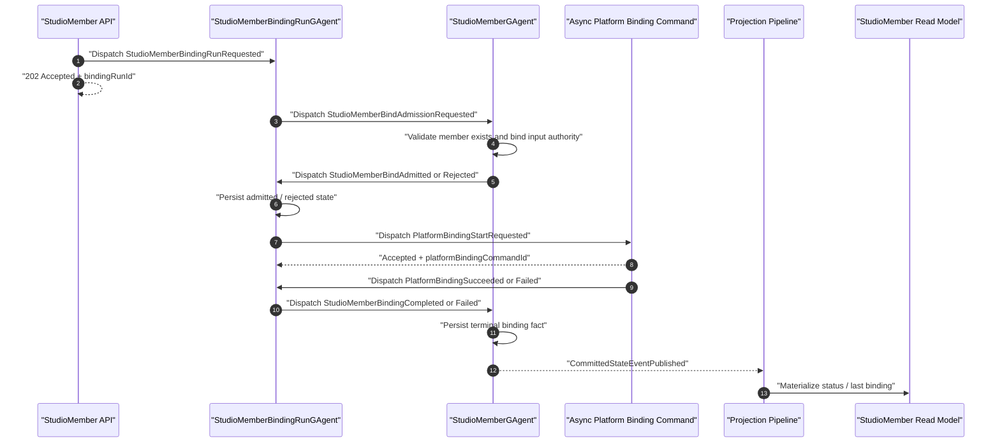

# StudioMember Bind Async Protocol Design

## Background

Issue [#516](https://github.com/aevatarAI/aevatar/issues/516) tracks the remaining StudioMember binding problem from #462. Today `StudioMemberService.BindAsync` reads `IStudioMemberQueryPort.GetAsync` before it dispatches the bind workflow. That query port is projection-backed, so a freshly created `StudioMemberGAgent` can already own the committed member fact while `StudioMemberCurrentStateDocument` still lags. In that window bind fails with `STUDIO_MEMBER_NOT_FOUND` even though the authoritative member exists.

This design follows the repository architecture rules:

- command paths must not depend on read-model freshness for admission;
- cross-actor waits must be continuation/eventized, not synchronous request-reply;
- projection remains committed-fact materialization, not business orchestration;
- command ACKs must be honest about the stage they reached.

## Current Objects

`StudioMemberGAgent` already exists in `agents/Aevatar.GAgents.StudioMember`. It owns the authoritative `StudioMemberState`, including `member_id`, `scope_id`, `implementation_kind`, `published_service_id`, `implementation_ref`, lifecycle stage, team assignment, and the last bound contract.

`StudioMemberBindingRunGAgent` does not exist today. This design introduces it as a short-lived run actor. One bind request maps to one binding run actor.

## Goals

1. `PUT /api/scopes/{scopeId}/members/{memberId}/binding` must not reject a valid member because the StudioMember read model is stale.
2. Bind admission must be owned by `StudioMemberGAgent`, because it is the authority for whether the member exists and what its stable bind inputs are.
3. The HTTP command must return `202 Accepted` with a stable `bindingRunId`; it must not imply the platform binding has already completed or the read model has observed it.
4. Bind progress, success, duplicate handling, and failure must be represented as durable actor facts/events.
5. Read models expose binding status as projection copies of committed facts.
6. Projection turns must not call platform binding commands or drive business continuations.

## Non-Goals

- Do not redesign NyxID relay admission. #506 showed that coupling NyxID callback tokens to Aevatar scope ownership is the wrong boundary.
- Do not move StudioMember authority into the read model.
- Do not add generic actor query/reply.
- Do not make the API wait for read-model visibility as the normal command contract.
- Do not preserve the current synchronous `200 + revision` bind response as the primary contract.

## Proposed Architecture

### Actors

`StudioMemberGAgent` remains the long-lived authoritative actor for a member. It gains binding protocol events that record:

- a bind run was admitted for this member;
- the bind is in progress;
- the bind completed with a published service revision;
- the bind failed with an open failure detail code/message;
- duplicate or stale run messages were ignored without changing authority state.

`StudioMemberGAgent` also owns the member-level binding authority state used to reject stale run continuations. That state records the current active binding run id, the current binding status, the last terminal binding run id, and the last failure detail. The existing `StudioMemberState.last_binding` remains the only source of truth for the last successful binding contract. Projection copies these facts into read models; it does not infer the current run by replaying event order outside the actor.

`StudioMemberBindingRunGAgent` is a run/session/task-scoped actor. It owns one binding attempt and persists its own run state:

- `binding_run_id`
- `scope_id`
- `member_id`
- request payload
- status
- admitted member snapshot
- platform binding result
- failure detail
- timestamps
- attempt count / retry cursor if retries are added

The run actor can be removed later by retention cleanup once the member actor and read model have observed a terminal state.

The run actor must not call the current `IScopeBindingCommandPort.UpsertAsync` and await its result inside an actor turn. The current port performs a multi-step synchronous orchestration and includes bounded read-model visibility polling. Using it as-is would reintroduce synchronous cross-component waiting and projection freshness coupling inside the run actor.

The implementation must first split platform binding into an asynchronous command/continuation contract:

- `IPlatformBindingCommandPort.StartAsync` accepts a typed binding command and returns only `accepted + platform_binding_command_id`;
- platform binding execution commits its own facts or publishes a typed completion/failure continuation;
- `StudioMemberBindingRunGAgent` consumes `PlatformBindingSucceeded` / `PlatformBindingFailed` messages in later turns and then notifies `StudioMemberGAgent`;
- any read-model visibility wait remains outside the actor command path and is not part of this protocol's ACK semantics.

### Command Flow



The diagram shows a logical message flow. Each actor-to-actor step is an event/command dispatch and ends the current actor turn. No actor turn blocks waiting for another actor reply, and the run actor does not wait for platform read models to become visible.

### Routing And Identity

`bindingRunId` is the stable command/run identity returned to clients. The runtime maps it to a run actor address through an internal convention such as `studio-member-binding-run:{bindingRunId}`. That actor id is an opaque runtime address; no caller may parse it for scope, member, or implementation facts.

All protocol messages carry `binding_run_id`; dispatch adapters use that value to derive or look up the run actor target when routing continuations. This avoids an API/service-level in-memory `bindingRunId -> context` map.

The member target remains the existing canonical `StudioMemberConventions.BuildActorId(scopeId, memberId)` address. The member actor never trusts mutable business facts from actor id text; it validates against its persisted `StudioMemberState`.

Platform binding continuations route back to the run actor by `binding_run_id` and `platform_binding_command_id`. The payload carries those correlation ids; the `EventEnvelope.Route` carries the actual target actor address.

### HTTP Contract

`PUT /api/scopes/{scopeId}/members/{memberId}/binding` changes from a synchronous completion response to an accepted command response:

```json
{
  "status": "accepted",
  "bindingRunId": "bind-01HV...",
  "scopeId": "scope-1",
  "memberId": "m-1"
}
```

This ACK only means the binding request was accepted for dispatch and has a stable run id. It does not promise that:

- the member exists;
- the platform binding succeeded;
- a service revision was published;
- the read model has observed the result.

Consumers read status through query endpoints:

- `GET /api/scopes/{scopeId}/members/{memberId}/binding` returns the member's current binding view, including last successful binding and current/last run status.
- `GET /api/scopes/{scopeId}/members/{memberId}/binding-runs/{bindingRunId}` returns exact status for one run. This is useful for frontend progress and failure details without overloading the member summary.

### Status Model

Use explicit wire-stable status names:

- `accepted`
- `admission_pending`
- `admitted`
- `platform_binding_pending`
- `succeeded`
- `failed`
- `rejected`

Actor, API, and frontend control flow must branch on the small typed status set above, not on arbitrary failure detail codes. `rejected` means member-side admission did not pass; `failed` means admission passed but platform binding did not complete.

Failure detail codes remain open string values, because they are not control-flow inputs in v1. They are for display, logs, diagnostics, and analytics. Stable internal failures should still use consistent code strings:

- `STUDIO_MEMBER_NOT_FOUND`
- `STUDIO_MEMBER_BIND_INPUT_INVALID`
- `STUDIO_MEMBER_BIND_KIND_MISMATCH`
- `SCOPE_BINDING_FAILED`
- `STUDIO_MEMBER_BIND_DUPLICATE`
- `STUDIO_MEMBER_BIND_CANCELLED`

`STUDIO_MEMBER_NOT_FOUND` becomes an asynchronous terminal status for this command protocol, not a stale read-model admission failure from the initial HTTP call.

If a future implementation needs programmatic branching beyond status, add a small typed field for that decision, such as `retry_policy`, rather than turning every failure detail code into an enum.

### Proto Changes

Extend `studio_member_messages.proto` with strongly typed binding protocol messages. Exact field numbers can be assigned during implementation, but the shape should stay close to:

```proto
enum StudioMemberBindingRunStatus {
  STUDIO_MEMBER_BINDING_RUN_STATUS_UNSPECIFIED = 0;
  STUDIO_MEMBER_BINDING_RUN_STATUS_ACCEPTED = 1;
  STUDIO_MEMBER_BINDING_RUN_STATUS_ADMISSION_PENDING = 2;
  STUDIO_MEMBER_BINDING_RUN_STATUS_ADMITTED = 3;
  STUDIO_MEMBER_BINDING_RUN_STATUS_PLATFORM_BINDING_PENDING = 4;
  STUDIO_MEMBER_BINDING_RUN_STATUS_SUCCEEDED = 5;
  STUDIO_MEMBER_BINDING_RUN_STATUS_FAILED = 6;
  STUDIO_MEMBER_BINDING_RUN_STATUS_REJECTED = 7;
}

message StudioMemberBindingRequest {
  string binding_run_id = 1;
  string scope_id = 2;
  string member_id = 3;
  string request_hash = 4;
  optional string revision_id = 5;
  oneof implementation {
    StudioMemberWorkflowBindingRequest workflow = 10;
    StudioMemberScriptBindingRequest script = 11;
    StudioMemberGAgentBindingRequest gagent = 12;
  }
}

message StudioMemberWorkflowBindingRequest {
  repeated string workflow_yamls = 1;
}

message StudioMemberScriptBindingRequest {
  string script_id = 1;
  optional string script_revision = 2;
}

message StudioMemberGAgentBindingRequest {
  string actor_type_name = 1;
  repeated StudioMemberGAgentEndpointBindingRequest endpoints = 2;
}

message StudioMemberGAgentEndpointBindingRequest {
  string endpoint_id = 1;
  string display_name = 2;
  string kind = 3;
  string request_type_url = 4;
  string response_type_url = 5;
  string description = 6;
}

message StudioMemberBindingRunState {
  string binding_run_id = 1;
  string scope_id = 2;
  string member_id = 3;
  string request_hash = 4;
  StudioMemberBindingRunStatus status = 5;
  StudioMemberBindingRequest request = 6;
  StudioMemberBindingAdmittedSnapshot admitted = 7;
  StudioMemberPlatformBindingResult platform_result = 8;
  StudioMemberBindingFailure failure = 9;
  google.protobuf.Timestamp accepted_at_utc = 10;
  google.protobuf.Timestamp updated_at_utc = 11;
  int32 attempt_count = 12;
  string platform_binding_command_id = 13;
}

message StudioMemberBindingAuthorityState {
  string current_binding_run_id = 1;
  StudioMemberBindingRunStatus current_status = 2;
  string last_terminal_binding_run_id = 3;
  StudioMemberBindingFailure last_failure = 4;
  google.protobuf.Timestamp updated_at_utc = 5;
}

// Existing StudioMemberState keeps `last_binding = 11` as the only source of
// truth for the last successful binding contract. The new binding sub-state
// records async run/protocol status only; it must not duplicate `last_binding`.
//
// message StudioMemberState {
//   ...
//   StudioMemberBindingAuthorityState binding = 12;
// }

message StudioMemberBindingAdmittedSnapshot {
  string member_id = 1;
  string scope_id = 2;
  string published_service_id = 3;
  StudioMemberImplementationKind implementation_kind = 4;
  string display_name = 5;
}

message StudioMemberBindingFailure {
  string code = 1;
  string message = 2;
  google.protobuf.Timestamp failed_at_utc = 3;
}

message StudioMemberBindingRunRequested {
  StudioMemberBindingRequest request = 1;
  google.protobuf.Timestamp requested_at_utc = 2;
}

message StudioMemberBindAdmissionRequested {
  string binding_run_id = 1;
  string scope_id = 2;
  string member_id = 3;
  string request_hash = 4;
  StudioMemberBindingRequest request = 5;
  google.protobuf.Timestamp requested_at_utc = 6;
}

message StudioMemberBindingAdmittedEvent {
  string binding_run_id = 1;
  string member_id = 2;
  string scope_id = 3;
  string published_service_id = 4;
  StudioMemberImplementationKind implementation_kind = 5;
  string display_name = 6;
  google.protobuf.Timestamp admitted_at_utc = 7;
}

message StudioMemberBindingPlatformPendingEvent {
  string binding_run_id = 1;
  string platform_binding_command_id = 2;
  google.protobuf.Timestamp pending_at_utc = 3;
}

message StudioMemberBindingRejectedEvent {
  string binding_run_id = 1;
  string scope_id = 2;
  string member_id = 3;
  StudioMemberBindingFailure failure = 4;
}

message StudioMemberPlatformBindingStartRequested {
  string binding_run_id = 1;
  string platform_binding_command_id = 2;
  StudioMemberBindingRequest request = 3;
  StudioMemberBindingAdmittedSnapshot admitted = 4;
  google.protobuf.Timestamp requested_at_utc = 5;
}

message StudioMemberPlatformBindingAccepted {
  string binding_run_id = 1;
  string platform_binding_command_id = 2;
  google.protobuf.Timestamp accepted_at_utc = 3;
}

message StudioMemberPlatformBindingResult {
  string published_service_id = 1;
  string revision_id = 2;
  StudioMemberImplementationKind implementation_kind = 3;
  string expected_actor_id = 4;
  StudioMemberImplementationRef implementation_ref = 5;
}

message StudioMemberPlatformBindingSucceeded {
  string binding_run_id = 1;
  string platform_binding_command_id = 2;
  StudioMemberPlatformBindingResult result = 3;
  google.protobuf.Timestamp completed_at_utc = 4;
}

message StudioMemberPlatformBindingFailed {
  string binding_run_id = 1;
  string platform_binding_command_id = 2;
  StudioMemberBindingFailure failure = 3;
}

message StudioMemberBindingRetryFired {
  string binding_run_id = 1;
  int32 attempt = 2;
  google.protobuf.Timestamp fired_at_utc = 3;
}

message StudioMemberBindingCompletedEvent {
  string binding_run_id = 1;
  string published_service_id = 2;
  string revision_id = 3;
  StudioMemberImplementationKind implementation_kind = 4;
  StudioMemberImplementationRef implementation_ref = 5;
  google.protobuf.Timestamp completed_at_utc = 6;
}

message StudioMemberBindingFailedEvent {
  string binding_run_id = 1;
  StudioMemberBindingFailure failure = 2;
}
```

`StudioMemberBindingCompletedEvent` replaces `StudioMemberBoundEvent` as the authoritative bind terminal event. There is no public compatibility requirement for the current `StudioMemberBoundEvent` shape, so implementation should remove the old event path instead of keeping a parallel compatibility transition.

### Read Models

Extend `StudioMemberCurrentStateDocument` with query-shaped fields:

- `current_binding_run_id`
- `binding_status`
- `binding_failure_code`
- `binding_failure_message`
- `last_terminal_binding_run_id`
- existing last bound fields remain for successful bind results

Add `StudioMemberBindingRunDocument` in v1. The member binding endpoint can show the member's current binding summary, while `GET /binding-runs/{bindingRunId}` reads the run document for exact progress and failure details. The run document is still projection output from committed run/member facts; it is not the authority.

### Duplicate And Retry Semantics

V1 does not accept a client-provided idempotency key. Each `PUT /binding` creates a new server-generated `bindingRunId`.

V1 duplicate handling is actor-protocol idempotency:

- repeated `StudioMemberBindingRunRequested` messages for the same `binding_run_id` and same `request_hash` are no-ops;
- repeated admission messages for the same `binding_run_id` and same admitted snapshot are no-ops;
- repeated terminal completion events are idempotent if `binding_run_id` and result match;
- stale completion/failure events for a superseded active run are ignored or recorded as stale, but must not overwrite a newer successful binding.

Client-provided idempotency keys are out of scope for v1. If a future workflow needs client retry de-duplication, add them as a separate design. The authoritative key-to-run binding must be actor-owned, preferably by deterministic run actor identity or member actor state. It must not be an API/service-level in-memory map.

Retries belong to the run actor. A retry must re-enter the run actor as a self/internal message, then re-execute the platform binding effect from a new actor turn. Timer or delay callbacks must only publish internal events.

### Layering

Application:

- normalizes HTTP input;
- dispatches a binding run command;
- returns `202 + bindingRunId`;
- does not query `IStudioMemberQueryPort` for command admission.

Domain/Actor:

- `StudioMemberGAgent` owns member admission and terminal binding facts;
- `StudioMemberBindingRunGAgent` owns per-run progress and retries.

Infrastructure:

- implements command dispatch through existing dispatch/runtime ports;
- introduces the async platform binding command/continuation port used by the run protocol;
- may adapt the existing scope binding internals behind that async port only after removing actor-turn waits on `UpsertAsync` and read-model visibility polling from the run path;
- does not drive business orchestration from projection.

Projection:

- consumes committed actor facts;
- materializes member current-state and optional run documents;
- does not call binding commands.

## Migration Plan

1. Add proto contracts for member binding admission/completion/failure, binding run state, platform binding continuations, and retry/self messages.
2. Add `StudioMemberBindingRunGAgent`.
3. Split platform binding into an async command/continuation contract; do not call the current synchronous `IScopeBindingCommandPort.UpsertAsync` from the run actor.
4. Add command port method for starting a binding run.
5. Change `StudioMemberService.BindAsync` to dispatch the run and return accepted response.
6. Extend read model projection with binding status fields.
7. Add `StudioMemberBindingRunDocument` and `GET /binding-runs/{bindingRunId}`.
8. Update frontend bind flow to show accepted/platform_binding_pending/succeeded/failed states from read model or run query.
9. Remove the obsolete synchronous bind path and tests that require immediate `200 + revision`.

## Tests

Focused tests should cover:

- stale member read model: `BindAsync` returns accepted and never calls `IStudioMemberQueryPort.GetAsync`;
- missing member: run reaches rejected/failed status with `STUDIO_MEMBER_NOT_FOUND`;
- successful workflow/script/gagent bind: run records success and member read model exposes last binding;
- duplicate run messages with the same `binding_run_id` and same `request_hash` are idempotent;
- duplicate terminal events with the same result are idempotent;
- platform binding failure records durable failed status;
- stale terminal event cannot overwrite a newer successful binding;
- run actor does not call or await the existing synchronous `IScopeBindingCommandPort.UpsertAsync`;
- projection only materializes committed facts and never invokes command ports.

Because tests are changing command behavior, run:

```bash
bash tools/ci/test_stability_guards.sh
dotnet test test/Aevatar.Studio.Tests/Aevatar.Studio.Tests.csproj --no-restore --nologo
```

If proto or projection guards are affected, also run the relevant projection guards from `AGENTS.md`.

## Spec Review Notes

- No implementation is included in this document.
- `StudioMemberGAgent` is an existing object.
- `StudioMemberBindingRunGAgent` is a proposed new short-lived actor.
- The command API is intentionally asynchronous and returns an honest ACK.
- Read models never participate in bind admission.
- V1 does not include client-provided idempotency keys.
- The run actor must use an async platform binding continuation contract, not the existing synchronous binding port as-is.
