# External Workflow Capability Readiness Design

## Problem

Chat-authored workflows can currently describe an external call without one
authoritative contract that proves which authority owns the capability, which
exact resource will execute it, and whether the selected operation is available
for the intended execution mode. This leaves room for several unsafe
interpretations:

- treating authentication presence as the Connector/NyxID boundary;
- treating a NyxID service slug as an instance identity;
- letting authoring infer an arbitrary URL, method, path, or request schema;
- asking a user to paste a downstream secret into Chat or Workflow YAML;
- evaluating authoring readiness differently at separate workflow write entry
  points; and
- persisting an interactive caller bearer for a later durable execution.

The current contracts do not support a per-UserService OAuth `resource` grant.
NyxID does expose the exact caller-visible `UserService.id` and service facts
through `GET /api/v1/keys`, exact proxy routing through `_nyxid_via`, and scoped
API keys through `allowed_service_ids` and `allowed_node_ids`. The design must
use those published contracts without inventing a second authorization model.

## Semantic Decisions

External capability selection follows the authority owner, not whether the
operation needs credentials:

| Authority owner | Workflow primitive | Credential owner | Canonical identity |
| --- | --- | --- | --- |
| Host/deployment-owned and allowlisted | `connector_call` | Host connector configuration or secret store | `connector_capability_ref` |
| User/org credential, OAuth connection, UserService, or local Node | `tool_call -> nyxid_proxy` | NyxID | `user_service_id` |
| Undiscovered arbitrary URL | Not admitted | None | None |

A configured Connector remains a Connector when it uses
`client_credentials` or a secret reference. A public service is not
automatically a Connector. The ownership boundary is an explicit catalog fact,
never an inference from an authentication field.

Readiness is a point-in-time evaluation of one selected capability and one
execution mode. It is not a workflow lifecycle state. Workflow admission is the
server-side authority; Chat instructions only guide the model toward that
contract and are not a security boundary.

## Typed Contract

Workflow abstractions define Protobuf messages for the stable semantic core:

```proto
message ExternalWorkflowCapabilityRef {
  oneof capability {
    HostConnectorCapabilityRef host_connector = 1;
    NyxIdUserServiceCapabilityRef nyx_id_user_service = 2;
  }
}

message HostConnectorCapabilityRef {
  string connector_capability_ref = 1;
  string operation_id = 2;
  string contract_digest = 3;
}

message NyxIdUserServiceCapabilityRef {
  string user_service_id = 1;
  string service_slug_snapshot = 2;
  string operation_id = 3;
  string http_method = 4;
  string path_template = 5;
  string contract_digest = 6;
}
```

`user_service_id` is the NyxID instance identity. The slug is a routing
snapshot retained only because the current proxy path includes it. Operation
identity, method, path template, and contract digest freeze the allowlisted
operation contract used by admission and execution.

`ExternalCapabilityExecutionMode` distinguishes interactive execution from
durable execution. `ExternalCapabilityReadinessStatus` contains stable outcomes
for selection, catalog, credential/access, node, endpoint contract, operation,
freshness, durable authorization evidence, and ready state. Blockers,
remediations, and source stamps are typed submessages rather than a generic bag.

`WorkflowAuthorizationDependencies` carries repeated
`ExternalWorkflowCapabilityRef` values. Slug-only NyxID dependency fields are
removed once all repository consumers migrate; there is no parallel legacy
authorization path.

## Authoring And Admission Flow

```mermaid
%%{init: {"maxTextSize": 100000, "flowchart": {"useMaxWidth": false, "nodeSpacing": 10, "rankSpacing": 50}, "themeVariables": {"fontSize": "10px"}}}%%
flowchart LR
    A["Chat authoring intent"] --> B["List external workflow capabilities"]
    B --> C["Resolve authority owner"]
    C -->|"Host-owned / preconfigured"| D["Connector catalog read model"]
    C -->|"User or org-owned"| E["NyxID GET /api/v1/keys"]
    D --> F["Select exact connector operation"]
    E --> G["Select exact UserService.id"]
    G --> H["Read published OpenAPI operation"]
    F --> I["Typed readiness evaluation"]
    H --> I
    I -->|"Not ready"| J["Typed remediation; no Secret in Chat"]
    I -->|"Ready"| K["Workflow capability admission plan"]
    K --> L["Bind command commits definition + admission fact"]
    L --> M["Workflow runtime"]
    M -->|"connector_call"| N["Host Connector"]
    M -->|"interactive NyxID"| O["Caller bearer"]
    M -->|"durable NyxID"| P["Dedicated scoped API key"]
    O --> Q["nyxid_proxy with slug + exact _nyxid_via"]
    P --> Q
```



The application surface exposes two read-only authoring tools:

- `list_external_workflow_capabilities` returns Host Connector operations and
  caller-visible NyxID UserService operations without collapsing duplicate
  slugs;
- `inspect_external_workflow_capability_readiness` evaluates an exact candidate
  and execution mode and returns typed readiness.

The application layer depends on narrow source ports. The Connector source reads
the existing Connector read model. The NyxID adapter reads `/keys` and the
published OpenAPI locator, maps external JSON immediately into typed repository
contracts, and retains no process-local service catalog. Neither source primes a
projection, activates an actor, replays events, or creates a second fact store.

Durable NyxID readiness additionally performs one owner-scoped query against the
NyxID authorization catalog current-state read model. The queried personal owner
is derived from the verified caller id, not from the selected service or its
slug. `READY` requires an activated, fresh, non-invalidated, non-cleaned catalog
for that exact owner and one permitted exact service id whose slug snapshot,
normalized resource owner, node-grant requirement, and canonical Node ids all
match. The query path never refreshes the catalog, acquires a projection lease,
activates an actor, replays events, or otherwise primes the replica.

## Readiness Rules

`READY` requires a selected exact capability identity and an exact allowlisted
operation contract. The main non-ready outcomes have deliberately narrow
meanings:

| Status | Meaning |
| --- | --- |
| `SELECTION_REQUIRED` | More than one exact candidate remains, including duplicate slugs |
| `CONNECTOR_NOT_FOUND` | The selected Host Connector capability ref is absent from its read model |
| `SERVICE_REGISTRATION_REQUIRED` | The selected authority owner's current `/keys` result has no matching UserService instance |
| `CREDENTIAL_CONNECTION_REQUIRED` | The matching instance exists but its credential/connection is not usable |
| `SERVICE_ACCESS_DENIED` | The current caller lacks access according to the published source facts |
| `NODE_BINDING_REQUIRED` | The selected service requires a Node and has no binding |
| `NODE_UNAVAILABLE` | The selected Node binding is not available |
| `ENDPOINT_CONTRACT_REQUIRED` | No usable published OpenAPI contract is available |
| `OPERATION_SELECTION_REQUIRED` | No exact allowlisted operation has been selected |
| `SOURCE_STALE` | The source stamp cannot support a current admission decision |
| `DURABLE_AUTHORIZATION_UNAVAILABLE` | Exact least-privilege durable authorization topology cannot be proven |

Remediations carry a typed action kind and an optional trusted locator supplied
by Host/NyxID configuration. The authoring model does not construct remediation
URLs and never receives credential values.

Only operations marked by the published `x-aevatar-tool` allowlist are exposed.
Unknown operation ids, a changed method/path pair, dynamic service identities,
slug-only identities, and sensitive authentication headers fail closed.

A durable NyxID `READY` proof carries a
`DURABLE_AUTHORIZATION_CATALOG` source stamp with the catalog actor id,
authoritative state version, observation/freshness timestamps, and content
digest. Admission verifies that every readiness proof was evaluated for the
requested execution mode and exact capability identity. The catalog snapshot
must be active and not cleaned, have a positive authoritative version and
complete lifecycle facts, use the exact ordinal `nyxid` resource-owner
authority, and carry the canonical digest of its typed owner and services. A
durable NyxID plan is invalid without that catalog stamp; a generic `READY`
status cannot substitute for durable evidence.

## Unified Workflow Admission

`IWorkflowExternalCapabilityAdmissionService` is the single workflow write
admission boundary with two explicit operations:

- live `AdmitAsync` accepts authenticated caller authority and transient
  credentials, evaluates current readiness, and creates a plan;
- `RevalidatePersistedAsync` accepts an actor-owned plan and the bound workflow
  definition, but no caller identity or credentials and performs no external
  readiness read.

Live admission:

1. compiles the YAML through the existing workflow parser;
2. extracts static typed external capability references;
3. rejects dynamic identity, slug-only NyxID calls, unknown operations, and
   sensitive headers;
4. evaluates typed readiness for every reference;
5. produces an `external-capability-admission.v2` plan containing the definition
   digest, exact capability refs, operation contract digests, and source stamps;
6. for durable NyxID capabilities, seals the exact typed
   `nyxid/personal/<subject>` owner into the admission digest; and
7. allows the bind actor to compare the submitted plan against independently
   parsed structure before committing the definition and admission fact.

Persisted revalidation reparses the definition and checks schema, execution
mode, exact capabilities, required source evidence, freshness, and admission
digest. For durable NyxID plans it also derives the catalog actor id from the
sealed owner and requires an exact source-stamp match. Recomputing the unkeyed
digest after changing the owner cannot make a plan valid for another catalog.
The expected execution mode comes from the current write/handoff contract, not
from the persisted plan being validated, and must match the plan exactly.
The persisted path never substitutes `appId`, `serviceId`, or an empty caller
for the original authority and never recovers credentials from actor state.

Scope upsert, Studio provisioning, member binding, revision preparation,
publish, skill mount, and startup file materialization paths use this same
contract. They do not each implement a separate readiness policy. Repository
startup definitions have no tenant caller authority and therefore cannot embed
a tenant-owned NyxID UserService identity. Their synchronous receipt remains
honest: it acknowledges dispatch acceptance, while observed definition state
remains a read-model query.

## Exact NyxID Execution

The internal `nyxid_proxy` tool accepts both `service_id` and the admitted slug
snapshot. `NyxIdApiClient` sends requests through:

```text
/api/v1/proxy/s/{slug}/...?_nyxid_via={user_service_id}
```

The runtime executes only the operation frozen by admission. A model cannot
replace the service id, slug, method, path, or sensitive headers at invocation
time. Duplicate slugs remain separate capabilities throughout discovery,
admission, workflow dependencies, durable authorization evidence, and proxy
execution.

Interactive execution uses the current verified caller bearer. If access is
revoked, the existing structured NyxID error mapping produces a safe typed tool
failure and terminates that run without storing the raw response or any secret.

Durable and scheduled execution reuses
`ScheduledInvocationAuthorizationPlan -> ScheduledAgentApiKeyIssuer`. Admission
supplies exact service ids and the stamped durable catalog evidence. Issuance
keeps `allow_all_services=false` and `allow_all_nodes=false`, and the key value
only enters the existing secret reference boundary. Missing, stale, or
inconsistent topology evidence yields
`DURABLE_AUTHORIZATION_UNAVAILABLE`; the system never persists a caller bearer,
widens a key, guesses an instance from a slug, or fabricates an OAuth resource
grant.

## Secret And Approval Boundaries

API keys, bearer tokens, cookies, OAuth secrets, and downstream credentials may
not enter Chat messages, Workflow YAML, actor state, read models, receipts, or
logs. Chat presents only typed remediation and directs secure input to the NyxID
browser or CLI boundary.

Read/write/destructive classification comes from the Connector contract or
OpenAPI `x-aevatar-tool`, not model prose. Existing Aevatar tool approval and
NyxID service approval remain independent authorities. Readiness does not create
pending approval and an approval denial is not reported as missing credentials.

## Migration And Compatibility

This is an upgrade-forward contract change. Repository-owned workflow producers
and consumers migrate together from NyxID slug lists to typed capability refs.
No compatibility adapter retains slug-only execution. Existing workflows that
use an external capability must be re-admitted against the current exact
contract before a new binding or durable authorization plan is accepted.

The implementation updates the Connector, NyxID connected-service, scheduled
runner, workflow primitive, and Chat canonical documentation together with the
system prompt. It adds no global Build/Bind/Invoke/Observe lifecycle and no
process-local owner/service/session registry.

## Verification

Tests use deliberately distinct identities such as
`user_service_id=us-home-alpha`, `slug=home-assistant`, and
`connector_capability_ref=connector-home-alpha`. Coverage proves:

- public and authenticated Host Connectors stay on the Connector path;
- NyxID API-key, OAuth, direct-service, and local-Node capabilities preserve
  exact UserService identity, including duplicate slugs;
- every readiness blocker has a stable typed outcome;
- only allowlisted static operations are admitted;
- all workflow write surfaces share the same admission contract;
- exact service ids reach proxy routing and scoped key evidence;
- interactive and durable credentials never cross their authority boundary;
- unprovable durable authorization fails closed; and
- no secret-bearing input or output is stored in repository-owned contracts.

Verification includes focused tests, complete build and test, architecture and
test-stability guards, workflow binding and query/projection boundary guards,
and documentation lint.
