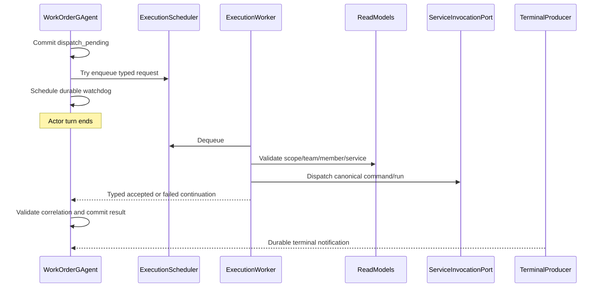

# WorkOrder Continuation And Terminal Outbox Fixes

**Date:** 2026-07-21
**Status:** Approved in conversation
**Scope:** Merge blockers found while reviewing `feature/integrate -> dev`

## Context

The final candidate review confirmed that the Studio query-tool blockers are
fixed, but found two Important defects in the newly added WorkOrder path:

1. `WorkOrderGAgent` awaits assignment read-model queries and service dispatch
   inside its actor turn. A stalled dependency pins the turn, so the WorkOrder
   timeout self-message cannot be consumed.
2. Role, script, and service-run terminal notifications are not driven by a
   durable retry state machine. Failed sends can be overwritten, trimmed, or
   left pending until an activation that may never happen.

The approved scope is limited to the WorkOrder execution path and the three
terminal producers used by static/script WorkOrder runs. This is not a new
platform-wide delivery framework.

## Binding Invariants

- `WorkOrderGAgent` remains the only authority for WorkOrder lifecycle state.
- Actor turns never wait for read-model access or cross-actor service dispatch.
- Background queues are transport only. They do not own facts and do not keep
  process-local ID-to-state registries.
- Every continuation carries `work_order_id + dispatch_command_id +
  requested_run_id`; stale or late continuations are ignored by the authority
  actor.
- All persisted state, events, retry signals, and continuations are Protobuf.
- Every WorkOrder-originated delivery is bounded by the WorkOrder deadline. This
  fix does not invent an expiry policy for other invocation origins.
- Pending terminal deliveries cannot be overwritten or trimmed.
- Frontend files remain byte-for-byte identical to `origin/dev`.

## Considered Approaches

### 1. Recoverable scheduler plus typed continuation

The WorkOrder actor commits `dispatch_pending`, performs a non-blocking enqueue,
and ends its turn. A hosted worker performs validation and dispatch outside any
actor turn, then sends a typed continuation to the WorkOrder actor.

This is the selected approach. It follows the existing LLM run execution
scheduler pattern while keeping WorkOrder state authoritative and recoverable.

### 2. Dedicated execution coordinator actor

A per-WorkOrder coordinator actor could own the execution attempt. It would
still need its own multi-step continuation protocol for read-model validation
and cross-actor dispatch, adding another persistent actor and state machine.
This is unnecessary for the current scope.

### 3. Broker-backed executor

A durable broker consumer would give stronger transport durability, but would
add broker configuration, checkpoint ownership, and deployment work. The
selected design keeps the transport replaceable so a broker can be added later
without changing WorkOrder semantics.

## Architecture

### Component ownership

- `Aevatar.GAgents.WorkOrder` owns the scheduler abstraction, Protobuf request,
  retry signals, continuations, and WorkOrder state transitions.
- `Aevatar.Studio.Application` owns the bounded queue, scheduler implementation,
  and the existing `IWorkOrderExecutionPort` implementation. The execution port
  is worker-only after this change.
- `Aevatar.Studio.Hosting` owns the hosted execution worker and its options.
- The worker uses `IActorDispatchPort` to deliver continuations. It does not
  mutate actor state or expose a synchronous request/reply API.

## WorkOrder Execution State Machine

### Dispatch handoff

`WorkOrderGAgent` no longer injects or invokes `IWorkOrderExecutionPort`.
It injects `IWorkOrderExecutionScheduler` instead.

After `WorkOrderDispatchRequestedEvent` commits, the existing self-message
boundary is retained. Its handler:

1. validates `work_order_id`, `dispatch_command_id`, and lifecycle;
2. clones the typed `WorkOrderExecutionRequest`;
3. invokes a non-blocking scheduler enqueue;
4. persists/schedules a durable execution watchdog; and
5. returns without awaiting external I/O.

The queue uses `Channel<T>` with `TryWrite`, single reader, multiple writers,
and default capacity `1024`. The worker default maximum concurrency is `64`
and shutdown drain grace is `10` seconds, matching the established off-actor
LLM execution defaults.

Queue saturation throws a dedicated `WorkOrderExecutionQueueFullException`.
The actor treats this as a retryable scheduling failure, not a terminal
business failure, and remains `dispatch_pending`.

### Recoverability

The WorkOrder state adds strongly typed execution retry fields:

- `execution_retry_attempt`
- `execution_retry_callback_id`
- `execution_retry_at_utc`

Retry delay starts at `250 ms`, doubles per attempt, is capped at `30 seconds`,
and is also capped by the remaining WorkOrder deadline. These values match the
existing workflow terminal-delivery policy.

Every successful enqueue schedules a watchdog. If the actor is still the same
`dispatch_pending` operation when the watchdog fires, it re-enqueues the same
canonical request. Duplicate execution requests are safe because downstream
registration and dispatch reuse `dispatch_command_id` and `requested_run_id`.

Activation recovery uses the same rule: a non-terminal `dispatch_pending`
WorkOrder re-enqueues and restores its watchdog. The queue itself is never the
fact source.

If durable retry scheduling fails, the actor preserves the retryable state and
may publish one immediate self-continuation for the first attempt, following
the existing `WorkflowRunGAgent` recovery rule.

### Worker and continuation contracts

The hosted worker calls `IWorkOrderExecutionPort.ExecuteAsync` outside any actor
turn. It converts the result into one of two Protobuf messages:

- `WorkOrderExecutionAcceptedContinuation`
- `WorkOrderExecutionFailedContinuation`

Both carry `work_order_id`, `dispatch_command_id`, and `requested_run_id`.
Accepted also carries the typed accepted Run receipt. Failed carries a typed,
safe `WorkOrderFailureReference`; unexpected exception messages are not exposed.

The WorkOrder handler accepts a continuation only when:

- lifecycle is still `dispatch_pending`;
- all three correlation identities match state; and
- accepted Run/command/correlation identities match the authorized request.

Accepted commits `WorkOrderRunAcceptedEvent`; failed commits
`WorkOrderDispatchFailedEvent`. Both clear execution retry fields. A timeout,
cancel, prior result, or mismatched continuation makes the message stale and it
is ignored without state mutation.

Host shutdown cancellation stops queue admission and worker dequeue. In-flight
execution is given the configured drain grace. If the process dies before a
continuation is delivered, the actor-owned watchdog/activation path retries.

## Deadline Propagation

`WorkOrderExecutionRequest` gains the authoritative WorkOrder deadline. The
application adapter derives both workflow and service-run completion target
`expires_at_unix_ms` from it. The current `long.MaxValue` values are removed.

`timeout_at_utc` is required for new WorkOrders and must be later than
`requested_at_utc`. The command boundary rejects a missing/elapsed deadline
before dispatch, and `WorkOrderGAgent` enforces the same invariant so alternate
command transports cannot create an unbounded WorkOrder.

Static and script dispatch also forward a stable internal terminal delivery ID
and the same expiry into their typed run contexts. A source terminal producer
therefore never outlives the WorkOrder that requested it.

The deadline is required for `run_origin = work-order`. Other invocation
origins retain their existing callback/deadline semantics; this scoped fix does
not assign them an arbitrary WorkOrder-derived or fixed-duration expiry.

The WorkOrder timeout remains authoritative. Downstream expiration records a
delivery fact only; it does not claim the WorkOrder completed or failed.

## Durable Terminal Outboxes

All three producers use the same local state-machine semantics without adding a
cross-platform generic framework:

`Prepared -> RetryScheduled -> Dispatched | Expired`

Each retry uses a stable delivery operation ID, exponential delay from
`250 ms` to `30 seconds`, a durable self-event, activation recovery, and exact
delivery/attempt matching. Cancellation requested by the actor runtime is
rethrown. Other send failures schedule retry and preserve the payload.
WorkOrder-originated entries always carry a positive expiry and stop retrying
at that deadline.

### RoleGAgent

`RoleChatRunContext` gains typed `completion_notification_delivery_id` and
`completion_notification_expires_at_unix_ms` fields.

Each `RoleChatSessionState` owns its delivery status, attempt, retry callback,
and retry timestamp. Session pruning may remove only deliveries that are
`Dispatched`, `Expired`, or have no completion target. A completed session with
a prepared or scheduled delivery is never trimmed.

Activation, session completion, and retry-fired handlers all call the same
idempotent delivery method.

### ScriptBehaviorGAgent

The single `last_run_outcome` slot is replaced by a typed map keyed by stable
script run ID. Each `ScriptRunOutcomeDeliveryState` contains the outcome,
delivery ID, expiry, delivery status, attempt, callback ID, and retry timestamp.

A later run adds a new entry and cannot overwrite another run's pending
delivery. Replay resolves the requested run entry rather than consulting one
global last outcome. Bounded pruning removes only the oldest `Dispatched` or
`Expired` entries; pending entries are retained. The retained terminal history
limit is `64` entries, excluding pending entries from the limit.

### ServiceRunGAgent

One ServiceRun actor owns one Run, so its existing single pending notification
shape remains appropriate. Its state gains attempt, retry callback ID, and retry
timestamp, and its delivery enum gains `RetryScheduled`.

Send failure schedules a durable retry immediately in the healthy process.
Activation remains recovery, not the primary retry mechanism.

## API And Tool Contract Corrections

Malformed WorkOrder IDs are normalized at the Application/Host boundary.
`ArgumentException` from canonical ID validation is mapped to a typed HTTP 400;
it must not escape as HTTP 500.

The final fix wave also closes the three non-blocking workflow catalog test gaps:

- resolve `WorkflowCatalogAgentToolSource` through `AddWorkflowTools()`;
- assert the caller cancellation token reaches `IWorkflowCatalogPort` unchanged;
- assert exact list/detail JSON property sets so application DTO growth cannot
  silently expand the tool wire contract.

Dedicated workflow tool wire DTOs are preferred over serializing application
DTOs directly.

## Protobuf Evolution

All new state, events, retry messages, continuation messages, and run-context
fields are defined in the owning `.proto` files. Removed pre-merge WorkOrder
prototype fields are reserved rather than reused. No JSON or custom string
serialization is introduced.

This WorkOrder feature has not been merged to `dev`, so no production state
migration or compatibility handler is required. Tests construct distinct
WorkOrder, member, workflow, service, run, command, and delivery IDs.

## Error Handling

- Queue full: remain `dispatch_pending`; durable retry.
- Assignment no longer valid: typed dispatch failure continuation.
- Service dispatch rejected: typed dispatch failure continuation.
- Unexpected worker exception: safe typed failure with exception type only.
- Continuation publish failure: worker logs; WorkOrder watchdog re-executes.
- Terminal notification publish failure: durable retry until deadline.
- Durable retry scheduling failure: preserve pending state and use the one-time
  immediate recovery rule.
- Deadline reached: typed delivery-expired event; WorkOrder timeout owns final
  lifecycle convergence.
- Late or mismatched continuation/retry: ignore without mutation.

## Test Strategy

TDD is required for every behavior change.

### WorkOrder execution tests

- dispatch handler returns without waiting for executor completion;
- timeout is processed while external execution remains blocked;
- accepted and failed continuations require all correlation identities;
- continuation after timeout is ignored;
- queue full schedules retry without terminal failure;
- watchdog and activation recovery re-enqueue the canonical request;
- stale retry attempt is ignored;
- duplicate requests preserve canonical Run/command identities;
- worker converts success, expected failure, unexpected failure, and publish
  failure correctly.

### Terminal outbox tests

- Role send failure schedules retry and pending sessions cannot be trimmed;
- Role activation and retry-fired delivery are idempotent;
- Script run B cannot overwrite pending run A;
- Script replay returns the requested run outcome;
- Script pruning removes only dispatched/expired history;
- ServiceRun send failure retries without deactivation;
- each producer expires exactly at the propagated deadline;
- stale delivery IDs and attempts are ignored;
- successful retry commits dispatched state once.

### Boundary and regression tests

- malformed WorkOrder ID returns HTTP 400;
- WorkOrder deadline replaces `long.MaxValue` in both completion targets;
- workflow tool DI, cancellation-token identity, and exact JSON property sets;
- no frontend diff from `origin/dev`.

## Verification

After focused suites pass, rerun the complete 21-command verification matrix
recorded in `.superpowers/sdd/task-5-report.md`, including full build/test,
architecture and projection guards, solution split guards, docs lint, frontend
equality, and diff checks. Then perform a fresh whole-branch review of
`origin/dev..HEAD`.

No remote branch update, force push, or PR creation is allowed until the final
review reports no Critical or Important findings.
