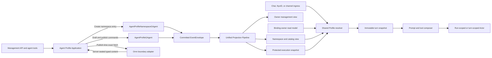

# Agent Profile Architecture Design

Decision status: approved for implementation planning on 2026-07-22.

## Problem

Aevatar agents can enter through Workflow Chat, NyxID conversations, or channel
bots, but their durable purpose is not modeled consistently.

The Console Chat surface currently sends `workflow: "studio"`. The built-in
`studio` workflow then carries both a Studio-specific system prompt and a tool
allowlist. This does give that one `/api/chat` caller a special prompt, but it
encodes agent purpose as workflow selection. The same purpose cannot be reused
by a NyxID conversation or a channel bot without another special case.

Channel registrations have the inverse problem. `default_skill_name` means that
every otherwise-unmatched plain-text turn deterministically invokes one remote
skill. It is a mutable name lookup, has no exact version or publisher evidence,
and cannot express profile instructions, routed skills, always-loaded skills,
or a profile-level tool policy.

In product terms, the current surfaces imply that a workflow name or a single
default skill defines the agent, while users expect one reusable resource to
define the agent's purpose, instructions, skills, and capability ceiling. That
resource is `AgentProfile`.

## Goals

- Model an Agent Profile as an independent, reusable, owner-scoped, versioned
  resource.
- Give profiles a human-readable GitHub-style reference such as
  `eanzhao/xiaomi-home-assistant` or `system/xiaomi-home-assistant`.
- Keep authorization and internal addressing on stable typed identities, never
  on the human-readable reference.
- Let an owner manage draft instructions, tool policy, and exact Ornn skill
  references through HTTP APIs and agent tools.
- Use the same profile resolution, prompt composition, and tool-policy logic for
  Workflow Chat, WebSocket Chat, NyxID conversations, and channel bots.
- Freeze all execution-relevant Ornn content at profile publish time. A live
  turn must not search Ornn, resolve `latest`, or fetch a skill over the network.
- Preserve Actor ownership, CQRS read/write separation, the unified Projection
  Pipeline, accepted-only command receipts, and Protobuf internal contracts.
- Migrate Studio and channel `default_skill_name` onto the single Profile model,
  then delete their old special paths.

## Non-Goals

- A public profile marketplace, ratings, forks, or cross-owner collaboration.
- Cross-scope binding of user-owned profiles. V1 allows same-scope owner profiles
  and globally bindable `system/*` profiles only.
- Profile ownership transfer, owner-handle rename, profile-slug rename, profile
  deletion, or rollback of an in-flight turn.
- Runtime installation of packages, runtime Ornn discovery, or a profile-owned
  credential store.
- Letting a profile or skill grant tools, permissions, OAuth scopes, API keys, or
  credentials that the caller and route do not already possess.
- Replacing workflow definitions. A workflow still defines execution; a Profile
  defines the agent behavior applied to that execution.

## Alternatives Considered

### Keep entry-specific configuration

Studio could retain a special workflow and each channel registration could gain
more prompt and skill fields. This has a small initial diff, but creates separate
profile semantics for every ingress and leaves no reusable owner resource. It is
rejected.

### Store a profile in Host configuration and fetch Ornn at runtime

This resembles the historical deployment snapshot and remote skill-fetch paths.
It avoids new authority actors, but configuration is not owner-manageable and
runtime fetch makes behavior depend on network availability and mutable remote
content. It also creates process-local truth. It is rejected.

### Actor-owned draft and published snapshot

An owner edits a draft, the server resolves and seals exact dependencies during
publish, and runtime reads a protected published-snapshot read model. This keeps
one authority, supports every ingress, and pins each turn to immutable content.
This is the selected design.

## Architecture Flow



The management and execution paths meet only through committed Profile facts
and their read models. Ornn is a publish-side adapter, not a runtime dependency.
The resolver is stateless and receives bindings and snapshots through query
ports; it does not become another fact owner.

## Product Identity

### Human reference

The canonical human reference is two fields rendered with a slash:

```text
ownerHandle/profileSlug
```

Examples:

```text
eanzhao/xiaomi-home-assistant
system/xiaomi-home-assistant
system/studio
```

The slash is the HTTP path separator, not a character stored inside either
field. Contracts always carry `owner_handle` and `profile_slug` separately. No
alternative separator is needed.

Both values use lowercase ASCII letters, digits, and single hyphens. They start
and end with a letter or digit, contain at most 63 characters, and reject empty
segments, repeated hyphens, `.` and `..`. The namespace service proposes an
owner handle from the authenticated NyxID username when that owner first claims
its namespace. The first create request may instead supply an available
`ownerHandle`; later requests must omit it or match the committed claim. A
collision is returned as `OWNER_HANDLE_CONFLICT`. It is never resolved by
treating the handle as identity.

`ownerHandle` and `profileSlug` are immutable in v1. `displayName` is mutable and
may contain normal user-facing text. The reserved handle `system` cannot be
claimed, written, or impersonated by an ordinary principal.

### Internal identity and authority

Every profile has an opaque, immutable `profileId`. Actor addresses are also
opaque. Callers must not derive either from a handle, slug, prefix, or route.

`AgentProfileOwnerIdentity` is a typed `oneof`: an ordinary Profile carries the
repository's stable authenticated user identity, while a built-in Profile
carries the platform-owned system identity. `owningScopeId` is a separate,
required Profile identity field for ordinary Profiles and absent for system
Profiles. Keeping them separate lets one stable owner handle identify the same
user while every ordinary Profile still has one unambiguous scope boundary.
User-profile authorization compares the typed owner identity and the separate
owning scope. `ownerHandle` is only a namespace lookup key and display value.

The management route's `scopeId` comes from the path and is checked against the
authenticated principal. Within that route, `{profileSlug}` is implicitly in
the authenticated owner's namespace; it cannot select another owner's same
slug. The request body cannot supply or replace the owner, scope, `profileId`,
or system authority. V1 does not grant a scope administrator implicit authority
over another user's Profile. User profiles may bind only to agent owners in the
Profile's owning scope. `system/*` profiles are the explicit exception.

`GET /api/agent-profiles/{ownerHandle}/{profileSlug}` is an authenticated
reference-resolution and discovery endpoint. Its GitHub-like route does not
imply public visibility. Inaccessible resources are reported as not found.

## Profile Contract

The stable semantic core is represented as Protobuf. The following shape is the
normative field and ownership model; final field numbers follow repository
allocation conventions.

```proto
message AgentProfileReference {
  string owner_handle = 1;
  string profile_slug = 2;
}

message AgentProfileContent {
  string display_name = 1;
  string purpose = 2;
  string instructions = 3;
  repeated AgentProfileSkillBinding skill_bindings = 4;
  AgentProfileToolPolicy tool_policy = 5;
}

enum AgentProfileSkillActivationMode {
  AGENT_PROFILE_SKILL_ACTIVATION_MODE_UNSPECIFIED = 0;
  AGENT_PROFILE_SKILL_ACTIVATION_MODE_ALWAYS = 1;
  AGENT_PROFILE_SKILL_ACTIVATION_MODE_ROUTED = 2;
  AGENT_PROFILE_SKILL_ACTIVATION_MODE_DEFAULT_FOR_UNMATCHED_TURN = 3;
}

message ExactOrnnSkillReference {
  string skill_guid = 1;
  string literal_version = 2;
  string expected_name = 3;
  string expected_publisher_id = 4;
}

message AgentProfileSkillBinding {
  string binding_id = 1;
  AgentProfileSkillActivationMode activation_mode = 2;
  ExactOrnnSkillReference skill = 3;
}

enum AgentProfileToolPolicyMode {
  AGENT_PROFILE_TOOL_POLICY_MODE_UNSPECIFIED = 0;
  AGENT_PROFILE_TOOL_POLICY_MODE_INHERIT_ROUTE_MAXIMUM = 1;
  AGENT_PROFILE_TOOL_POLICY_MODE_EXPLICIT_ALLOWLIST = 2;
}

message AgentProfileToolPolicy {
  AgentProfileToolPolicyMode mode = 1;
  repeated string tool_names = 2;
  repeated string tool_set_refs = 3;
}
```

`purpose` is for owner UI, search, and discovery. It is not a prompt layer.
`instructions` is the profile-authored prompt layer. This prevents descriptive
catalog copy from silently becoming privileged model instruction.

`bindingId` is an opaque stable identifier for editing one binding. It is not a
skill identity and is not inferred from the skill name. At most one binding may
use `DEFAULT_FOR_UNMATCHED_TURN`; publish rejects a second default.

`INHERIT_ROUTE_MAXIMUM` means the Profile adds no extra allowlist restriction.
It does not grant anything. `EXPLICIT_ALLOWLIST` applies an additional
intersection. An empty explicit allowlist means no tools.

### Version model

Each Profile exposes separate versions with separate meanings:

- `authorityStateVersion` is the committed `AgentProfileGAgent` state version.
- `draftRevision` advances when draft content changes.
- `publishedRevision` advances only when a different validated snapshot is
  published.
- `draftDigest` identifies deterministic draft content.
- `publishedSnapshotDigest` identifies deterministic execution content.

Draft and published versions are never aliases. Publishing does not overwrite
the draft. Repeating a publish command with the same idempotency key and payload
is idempotent. A new publish of unchanged content produces a typed no-change
outcome and retains the existing `publishedRevision`.

## Exact Ornn Skill Semantics

The management API accepts only `ExactOrnnSkillReference`. It never accepts a
skill body, an inline `SKILL.md`, a bare name, a `latest` selector, or a generic
key-value bag.

During `:validate` and again during `:publish`, the server resolves the exact
GUID and literal version with the authenticated owner authority, then verifies:

- the returned GUID and literal version exactly match the request;
- the returned canonical name matches `expectedName`;
- the returned stable publisher identity matches `expectedPublisherId`;
- the owner may read and use the skill;
- the package has a valid `SKILL.md` and valid typed workflow/script assets;
- size, prompt, file, workflow, script, and policy limits are satisfied; and
- when the Profile uses an explicit allowlist, declared tool dependencies do
  not exceed that allowlist.

`literalVersion` follows the current Ornn package contract exactly:
`<major>.<minor>` with non-negative decimal components and no `latest`, range,
prefix, or semantic-version patch component. For example, `1.4` is valid and
`1.4.0` is not.

If the current Ornn endpoint cannot fetch a literal version or cannot return a
stable publisher identity, it is not an exact source and cannot be used by this
publish path. The Ornn adapter contract must be extended first. Name-based
fallback is forbidden.

With `INHERIT_ROUTE_MAXIMUM`, validation records declared tool dependencies but
cannot prove a future route's effective tool set. Runtime still applies the full
intersection and returns a typed capability-unavailable result when a route or
caller removes a required tool.

Publish normalizes all execution-relevant content into a typed
`SealedAgentProfileSkill` and computes `contentSha256` over deterministic
Protobuf bytes. The sealed payload contains the exact reference, resolved
identity facts, normalized instructions, routing facts, and typed assets needed
at runtime. It contains no access token, bearer, secret, or arbitrary external
JSON.

The full published Profile snapshot has its own deterministic digest covering
profile instructions, tool policy, binding order, each exact reference, and
each sealed skill digest. Volatile timestamps and observation facts do not
participate in this digest.

Draft validation is a preview. `:publish` always resolves and validates again,
then sends a server-created sealed snapshot plus the expected draft revision to
the Profile Actor. The Actor rejects the command if the authoritative draft
changed during resolution.

## Skill Activation

Activation is evaluated from the immutable snapshot pinned to one turn:

- `ALWAYS` includes that skill's normalized instruction procedure on every
  model turn. It does not claim the inbound route.
- `ROUTED` exposes the sealed name, description, `whenToUse`, and invocability
  facts to the shared turn classifier. V1 selects at most one routed skill for a
  turn. An exact explicit trigger selects the matching bound skill directly.
- `DEFAULT_FOR_UNMATCHED_TURN` selects its skill only when no higher-priority
  local command, card action, workflow command, explicit skill trigger, or
  routed skill has claimed an ordinary text turn.

For channel ingress, precedence is:

```text
local slash or card action
explicit workflow command
explicit bound-skill trigger
routed Profile skill
DEFAULT_FOR_UNMATCHED_TURN
ordinary model turn
```

The default binding receives the original plain message as its arguments,
preserving the current channel behavior. Selection executes against the sealed
local snapshot. It does not call `IRemoteSkillFetcher`, `OrnnSkillClient`, skill
search, or a name-based `use_skill` fetch.

The selected sealed payload is mapped into the shared typed skill execution
contract. Instructions enter the Profile Skills layer; typed workflow or script
assets use the existing handoff path. `ALWAYS` loads instructions and descriptors
but never starts a side effect merely because the skill is present.

All activated skills are composed in stable `bindingId` order. Publish enforces
aggregate prompt and asset budgets, so runtime does not silently truncate one
skill into a different procedure. Runtime still reports composition diagnostics
when a lower route-specific context budget cannot admit an optional layer.

## Prompt And Tool Composition

Every supported AI conversation entry uses one composer with this fixed order:

```text
1. Kernel
2. Built-in Floor
3. Organization Overlay
4. Profile Instructions
5. Profile Skills
6. Runtime Facts
7. Conversation Context
```

Missing optional layers leave an empty slot; they never reorder another layer.
Profile instructions and skill procedures carry typed provenance with
`profileId`, `publishedRevision`, and content digest. Runtime facts and
conversation content remain separately delimited from authored instructions.

The effective tool set is always:

```text
runtime registered tools
INTERSECT route tool policy
INTERSECT Profile tool policy
INTERSECT workflow/role/step tool policy
INTERSECT caller authorization
INTERSECT platform safety policy
MINUS platform deny policy
```

`INHERIT_ROUTE_MAXIMUM` contributes the universal set at the Profile position.
A Profile, Profile skill, organization overlay, or workflow prompt cannot add a
tool, credential, scope, or permission. If a selected skill needs a tool removed
by a later intersection, execution returns a typed capability-unavailable
result. It never widens the set or silently changes caller identity.

## Authority Actors

### `AgentProfileNamespaceGAgent`

The namespace actor family owns:

- owner-handle claims and their typed owner identities;
- each owner's `profileSlug -> profileId` mapping;
- the reserved `system` namespace; and
- idempotent create outcomes and slug conflicts.

This is a long-lived catalog/manager authority, which is an allowed long-lived
Actor role. Implementations may partition the namespace behind a narrow port,
but no caller parses a partition key or Actor address.

Profile creation is an Actor continuation protocol rather than a synchronous
cross-Actor transaction:

1. The Application layer allocates an opaque `profileId` and stable operation
   identity before dispatch, so the accepted receipt can contain the final
   resource identity.
2. The Namespace Actor validates the handle/slug claim and commits a
   `PROVISIONING` mapping with the requested Profile identity.
3. It sends a typed initialization request to the Profile Actor and ends its
   current turn.
4. The Profile Actor commits immutable identity and initial draft state, then
   replies with a typed initialized or rejected continuation.
5. The Namespace Actor commits `ACTIVE` or a stable failed provisioning outcome.

Catalog and management resolution expose only `ACTIVE` entries. A failed or
interrupted provisioning record remains durable and retryable by the same
idempotency key; no orphan is guessed active and no process-local coordinator
owns the protocol.

### `AgentProfileGAgent`

One Profile Actor owns:

- immutable identity and owner facts;
- current draft content and draft revision;
- current published snapshot and published revision;
- publish and mutation outcome facts;
- mutation idempotency; and
- authoritative state version.

Commands use the standard command skeleton and `EventEnvelope`. State changes
are Protobuf events. Committed state is exposed through
`EventEnvelope<CommittedStateEventPublished>` and the unified Projection
Pipeline. The Actor does not write document, index, graph, or query stores.

External Ornn I/O is not performed inside the Profile Actor turn. The
Application publish service performs the exact preflight through an Ornn port,
then dispatches a typed command containing the sealed server-created payload.
The Actor compares owner, expected draft revision, normalized draft digest, and
sealed snapshot digest before committing.

### Binding owners

The resource that behaves as an agent owns its typed binding:

- `ChannelBotRegistrationGAgent` owns a bot registration binding.
- The conversation Actor owns a Workflow Chat or NyxID conversation binding.
- A Studio Member Actor is the only valid owner if a member binding is added.
  V1 does not add a member Profile endpoint, so this rule reserves the ownership
  boundary without creating an unapproved member surface.

A binding stores `profileId` plus a human-reference snapshot for diagnostics. It
does not store `publishedRevision`; therefore a later successful publish affects
later turns. The binding owner never stores mutable Profile content as its
authority.

Bindings are explicit commands and committed facts. They are not inferred from
agent names, workflow names, bot labels, route position, Actor ID prefixes, or
process-local dictionaries.

## Read Models

The Profile module materializes exactly three actor-scoped current-state views:

1. Namespace/catalog view: the namespace Actor's handle and slug mappings plus
   non-sensitive published summaries.
2. Owner management view: the Profile Actor's draft, exact references, tool
   policy, revisions, digests, last mutation outcome, and publish status.
3. Protected execution snapshot: the Profile Actor's current sealed published
   snapshot used only by the runtime resolver.

These are three query shapes over authoritative current state, not three state
machines. Every version comes from the source Actor's committed state version.
Writes are monotonic, idempotent, and reject an equal-version conflicting
payload. Projectors consume committed facts only and do not read another Profile
read model to derive their result.

The protected execution document is not returned by public or management APIs.
Owner management shows exact references and committed publish/mutation
outcomes, but raw sealed skill bodies remain internal. A non-mutating validate
report is returned to its caller and is not persisted as Profile state. The
discovery endpoint returns only the human reference, display name, purpose,
published revision, and availability facts authorized for the caller.

No query primes a projection, activates an Actor, replays the event store, or
fetches Ornn. Publish-side projection activation and system bootstrap happen
outside query call stacks.

## Runtime Resolution And Pinning

For a new binding, the entry adapter maps `AgentProfileReference` to a
`profileId` through the namespace read model and verifies management/binding
authority. For later turns, the Application layer reads the binding owner's
current-state read model and resolves the protected execution snapshot directly
by stored `profileId`; the human reference is not load-bearing. The resolver
verifies scope eligibility and the snapshot digest before use.

At execution time, a committed bot or conversation binding is the authority to
use that published Profile within its allowed scope. An inbound channel sender
does not need Profile-management visibility. Caller authorization is still
applied independently to tools and external effects.

Resolution produces an immutable `ResolvedAgentProfileSnapshot`. The command
builder passes that snapshot explicitly to the run-scoped or turn-scoped Actor.
There is no ambient DI profile context, `AsyncLocal`, `Metadata`, `Headers`,
`Items`, static current-profile property, or process-local registry.

Each turn records a typed execution stamp:

```proto
message AgentProfileExecutionStamp {
  string profile_id = 1;
  int64 published_revision = 2;
  int64 authority_state_version = 3;
  bytes snapshot_sha256 = 4;
}
```

The binding owner's existing current-state projection supplies the binding to
the Application command builder. This is not a fourth Profile read model. The
stamp is carried by the typed run/turn contract and committed terminal facts
where provenance is needed. It is not inferred from prompt text.

Snapshot timing is deliberate:

- draft changes have no runtime effect;
- a published revision becomes eligible only after its execution read model is
  materialized;
- a new turn resolves the currently visible published snapshot;
- an in-flight turn keeps the snapshot with which it started; and
- a later turn may use a newer published revision.

A genuinely unbound agent follows the existing generic path. Once a binding is
committed, missing, unpublished, inaccessible, lagging, or digest-invalid
Profile state fails closed with `AGENT_PROFILE_UNAVAILABLE`. It never falls back
to an unprofiled assistant.

## Conversation Semantics

`/api/chat`, `/api/ws/chat`, and NyxID conversation creation accept the same
optional typed field:

```json
{
  "agentProfile": {
    "ownerHandle": "system",
    "profileSlug": "studio"
  }
}
```

The field means only Profile reference lookup. It does not accept a `profileId`,
inline instructions, inline skill content, workflow name, or generic object.

A Profile can be bound only while creating a conversation. An existing bound
conversation may omit the field on later turns and continues using its binding.
Providing the same reference is idempotent. Providing a different reference is
`PROFILE_BINDING_CONFLICT`. An existing generic conversation cannot become
profiled through a later chat turn; such a lifecycle change requires a future
explicit conversation-binding command.

`workflow`, `workflowYamls`, and typed workflow source keep their existing
single execution meanings. Profile selection never changes workflow-source
precedence.

JSON, multipart payload JSON, SSE, and WebSocket producers normalize into the
same typed command. Multipart does not gain a second scalar profile syntax.

## Management API

The owner management surface is:

```text
POST /api/scopes/{scopeId}/agent-profiles
GET  /api/scopes/{scopeId}/agent-profiles/{profileSlug}
PUT  /api/scopes/{scopeId}/agent-profiles/{profileSlug}/draft
PUT  /api/scopes/{scopeId}/agent-profiles/{profileSlug}/draft/skills/{bindingId}
DELETE /api/scopes/{scopeId}/agent-profiles/{profileSlug}/draft/skills/{bindingId}
POST /api/scopes/{scopeId}/agent-profiles/{profileSlug}:validate
POST /api/scopes/{scopeId}/agent-profiles/{profileSlug}:publish
GET  /api/agent-profiles/{ownerHandle}/{profileSlug}
```

Create accepts `profileSlug`, optional first-claim `ownerHandle`, `displayName`,
`purpose`, `instructions`, and `toolPolicy`; it starts with no skill bindings.
The owner and scope always come from authenticated authority. Draft update
accepts only `displayName`, `purpose`, `instructions`, and `toolPolicy`. Skill
bindings can change only through their dedicated `PUT` and `DELETE` endpoints.
A request cannot change `profileId`, owner, committed handle, slug, published
revision, digest, or outcome facts.

The skill binding `PUT` accepts exactly:

```json
{
  "activationMode": "ROUTED",
  "skill": {
    "skillGuid": "2d05bf2e-88ee-4f76-9998-728ba2f9db10",
    "literalVersion": "1.4",
    "expectedName": "xiaomi-home-control",
    "expectedPublisherId": "publisher-123"
  }
}
```

The server does not interpret `bindingId` as a skill name and does not accept a
name in place of `skillGuid`.

Management detail responses expose `authorityStateVersion` and a strong ETag.
Draft, skill-binding, Profile-binding, and publish writes require `If-Match`. A
malformed validator is `400`; a missing validator is `428`; a version known to
be stale before dispatch is `412`. The Actor still performs the authoritative
expected-version check.

Create requires `Idempotency-Key`, from which Host derives stable operation and
opaque Profile identities before dispatch. Other mutations accept an optional
`Idempotency-Key`; without one they are new commands. Reusing a key with
identical deterministic normalized Protobuf input is idempotent. Reusing it with
different input is `IDEMPOTENCY_PAYLOAD_CONFLICT`.

`operationId` is the stable semantic idempotency identity. `commandId` and
`correlationId` identify and trace one dispatch attempt. A retry may therefore
have a new `commandId` while retaining the same `operationId`; transport-level
deduplication cannot replace the Actor's operation digest comparison.

`POST ...:validate` is non-mutating and returns `200` with a typed report tied
to `draftRevision` and `draftDigest`. `POST ...:publish` is a mutation and
returns an accepted receipt after exact resolution and command dispatch.

The validation report contains `valid`, `draftRevision`, `draftDigest`, bounded
typed diagnostics, and one resolved summary per binding containing `bindingId`,
the exact reference, and computed `contentSha256`. It does not return normalized
instructions, files, workflows, scripts, access tokens, or raw Ornn responses.

## Binding API

Channel bindings use:

```text
PUT    /api/channels/registrations/{registrationId}/profile-binding
DELETE /api/channels/registrations/{registrationId}/profile-binding
```

The `PUT` body contains only `agentProfile { ownerHandle, profileSlug }` and the
registration ETag is required. Host authorization proves that the caller owns
the registration in the current scope. The Application layer resolves the
reference, requires a published execution-visible Profile, checks same-scope or
`system` eligibility, and dispatches the typed binding command.

`DELETE` makes future turns genuinely unbound and therefore eligible for the
generic path. It does not alter any in-flight turn. Conversation bindings have
no delete endpoint in v1.

## Agent Tools And Management Skill

Two agent tools expose the same Application contracts as HTTP:

- `agent_profiles` supports create, get, update draft, upsert/remove exact skill
  binding, validate, and publish actions.
- `agent_profile_bindings` supports v1 channel-registration bind and unbind
  actions with a typed `registrationId`. It does not accept a generic resource
  ID that might be guessed as a member, conversation, or registration.

Tool authorization comes from the current caller context. Tool arguments cannot
provide another owner identity, scope authority, sealed content, ETag bypass, or
system access. Tool results preserve accepted-only semantics and return the
canonical resource reference for a subsequent read.

The Ornn playbook skill `aevatar-agent-profile-management` teaches a management
agent how to search for a candidate, inspect its stable GUID/version/name/
publisher facts, update `ExactOrnnSkillReference`, validate, publish, and bind.
The playbook is guidance, not authority. It cannot bypass either tool or API
validation.

## Command Receipts And Errors

Except for non-mutating `:validate`, Profile and binding mutations return
`202 Accepted` with:

```json
{
  "accepted": true,
  "ackStage": "accepted",
  "operationId": "...",
  "commandId": "...",
  "correlationId": "...",
  "actorId": "...",
  "profileId": "...",
  "resourceUrl": "..."
}
```

This means only that the command reached the dispatch/inbox boundary. It does
not mean the Actor handled it, an event committed, a published revision exists,
or a read model observed the version.

Clients and management tools reread the canonical resource. A newer
`authorityStateVersion`, matching content/revision digest, and typed
`lastMutationCommandId` plus `lastMutationOutcome` establish the result. If a
later command has already replaced that current-state outcome, the client
reconciles the requested content digest against canonical state instead of
assuming success. The design does not add a generic in-memory command-status
registry or query-time event replay.

Host-visible failures use normal HTTP status before dispatch:

- `400` for malformed references, slugs, ETags, or structurally invalid input;
- `401` for missing authentication;
- `403` for a caller known not to have the requested scope operation;
- `404` for an absent or intentionally hidden resource in the current read
  model;
- `412` for a known stale `If-Match`;
- `422` for exact Ornn lookup, version, name, publisher, package, or policy
  validation failure; and
- `503` for a required dependency or protected execution view that is
  temporarily unavailable before dispatch.

Actor-known races and invariants commit stable rejection outcomes such as
`PROFILE_SLUG_TAKEN`, `DRAFT_VERSION_CONFLICT`, `PUBLISH_SOURCE_CHANGED`,
`PROFILE_BINDING_CONFLICT`, and `IDEMPOTENCY_PAYLOAD_CONFLICT`. Exception text,
remote response bodies, skill content, and credentials are not returned.

At runtime, a temporary read-model gap yields retryable
`AGENT_PROFILE_UNAVAILABLE`; an invalid digest yields
`AGENT_PROFILE_INTEGRITY_FAILURE` and an operator alert. Channel adapters map the
typed failure to a safe user reply. Neither condition starts a generic model
turn.

## Studio Migration

The existing Studio behavior is migrated to `system/studio`:

1. Bootstrap and publish `system/studio` through the same namespace Actor,
   Profile Actor, commands, events, and projections as user profiles.
2. Move the Studio-specific instructions and tool ceiling out of
   `WorkflowDefinitionCatalog.BuiltInStudioYaml` into that Profile.
3. Change Console Chat to send `workflow: "direct"` and
   `agentProfile: { ownerHandle: "system", profileSlug: "studio" }`.
4. Verify that the protected Profile snapshot is execution-visible before
   enabling the Console route.
5. Delete `BuiltInStudioYaml`, its registration, its workflow-specific prompt
   tests, and the `workflow: "studio"` producer.

The generic direct workflow retains its execution meaning. The Profile layer is
composed after the built-in floor and applies the Studio behavior. There is no
permanent `studio` compatibility workflow.

System Profile bootstrap is idempotent by stable system profile identity and
content digest. A changed built-in definition publishes a new revision for new
turns. Bootstrap attaches projection lifecycle on the write side and exposes a
readiness failure until required system execution snapshots are visible. No
request primes them.

## `default_skill_name` Migration

Migration is per channel registration so each bot receives an independently
editable owner Profile.

For every registration with a non-empty legacy value, a durable migration
coordinator:

1. derives the stable registration owner and scope;
2. resolves the legacy name using the exact currently selected Ornn skill;
3. requires one GUID, literal version, canonical name, and publisher identity;
4. creates an owner Profile with one
   `DEFAULT_FOR_UNMATCHED_TURN` binding;
5. uses slug `channel-<normalized-bot-label>-<stable-registration-suffix>` and a
   human display name based on the bot label;
6. validates and publishes the Profile;
7. waits outside the query path for its execution snapshot to materialize;
8. commands `ChannelBotRegistrationGAgent` to bind the `profileId`; and
9. clears the legacy field only after the binding read model is visible.

If the name is absent, ambiguous, version-unaddressable, publisher-unverifiable,
or inaccessible, the item becomes `MIGRATION_BLOCKED` with a stable reason. The
migrator does not choose `latest`, guess by name similarity, or silently make
the bot generic.

As soon as Profile binding is available, new registration requests and
`channel_registrations` tool calls stop accepting `default_skill_name`. During
the bounded migration window, a committed Profile binding has strict precedence
over the old field. The old runtime branch exists only for unmigrated records
and emits a legacy-use metric.

After the durable remaining count reaches zero and blocked items are resolved,
the same delivery removes:

- `default_skill_name` from HTTP and tool schemas;
- `DefaultSkillName` from runtime and read models;
- name-based default routing code;
- legacy tests and documentation; and
- the temporary migration branch.

Removed Protobuf field names and numbers are reserved. Migration cursor,
outcomes, retry state, and completion watermark are durable Actor or distributed
state, never an in-memory service dictionary. Migration is a background path,
not query-time repair.

## Security And Audit

Profile instructions and skill packages are owner-authored privileged input, so
publish applies byte/token limits, deterministic normalization, prohibited
content checks already required by the skill pipeline, and exact provenance.
The platform floor and deny policies remain outside owner control.

Audit facts include actor owner identity, profile identity, operation,
command/correlation IDs, old/new draft and published revisions, old/new digests,
binding target identity, exact skill reference, and stable outcome code. Audit
does not include prompt bodies, sealed skill content, access tokens, raw remote
errors, or credentials.

Protected execution snapshots are accessible only through the runtime query
port. Public discovery cannot be used to download another owner's sealed skill
package. Management APIs return owner-authored draft text to the authorized
owner but do not expose the server-normalized sealed package.

## Observability

Structured traces and logs record:

- `profileId`, human reference, published revision, authority state version,
  and snapshot digest;
- binding owner kind and stable owner resource ID;
- resolution outcome and failure code;
- selected activation mode and skill binding ID;
- exact skill GUID, literal version, and content digest; and
- command ID, correlation ID, turn ID, and run ID where applicable.

Profile IDs and resource IDs are not metric labels. Low-cardinality metrics
cover:

- accepted-to-committed and committed-to-execution-visible publish latency;
- resolution outcomes by ingress and failure class;
- protected snapshot materialization lag and age;
- turn counts by profiled/unbound mode;
- capability-unavailable and integrity-failure counts;
- remaining, completed, blocked, and legacy-use migration counts; and
- required system Profile readiness.

Alerts cover `system/studio` unavailability, snapshot digest mismatch, sustained
projection lag, repeated publish rejection, and non-zero blocked migration after
the migration deadline. Prompt bodies, skill bodies, remote response bodies,
and credentials are never logged.

## Test Strategy

### Domain and Actor tests

- owner, handle, slug, and `profileId` immutability;
- system namespace reservation and authorization;
- draft and published revision separation;
- expected-version conflict, command deduplication, and payload-drift rejection;
- exact reference validation and sealed digest verification;
- at most one default binding and stable binding order;
- unchanged publish no-change behavior; and
- binding Actor ownership and idempotency.

### Projection tests

- only committed state events materialize Profile views;
- namespace, owner, and execution documents use the authority state version;
- repeated equal writes are idempotent and equal-version conflicts fail;
- stale writes cannot replace a newer published snapshot;
- exact `TypeUrl` routing reaches each projector; and
- query ports never prime, replay, activate, or read a write model.

### Application and policy tests

- human reference resolution never becomes authorization;
- same-scope and `system` binding rules;
- `:validate` is non-mutating and publish revalidates exact content;
- runtime uses no Ornn/network dependency;
- fixed seven-layer prompt order and provenance;
- complete tool-policy intersection, including empty explicit allowlist;
- bound-but-unavailable fails closed while genuinely unbound stays generic;
- draft changes do not affect runtime;
- later turns see a newly visible revision while in-flight turns stay pinned; and
- an unavailable required tool does not widen authorization.

### Host and end-to-end tests

- JSON, multipart payload JSON, SSE, and WebSocket share one typed Profile field;
- an existing conversation accepts omitted/same Profile and rejects replacement;
- `system/studio` receives the former Studio instructions and tool subset;
- ordinary direct Chat remains unchanged;
- channel explicit routes beat the default Profile binding;
- migrated default binding preserves original plain-text arguments;
- owner tools cannot edit or bind another owner's Profile;
- accepted receipts never claim committed or visible state; and
- API responses never return sealed bodies or credentials.

Test fixtures use visibly different identities, for example
`profileId = "prof-alpha"`, `bindingId = "bind-beta"`,
`skillGuid = "2d05bf2e-88ee-4f76-9998-728ba2f9db10"`, and
`registrationId = "reg-gamma"`.

## Architecture Guards

A focused `tools/ci/agent_profile_boundary_guard.sh` is added to prevent:

- runtime turn paths calling Ornn fetch/search or resolving a skill by name;
- `AgentProfile` or its execution snapshot being carried in
  `Metadata`, `Headers`, `Items`, `AsyncLocal`, or a static ambient context;
- Application, Projection, or orchestration services keeping a Profile or
  binding fact registry in a process-local dictionary;
- an ingress reintroducing a private Profile composer or prompt order;
- `default_skill_name` or `DefaultSkillName` returning after migration;
- `workflow: "studio"` or `BuiltInStudioYaml` representing agent purpose; and
- a Profile tool policy granting rather than intersecting capabilities.

The implementation also runs the repository's architecture, projection route,
projection state-version, current-state projector, query-priming, solution
ownership, documentation, and test-stability guards. Tests involving eventual
materialization use deterministic observation hooks; they do not add arbitrary
`Task.Delay` polling.

## Rollout

This is one semantic migration but not one undifferentiated code change. Each
phase below receives its own implementation plan, verification checkpoint, and
reviewable commit series. Phase 1 is planned first; later plans must consume the
contracts established here rather than introducing a temporary parallel Profile
model.

### Phase 1: Profile authority and management

Add typed contracts, namespace/Profile actors, three read models, management
APIs, tools, exact Ornn publish adapter, audit, and system Profile bootstrap.
No existing runtime entry consumes a Profile yet.

### Phase 2: Unified runtime and Studio

Add the shared resolver, execution stamp, prompt/tool composer integration, and
typed Chat/NyxID conversation input. Publish `system/studio`, require its
readiness, switch Console Chat, and remove the Studio workflow special case.

### Phase 3: Channel binding and migration

Add the channel binding API and tool action, stop new legacy writes, execute the
durable registration migration, and monitor blocked and legacy-use metrics.

### Phase 4: Removal and enforcement

Resolve every blocked registration, remove the legacy field and path, reserve
its Protobuf tags, enable the architecture guard in CI, update canonical Chat,
channel, prompt, and Ornn documentation, and run full build/test verification.

Each phase is forward-only. A published Profile revision affects only later
turns, so rollback means binding a previously prepared Profile or publishing a
corrected revision. It never mutates an in-flight turn or reinstates runtime
name lookup.

## Acceptance Criteria

- An owner can create `ownerHandle/profileSlug`, edit its draft, change an
  `ExactOrnnSkillReference`, validate it, publish it, and bind it through both
  API and management tools.
- `system/studio` replaces the current Studio workflow prompt/tool special case.
- Workflow Chat, WebSocket Chat, NyxID conversation creation, and channel bots
  resolve the same protected Profile snapshot and use the same prompt/tool
  composition.
- Runtime behavior remains deterministic when Ornn is unavailable or the remote
  skill later changes, because each published snapshot contains exact sealed
  content and digests.
- Draft changes do not affect execution; published changes affect later turns;
  in-flight turns remain pinned.
- A committed but unresolvable binding fails closed, while an unbound agent
  follows the generic path.
- All legacy `default_skill_name` data is migrated or explicitly blocked before
  the legacy contract and runtime branch are deleted.
- Internal contracts are Protobuf, authoritative state is Actor-owned, queries
  use read models, projections consume committed events, and no process-local
  registry or query-time priming is introduced.
