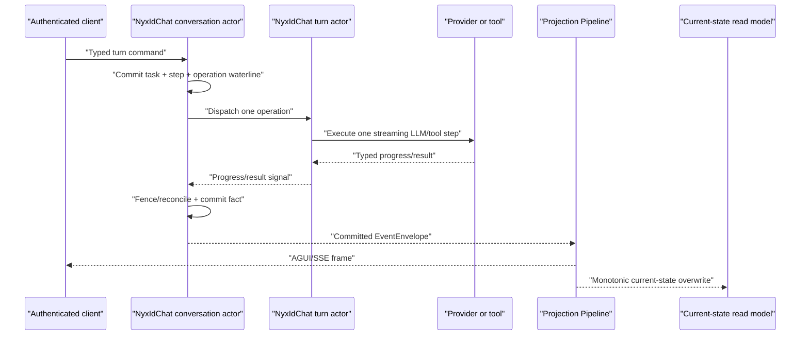
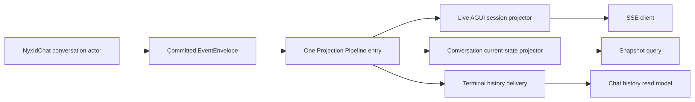

# NyxID Assistant Chat v1 Design

Issues: #2936, #2954, #2955, #2956, #2957, #2961

Milestone: [NyxID Assistant Chat v1](https://github.com/aevatarAI/aevatar/milestone/36)

External boundary input: `/Users/eanzhao/Code/AEVATAR_NYXID_HANDSHAKE.md`, reviewed Schema v3 input; this design defines the proposed Schema v4 corrections

Status: approved design

## 1. Purpose

NyxID Assistant v1 needs one authoritative single-user conversation loop that can:

- report failures honestly from the tool producer through the terminal SSE frame;
- survive page reload, stream loss, actor passivation, and actor restart;
- stop or steer active work without starting hidden concurrent turns;
- expose a typed task plan and stable step lifecycle;
- hand credential-bearing browser journeys to NyxID without moving secrets or mutation authority into Aevatar;
- reconcile late, duplicate, stale, and uncertain operation results deterministically.

The product mismatch being corrected is:

> The current UI transport can imply that a turn, tool, or browser action completed, while the authoritative Aevatar actor either has no corresponding fact or cannot prove that the external state changed.

This is primarily an ownership, contract, and runtime mismatch. The fix is not a frontend card state machine. The fix is an actor-owned conversation/task state machine whose committed facts feed both live observation and durable current-state queries.

## 2. Design constraints

The implementation must preserve these repository invariants:

- `Domain / Application / Infrastructure / Host` layering remains strict. HTTP endpoints perform authentication, admission, DTO mapping, and response writing only.
- Commands enter an actor inbox and produce committed facts. Queries read current-state read models only.
- Committed facts reach AGUI/SSE and durable read models through the same Projection Pipeline.
- Runtime and task facts are actor-owned. No process-local conversation, turn, task, operation, cancellation, or cursor registry may become an authority.
- A single-threaded actor never relies on `lock`, `Monitor`, or `ConcurrentDictionary` to patch business concurrency.
- LLM execution remains stream-first through `ChatStreamAsync` or the existing single-step streaming primitive. No realtime chat path may use `ChatAsync`.
- All durable state, commands, events, callbacks, and internal actor messages are protobuf contracts.
- Stable control semantics are typed fields or typed sub-messages, never arbitrary metadata/items bags.
- Accepted command receipts promise dispatch admission and stable identities, not operation completion or read-model visibility.
- Browser or SSE disconnection is transport behavior. It never means stop, cancellation, decline, or completion.
- Port `5000` and Web API port `5050` remain prohibited.

## 3. Existing-state findings

### 3.1 Honest failure already has a downstream path

Issue #2936 is a producer-boundary defect, not a missing workflow failure engine. The reproduced NyxID proxy validation rejection is returned as ordinary JSON. The existing workflow adapter, execution kernel, committed event path, projection, and SSE mapper already propagate a typed failed receipt as fail-fast terminal failure.

The implementation therefore ports the narrow producer classification from PR #2938 onto the current `feature/integrate` baseline and proves the complete chain. It does not add generic JSON inspection or a parallel terminal system.

### 3.2 Current direct chat occupies one long actor turn

`RoleGAgent.HandleChatRequest` awaits the complete streaming model/tool loop inside one mailbox turn. Stop or steering commands sent to the same actor are queued until that turn ends. Adding fields to the existing state without changing execution shape cannot meet #2954 or #2956.

### 3.3 Live observation is not a reconnect store

NyxIdChat currently activates an attach-only per-turn projection session. Its sink fence deduplicates live delivery but does not form a durable event backlog. The current-state requirement therefore uses a query-shaped actor replica and conditional snapshot polling. It does not reinterpret an attachment lease as durable history.

### 3.4 Terminal transcript and active work have different read concerns

`ChatConversationGAgent` owns terminal transcript turns. It does not own an active NyxIdChat task and must not become the control source for stop, steering, pending approval, browser actions, or in-flight operations.

### 3.5 A reusable single-step execution pattern already exists

`AgentRunGAgent` demonstrates the correct continuation pattern:

1. an actor commits a step waterline;
2. a single LLM or tool I/O step runs;
3. typed I/O facts return to the actor;
4. the actor reconciles and commits the next waterline.

The NyxIdChat implementation reuses or extracts focused single-step execution capabilities from this pattern. It does not reuse channel-specific reply/delivery state as direct-chat business state and does not build a second generic workflow engine.

## 4. Considered approaches

### 4.1 Selected: conversation authority plus run-scoped turn actor

The canonical NyxIdChat actor owns the conversation, active turn, task, step state, control fences, pending actions, and terminal decisions. A short-lived turn actor executes one authorized I/O operation at a time and returns typed signals.

This keeps the conversation actor responsive to stop and steering while preserving actor-serialized authority.

### 4.2 Rejected: extend the existing long `RoleGAgent` turn

This has the smallest apparent code diff, but its mailbox cannot handle stop or steering while `ChatStreamAsync` is executing. Runtime behavior would contradict the API contract.

### 4.3 Rejected: implement a new general workflow engine

The milestone needs a conversation task lifecycle, not a replacement for Aevatar Workflow. A second orchestration framework would violate the single-mainline architecture and the issues' non-goals.

## 5. Ownership model

| Concept | Authoritative owner | Query/transport representation |
|---|---|---|
| Conversation identity and active turn | canonical NyxIdChat conversation actor | scoped endpoint and conversation current-state read model |
| Task plan, step lifecycle, safe actions | conversation actor | current-state read model plus committed AGUI frames |
| Stop and steering decisions | conversation actor | accepted receipt, committed control frames, current-state read model |
| Per-operation execution | run-scoped `NyxIdChatTurnGAgent` | typed progress/result signals to conversation actor |
| Current external-effect evidence | conversation actor | task step snapshot |
| Terminal transcript | `ChatConversationGAgent` | existing chat-history read model |
| Projection session lifecycle | Projection Pipeline actors and explicit leases | live AGUI/SSE attachment |
| NyxID browser journey, consent, risk enforcement, mutation, credentials | NyxID | `nyxid.action.request` frame and safe continuation report |
| Action postcondition truth used by Aevatar | the corresponding typed NyxID-backed read model | application query port consumed before continuation |

The NyxIdChat conversation actor remains the single Aevatar authority. The run-scoped turn actor owns no durable conversation or task decision. It may persist its own operation delivery/recovery waterline, but the conversation actor decides whether a result is current and whether another operation may start.

## 6. Identity model

Every identity has one meaning:

| Identity | Meaning |
|---|---|
| `actorId` | durable conversation address |
| `turnId` | one user submission, approval continuation, steering continuation, or action continuation |
| `taskId` | one task instance owned by a turn |
| `stepId` | stable step identity within a task |
| `operationId` | one LLM/tool I/O attempt |
| `operationGeneration` | monotonic attempt generation for one step |
| `stopRequestId` | idempotency identity of one stop intent |
| `steeringId` | idempotency identity of one steering instruction |
| `actionRequestId` | stable identity of one NyxID browser action request |
| `originTurnId` | terminal blocked turn that emitted an action request |
| `clientRequestId` | caller-created transport retry identity |
| `continuationTurnId` | server-created turn after steering or action continuation |
| `commandId` | command dispatch trace identity |
| `correlationId` | trace-chain identity |
| `stateVersion` | committed conversation-actor version materialized into the read model |

No API or internal helper may reuse a generic `id`, `sessionId`, or `keyId` as multiple resource identities. Safe resource references use a typed protobuf `oneof` rather than an unqualified string.

## 7. State contracts

### 7.1 Turn and task state

The conversation state contains the latest/active turn and a bounded set of recent terminal turn summaries. The active task contains:

- `taskId` and owning `turnId`;
- task status;
- ordered steps;
- active `stepId` and `operationId`;
- stop or steering fence;
- pending approval and browser-action references;
- committed continuation admission, if any;
- actor-derived progress sequence.

Task status is closed:

- `active`
- `succeeded`
- `failed`
- `stopped`
- `blocked`

### 7.2 Step state

Step status is closed:

- `planned`
- `waiting`
- `running`
- `done`
- `failed`
- `skipped`
- `cancelled`
- `uncertain`

`uncertain` means the system cannot prove whether an external effect occurred. It is not success and it is not a retry invitation.

Each step contains:

- stable identity, order, kind, and required/optional policy;
- safe plain-language description;
- typed tool/action/source presentation descriptor;
- current operation identity and generation;
- approval/tool/action correlation identities;
- whether the operation may change external state;
- external-effect evidence;
- safe failure code and message;
- actor-computed available actions.

### 7.3 External-effect evidence

The evidence set is closed:

- `not_started`: no operation entered execution;
- `not_applied`: execution returned typed evidence that no external effect occurred;
- `confirmed`: typed result or postcondition read proves the effect;
- `may_have_changed`: an effect-capable operation started but its final outcome cannot be proved.

Evidence derives from the actor's operation waterline, `AgentToolReceipt`, `AgentToolCallSafety`, side-effect kind, idempotency identity, and typed postcondition read. UI code cannot calculate it.

### 7.4 Available actions

The actor exposes only actions that are safe at the current committed version:

- `retry`
- `skip`
- `stop`

Retry requires proof that either no external effect occurred or the exact logical operation is idempotent under a stable key. Skip requires an optional step or an explicit actor-owned safe-skip policy. A completed or potentially completed non-idempotent effect cannot be repeated.

### 7.5 Transition invariants

- A step may enter `running` only after its operation waterline is committed.
- Only one operation generation may be active for a step.
- A stale/mismatched `turnId`, `taskId`, `stepId`, `operationId`, or generation is ignored or rejected without state advancement.
- Terminal step states do not regress.
- A required `failed` or `uncertain` step prevents task `succeeded`.
- A stop/steering fence prevents all later old-plan operation starts.
- A browser-reported disposition alone never changes a step to `done`.
- Duplicate facts are idempotent; same-version conflicting facts fail explicitly.

## 8. Execution architecture

### 8.1 Conversation actor

The canonical NyxIdChat actor is refactored into a responsive controller. It performs no long provider/tool loop. Its handlers:

- admit or reject new turns;
- create task and step facts;
- authorize one operation generation;
- receive and commit typed progress/results;
- accept stop and steering commands;
- reconcile approvals and browser-action continuations;
- decide terminal state;
- dispatch the next self/turn continuation only after committing the current transition.

NyxIdChat-specific task/action state remains in a NyxIdChat-owned protobuf contract. It is not placed in a generic metadata bag or leaked into unrelated role-agent state.

### 8.2 Run-scoped turn actor

`NyxIdChatTurnGAgent` is short-lived and keyed by an opaque server-created actor address. Callers never parse that address. It receives a typed operation request containing the minimum stable execution input plus runtime-only credential references supplied at dispatch time.

For one operation it:

1. validates the request identity and generation;
2. records/recognizes the operation waterline needed for duplicate admission;
3. executes one streaming LLM step or one tool step;
4. sends typed progress signals to the conversation actor;
5. sends one typed result/failure signal;
6. reaches a terminal delivery state and becomes eligible for cleanup.

Progress callbacks publish signals only. They never mutate conversation/task state.

### 8.3 Single-step execution capability

The implementation extracts or reuses focused behavior from `ChatRuntimeStepExecutor` and the channel `AgentRunGAgent` pattern:

- build one LLM request from committed messages/context;
- execute one streaming LLM step;
- return typed content, reasoning, tool calls, usage, and authorized tool context;
- execute one authorized tool step;
- return typed results and receipts.

Channel-specific card delivery, relay credentials, reply handoff, and channel history do not enter the direct-chat contract.

### 8.4 Operation flow



The conversation commits before observation. The turn actor result is never projected directly as task truth.

## 9. Stop semantics

The canonical endpoint accepts an authenticated typed stop command for a specific `actorId` and active `turnId`. The command has a distinct request identity and transport retry identity.

The actor result is one of:

- accepted;
- rejected with a typed reason;
- already terminal.

On acceptance the actor first commits a durable execution fence. From that point it starts no later model round, tool, retry, or step for the old plan.

The currently executing operation is cancelled only when an existing provider/runtime seam can prove that behavior without introducing an in-process operation-to-CTS authority. V1 therefore permits the honest result `uncancellable`. A late LLM result is discarded as output. A late tool result may update effect evidence but cannot advance the old task.

Stopping an Aevatar turn does not cancel or roll back a NyxID-owned browser journey that was already handed off. A turn that ended `blocked` after an action handoff returns `already_terminal` to stop.

## 10. Steering semantics

An ordinary `:stream` submission while a turn is active returns a typed `ACTIVE_TURN_REQUIRES_STEERING` outcome. It does not enter an invisible queue and does not start another turn.

The typed steering command includes:

- `steeringId` and `clientRequestId`;
- `actorId` and expected active `turnId`;
- the new instruction;
- safe optional input parts.

The conversation actor commits a steering fence before deciding whether to stop, fold, reject, or accept a later continuation. Two simultaneous steering commands are serialized by actor order; they cannot both fork from the same checkpoint.

When continuation is safe, the server creates `continuationTurnId`. Completed steps and confirmed/may-have-changed evidence remain visible. No previously completed external effect is re-executed.

## 11. NyxID browser-action handoff

### 11.1 Boundary ownership

Aevatar owns the action intent, correlation with its task, and decision to continue. NyxID owns:

- browser card and journey state;
- consent title/body/confirm label;
- authoritative risk and remember/grant policy;
- auth modality;
- management mutation;
- credential and secret storage.

Aevatar may read advisory `risk` and `rememberEligible` from the action registry for planning/presentation. NyxID recomputes and enforces them. Aevatar cannot submit or lower risk.

### 11.2 Registry

A startup snapshot from `GET /api/v1/assistant/actions` provides schema revision and supported action descriptors. The host/application adapter validates supported tier and typed parameters against that pinned revision. The manifest is not hot-reloaded in v1.

Unknown revision, unknown verb, unsupported tier, or invalid parameters fail safely before the actor commits an action request.

`service.connect` uses distinct typed variants for a catalog service and a custom endpoint. It does not use `custom: true` to switch the meaning of the same field set. Each patch-style action has its own closed typed schema.

### 11.3 Wire frame

The outer AGUI custom envelope retains `payload`; the action's arguments consistently use `params`:

```json
{
  "name": "nyxid.action.request",
  "payload": {
    "schemaVersion": 4,
    "actorId": "conversation-alpha",
    "originTurnId": "turn-alpha",
    "taskId": "task-alpha",
    "stepId": "step-connect-github",
    "actionRequestId": "action-alpha",
    "action": "service.connect",
    "params": {
      "catalogService": {
        "serviceSlug": "api-github",
        "requestedScopes": ["repo"]
      }
    }
  }
}
```

Before this frame exists, the conversation actor atomically commits the action request, waiting/blocked step, and origin turn's `blocked` terminal fact.

### 11.4 Continuation input

`action.continue` is an authenticated wake-up input, not a completion fact and not an old-turn resume. It includes:

- a continuation `clientRequestId`;
- action reports correlated by `actionRequestId` and `originTurnId`;
- reported disposition;
- optional typed safe resource references.

Reported dispositions are closed:

- `completed`
- `declined`
- `failed`
- `cancelled`
- `expired`

`completed` means the NyxID browser journey reported completion. It does not prove the requested resource mutation. The server creates a new continuation turn and reads the action's declared typed postcondition. Only a matching postcondition changes the step to `done`.

If a different turn is active, the actor rejects the action continuation or commits `accepted_for_later_continuation`. It never starts hidden concurrent execution.

### 11.5 Safe resource references and postconditions

Creation actions may return typed, non-secret resource references as query hints. A generic `id` cannot represent multiple resource kinds.

Every supported action declares a typed postcondition reader and condition. Examples include exact connected-service, key, or node identities. A missing, stale, unavailable, or mismatched read keeps the step waiting/blocked or fails it safely; it never guesses success.

Multiple action reports are independent. A batch is not a transaction and may be partially complete.

### 11.6 Secret boundary

Action commands, events, state, read models, SSE frames, logs, and audit annotations must exclude:

- credentials and access/refresh tokens;
- authorization/cookie headers;
- client secrets;
- OAuth/device/user codes;
- raw upstream response bodies;
- URI userinfo;
- secret-bearing URI query or fragment values.

`device.approve.user_code` is not an Aevatar action parameter. User-code entry stays inside the NyxID browser journey. URLs accepted by safe action parameters reject userinfo and, for v1, reject query/fragment unless a future typed contract explicitly proves they are non-secret.

## 12. Approval relationship

Tool approval and NyxID browser actions remain separate concepts:

- `:approve` resolves `PendingToolApprovalState.requestId` for an Aevatar tool continuation;
- `action.continue` wakes a new turn after a NyxID browser journey;
- an authorization-required or browser-action-blocked turn is terminal and cannot be continued with `:approve`;
- neither path reuses the old turn identity.

Pending approval, denial, expiry, and timeout map to typed step outcomes. No raw approval payload or secret-bearing arguments enter the current-state read model.

## 13. Current-state read model and reconnect

### 13.1 Read model

Projection materializes an actor-scoped `NyxIdChatConversationCurrentStateDocument` from the conversation actor's committed state. Its version is the authoritative actor committed version, not a projection-local counter.

The document exposes query-shaped safe data:

- conversation identity and `stateVersion`;
- active/latest turn and task terminal status;
- ordered step snapshots and effect evidence;
- active operation identity/generation;
- stop/steering fence and committed outcomes;
- pending approval summary;
- pending browser-action summaries and reports;
- latest actor progress sequence;
- updated timestamp.

It does not dump internal actor runtime state or credentials.

### 13.2 Query contract

```text
GET /api/scopes/{scopeId}/nyxid-chat/conversations/{actorId}/state
    ?afterStateVersion={version}&turnId={turnId}
```

The typed result is:

- `current`: server version is newer and a full snapshot is returned;
- `not_modified`: version and optional turn identity match exactly;
- `reload_required`: client version is in the future, identity mismatches, input is invalid, or incremental continuation cannot be represented safely.

V1 deliberately uses full snapshot plus conditional polling. It adds no durable AGUI frame backlog.

The query path reads only the read model. It does not activate actors, replay events, prime a projection, attach a live session, run a model/tool, or create a turn.

### 13.3 Monotonic write behavior

- newer actor versions overwrite older documents;
- duplicate equal-version writes are idempotent when protobuf content matches;
- conflicting equal-version writes fail explicitly;
- older versions cannot overwrite newer state.

## 14. Recovery and late-result reconciliation

### 14.1 Conversation recovery

The conversation actor restores task, steps, control fences, pending actions, and operation generations from protobuf state/event history. Activation may re-dispatch only a typed self-continuation that the committed state proves is outstanding and safe.

### 14.2 Turn-operation recovery

If an operation actor restarts after `started` but before a terminal result:

- an operation proven not started may be admitted again under a new generation;
- an exact operation with a stable idempotency contract may be retried only after conversation policy approves it;
- an effect-capable operation with unknown outcome becomes `uncertain`/`may_have_changed`;
- no operation is automatically replayed merely because a process restarted.

### 14.3 Late signals

Every progress/result signal carries the full reconciliation key. A late or duplicate signal:

- cannot remove a stop/steering fence;
- cannot start a successor;
- cannot change a newer operation generation;
- may add typed external-effect evidence if it proves the outcome of the exact old operation;
- cannot regress a terminal step/task state.

## 15. API surface

Existing canonical routes remain scoped and actor-addressed. New routes are:

```text
GET  /api/scopes/{scopeId}/nyxid-chat/conversations/{actorId}/state
POST /api/scopes/{scopeId}/nyxid-chat/conversations/{actorId}:stop
POST /api/scopes/{scopeId}/nyxid-chat/conversations/{actorId}:steer
POST /api/scopes/{scopeId}/nyxid-chat/conversations/{actorId}/turns/{turnId}/steps/{stepId}:retry
POST /api/scopes/{scopeId}/nyxid-chat/conversations/{actorId}/turns/{turnId}/steps/{stepId}:skip
```

The existing stream route accepts a discriminated text or action-continuation body at its Host boundary. The repository's scoped route is canonical; any NyxID gateway `/api/v1/assistant/...` path is an external alias/adapter and does not define a second Aevatar resource identity.

Control commands return `202 Accepted` with stable request/command identities and the state URL. Actor-owned accepted/rejected/already-terminal facts arrive through the committed observation/read-model path.

## 16. Failure and terminal consistency

- Producer-known tool failures use typed receipts.
- Default required-step behavior is fail-fast unless an explicit typed recovery policy exists.
- SSE HTTP `200` means the stream opened, not that the task succeeded.
- A failed task produces exactly one typed terminal error and no success terminal.
- Authorization and browser-action handoff produce a `blocked` terminal, not success.
- A stopped task produces stopped terminal semantics consistently in task state, snapshot, history, and SSE.
- A required uncertain step prevents success and explains what may have changed.
- Safe messages contain stable codes and redacted summaries only.

## 17. Projection flow



Live and durable projections consume the same committed authority. No endpoint synthesizes task progress around the pipeline.

## 18. Test design

Tests use distinct ID shapes (`conversation-alpha`, `turn-alpha`, `task-alpha`, `step-alpha`, `operation-alpha`, `action-alpha`) so identity aliasing fails visibly.

### 18.1 #2936 honest failure

- NyxID proxy producer returns a typed failure receipt for missing `service_id` with slug.
- Ordinary domain JSON containing an `error` property remains ordinary success unless the producer contract classifies it.
- Failed workflow step does not schedule its ordinary successor.
- Committed run read model is failed.
- An opened SSE stream emits terminal error and no success terminal.

### 18.2 Task lifecycle

- valid transition table and every invalid regression;
- duplicate/mismatched operation results;
- multi-step success;
- pending, denied, expired, and timed-out approval;
- tool failure before effect and failure after confirmed effect;
- uncertain effect after restart/timeout;
- safe and unsafe retry/skip availability;
- required failure/uncertainty terminal consistency.

### 18.3 Stop and steering

- stop before dispatch, during model, during cancellable/uncancellable tool, and between steps;
- duplicate/stale/cross-scope/cross-conversation/wrong-turn stop;
- steering between steps, during operation, and after terminal;
- concurrent steering and action-continuation admission;
- late model/tool results after a fence;
- passivation/restart at each control transition;
- browser/SSE disconnect without stop.

### 18.4 Browser action

- registry revision, supported tier, verb, and typed parameter validation;
- catalog/custom service-connect variants;
- request idempotency and different-payload conflict;
- committed request before frame observation;
- origin turn ends blocked;
- every reported disposition;
- duplicate, partial, out-of-order, cross-scope/conversation/origin reports;
- completed report with matching, missing, stale, unavailable, and mismatched postcondition;
- typed resource-ref identity;
- continuation after reload/restart and arrival during another active turn;
- secret and URL redaction across state, read model, SSE, logs, and audit.

### 18.5 Reconnect and projection

- `current`, `not_modified`, and every `reload_required` case;
- reload during model, tool, approval, browser action, stop, steering, and every terminal status;
- monotonic overwrite, idempotent duplicate, explicit equal-version conflict;
- query path does not use runtime, event store, projection activation, or priming;
- actor replay reconstructs the same snapshot without repeating I/O.

Tests coordinate asynchronous boundaries with `TaskCompletionSource`, `Channel`, or actor messages. New arbitrary `Task.Delay` polling is prohibited.

## 19. Required verification

At minimum the implementation runs:

```text
dotnet restore aevatar.slnx --nologo
dotnet build aevatar.slnx --nologo
dotnet test aevatar.slnx --nologo
bash tools/ci/test_stability_guards.sh
bash tools/ci/query_projection_priming_guard.sh
bash tools/ci/projection_state_version_guard.sh
bash tools/ci/projection_state_mirror_current_state_guard.sh
bash tools/ci/projection_route_mapping_guard.sh
bash tools/ci/architecture_guards.sh
bash tools/docs/lint.sh
```

Targeted project tests run after each TDD slice. Any modified frontend code additionally runs frozen install, `tsc`, tests, and production build, although frontend layout/card implementation is outside this milestone.

## 20. Documentation

The implementation updates `docs/canon/nyxid-chat-api.md` with:

- identity table;
- task/step/action state and transition rules;
- stop and steering routes/outcomes;
- action request and continuation wire examples;
- registry and risk ownership;
- postcondition verification;
- snapshot conditional-polling contract;
- terminal and external-effect consistency;
- cancellation and secret-boundary limits.

The external handshake remains a NyxID/Aevatar boundary input, but the repository canonical document is the CI-governed implementation contract.

## 21. Delivery order

The milestone is implemented as one dependency-ordered mainline:

1. port and verify #2936 producer failure classification;
2. introduce typed NyxIdChat task/control/action contracts and pure transition policy;
3. introduce run-scoped single-step execution and make the conversation actor responsive;
4. add task lifecycle and honest terminal projection;
5. add stop and steering fences;
6. add browser-action request/continuation/postcondition reconciliation;
7. add current-state materialization and conditional snapshot query;
8. complete cross-layer recovery, security, documentation, and full verification.

Each slice must leave a compilable, independently testable mainline. No slice introduces a temporary JSON state format, query-time replay, process-local fact registry, or alternate projection path.
