# Generic Schedule Owner Filtering

## Context

The backend console schedule page at `/admin#/schedules` currently calls:

```text
GET /api/schedules?take=50
```

The endpoint returns every non-Team generic schedule. The page then applies only local
status filters such as enabled, disabled, and failing. The authenticated caller never
enters the query, so the page cannot mean "my scheduled tasks."

The missing ownership fact is not only a UI issue:

- `ScheduledDispatchGAgent` has no owner for a generic schedule.
- `ScheduledDispatchDocument` has no generic owner to filter.
- `ScheduledDispatchListQuery` cannot express an exact generic owner.
- generic get and mutation routes do not enforce owner access.
- the current `scopeId/teamId/memberId` branch on `/api/schedules` leaks Team resource
  semantics into a generic schedule endpoint.

`TeamMemberAutomationOwner`, an active credential owner, and a workflow caller's NyxID
credential subject already exist, but they answer different questions. None of them is
the authoritative answer to "which account owns this generic schedule?"

In this document, **generic schedule resource** means a schedule managed through the
generic `/api/schedules` resource and not owned by a Team member. It may carry either
`ScheduledDispatchScheduleKind.Generic` or `ScheduledDispatchScheduleKind.Workflow`.
The word "generic" never means filtering to the `Generic` enum value alone.

## Goal

Make the schedule page default to the current authenticated NyxID account's generic
scheduled tasks, with ownership enforced end to end:

```mermaid
%%{init: {"maxTextSize": 100000, "flowchart": {"useMaxWidth": false, "nodeSpacing": 10, "rankSpacing": 50}, "themeVariables": {"fontSize": "10px"}}}%%
flowchart LR
    A["Verified ClaimsPrincipal"] --> B["GenericScheduleOwner"]
    B --> C["Generic schedule application facade"]
    C --> D["ScheduledDispatchGAgent committed state"]
    D --> E["CommittedStateEventPublished"]
    E --> F["ScheduledDispatchDocument"]
    F --> G["Exact owner query filter"]
    G --> H["/admin#/schedules: 我的任务"]
```



Platform administrators may explicitly switch to an all-generic-schedules view. Team
member automations remain under their canonical `scope -> team -> member` resources and
do not become generic schedule resources.

## Non-Goals

- Do not infer ownership for historical schedules.
- Do not merge Team member automations into this page or API.
- Do not reuse credential ownership as schedule ownership.
- Do not add query-time event replay, projection priming, or actor-state reads.
- Do not promise read-model visibility in a `202 Accepted` response.
- Do not add ownership transfer or an administrator "claim schedule" action.
- Do not redesign unrelated backend console modules.

## Product Semantics

### Generic schedule ownership

A generic schedule has one immutable owner established when its actor is first
configured. The owner is a strong typed value:

```text
GenericScheduleOwner
  authority
  tenant
  subject
```

For the native console:

- `authority` is the canonical identity authority, currently `nyxid`.
- `tenant` is an identity-provider tenant, not a resource scope. It is empty when the
  verified NyxID identity is not tenant-qualified.
- `subject` is the stable authenticated NyxID user ID.

`scope_id`, workflow scope, Team ID, member ID, schedule target, credential owner,
schedule name, and route position must never substitute for any owner field. Two owner
values match only when all three normalized fields match exactly.

Schedule ownership and execution credential authority remain separate typed fields.
They may originate from the same authenticated account during creation, but one cannot
be reconstructed from the other.

### Team automation boundary

`TeamMemberAutomationOwner` keeps its existing `scopeId/teamId/memberId` semantics.
Both user and administrator generic lists set `ExcludeTeamOwned = true`. Team automation
inspection and mutation continue through canonical member endpoints.

The generic `/api/schedules` endpoint no longer accepts `scopeId`, `teamId`, or
`memberId` as an alternate Team-listing mode. This removes the mixed resource meaning
instead of retaining a hidden compatibility path.

### Historical ownerless schedules

A schedule projected without `GenericScheduleOwner` is `ownerless`, not owned by the
first account that views or updates it.

- It is excluded from `我的任务`.
- It appears only in the administrator `全部任务` view.
- It is labeled `未归属`.
- An administrator may inspect or mutate it, but ordinary updates preserve the null
  owner and never claim it.
- Creating or ensuring the same schedule ID as a different owner returns a conflict.

No backfill uses scope, caller credentials, service identity, prompt, headers, naming,
IDs, or routes. A future ownership migration would be a separate explicit, audited
administrator operation and is outside this change.

## Chosen Architecture

### Strong typed contracts

Add an Application/domain value `GenericScheduleOwner` and its protobuf state message
with `authority`, `tenant`, and `subject`. Add the owner to:

- the generic schedule mutation context used for create/configure admission;
- `ScheduledDispatchCreateCommand`, `ScheduledDispatchUpdateCommand`, and
  `ScheduledDispatchEnsureCommand`;
- `ScheduledDispatchConfiguredEvent`;
- `ScheduledDispatchState`;
- `ScheduledDispatchDocument` through a typed owner sub-message;
- `ScheduledDispatchSummary` and detail output;
- `ScheduledDispatchListQuery` as an exact `GenericScheduleOwner` filter.

The owner is a stable core semantic, so it must not be placed in headers, annotations,
items, or any generic bag.

### Actor invariant

`ScheduledDispatchGAgent` owns the fact.

- First configuration records the normalized generic owner in the committed configured
  event and state.
- Reconfiguration preserves the existing owner.
- A non-null owner that differs from the committed owner is rejected as a conflict.
- A previously ownerless configured actor cannot acquire an owner through update or
  ensure.
- Team-owned actors continue to use `TeamMemberAutomationOwner`; they do not also gain a
  generic owner.
- Event replay restores the same owner and cannot derive it from target or credential
  state.

Trusted internal schedule creation that has no end-user owner remains representable as
ownerless, but no authenticated generic HTTP create path may omit its owner.

### Application authorization boundary

Introduce a narrow generic schedule Application facade for authenticated resource
operations. The schedule HTTP endpoints depend on this facade rather than directly on
the unguarded orchestration surface used by Team automation and trusted internal flows.

The facade accepts a required `GenericScheduleAccessContext` containing:

- the verified current `GenericScheduleOwner`;
- whether platform-administrator authority was verified for this request.

It has the following responsibilities:

- require an owner for generic HTTP creation and pass it into the write command;
- list only the exact current owner for the normal list operation;
- allow a global generic list only for a verified platform administrator;
- read the projected schedule before get/update/enable/disable/run-now/delete;
- allow the operation only when the projected owner exactly matches the caller or the
  access context is elevated;
- treat Team-owned and deleted schedules according to the existing generic-resource
  rules;
- pass the resource's committed owner, not an administrator's personal owner, into any
  reconfiguration so elevation cannot transfer ownership.

The facade performs deterministic, read-model-visible access and collision checks before
dispatch. The Actor remains the final authority for immutable-owner and first-create
invariants. If a concurrent race is discovered only after a command has been admitted,
the already returned `202` remains an admission receipt; the rejection is observed
through committed state/operation observation and the subsequent read, not rewritten as
a synchronous `409`.

For a non-administrator, a missing schedule and another account's schedule produce the
same not-found result. The UI is not an authorization boundary.

### Host identity and administrator resolution

Schedule resource routes require authentication. A single Host-layer owner resolver
derives the owner only from the verified `ClaimsPrincipal`:

1. Require an authenticated principal.
2. Resolve the stable subject with the repository's existing NyxID user-subject
   precedence: `uid`, then `sub`, then `ClaimTypes.NameIdentifier`, then `user_id`.
   `scope_id` is not a user-subject candidate.
3. Read the selected claim once and reject a missing or blank value; do not combine
   values from multiple claims.
4. Use canonical `nyxid` authority.
5. Use only a verified identity-tenant claim for `tenant`; never use `scope_id`.
6. Trim contractually insignificant surrounding whitespace and reject incomplete
   values. Do not case-fold the subject or tenant.

Unauthenticated, missing-subject, or conflicting-subject requests fail closed with
`401`. Request JSON and query parameters contain no owner override.

Administrator checks reuse `IPlatformAdminAuthorizer` and its Aevatar-owned policy.
Only the explicit global list and get/mutation operations that need elevation consult
administrator authority. A missing authorizer, provider failure, malformed identity,
or missing grant is non-elevated. Cancellation still propagates.

### Projection and query flow

`ScheduledDispatchCurrentStateProjector` copies the committed owner from the actor state
into `ScheduledDispatchDocument`. The document retains `stateEvent.Version` as its
`StateVersion`; no owner-specific version or projection counter is introduced.

The query port maps `ScheduledDispatchListQuery.GenericScheduleOwner` into three exact
document filters. These filters are sent to the document store together with
`ExcludeTeamOwned` and `IncludeDeleted = false`, so filtering happens before ordering,
cursor calculation, pagination, and total count. The Application layer does not fetch a
broad page and filter it in memory.

Normal get and mutation authorization reads only `ScheduledDispatchDocument`. It does
not read actor state, replay events, or prime projection. A newly accepted create can be
temporarily absent until the committed state is projected; the UI handles that as
eventual consistency rather than bypassing the read boundary.

## HTTP Contract

### Current user's schedules

```http
GET /api/schedules?take=50&cursor=...
Authorization: Bearer <token>
```

The server derives the current owner and returns only that owner's non-Team,
non-deleted generic schedules. There is no `owner`, `scopeId`, `teamId`, or `memberId`
selector.

### Administrator global schedules

```http
GET /api/admin/schedules?take=50&cursor=...
Authorization: Bearer <token>
```

This separately named endpoint requires verified platform-administrator authority and
returns all non-Team, non-deleted generic schedules, including ownerless historical
ones. Each item exposes its typed owner or null so the UI can render ownership without
guessing.

Existing generic detail and mutation routes use the same Application authorization
facade. They permit the exact owner or a verified platform administrator. They never
accept an elevation flag from the client.

### Error semantics

| Condition | Status | Meaning |
|---|---:|---|
| Missing authentication or authoritative subject | `401` | Caller ownership cannot be established |
| Non-admin calls `/api/admin/schedules` | `403` | Explicit global access denied |
| Resource missing or owned by another user | `404` | Existence is not disclosed |
| Pre-dispatch create/ensure/update detects owner rebinding or ID collision | `409` | Immutable owner conflict |
| Malformed schedule request | `400` | Existing validation behavior |
| Accepted write command | `202` | Dispatch accepted, not yet projected |

The response should use stable machine-readable error codes alongside concise messages;
it must not include another account's owner value in a non-admin error.

## Backend Console Design

The `/admin#/schedules` page keeps its operational, table-first layout.

### Filters

The first-level segmented control is:

- `我的任务`, selected by default for every caller, including administrators;
- `全部任务`, visible only when the existing account probe confirms a platform
  administrator.

The existing status control remains a second-level local filter:

- `全部`
- `启用`
- `停用`
- `有失败`

Changing ownership mode resets pagination/loading state and immediately requests the
matching endpoint. It does not silently widen to all schedules when a request fails.

### Table and states

The own view keeps the current compact columns and actions. The global administrator
view adds an owner column. A null owner renders `未归属`; otherwise the UI shows a
human-usable owner label when already available and retains the stable subject as the
unambiguous fallback. It does not perform per-row identity guesses.

Loading, empty, forbidden, and failed states are distinct:

- own empty state: `当前账号还没有定时任务`;
- global empty state: `当前没有定时任务`;
- status-filter empty state names the active filter;
- failures keep any previously loaded data visible and offer retry;
- `403` in global mode stays global and explains the denied mode; it never falls back to
  the caller's list while presenting it as global data.

Delete requires confirmation. A successful mutation displays honest accepted wording,
then rereads the selected ownership view until the projection reflects the change. It
does not claim `已删除`, `已启用`, or `已执行` solely from a `202` receipt.
If the expected projected state does not appear within the bounded observation window,
the receipt remains `已受理，状态尚未可见` and the page offers refresh; it does not
manufacture success or failure.

### Polling and races

The existing polling loop follows the selected ownership mode. Each request captures a
monotonic generation or request ID. A response is applied only when its generation and
ownership mode still match current state. Switching between `我的任务` and `全部任务`
therefore cannot be overwritten by a late response from the previous mode.

Leaving the schedule page still stops polling. Refresh, status changes, and actions do
not resize fixed table controls or reset the chosen ownership mode.

## Data Flow

```mermaid
%%{init: {"maxTextSize": 100000, "flowchart": {"useMaxWidth": false, "nodeSpacing": 10, "rankSpacing": 50}, "themeVariables": {"fontSize": "10px"}}}%%
sequenceDiagram
    participant UI as "Backend console"
    participant Host as "Schedule Host endpoints"
    participant App as "Generic schedule Application facade"
    participant Actor as "ScheduledDispatchGAgent"
    participant Projection as "Projection pipeline"
    participant ReadModel as "ScheduledDispatchDocument store"

    UI->>Host: "POST /api/schedules + bearer"
    Host->>Host: "Resolve verified GenericScheduleOwner"
    Host->>App: "Create(configuration, access context)"
    App->>Actor: "Create command with owner"
    Actor-->>App: "Accepted admission"
    App-->>UI: "202 + commandId"
    Actor->>Projection: "Committed state event with owner"
    Projection->>ReadModel: "Versioned owner document upsert"
    UI->>Host: "GET /api/schedules"
    Host->>App: "ListMine(access context)"
    App->>ReadModel: "Exact owner filters before pagination"
    ReadModel-->>UI: "Only current owner's generic schedules"
```

## Rollout

The protobuf change is additive. Actor state, commands/events, projector, query port,
Application facade, endpoints, and UI deploy together.

Existing documents without the new owner field remain ownerless. Normal query and
projection paths do not replay or backfill them. A later committed state from a
historical ownerless actor also remains ownerless because update cannot infer or assign
the initial owner.

Immediately after a new create is accepted, `我的任务` may remain unchanged until its
committed state reaches the read model. The UI keeps the accepted receipt visible and
polls normally. Deployment acceptance must test this delay rather than depending on an
instant projection.

## Test Contract

### Core and protobuf

- A first generic create commits and replays the exact normalized owner.
- Both non-Team `ScheduleKind.Generic` and `ScheduleKind.Workflow` resources use the
  same generic owner contract.
- Update and ensure preserve the initial owner.
- A different owner cannot rebind a configured actor.
- An ownerless historical actor stays ownerless after administrator mutation.
- Team-owned schedules do not acquire a generic owner.
- Descriptor tests assert typed owner fields on state, commands, and configured event.

### Projection and query

- The projector copies all owner fields and the committed `StateVersion`.
- Missing historical owner projects as null without inference.
- Exact owner filters include authority, tenant, and subject.
- Owner filtering, Team exclusion, deleted exclusion, total count, and cursor pagination
  are applied by the document query before result mapping.
- Owner A never receives owner B or ownerless documents.
- The administrator global query includes owned and ownerless generic documents but no
  Team-owned documents.

### Application and HTTP

- Create derives ownership from verified server context and rejects a client owner
  field.
- Missing or blank authoritative subject claims return `401`.
- Default list returns only the current caller's schedules, including for an admin.
- Non-admin global list returns `403`; verified admin global list succeeds.
- Get/update/enable/disable/run-now/delete allow the exact owner.
- The same operations hide another user's schedule as `404`.
- A verified administrator can operate another user's or ownerless generic schedule
  without changing its owner.
- Read-model-visible ID collisions and owner-rebinding attempts return `409`; a
  post-admission race preserves the honest `202` contract and is observed asynchronously.
- `scopeId/teamId/memberId` no longer activate a Team-listing branch on the generic
  endpoint.
- Tests use visibly distinct subjects, tenants, Team members, workflows, and services.

### Backend console

- `我的任务` is the initial mode for ordinary users and administrators.
- Only a confirmed administrator sees and can select `全部任务`.
- Each mode calls only its canonical endpoint.
- Global rows render owner and `未归属` correctly.
- Status filtering composes with the active ownership mode.
- Empty, forbidden, loading, retry, and accepted states are distinct.
- Delete asks for confirmation.
- A stale response from the previous ownership mode cannot replace current data.
- Polling stops after navigation away from the page.

### Required verification

Run focused schedule actor, Application, projection, endpoint integration, and backend
console static-asset tests, followed by:

```bash
bash tools/ci/test_stability_guards.sh
bash tools/ci/query_projection_priming_guard.sh
bash tools/ci/projection_state_version_guard.sh
bash tools/ci/projection_state_mirror_current_state_guard.sh
bash tools/ci/architecture_guards.sh
bash tools/docs/lint.sh
```

The implementation also updates the canonical backend-console and schedule API
documentation so future changes preserve the owner and Team-resource boundaries.

## Rejected Alternatives

### Filter the broad response in browser JavaScript

Rejected because the API would still disclose other users' schedules, pagination and
counts would be wrong, and get/mutation authorization would remain absent.

### Infer owner from scope or credentials

Rejected because resource scope, Team ownership, caller credentials, and schedule
ownership are separate identities. The inference would misassign historical schedules
and violate the single authoritative owner requirement.

### Reuse Team automation owner

Rejected because generic personal schedules and Team member automations have different
resource hierarchies and lifecycle contracts. Reuse would make a field carry two
meanings and would let generic routes bypass canonical Team member APIs.

### Make administrators global by default

Rejected because authority is permission to widen scope, not the caller's default
working context. Administrators also begin in `我的任务` and enter `全部任务` explicitly.
