# Issue 2944 Lark Capability Contract Design

## Problem

Issue #2944 exposes two coupled contract defects behind the Studio member
workflow bind failure.

First, `NyxLarkProvisioningService` creates each `api-lark-bot` UserService
with `service_slug`, credential, and label, but no `openapi_spec_url`. The
external-capability admission introduced by #2895 correctly requires one exact
allowlisted operation from the selected UserService endpoint contract. Because
the Lark catalog entry and its per-connection UserServices publish no OpenAPI
document, discovery cannot produce an `operation_id` and every new bind fails
closed.

Second, workflow `nyxid_proxy` arguments currently use `path` as both the
static OpenAPI route template frozen by admission and the concrete request path
executed at runtime. These are different facts. An operation such as a message
resource download has the stable route
`/open-apis/im/v1/messages/{message_id}/resources/{file_key}`, while each run
must supply concrete message and file identities. Reusing one field for both
meanings either rejects the dynamic call during admission or lets runtime route
data replace an admitted contract.

The REST bind endpoint compounds the problem by reducing
`WorkflowExternalCapabilityAdmissionException.Readiness` to a generic
`{ code, message }` response. The typed blocker and remediation already exist
but are not available to REST clients.

## Semantic Ownership

The fix keeps two authorities distinct:

| Fact | Authority | Aevatar responsibility |
| --- | --- | --- |
| Exact UserService identity, owner visibility, credential/access state, route slug, and Node state | NyxID `/api/v1/keys` | Read live facts and map external JSON into typed internal contracts |
| Lark operation allowlist, HTTP method, path template, and operation schema | Versioned Aevatar Lark capability contract | Publish one platform contract and use it consistently for discovery, admission, provisioning, and documentation |
| Bound workflow definition and admitted capability proof | Workflow definition actor | Commit and carry the proof into each run actor |
| Concrete path values for one run | Workflow run actor | Resolve workflow expressions, validate them against the committed operation proof, and dispatch the tool call |

The platform contract does not turn Lark into a Host Connector. Credentials and
the exact callable instance remain NyxID-owned, so execution continues through
`nyxid_proxy` with `user_service_id` and the admitted slug snapshot. The
contract only supplies the missing operation semantics.

## Chosen Approach

The platform ships one embedded, versioned OpenAPI 3.1 document for the
`api-lark-bot` catalog family. The same bytes are exposed through a public Host
endpoint, attached to newly provisioned Lark UserServices when a trusted public
base URL is configured, and used as a strict read-time fallback for existing
catalog-backed Lark connections whose NyxID OpenAPI endpoint explicitly reports
that no documentation contract exists.

This approach restores existing connections without weakening #2895 and also
repairs future provisioning. It is preferred over the alternatives:

- provisioning-only attachment leaves every existing connection frozen until
  an out-of-band NyxID data migration occurs;
- accepting an arbitrary `operation_id` or skipping operation admission for a
  Lark-looking slug destroys the allowlist security boundary; and
- copying a separate OpenAPI document into each caller or workflow creates
  multiple drifting product contracts.

## Versioned Lark Contract

The contract lives as an embedded resource in
`Aevatar.AI.ToolProviders.Lark`. A provider in that project implements a narrow
NyxID endpoint-contract abstraction owned by
`Aevatar.AI.ToolProviders.NyxId`; this preserves dependency direction because
the NyxID provider does not reference the concrete Lark project.

Version 1 exposes only the operations requested by #2944:

| Operation ID | Method | Path template | Admission semantics |
| --- | --- | --- | --- |
| `lark_list_messages` | `GET` | `/open-apis/im/v1/messages` | read-only |
| `lark_send_message` | `POST` | `/open-apis/im/v1/messages` | write; approval required |
| `lark_get_message_resource` | `GET` | `/open-apis/im/v1/messages/{message_id}/resources/{file_key}` | read-only; supports `file_artifact` response mode |
| `lark_batch_get_user_ids` | `POST` | `/open-apis/contact/v3/users/batch_get_id` | non-destructive request; approval required by the current POST policy |
| `lark_list_approval_instances` | `GET` | `/open-apis/approval/v4/instances` | read-only |
| `lark_create_approval_instance` | `POST` | `/open-apis/approval/v4/instances` | write; approval required |
| `lark_get_approval_instance` | `GET` | `/open-apis/approval/v4/instances/{instance_code}` | read-only |

Every operation has an explicit operation-level `x-aevatar-tool` marker. The
marker uses the repository's existing boolean or object schema:

```yaml
x-aevatar-tool:
  enabled: true
  name: lark_send_message
  readOnly: false
  destructive: false
  approval: always
```

There is no document-level wildcard allow. Lark endpoints omitted from the
document, and operations without an enabled marker, remain unavailable to
workflow authoring. Version 1 request schemas constrain stable route, query,
and body shapes needed for authoring without claiming to duplicate the entire
upstream Lark API specification.

The Mainnet Host exposes the exact embedded bytes at:

```text
/api/external-capability-contracts/lark-bot/v1/openapi.json
```

`Aevatar:Lark:CapabilityContractPublicBaseUrl` is the trusted operator setting
used to construct the absolute `openapi_spec_url` sent to NyxID. It must be an
absolute HTTPS URL, except that loopback HTTP is accepted for development using
the repository's existing secure-local URL policy. The user-supplied Lark
registration `webhookBaseUrl` is not a contract authority and is never reused
for this purpose. If the setting is absent, provisioning remains available and
the in-process versioned fallback still supports admission, but no unverifiable
URL is written into NyxID.

## Contract Resolution

`NyxIdExternalWorkflowCapabilitySource` continues to read each exact
UserService from live NyxID facts. Its internal typed snapshot additionally
retains `catalog_service_id` and `catalog_service_slug`; these are service-family
facts, not replacements for `user_service_id`.

Contract resolution follows this order:

1. Fetch `/api/v1/proxy/services/{user_service_id}/openapi.json` using the
   bearer that owns the exact UserService.
2. If a valid document is returned, parse and use it exactly as today. A
   document that exists but is invalid, has no enabled marker, or omits the
   selected operation fails closed; the platform fallback does not hide drift
   in a published document.
3. Only when NyxID explicitly reports that no documentation contract is
   configured, consult registered platform contract providers.
4. The Lark provider matches only when all of the following hold:
   `catalog_service_id` is non-empty, `catalog_service_slug` equals
   `api-lark-bot` using ordinal comparison, and the exact UserService remains
   otherwise ready. A custom service whose display or route slug resembles
   `api-lark-bot` cannot match.
5. If no provider matches, return the existing
   `ENDPOINT_CONTRACT_REQUIRED / OPENAPI_CONTRACT_REQUIRED` readiness result.

The fallback is a read-only versioned resource. It does not create a service
catalog, cache UserServices, or become an authority for identity/access facts.

### Source Evidence

`ExternalCapabilitySourceKind` gains
`EXTERNAL_CAPABILITY_SOURCE_KIND_PLATFORM_ENDPOINT_CONTRACT`. A Lark fallback
readiness proof contains both:

- `NYX_ID_USER_SERVICES`, identifying the live caller/organization visibility
  snapshot; and
- `PLATFORM_ENDPOINT_CONTRACT`, with `source_id` equal to the exact
  `user_service_id`, `source_version = 1`, and the embedded document digest.

`observed_at/fresh_until` describe the readiness evaluation window, not a fake
platform deployment time. They use the same five-minute point-in-time window as
live NyxID OpenAPI evidence. Admission integrity accepts either exact
`NYX_ID_OPEN_API` or exact `PLATFORM_ENDPOINT_CONTRACT` evidence for a NyxID
capability and still requires `NYX_ID_USER_SERVICES`. It never accepts a
platform contract as service identity/access evidence.

## Workflow Path Contract

New workflow `nyxid_proxy` calls carry two separate fields:

```json
{
  "service_id": "us-lark-alpha",
  "slug": "api-lark-bot-2",
  "operation_id": "lark_get_message_resource",
  "method": "GET",
  "path_template": "/open-apis/im/v1/messages/{message_id}/resources/{file_key}",
  "path": "/open-apis/im/v1/messages/${steps.input.json.message_id}/resources/${steps.input.json.file_key}?type=file",
  "contract_digest": "<digest returned by capability discovery>",
  "response_mode": "file_artifact"
}
```

- `path_template` is a required static admission fact for new live binds. It
  must exactly match the selected OpenAPI operation.
- `path` is the concrete relative proxy request target. It may contain workflow
  expressions at authoring time and is resolved by the run actor before tool
  execution. It never participates as the operation identity.
- `service_id`, `slug`, `operation_id`, `method`, `path_template`, and
  `contract_digest` remain static. Dynamic values in any of those fields fail
  admission.

For already-bound v2 definitions, a missing `path_template` is accepted only on
the persisted serving path when the concrete `path` is static and exactly equals
the path template sealed in the existing admission plan. Live `AdmitAsync` for
new/rebound definitions requires the explicit field. This preserves current
serving revisions without reopening the old authoring contract.

### Template Matching

Before dispatch, runtime validates the resolved concrete target against the
actor-owned proof:

1. The proof identity, slug snapshot, operation ID, method, path template, and
   contract digest must exactly match the static arguments.
2. The path component must start with `/`; fragments are rejected. An optional
   query suffix does not participate in route-template matching.
3. Template placeholders must occupy a whole segment (`{message_id}`), never a
   partial segment or catch-all. Literal segments match ordinally and the
   concrete path must have the same number of segments.
4. Placeholder values must be non-empty single segments. Dot segments, encoded
   or literal slash/backslash, NUL, and encoded traversal delimiters are
   rejected before the request reaches `NyxIdApiClient`.
5. A literal mismatch, extra segment, unresolved brace, or operation-proof
   mismatch returns a stable typed tool failure and performs no HTTP request.

This validation proves route membership; it does not reconstruct business data
or refresh the OpenAPI document during execution.

## Actor-Owned Runtime Proof

The committed `WorkflowCapabilityAdmissionPlan` is copied from the definition
binding into `BindWorkflowRunDefinitionEvent` and `WorkflowRunState`. The run
actor is therefore the runtime proof owner; a tool must not query a definition
actor, read model, event store, or process-local registry before execution.

When the run actor installs `ToolCallModule`, it supplies the compiled definition
and an immutable clone of its admission plan. The module builds an actor-scoped
derived map from step ID to the one admitted external capability. This map is
not an authoritative registry: it is rebuilt from actor-owned state on
activation and discarded with the module lifecycle.

For a `nyxid_proxy` step, `ToolCallModule` puts that one capability into the
existing `WorkflowToolExecutionRequest`. The AI workflow adapter maps it to a
strongly typed `AgentToolNyxIdOperationAdmissionContext` field on
`AgentToolExecutionContext`; it is never placed in `ExternalMetadata`.
`NyxIdProxyTool` consumes the typed context and enforces the route matcher.
Non-workflow interactive `nyxid_proxy` calls continue to use live connected
service tooling and do not fabricate a workflow proof.

```mermaid
%%{init: {"maxTextSize": 100000, "flowchart": {"useMaxWidth": false, "nodeSpacing": 10, "rankSpacing": 50}, "themeVariables": {"fontSize": "10px"}}}%%
flowchart LR
    A["NyxID /keys: exact UserService facts"] --> C["NyxID capability source"]
    B["Versioned Lark operation contract"] --> C
    C --> D["Typed readiness + source stamps"]
    D --> E["Definition actor commits admission plan"]
    E --> F["Run actor owns plan clone"]
    F --> G["ToolCallModule selects step proof"]
    G --> H["Typed tool execution context"]
    H --> I["nyxid_proxy validates concrete path"]
    I --> J["Exact UserService proxy request"]
```



## Typed REST Remediation

`StudioMemberEndpoints.HandleBindAsync` catches
`WorkflowExternalCapabilityAdmissionException` before the generic
`InvalidOperationException` branch and returns HTTP 400 with a stable response:

```json
{
  "code": "STUDIO_MEMBER_EXTERNAL_CAPABILITY_NOT_READY",
  "message": "External workflow capability admission failed.",
  "readiness": {
    "executionMode": "interactive",
    "status": "endpoint_contract_required",
    "selectedCapability": { "kind": "nyxid_user_service", "userServiceId": "us-lark-alpha" },
    "blockers": [],
    "remediations": [],
    "sources": []
  }
}
```

Studio Hosting maps the Protobuf readiness into explicit HTTP DTO records in
Studio Application Abstractions. Enum values use stable lowercase snake-case
wire names. The mapping includes all selected capability identity fields,
blocker codes/messages, remediation action/label/trusted locator, and source
kind/id/version/digest/freshness. It never serializes bearer tokens or internal
exception details. Ordinary invalid YAML or member-domain errors retain
`INVALID_STUDIO_MEMBER_BINDING`.

## Provisioning And Existing Connections

For a new catalog-backed `api-lark-bot` connection,
`NyxLarkProvisioningService` includes the trusted version-1
`openapi_spec_url` in the existing `POST /api/v1/keys` body. This uses NyxID's
published create contract; no NyxID endpoint change is required. The operation
remains best-effort with respect to relay provisioning exactly as today. No
secret enters the contract URL or logs.

Existing connections are immediately discoverable through the strict fallback,
so they do not require destructive recreation or an Aevatar-side process-local
migration registry. Operators or users may also persist the URL through the
existing NyxID command:

```text
nyxid service update <user-service-id> --openapi-spec-url <trusted-contract-url>
```

Any user-published OpenAPI is accepted by admission only when it is returned for
the exact selected UserService, parses successfully, contains the exact
operation/method/path, and explicitly enables the operation through
`x-aevatar-tool`. Setting a URL is not itself an admission bypass.

## Error And Migration Guide

The canonical NyxID connected-service document maps bind failures to actions:

| Blocker | Required action |
| --- | --- |
| Invalid static JSON | Keep the arguments document valid JSON; only concrete runtime values may use workflow expressions |
| Exact `service_id` required | Select the exact UserService ID from typed discovery; do not use its slug as identity |
| Exact `operation_id` required | Select an operation returned by capability discovery; do not invent an ID |
| Endpoint contract required | Attach a valid OpenAPI URL or, for a verified catalog-backed `api-lark-bot`, deploy the platform versioned contract provider |
| Operation not found/not allowlisted | Add or select an exact operation with enabled `x-aevatar-tool`; changing only the YAML does not grant access |
| Contract drift | Re-run discovery and replace method, `path_template`, and digest together |
| Concrete path mismatch | Fix runtime path values so they instantiate the admitted template; do not change the template dynamically |

The document also records the boolean/object marker schema, operation IDs,
template matching semantics, public contract endpoint, trusted host setting, and
self-service NyxID update command.

## Testing

Tests use distinct identities such as `user_service_id = us-lark-alpha`, route
slug `api-lark-bot-2`, catalog id `catalog-lark-bot`, and operation ID
`lark_get_message_resource`. At minimum they cover:

- embedded OpenAPI parsing and the exact seven-operation allowlist;
- no document-level wildcard and write/read approval classifications;
- fallback accepted only for a non-empty catalog ID plus exact
  `catalog_service_slug = api-lark-bot`;
- custom or lookalike slugs rejected; an invalid published remote document is
  not hidden by fallback;
- discovery and readiness source stamps distinguish NyxID OpenAPI from the
  platform endpoint contract;
- admission integrity accepts the exact new source and rejects unrelated source
  IDs or missing UserService evidence;
- Lark provisioning emits the trusted `openapi_spec_url` and omits it when Host
  configuration is absent/invalid;
- public endpoint returns the embedded document bytes and content type;
- new live admission rejects a missing/dynamic `path_template`; persisted static
  v2 serving definitions remain executable;
- concrete static and dynamic paths match, while literal drift, traversal,
  encoded slash, extra segment, unresolved template, and proof mismatches fail
  before HTTP dispatch;
- definition admission proof reaches the run actor and typed tool context;
- REST bind returns typed blocker/remediation/source data and retains the generic
  error shape for unrelated domain failures; and
- credentials and sensitive headers never appear in contract resources, REST
  errors, actor state, or test fixtures.

Required verification is proportional to the touched surfaces:

```bash
dotnet build aevatar.slnx --nologo
dotnet test aevatar.slnx --nologo
bash tools/ci/architecture_guards.sh
bash tools/ci/test_stability_guards.sh
bash tools/ci/workflow_binding_boundary_guard.sh
bash tools/ci/query_projection_priming_guard.sh
bash tools/docs/lint.sh
```

Targeted project tests run during each red/green cycle before the full gate.

## Non-Goals

- No NyxID endpoint or database change.
- No arbitrary raw HTTP capability or slug-based admission exception.
- No complete mirror of the upstream Lark API; version 1 exposes only the seven
  operations required by #2944.
- No process-local UserService catalog, actor lookup registry, or query-time
  event replay.
- No automatic mutation of every existing NyxID row; the strict fallback is the
  immediate migration path and the existing NyxID update command is the durable
  optional path.
- No secret, bearer, app ID/secret pair, or sensitive header in the OpenAPI
  resource, admission plan, REST remediation, read model, or logs.

