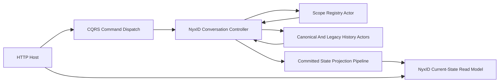
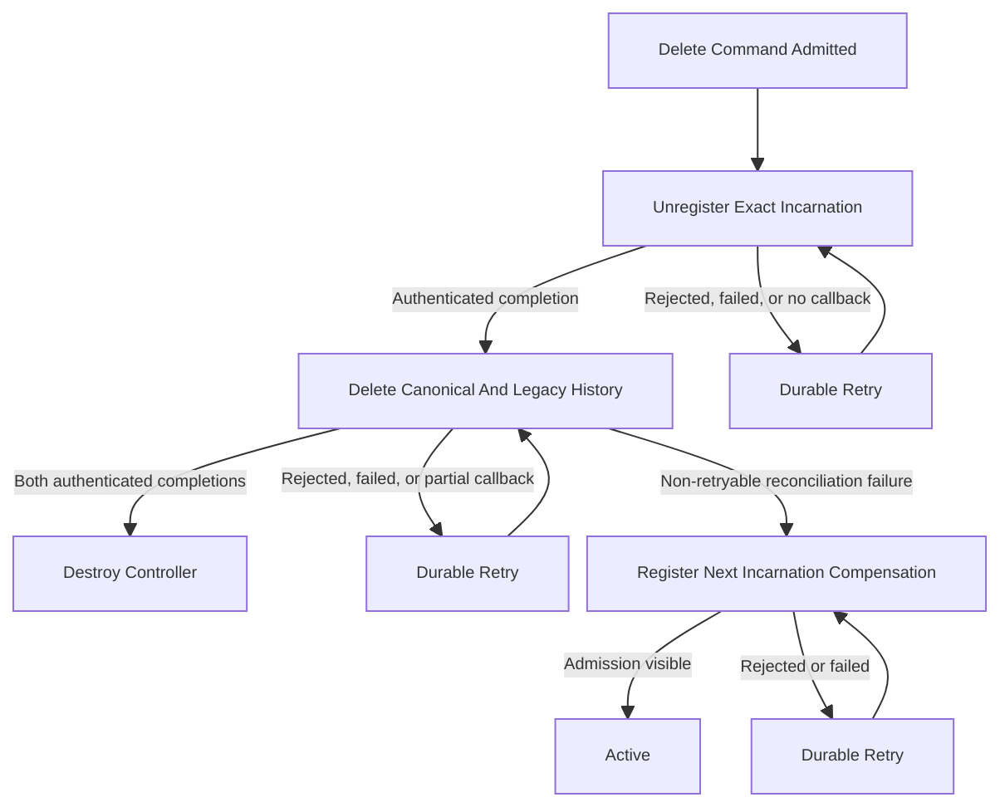

# NyxID Lifecycle Authority Convergence Design

**Date:** 2026-07-27

**Status:** Design option B selected; written-spec review pending

**Scope:** NyxID conversation create/delete admission, Registry membership,
Chat History deletion, lifecycle callbacks, and lifecycle observation

## Context

The merged Agent Profile and NyxID Assistant Chat tree preserves both Git
parents, but its lifecycle protocol still has seven correctness gaps:

1. a missing or rejected dispatch admission can be reported as success;
2. a locally created conversation Actor is leaked when create dispatch fails;
3. a stable self-envelope ID can cause a current continuation to be removed by
   runtime deduplication;
4. Registry callback bookkeeping has a crash window and bounded-ledger ABA
   problem;
5. Chat History stores an unbounded acknowledgement map;
6. typed Registry unregistration can overlook legacy membership rows; and
7. callback consumers trust caller-authored route data without runtime
   authenticated provenance.

This design selects option B: the NyxID conversation controller is the only
durable lifecycle saga owner. Registry and Chat History remain authoritative
owners of their own current state, but do not keep per-operation callback
ledgers. They recompute every response from committed current state. The
controller persists stable business identities and retries through durable
Actor callbacks until it observes authenticated owner responses.

## Goals

- Make HTTP `202 Accepted` mean exactly that the command entered the target
  Actor inbox.
- Keep create/delete progress recoverable across process, Actor, transport,
  and callback interruption.
- Prevent a delayed unregister attempt from deleting a newer registration.
- Remove operation-count-dependent state growth from Registry and Chat
  History.
- Resolve trusted pre-canonical Registry and Chat History data without making
  legacy storage writable again.
- Expose lifecycle progress through the existing actor-scoped current-state
  projection after Registry membership has been removed.
- Preserve the repository's single Projection Pipeline and read-model-only
  query path.

## Non-Goals

- No new generic workflow engine or distributed transaction coordinator.
- No synchronous wait for command commit or read-model visibility in an HTTP
  request.
- No query-time Actor activation, event replay, or projection priming.
- No per-request Registry or Chat History idempotency ledger.
- No reuse of a destroyed NyxID conversation Actor ID.
- No redesign of Agent Profile binding, turn execution, browser actions, or
  Managed Codex behavior outside lifecycle integration points.

## Authority And Identity Invariants

The implementation must keep these identities separate:

| Identity | Owner | Stability | Purpose |
|---|---|---|---|
| command ID | CQRS command context | one HTTP command | trace inbox admission |
| correlation ID | CQRS command context | one related request flow | distributed tracing |
| lifecycle business operation ID | NyxID conversation controller | one logical Registry or history operation | correlate durable retries and callbacks |
| registration incarnation | NyxID conversation controller | one live registration incarnation | fence ABA across unregister and compensation |
| retry generation | NyxID conversation controller | one scheduled retry callback | fence stale durable callbacks |
| transport envelope ID | Actor-bound publisher/runtime | one delivery attempt | runtime delivery deduplication |
| Actor ID | Actor runtime | entire conversation lifetime | address the authoritative controller |

A business operation ID is payload data and must never be reused as a
transport envelope ID. Retrying the same logical operation preserves the
business operation ID and registration incarnation, but every send gets a
fresh transport identity.

New conversation creation generates an opaque, non-reusable Actor ID. The
create API does not accept a caller-selected Actor ID. Once destruction is
accepted, that ID cannot identify a later conversation.

## Architecture



Responsibilities remain strictly separated:

- **Host** validates access and maps typed results to HTTP. It does not
  orchestrate deletion.
- **CQRS Core** resolves a target, builds one command context/envelope,
  dispatches it, and returns an honest admission result.
- **NyxID controller Actor** owns lifecycle phase, stable operation IDs,
  registration incarnation, retry generation, owner completion bits, and
  compensation decisions.
- **Registry Actor** owns current scope membership and incarnation matching.
- **Chat History Actor** owns its conversation tombstone/current state.
- **Projection Pipeline** copies the controller's committed query-shaped state
  to an actor-scoped read model.
- **Query ports** read only that materialized state.

## Shared Command Dispatch Result

`CommandDispatchResult<TReceipt, TError>` will use an explicit discriminator:

```text
Accepted = receipt is present AND admission is present AND admission.Accepted
Rejected = rejected admission is present; no accepted receipt is exposed
Failed   = typed target/preparation error is present; no admission is claimed
```

The public factories enforce these invariants. It must be impossible to
construct `Accepted` with a null admission or with `Accepted == false`.
`DefaultCommandDispatchService` maps a rejected pipeline admission to
`Rejected`, not to success. Custom dispatch implementations must propagate the
real `DispatchAdmission` instead of manufacturing success from a receipt.

The low-level pipeline may still report successful target resolution together
with rejected transport admission. That distinction is useful internally, but
it cannot cross the service boundary as an accepted command result.

All affected consumers migrate in the same change. There is no compatibility
boolean whose value can disagree with the discriminator.

## Local Create Cleanup

`NyxIdChatConversationCreateCommandTarget` implements
`ICommandDispatchCleanupAware` and owns the runtime used to destroy its target.
Cleanup follows these rules:

- only a target created by this resolution (`CreatedLocally == true`) is
  eligible;
- rejected admission and thrown dispatch both trigger cleanup;
- cleanup is idempotent and destroys exactly that Actor ID at most once;
- accepted admission transfers lifecycle ownership to the controller and
  never triggers resolver cleanup; and
- resolving an existing/non-local Actor never destroys it.

The cleanup hook is local admission rollback only. Once the command is
accepted, later registration/history failures are handled by the durable
controller saga.

## Controller Lifecycle State

`NyxIdChatConversationLifecycleState` remains the durable saga state and gains
the minimum fields needed for fencing and retry:

- `registration_incarnation`;
- `retry_generation`;
- `retry_due_at`;
- the existing stable Registry unregistration operation ID;
- the existing stable history deletion operation ID;
- the existing canonical/legacy history completion bits;
- the existing command/correlation IDs and bounded failure summary.

New creation starts at registration incarnation `1`. A compensation
re-registration commits the next incarnation once before its first outbound
attempt and reuses that value for every retry. It does not increment once per
transport attempt. Existing reconstructed state with incarnation `0` is a
legacy-only case; no new registration may write incarnation `0`.

Failure counters saturate rather than overflow. Retry delay is
`min(30 seconds, 1 second * 2^min(retry_generation, 5))` plus deterministic
`0..250 ms` jitter derived from Actor ID and the phase-specific operation key.
Creation registration uses command ID plus registration incarnation as that
key; Registry/history work uses its persisted business operation ID. Tests use
a fake durable callback scheduler; production code does not use `Task.Delay`
or mutate state from a timer callback.

## Continuation And Retry Protocol

Every continuation signal carries:

- the exact lifecycle snapshot;
- `expected_state_version`; and
- the retry generation where applicable.

Immediate self-continuations use the Actor-bound
`PublishAsync(signal, TopologyAudience.Self)` path. The publisher/runtime
creates a fresh envelope ID and stamps authenticated origin. The handler keeps
`OnlySelfHandling = true` and accepts a signal only when all of these match:

- route publisher Actor ID equals the controller Actor ID;
- runtime `DeliveryProvenance.AuthenticatedActorId` equals the controller Actor
  ID;
- expected committed state version equals the current state version; and
- the complete Protobuf lifecycle snapshot equals current lifecycle state.

After an outbound attempt, the controller schedules a durable self timeout
whether the attempt was rejected, threw, or was admitted without a completion
yet. The callback ID is derived from the business operation ID plus the
committed retry generation. Scheduling is idempotent for the same generation.
Before scheduling, the controller commits the retry generation and due time;
if it crashes between commit and scheduling, activation schedules the same
callback again. A callback first re-enters the Actor inbox, then the handler
revalidates version, generation, operation ID, and lifecycle snapshot before
retrying.

Once an authenticated owner completion advances lifecycle state, an older
timeout or duplicate self-continuation becomes a no-op by version/snapshot
fence. The scheduler callback never modifies Actor state directly.

## Registry Membership And Incarnation

Registry current state uses typed memberships:

```text
GAgentRegistryMembership {
    actor_id
    registration_incarnation
}
```

An entry's typed memberships are authoritative. The previous repeated
`actor_ids` wire field remains only as replay/migration input for existing
state and is never emitted by a new registration. A touched legacy entry is
canonicalized into typed memberships by a committed Registry event. Query
responses may still expose actor IDs, but derive them from typed membership;
they do not create a second authority.

Registration semantics are:

- same Actor ID and same positive incarnation: idempotent;
- higher incarnation for the same Actor ID: atomically replace the older
  membership and remove trusted duplicate legacy rows;
- lower incarnation: stale and rejected without mutation;
- incarnation `0`: never written by a new registration; it may appear only as
  the expected incarnation of reconstructed legacy membership.

All live Registry mutations are typed and carry an incarnation. Registration
requires a positive value. Unregistration permits `0` only when probing an
existing trusted legacy row and never writes a zero-incarnation membership.
The former unversioned unregister entry point is removed from live composition;
its Protobuf event remains replay-only for historical event streams. Otherwise
an internal caller could bypass the ABA fence by deleting only on Actor ID.

The typed unregistration request and completion echo the expected registration
incarnation. Unregistration removes a membership only when Actor ID, agent
kind, and incarnation all match.

Registry distinguishes three state-derived outcomes:

- `CommittedRemoved`: the exact current incarnation was removed by this turn;
- `AuthoritativeAbsent`: no membership for that Actor exists after complete,
  trusted legacy resolution; and
- `IncarnationMismatch`: the Actor is registered under another incarnation;
  nothing is removed and the controller must not advance deletion.

`IncarnationMismatch` is deliberately not folded into absence. This fails
closed if controller and Registry authority diverge.

## Registry Legacy Resolution

Before returning absence, typed unregistration inspects every Registry group
that contains the Actor ID:

1. match the canonical agent-kind row;
2. probe non-canonical rows through the registered agent-kind/type authority;
3. classify each candidate as the requested kind, a different trusted kind,
   or unresolved;
4. abort without mutation if any relevant candidate is ambiguous or probing
   fails; and
5. otherwise remove the exact typed incarnation and all trusted legacy rows
   for the requested kind in one committed event.

The Registry cannot report `AuthoritativeAbsent` while an unresolved row could
still represent the requested membership. Multiple trusted legacy rows for
the same requested kind are duplicates and are removed atomically. Rows proven
to belong to another canonical kind remain untouched.

## Registry Response Without An Operation Ledger

The Registry removes `unregistration_operations`, operation ordering,
accepted-dispatch markers, compaction, and capacity checks. It does not promise
to replay an immutable historical outcome.

For every request it evaluates committed current membership, commits an exact
removal when required, and sends a fresh response. Thus a retry can first
observe `CommittedRemoved` and later `AuthoritativeAbsent`; both describe the
same requested incarnation at different current states and are valid deletion
progress. Each response echoes the stable business operation ID but uses a
fresh transport attempt identity.

The Registry sends completions through its Actor-bound `SendToAsync` publisher.
It keeps no callback accepted marker. If it crashes before sending, after
sending, or after the target inbox accepts the callback, the controller's
durable retry causes a new state-derived response. This removes both the crash
window and the retention-slot/ABA failure.

## Chat History State-Derived Deletion

Chat History removes `deletion_acknowledgements` from authoritative current
state and stops writing acknowledgement events. The historical event descriptor
remains replay-only so old event streams still deserialize. Only the
conversation's bounded current tombstone remains. A delete response is computed
from the request tuple and committed current state:

| Owner/current state | Action | Outcome |
|---|---|---|
| canonical, live matching tuple | commit tombstone | `CommittedDeleted` |
| canonical, pristine target | commit tombstone to fence late append | `CommittedDeleted` |
| canonical, matching tombstone | no state change | `AlreadyDeleted` |
| canonical, conflicting tuple | fail closed, no callback | none |
| legacy, live matching tuple | commit tombstone | `CommittedDeleted` |
| legacy, matching tombstone | no state change | `AlreadyDeleted` |
| legacy, pristine or different tuple | no state change | `AuthoritativeAbsent` |

All new append commands are addressed only to the canonical history Actor.
Legacy history Actors remain readable and deletable for migration, but are
permanently read-only for append. This makes legacy absence stable without
remembering every operation ID.

History responses use an owner-bound `SendToAsync` call with a fresh transport
identity. The response carries the request's stable operation ID, exact owner
kind/Actor ID, outcome, source state version, and resolution time. The
controller requires both canonical and legacy completion before advancing.
Canonical `AuthoritativeAbsent` is not accepted because canonical deletion
must leave a tombstone that fences late canonical writes.

## Authenticated Callback Provenance

Registry and History callback consumers validate both claims:

1. `Route.PublisherActorId` equals the exact expected owner Actor; and
2. `Runtime.DeliveryProvenance.AuthenticatedActorId` equals that same Actor.

Payload owner IDs, scope, Actor ID, business operation ID, registration
incarnation, owner kind, completion target, and allowed outcome must also match
the current lifecycle state. Missing authenticated provenance is rejection,
even when the route publisher string is correct. Raw `IActorDispatchPort`
cannot be used to produce these owner callbacks.

## Create Flow

1. Host authorizes the scope and calls the create dispatch service.
2. Target resolution selects Profile binding, allocates a non-reusable Actor
   ID, and creates the controller Actor.
3. A rejected/thrown inbox dispatch invokes local target cleanup. HTTP does not
   return accepted.
4. Accepted inbox admission returns `202` with command/correlation identity and
   transfers ownership to the controller.
5. The controller commits lifecycle state with incarnation `1`, then registers
   that exact membership.
6. Registration success advances to `Active`. Registration failure remains
   controller-owned and uses the existing compensation/cleanup phases with
   durable retries.

## Delete Flow



The controller persists the Registry and history business operation IDs before
their first send. Repeated sends preserve those payload IDs. A deletion
compensation commits `registration_incarnation + 1` once before registering;
later duplicates of the old unregister request cannot remove that membership.

The controller is destroyed only after exact Registry unregistration and both
history owner resolutions. A destroy failure remains in cleanup state and is
retried durably. The final projected lifecycle fact before successful
destruction remains queryable; the read model does not claim a stronger fact
than the controller committed.

## HTTP Contracts

NyxID create and delete return `202 Accepted` only for an accepted dispatch
admission. Both responses contain:

```json
{
  "status": "accepted",
  "actorId": "...",
  "acceptedCommandId": "...",
  "correlationId": "...",
  "statusUrl": "/api/scopes/{scopeId}/nyxid-chat/conversations/{actorId}/state"
}
```

`Location` equals `statusUrl`. The receipt promises inbox admission, not
Registry commit, history deletion, Actor destruction, or read-model freshness.
Missing/rejected admission maps to service unavailable; target absence and
access denial keep their existing `404`/`403` semantics.

The public Chat History DELETE also returns a structured `202`:

```json
{
  "status": "accepted",
  "operationId": "...",
  "correlationId": "...",
  "resourceUrl": "/api/scopes/{scopeId}/chat-history/conversations/{conversationId}",
  "admissions": [
    {
      "ownerKind": "canonical",
      "ownerActorId": "...",
      "acceptedCommandId": "..."
    },
    {
      "ownerKind": "legacy",
      "ownerActorId": "...",
      "acceptedCommandId": "..."
    }
  ]
}
```

The two owner commands share the deletion operation ID and correlation ID but
retain distinct command and transport identities. The endpoint no longer
returns an empty `200`. This receipt promises only both inbox admissions. The
resource URL is not labelled as a command-status URL because no dedicated
history deletion-status read model exists.

If one of the canonical/legacy history dispatches is rejected after the other
was admitted, the endpoint returns unavailable. A retry is safe because owner
behavior is current-state-derived and bounded; no rollback is attempted in the
HTTP call.

## Lifecycle Read Model

The NyxID conversation current-state document and application snapshot add a
query-shaped lifecycle submessage containing:

- wire-stable lifecycle phase;
- command and correlation IDs;
- registration incarnation;
- Registry and history business operation IDs;
- canonical/legacy history completion bits;
- retry generation/due time;
- bounded failure count and last failure code; and
- authoritative controller state version from the committed state event.

The state endpoint queries this document directly by Actor ID and verifies the
document's scope. It must not first require current Registry membership.
Therefore create progress is observable before registration visibility and
delete progress remains observable after unregistration. The query path does
not activate an Actor, read an event store, or prime projection.

The projector continues to consume only
`EventEnvelope<CommittedStateEventPublished>` and performs monotonic overwrite
using the controller's committed version. It does not infer lifecycle state.

## Crash And Recovery Semantics

| Interruption | Recovery |
|---|---|
| local Actor created, command dispatch rejected/throws | CQRS cleanup destroys only that local Actor |
| controller state commit before immediate self publish | activation republishes a fresh fenced continuation |
| outbound owner request accepted before controller records attempt | activation or existing timeout resends the same business operation with a fresh transport ID |
| owner commits removal/tombstone before callback send | controller timeout resends; owner recomputes from committed state |
| callback inbox accepts before producer returns/crashes | durable inbox delivery or a later state-derived duplicate advances controller once |
| one history owner completes and the other does not | committed owner bit survives; retry targets the operation and duplicate completed-owner response is harmless |
| stale retry callback fires after lifecycle advances | version, generation, operation, and snapshot checks make it a no-op |
| old unregister arrives after compensation registration | incarnation mismatch prevents removal |
| Registry legacy probe is unavailable/ambiguous | fail closed without absence response; controller remains retryable |
| controller destroy fails | cleanup phase and durable retry remain committed |

## Data Evolution

- Existing Protobuf field numbers remain reserved or are reused only with the
  same wire type.
- Historical Registry entries containing string Actor IDs are treated as
  legacy migration input. New events write typed positive-incarnation
  memberships only.
- Historical Registry registration events with no incarnation reconstruct as
  legacy incarnation `0`; new command paths reject creation of incarnation `0`.
- Historical Registry unregistration-commit events still apply their recorded
  membership removal during replay, but no longer reconstruct an operation
  ledger. Historical callback-accepted events deserialize and apply as no-ops.
  Their message descriptors are retained and marked replay-only.
- Existing Chat History tombstone fields remain readable. The unbounded
  acknowledgement map stops receiving writes and its field is removed/reserved
  in the new state contract. Historical acknowledgement events retain their
  descriptors and apply as no-ops so replay does not require a runtime
  compatibility path.
- Legacy history Actor addresses remain read/delete targets only. All append
  producers use the canonical address helper.
- API JSON names that remain in use retain one meaning per field. No field
  doubles as both an operation identifier and inline payload.

## Test Matrix

### Shared ACK And HTTP

- accepted result requires a non-null accepted admission;
- null or rejected admission cannot construct accepted result;
- default and custom dispatch services preserve rejected admission;
- create rejected/thrown dispatch destroys one locally created Actor exactly
  once and never destroys a non-local/accepted target;
- NyxID create/delete return `202` only on accepted admission and return the
  exact command/correlation/status URL;
- public Chat History DELETE returns a structured `202`, not empty `200`.

### Runtime Dedup And Provenance

- a stale lifecycle continuation and a current continuation both traverse a
  real deduplicating runtime because their transport IDs differ;
- stale expected version, generation, operation, or snapshot no-ops;
- correct route with missing/foreign authenticated origin is rejected;
- Actor-bound Registry and history sends stamp the real owner in local and
  Orleans runtime tests.

### Registry

- exact incarnation removal commits once, then a retry returns current-state
  absence without an operation ledger;
- stale lower incarnation cannot remove a newer membership;
- deletion, compensation to the next incarnation, ledger-free churn, and late
  old unregister reproduce the ABA sequence without deleting the new row;
- trusted single/multiple legacy rows are removed atomically;
- rows proven to another kind remain;
- ambiguous mapping and probe failure fail closed and cannot report absence;
- repeated/flooded absent unregister requests keep Registry state size
  constant apart from actual memberships;
- reconstruction at every commit/send boundary converges without callback
  accepted markers or capacity slots.

### Chat History

- canonical live, pristine, and already-deleted behavior matches the outcome
  table and leaves a tombstone;
- legacy matching, deleted, pristine, and colliding tuples behave as specified;
- append producers address only canonical Actors and deleted canonical Actors
  reject late append;
- thousands of unique delete operation IDs do not grow Actor state;
- canonical/legacy partial completion plus restart converges;
- duplicate owner responses do not advance lifecycle twice.

### Read Model And Boundaries

- lifecycle fields round-trip through Protobuf, projector, query port, and HTTP
  state response;
- state query succeeds from the read model after Registry removal;
- scope mismatch does not disclose another scope's document;
- query tests prove no Actor activation, event-store replay, or projection
  priming;
- architecture guards cover raw lifecycle callback dispatch, legacy history
  append, and dishonest accepted-result construction where static enforcement
  is practical.

All modified tests must pass `tools/ci/test_stability_guards.sh`. Query/current
state changes must also pass the query priming, projection state version, and
state mirror guards. Full architecture guards, solution build, and relevant
test projects run before the merge commit.

## Acceptance Criteria

The design is complete when all of the following are true:

1. no public accepted result can represent missing or rejected admission;
2. no create admission failure leaks a locally created Actor;
3. Registry and Chat History state do not grow with lifecycle operation count;
4. an old unregister can never delete a newer registration incarnation;
5. all owner and self callbacks require runtime-authenticated provenance;
6. all retry attempts use fresh transport IDs and durable state fences;
7. legacy Registry ambiguity fails closed and legacy history receives no new
   append;
8. lifecycle progress remains queryable after Registry removal without
   query-time priming;
9. the complete 329-path parent-union preservation audit remains clean; and
10. a fresh final review reports no Critical or Important lifecycle finding.
