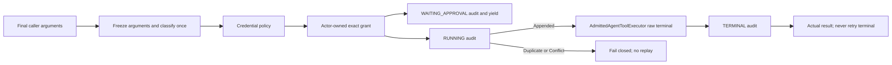

<<<<<<< HEAD
# Ornn / Aevatar Platform Codex Exec Skill Upgrade - Design Spec

- **Date:** 2026-07-27
- **Status:** Accepted
- **Scope:** Unify every server-owned `IAgentTool` execution surface behind admitted
  execution, including Ornn skills, workflow tools, direct Responses tools, NyxID channel
  tools, MCP, voice, and `codex_exec`.

## 1. Problem

Tool discovery and tool execution are separate concerns. A tool may come from an Ornn skill,
an Aevatar provider, NyxID, MCP, a workflow adapter, or a direct Responses tool plan, but a
server-owned side effect must not inherit a different security pipeline from each source.

The old execution shape allowed local callers to compose next-style middleware, synchronous
approval handlers, receipt finalizers, or a Responses-only execution wrapper around a raw
`IAgentTool.ExecuteAsync` call. That made admission optional and allowed approval or audit to
cover arguments different from the arguments eventually executed.

## 2. Goals

- One abstraction for every server-owned tool call.
- One raw terminal implementation across the solution.
- One frozen argument payload and one safety classification per attempt.
- Actor-owned durable approval with exact-call binding.
- Durable audit as a precondition for side effects and an honest record after side effects.
- Closed NyxID action semantics and fail-closed SSH exposure.
- A hard ownership split between local and client-forwarded tools.

This design does not turn client-forwarded functions into local tools, add a new audit store,
change workflow protobuf approval payloads, or create a second tool execution pipeline.

## 3. Public Contract

`Aevatar.AI.Abstractions.ToolProviders.IAgentToolExecutionPort` is the only application-facing
execution abstraction. Its request is intentionally narrow:

| Field | Meaning |
|---|---|
| `Tool` | Exact server-owned `IAgentTool` selected by the caller's frozen tool plan. |
| `ArgumentsJson` | Final argument string after all caller-owned rewrites. |
| `ExecutionContext` | Typed request, caller, channel, schedule, credential, and correlation context. |
| `ApprovalContinuationMode` | `None=0` or `ActorOwned=1`. |
| `ApprovalGrant` | Optional exact-call durable grant. |

The grant binds `ApprovalRequestId`, `RequestId`, `ToolName`, `ToolCallId`, and
`ArgumentsSha256`. The digest is computed from the actor-persisted original
`arguments_json`; it is not accepted from an approval client and does not require a protobuf
change.

The outcome kind is `Executed`, `ExecutedAuditIncomplete`, `ApprovalRequired`, `Denied`, or
`Failed`. `FailureStage`, `TerminalInvoked`, `Retryable`, and `AuditCompleted` state exactly
how far the attempt progressed.

## 4. Admission Algorithm

Caller-owned hooks finish before the request crosses the port. Inside
`AdmittedAgentToolExecutor`, the exact argument string is immutable for the remainder of the
attempt. The executor calls `GetCallSafety` once and reuses the result for credential policy,
approval, audit records, receipt construction, and terminal execution.



The audit phases have these semantics:

| Phase | Durable append result | Terminal behavior |
|---|---|---|
| `WAITING_APPROVAL` | `Appended` or same-fact `Duplicate` | Yield `ApprovalRequired`; terminal remains untouched. |
| `WAITING_APPROVAL` | `Conflict` or unavailable | Fail closed; terminal remains untouched. |
| `RUNNING` | `Appended` | Exactly one permission to enter the raw terminal. |
| `RUNNING` | `Duplicate` | The exact call already started; return non-retryable failure and do not replay. |
| `RUNNING` | `Conflict` | Fail closed as non-retryable and do not execute. |
| `RUNNING` | unavailable | Fail before terminal; retry is allowed because no side effect started. |
| `TERMINAL` | `Appended` or same-fact `Duplicate` | Return the actual terminal outcome with completed audit. |
| `TERMINAL` | `Conflict` or unavailable | Preserve the actual terminal outcome; mark audit incomplete and never retry the tool. |

Credential policy runs before approval and before every downstream tool operation. A missing
or stale sender credential therefore cannot be rescued by a grant. A grant mismatch fails
closed. Approval does not mean that a tool ran; only `RUNNING Appended` allows terminal entry.

## 5. Ownership and Callers

Every production call of raw `IAgentTool.ExecuteAsync` is owned by
`Aevatar.AI.Core.Tools.AdmittedAgentToolExecutor`. Server-owned execution surfaces inject and
call `IAgentToolExecutionPort`, including streaming/chat loops, role actors, workflow
adapters, direct Responses, NyxID channel turns, scheduled skill runs, MEAI, MCP, voice, and
human-interaction skill adapters.

Workflow approval is actor-owned. The actor persists the original tool name, arguments,
execution id, tool call id, and approval request id. Resume messages carry only reconciliation
keys; the actor reconstructs the exact grant from persisted state.

Responses ownership is resolved before execution:

- substitute and additive Aevatar tools are server-owned and enter the port;
- names in `owned_tool_names` cannot fall back to client forwarding;
- client-forwarded tools are returned as pending calls and never enter the port, so their
  port invocation count is zero.

## 6. NyxID Actions and SSH

`nyxid_approvals` and `nyxid_services` share a closed typed action parser. The parser is the
single source for JSON Schema enums, `GetCallSafety`, and terminal dispatch.

Only a valid JSON object with no `action` uses the read-only `list` default. Blank or malformed
JSON, arrays, scalar JSON, non-string/null/blank actions, and unknown actions classify as
approval-required destructive input. If such input ever reaches a terminal, it returns
`{"error":"invalid_action"}` without HTTP or SSH I/O.

All mutations require approval. Denial of approval decision, grant revocation, service
deletion, service mutation, or credential rotation produces zero downstream calls. Credential
rotation is admitted before its preparatory service `GET`, so denial produces neither the
read nor the update.

`ssh_exec` and `codex_exec` are disabled by default. Hosts must explicitly opt in with
`EnableSshExecTool`, and exposure does not weaken admission: both tools always require a
durable actor-owned grant. No configuration can bypass that requirement.

## 7. Removed Surfaces

The following are deleted instead of retained as compatibility layers:

- next-style `IToolCallMiddleware` and per-caller middleware chains;
- synchronous approval handlers and yield/missing handler variants;
- credential-policy and tool-execution audit middleware;
- tool-call receipt finalizer and old audit DI/wiring guard;
- Responses-only safe tool executor wrapper;
- silent null execution adapter;
- SSH approval bypass.

Provider-specific telemetry may still wrap the admitted port, but it cannot call the raw
terminal or implement a second approval/audit decision path.

## 8. Verification

The implementation is accepted only when all of the following hold:

1. Solution-graph analysis finds exactly one production raw terminal, in
   `AdmittedAgentToolExecutor`.
2. Every known server-owned execution surface invokes `IAgentToolExecutionPort`.
3. Safety classification is called once for the exact executed argument string.
4. Credential denial, grant mismatch, approval denial, SSH denial, service deletion denial,
   grant revocation denial, and credential rotation denial have zero downstream calls.
5. Credential rotation denial has zero preparatory `GET` calls as well as zero updates.
6. `RUNNING Duplicate` and `RUNNING Conflict` never replay the tool.
7. Terminal audit failure preserves the real result and reports a non-retryable outcome.
8. Client-forwarded calls invoke the local execution port zero times.
9. SSH is absent by default and remains grant-gated after explicit opt-in.
10. Production composition fails at startup when durable audit dependencies are missing.

See [ADR-0045](../../adr/0045-admitted-agent-tool-execution.md) for the governing decision.
=======
# Ornn Aevatar Platform Codex Exec Skill Upgrade Design

## Status

Approach A approved on July 27, 2026. The written specification is awaiting
final review before implementation.

## Goal

Upgrade the canonical Ornn `aevatar-platform` skillset so an agent can discover,
configure, invoke, verify, and diagnose Aevatar `codex_exec` using the current
runtime contract. Update only skills whose behavior or routing is affected.

This is a skill-content and skillset-publication change. It does not change the
Aevatar, NyxID, Ornn, or chrono-sandbox product implementations.

## Product Mismatch

The published Ornn skills imply an obsolete managed execution path:

- Aevatar directly owns OpenSandbox provisioning and credentials;
- managed access depends on `llm:proxy` consent;
- Credential Vault or a credential proxy injects the runner token;
- Landlock is the required inner isolation boundary;
- process-local capacity and old sandbox failure names describe readiness.

The current implementation instead uses one typed Aevatar tool with two
infrastructure targets. Managed execution flows through the user's exact NyxID
`chrono-sandbox` UserService into a one-shot gVisor workload. Private SSH flows
through a user-owned NyxID SSH service and the target host's Codex installation.

The `aevatar-platform@1.11` skillset does not include either canonical
`codex_exec` skill, so its router cannot discover the capability. Its platform
map also presents `scope -> team -> member -> service` as a global linear
lifecycle, which conflicts with the current identity boundary: `memberId`,
`workflowId`, and `publishedServiceId` identify separate resources.

## Verified Sources

The upgrade is grounded in these exact sources:

- Aevatar commit `7985ff355e76542182fb89b148a5e027e3dce6a7`:
  - `NyxIdCodexExecTool` argument admission and target dispatch;
  - `ManagedCodexExecutionCoordinator` transparent credential readiness;
  - `NyxIdManagedCodexChronoTransport` fixed NyxID proxy call and result mapping;
  - `PrivateSshCodexExecutionAdapter` fixed Base64-to-`codex exec -` command;
  - `docs/canon/managed-codex-execution.md` and focused tests.
- chrono-sandbox managed branch commit
  `1e8134d8ac5f256e90bebb70695200a5c46aa72c`:
  - exact `POST /codex/execute` contract;
  - fixed runtime profile and Codex command;
  - gVisor workload creation, bounded JSONL parsing, timeout classification,
    strict cleanup, and sanitized diagnostics.
- Codex CLI `0.144.5`, pinned by the Aevatar runner image, plus the current
  official Codex non-interactive-mode manual.
- Ornn API and registry state read on July 27, 2026:
  - `aevatar-platform@1.11` and its exact 12-member closure;
  - `aevatar-codex-exec-node-setup@3.0`;
  - `aevatar-codex-exec-workflow-sample@2.0`;
  - current immutable-version and system-assigned skillset-revision contracts.

The chrono-sandbox default `main` branch does not yet contain the managed Codex
surface. Skill claims about that surface must therefore cite the managed branch
above and the matching Aevatar integration contract, not chrono-sandbox `main`.

## Authoritative `codex_exec` Contract

### Shared tool boundary

`codex_exec` accepts only:

- a strongly typed `target`;
- `prompt`, capped at 6000 UTF-8 bytes;
- optional `timeout_secs`;
- `workspace` only for `managed_sandbox`.

It does not expose a repository, workspace path, image, architecture, model,
provider, credential, shell command, approval flag, Codex profile, or sandbox
implementation. Target fields cannot be mixed.

### Managed sandbox

The caller supplies:

```json
{
  "target": { "kind": "managed_sandbox" },
  "workspace": { "kind": "empty_git" },
  "prompt": "Reply with exactly CODEX_EXEC_READY",
  "timeout_secs": 180
}
```

The default and maximum managed timeout are 180 seconds. The tool does not
request remote-tool approval. The normal path is:

```text
codex_exec
  -> ManagedCodexExecutionCoordinator
  -> transparent per-NyxID-user credential readiness
  -> exact personal chrono-sandbox UserService through NyxID
  -> chrono-sandbox POST /codex/execute
  -> one-shot OpenSandbox workload under gVisor
  -> fixed Codex CLI command
  -> bounded terminal result and strict cleanup
```

chrono-sandbox writes the prompt as data and runs:

```bash
codex --ask-for-approval never exec --ephemeral --json \
  - < /workspace/.aevatar/prompt.txt
```

The runtime-written Codex profile fixes the Responses provider, model, retry
bounds, approval policy, and `sandbox_mode="danger-full-access"`. This is not a
caller-granted host permission: Codex's inner sandbox is deliberately disabled
because gVisor is the workload isolation boundary. There is no Landlock,
Bubblewrap, Credential Vault substitution, or TLS-intercepting credential proxy
in this design.

NyxID terminates Aevatar's persistent per-user invocation key and injects a
five-minute delegation token into the one-shot process only as
`NYXID_LLM_TOKEN`. The current internal rollout validates exact `proxy:*`
delegation and remains `InternalOnly`; skills must not generalize this into a
public security guarantee or instruct callers to handle either raw credential.

A successful managed tool result is structured JSON containing:

- `status="succeeded"`;
- `target="managed_sandbox"`;
- final Codex text in `output`;
- `exit_code=0`;
- a sanitized `diagnostic_id`;
- optional `elapsed_ms`.

### Private SSH

The caller supplies:

```json
{
  "target": {
    "kind": "private_ssh",
    "private_ssh": {
      "service": "personal-codex-node",
      "principal": "runner"
    }
  },
  "prompt": "Reply with exactly CODEX_EXEC_READY",
  "timeout_secs": 300
}
```

Private SSH accepts no `workspace`. Its timeout defaults to 30 seconds and is
capped at 300 seconds. Aevatar Base64-encodes the prompt and sends a fixed
decode pipe ending in `codex exec -` through the selected NyxID SSH service.
The target host owns the Git workspace, Codex authentication/configuration,
forced-command wrapper, and Codex sandbox policy.

Private SSH approval remains host policy: it requires the local tool-approval
path unless that Aevatar host explicitly sets `BypassSshExecApproval`. The tool
returns the NyxID SSH response without converting it to the managed result
shape. Verification therefore checks the SSH response's `exit_code`,
`timed_out`, and stdout rather than managed `status/target/diagnostic_id` fields.

## Skill Changes

| Skill | Current | Target | Required change |
|---|---:|---:|---|
| `aevatar-codex-exec-workflow-sample` | 2.0 | 3.0 | Preserve the valid typed payloads; replace OpenSandbox-era readiness, failure, and isolation claims; document the distinct managed and SSH result contracts. |
| `aevatar-codex-exec-node-setup` | 3.0 | 4.0 | Replace the obsolete managed architecture and security model; update prerequisites, transparent readiness, operations handoff, failure map, and dependency to sample 3.0; retain and re-verify private SSH hardening. |
| `aevatar-platform-map` | 1.7 | 1.8 | Route setup/use/verification to the two canonical Codex skills; correct member/workflow/service identity semantics; stop presenting one global lifecycle. |
| `aevatar-feasibility-advisor` | 1.1 | 1.2 | Add target selection and feasibility boundaries: managed empty ephemeral Git work versus user-owned private SSH workspace. |
| `aevatar-triage` | 1.3 | 1.4 | Add layered Codex diagnostics across Aevatar, NyxID, chrono-sandbox, OpenSandbox/gVisor, runner, and private SSH using current stable errors and sanitized diagnostics. |
| `aevatar-platform` skillset | 1.11 | system-assigned next revision | Reference the five upgraded versions, add both Codex skills as members, and update the master router instructions and description. |

No content change is planned for `workflow-authoring`, `team-builder`,
`scheduler`, `service-publisher`, `automation`, `channels-delivery`, either
NyxID connector skill, or the fallback skill. They neither teach the obsolete
managed boundary nor own `codex_exec` setup. A workflow that needs Codex must
load the canonical Codex setup/sample skill for its exact payload instead of
duplicating the contract inside workflow-authoring.

## Product Routing Semantics

The platform router will treat `codex_exec` as an in-session execution
capability, not as a new Studio resource stage:

- “Can Aevatar use Codex for this?” -> `aevatar-feasibility-advisor`.
- “Set up or repair Codex execution” ->
  `aevatar-codex-exec-node-setup`.
- “Prove the configured route works” ->
  `aevatar-codex-exec-workflow-sample`.
- “Put a Codex task in a workflow” -> load the canonical Codex contract first,
  then use `aevatar-workflow-authoring` for the workflow document.
- “Why did codex_exec fail?” -> `aevatar-triage`, which may hand off to the
  setup skill after locating the failing boundary.

The router must keep these resource identities separate:

- `memberId`: Studio team-member authority and the member workflow-editor path;
- `workflowId`: draft/definition identity only;
- `publishedServiceId`: callable service identity only.

The workflow editor is a member implementation surface. It does not make the
member ID a workflow ID, and publishing does not turn either ID into a service
ID by string convention.

## Skill TDD and Verification

Each skill is upgraded and deployed independently. Do not batch author all
skills and test only at the end.

For each skill:

1. Save the exact published old version as the current-behavior baseline.
2. Run realistic retrieval/application scenarios both without the skill and
   against that version. Record the no-skill control, the old skill's incorrect
   or missing behavior, and any rationalization the agent uses.
3. Author the minimal next version that corrects those observed failures.
4. Validate the package with Ornn's current skill-format validator.
5. Run the same scenarios against the candidate and inspect every result.
6. Check for stale terms and forbidden claims.
7. Publish the immutable version.
8. Read it back by exact version and verify its file hash/content before moving
   to the next skill.

At minimum, scenarios must prove that an agent:

- emits the exact managed and private request shapes without mixed fields;
- selects managed only for bounded work in an empty ephemeral Git repository;
- selects private SSH when the user's fixed host workspace/config is required;
- does not request model, image, raw credential, or sandbox flags;
- identifies gVisor as the managed isolation boundary and does not propose
  Landlock, Credential Vault, or credential-proxy repair;
- distinguishes structured managed results from raw SSH results;
- routes setup, verification, authoring, and triage to the right skill;
- preserves member/workflow/service identity separation.

Static scans for the two managed Codex skills must reject stale assertions for
`llm:proxy`, Credential Vault injection, credential proxy, Landlock, direct
Aevatar OpenSandbox ownership, caller-selected model/image/profile, and a
process-local capacity slot. Historical context may name an obsolete term only
to say explicitly that it is not the current design.

## Publication Order and Identity Boundary

Two Ornn owners are involved:

- NyxID user `2db990b5-29ea-4a32-acf5-0008420afa1f` owns the two
  `aevatar-codex-exec-*` skills.
- NyxID user `5d0d7b72-acff-49af-bb1b-9f30bbb7c102` owns the three platform
  skills and `aevatar-platform` skillset.

The safe publication sequence is:

1. Authenticate as the Codex-skill owner.
2. Publish and read back workflow sample 3.0.
3. Publish and read back node setup 4.0, pinned to sample 3.0.
4. Authenticate as the platform owner.
5. Publish and read back platform map 1.8.
6. Publish and read back feasibility advisor 1.2.
7. Publish and read back triage 1.4.
8. Publish the skillset with all exact member refs and the complete new master
   instructions; Ornn assigns the next minor revision.
9. Resolve the exact new skillset closure and verify the five upgraded refs,
   both Codex skills, the master prompt, member visibility, and hash stability.

Never pass tokens between profiles, print them, copy profile files, or use one
owner's credential to impersonate the other. If the first owner cannot be
authenticated, stop before publishing any dependent platform versions rather
than creating duplicate replacement skills.

## Failure and Rollback Semantics

Ornn skill versions and skillset revisions are immutable. If a candidate fails
before publication, discard the candidate and leave the registry unchanged. If
a published version is wrong, publish a corrected next version; do not delete
or mutate history as rollback.

Do not update the skillset until every referenced member version has been
published and read back successfully. This keeps `aevatar-platform@1.11`
as the latest revision if implementation pauses during the cross-account phase.
Before the skillset publish, resolve every proposed member ref and validate the
complete request locally. If the post-publish exact readback still reveals a
defect, 1.11 remains the prior known-good revision but cannot become latest
again; publish a corrected next revision after repairing the member or master
prompt.

## Acceptance Criteria

The upgrade is complete when:

- all five affected skills exist at the target versions and pass Ornn format
  validation plus their forward scenarios;
- their published files match the verified local candidates exactly;
- the new `aevatar-platform` revision resolves a readable, conflict-free
  closure containing both canonical Codex skills and the three upgraded
  platform skills;
- the master prompt routes Codex feasibility, setup, sample verification,
  workflow authoring, and triage correctly;
- no affected current skill teaches the obsolete managed security or ownership
  model;
- all unchanged skillset members retain their exact previous refs;
- no Aevatar, Ornn, NyxID, or chrono-sandbox source repository is modified as
  part of publishing the skill content.
>>>>>>> origin/feat/2026-07-10_scheduled-agent-key-credential
