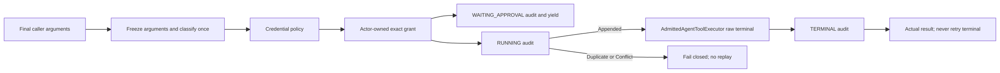

# Ornn / Aevatar Platform Codex Exec Skill Upgrade - Design Spec

- **Date:** 2026-07-27
- **Status:** Accepted
- **Scope:** Unify every server-owned `IAgentTool` execution surface behind admitted
  execution, including Ornn skills, workflow tools, direct Responses tools, NyxID channel
  tools, MCP, voice, and `codex_exec`.

## 1. Problem

Tool discovery and tool execution are separate concerns. A tool may come from an Ornn skill,
an Aevatar provider, NyxID, MCP, a workflow adapter, or a direct Responses tool plan, but a
server-owned side effect must not inherit a different security pipeline from each source.

The old execution shape allowed local callers to compose next-style middleware, synchronous
approval handlers, receipt finalizers, or a Responses-only execution wrapper around a raw
`IAgentTool.ExecuteAsync` call. That made admission optional and allowed approval or audit to
cover arguments different from the arguments eventually executed.

## 2. Goals

- One abstraction for every server-owned tool call.
- One raw terminal implementation across the solution.
- One frozen argument payload and one safety classification per attempt.
- Actor-owned durable approval with exact-call binding.
- Durable audit as a precondition for side effects and an honest record after side effects.
- Closed NyxID action semantics and fail-closed SSH exposure.
- A hard ownership split between local and client-forwarded tools.

This design does not turn client-forwarded functions into local tools, add a new audit store,
change workflow protobuf approval payloads, or create a second tool execution pipeline.

## 3. Public Contract

`Aevatar.AI.Abstractions.ToolProviders.IAgentToolExecutionPort` is the only application-facing
execution abstraction. Its request is intentionally narrow:

| Field | Meaning |
|---|---|
| `Tool` | Exact server-owned `IAgentTool` selected by the caller's frozen tool plan. |
| `ArgumentsJson` | Final argument string after all caller-owned rewrites. |
| `ExecutionContext` | Typed request, caller, channel, schedule, credential, and correlation context. |
| `ApprovalContinuationMode` | `None=0` or `ActorOwned=1`. |
| `ApprovalGrant` | Optional exact-call durable grant. |

The grant binds `ApprovalRequestId`, `RequestId`, `ToolName`, `ToolCallId`, and
`ArgumentsSha256`. The digest is computed from the actor-persisted original
`arguments_json`; it is not accepted from an approval client and does not require a protobuf
change.

The outcome kind is `Executed`, `ExecutedAuditIncomplete`, `ApprovalRequired`, `Denied`, or
`Failed`. `FailureStage`, `TerminalInvoked`, `Retryable`, and `AuditCompleted` state exactly
how far the attempt progressed.

## 4. Admission Algorithm

Caller-owned hooks finish before the request crosses the port. Inside
`AdmittedAgentToolExecutor`, the exact argument string is immutable for the remainder of the
attempt. The executor calls `GetCallSafety` once and reuses the result for credential policy,
approval, audit records, receipt construction, and terminal execution.

The audit phases have these semantics:

| Phase | Durable append result | Terminal behavior |
|---|---|---|
| `WAITING_APPROVAL` | `Appended` or same-fact `Duplicate` | Yield `ApprovalRequired`; terminal remains untouched. |
| `WAITING_APPROVAL` | `Conflict` or unavailable | Fail closed; terminal remains untouched. |
| `RUNNING` | `Appended` | Exactly one permission to enter the raw terminal. |
| `RUNNING` | `Duplicate` | The exact call already started; return non-retryable failure and do not replay. |
| `RUNNING` | `Conflict` | Fail closed as non-retryable and do not execute. |
| `RUNNING` | unavailable | Fail before terminal; retry is allowed because no side effect started. |
| `TERMINAL` | `Appended` or same-fact `Duplicate` | Return the actual terminal outcome with completed audit. |
| `TERMINAL` | `Conflict` or unavailable | Preserve the actual terminal outcome; mark audit incomplete and never retry the tool. |

Credential policy runs before approval and before every downstream tool operation. A missing
or stale sender credential therefore cannot be rescued by a grant. A grant mismatch fails
closed. Approval does not mean that a tool ran; only `RUNNING Appended` allows terminal entry.

## 5. Ownership and Callers

Every production call of raw `IAgentTool.ExecuteAsync` is owned by
`Aevatar.AI.Core.Tools.AdmittedAgentToolExecutor`. Server-owned execution surfaces inject and
call `IAgentToolExecutionPort`, including streaming/chat loops, role actors, workflow
adapters, direct Responses, NyxID channel turns, scheduled skill runs, MEAI, MCP, voice, and
human-interaction skill adapters.

Workflow approval is actor-owned. The actor persists the original tool name, arguments,
execution id, tool call id, and approval request id. Resume messages carry only reconciliation
keys; the actor reconstructs the exact grant from persisted state.

Responses ownership is resolved before execution:

- substitute and additive Aevatar tools are server-owned and enter the port;
- names in `owned_tool_names` cannot fall back to client forwarding;
- client-forwarded tools are returned as pending calls and never enter the port, so their
  port invocation count is zero.

## 6. NyxID Actions and SSH

`nyxid_approvals` and `nyxid_services` share a closed typed action parser. The parser is the
single source for JSON Schema enums, `GetCallSafety`, and terminal dispatch.

Only a valid JSON object with no `action` uses the read-only `list` default. Blank or malformed
JSON, arrays, scalar JSON, non-string/null/blank actions, and unknown actions classify as
approval-required destructive input. If such input ever reaches a terminal, it returns
`{"error":"invalid_action"}` without HTTP or SSH I/O.

All mutations require approval. Denial of approval decision, grant revocation, service
deletion, service mutation, or credential rotation produces zero downstream calls. Credential
rotation is admitted before its preparatory service `GET`, so denial produces neither the
read nor the update.

`ssh_exec` and `codex_exec` are disabled by default. Hosts must explicitly opt in with
`EnableSshExecTool`, and exposure does not weaken admission: both tools always require a
durable actor-owned grant. No configuration can bypass that requirement.

## 7. Removed Surfaces

The following are deleted instead of retained as compatibility layers:

- next-style `IToolCallMiddleware` and per-caller middleware chains;
- synchronous approval handlers and yield/missing handler variants;
- credential-policy and tool-execution audit middleware;
- tool-call receipt finalizer and old audit DI/wiring guard;
- Responses-only safe tool executor wrapper;
- silent null execution adapter;
- SSH approval bypass.

Provider-specific telemetry may still wrap the admitted port, but it cannot call the raw
terminal or implement a second approval/audit decision path.

## 8. Verification

The implementation is accepted only when all of the following hold:

1. Solution-graph analysis finds exactly one production raw terminal, in
   `AdmittedAgentToolExecutor`.
2. Every known server-owned execution surface invokes `IAgentToolExecutionPort`.
3. Safety classification is called once for the exact executed argument string.
4. Credential denial, grant mismatch, approval denial, SSH denial, service deletion denial,
   grant revocation denial, and credential rotation denial have zero downstream calls.
5. Credential rotation denial has zero preparatory `GET` calls as well as zero updates.
6. `RUNNING Duplicate` and `RUNNING Conflict` never replay the tool.
7. Terminal audit failure preserves the real result and reports a non-retryable outcome.
8. Client-forwarded calls invoke the local execution port zero times.
9. SSH is absent by default and remains grant-gated after explicit opt-in.
10. Production composition fails at startup when durable audit dependencies are missing.

See [ADR-0045](../../adr/0045-admitted-agent-tool-execution.md) for the governing decision.
