# NyxID Chat First-Turn Recovery Design

**Date:** 2026-07-28

**Status:** Approved for implementation

## Problem

Creating a `nyxid.chat` conversation is accepted and becomes visible in the
scope actor registry, but the first streamed turn can remain permanently in
`requested`. The same conversation has no `ChatConversationGAgent` document,
so chat-history reads return `404` and the conversation cannot be reopened as
a transcript. A nominal five-minute stream deadline also depends on the inner
interaction returning after cancellation and therefore is not a strict
wall-clock terminal guarantee.

Production logs from image revision
`895e1908ba7ccc2dc34bce555a13ce445afef5fe` establish the first broken
invariant:

1. `NyxIdChatTurnStartedEvent` commits.
2. `NyxIdChatTurnGAgent` activates successfully as `nyxid.chat.turn`.
3. `NyxIdChatConversationGAgent` calls `LinkAsync(Id, turnActor.Id)` while its
   non-reentrant Orleans grain is processing the start-turn envelope.
4. `OrleansActorRuntime.LinkAsync` calls `AddChildAsync` back through a hosted
   Orleans client to that same grain. The request queues behind the current
   turn while the current turn waits for it, creating a self-call deadlock.
5. Orleans reports the `AddChildAsync` timeout after 30 seconds; no
   `NyxIdChatOperationDispatchedEvent` is committed.

The turn kind is registered and activatable. Registration is not the failure.

## Product Semantics

`nyxid-chat` remains the intended AG-UI transport for NyxID Assistant. Its
conversation actor ID, task current state, and transcript are separate
resources with separate owners:

- `NyxIdChatConversationGAgent` owns turn/task/control truth.
- `ChatConversationGAgent` owns the durable transcript and history index row.
- the scope actor registry owns admission-visible `nyxid.chat` identities.
- the HTTP endpoint owns only transport framing and the wall-clock connection
  deadline.

`GET /api/scopes/{scopeId}/nyxid-chat/conversations` is the create-status
resource for this transport. `/chat-history/create-recovery/{commandId}`
belongs to `/api/chat` workflow conversation creation and is not advertised as
a NyxID-chat recovery route.

An accepted NyxID conversation eventually has an empty transcript document,
even before its first turn completes. Consequently:

- the NyxID conversation list eventually contains the actor ID;
- `GET /chat-history/conversations/{actorId}` eventually returns `200` with an
  empty message list rather than `404`;
- a terminal turn is appended idempotently to the same transcript owner.

Historical `nyxid.chat.legacy` actors are not aliases of `nyxid.chat` actors.
They do not accept the new controller protocol and remain read-only unless a
separate explicit data migration creates a new controller actor and records an
identity mapping. Admission checks must not guess compatibility from actor ID
shape or history `serviceKind`.

## Goals

1. Eliminate actor-turn self-deadlock without removing the parent/child
   lifecycle and committed-observation topology.
2. Dispatch the first LLM operation and commit honest operation phases.
3. Materialize an empty transcript for every accepted new NyxID conversation.
4. Append completed, failed, stopped, and blocked turns through the existing
   actor-owned chat-history delivery trunk.
5. Guarantee one transport terminal by the configured wall-clock deadline,
   even when the inner interaction ignores cancellation.
6. Preserve typed contracts, protobuf persistence, runtime neutrality, and the
   unified projection pipeline.

## Non-goals

- Migrating existing `nyxid.chat.legacy` actor state to the new controller.
- Making the actor registry and chat-history projection synchronously
  consistent with the `202 Accepted` response.
- Reusing `/api/chat` create-recovery for the NyxID-chat transport.
- Persisting credentials, tool arguments, raw tool results, or transient LLM
  execution capability in conversation current state.
- Adding a NyxID-specific second transcript store or delivery actor.

## Design

### 1. Runtime-safe self-parent linking

`OrleansActorRuntime` receives the existing
`IRuntimeActorStateBindingAccessor`. During `LinkAsync(parentId, childId)`, it
checks whether the currently bound runtime state belongs to `parentId`.

- When it does, `LinkAsync` updates the bound parent's `Children` collection
  and persists it directly on the current grain turn. It does not call
  `AddChildAsync` through the hosted Orleans client.
- Otherwise it uses the existing `parent.AddChildAsync` path.
- Child parent assignment and both stream relay bindings remain unchanged.
- Duplicate links remain idempotent.

This is a Runtime-layer correction, not a NyxID bypass. It preserves actor
single-threaded mutation and also fixes other actors that link a child from
their own turn. The local runtime already performs the equivalent in-process
parent update. Marking the whole grain reentrant or deleting `LinkAsync` is
rejected because each would weaken a required invariant.

### 2. Empty transcript initialization

The chat-history protobuf contract gains typed conversation initialization
messages. `ChatConversationGAgent` accepts an idempotent initialize command and
commits an initialization event containing:

- `scope_id`;
- `conversation_id`;
- `service_id`;
- `service_kind`;
- `created_at`;
- an optional initial title.

The event initializes identity and timestamps without inventing a turn. A
byte-equivalent retry is a no-op; an identity conflict fails closed. The
current-state projector then materializes a document with zero turns and zero
messages.

`IChatHistoryCommandPort` exposes the typed initialization operation, and the
actor-backed adapter creates or resolves the deterministic
`ChatConversationGAgent` before dispatching it. Once NyxID registry admission
is committed, `NyxIdChatConversationGAgent` prepares a bounded typed history
initialization outbox in its own state. A self continuation dispatches the
initialize command. Inbox admission commits an initialization-dispatched event;
dispatch failure schedules an actor-owned durable retry, and activation
re-publishes a typed recovery signal while the outbox remains pending. The
NyxID current-state projector deliberately excludes this delivery outbox.
Once the registration-accepted event has committed, failure to publish that
self continuation is a post-commit delivery failure: it leaves the registry
admission and initialization outbox intact for activation recovery and must not
enter conversation-creation compensation.

The outbox makes registration the prerequisite fact and avoids both bad
creation orders: history is not created speculatively before registration, and
an accepted conversation does not rely on one non-recoverable post-commit
method call. An exact initialize replay remains idempotent at the transcript
actor.

The HTTP response remains `202 Accepted`: it promises command admission, not
synchronous projection visibility. Clients continue polling the returned
NyxID conversation-list `statusUrl`.

### 3. One source-neutral terminal-delivery trunk

The existing `ChatTurnHistoryDeliveryGAgent` remains the only durable terminal
delivery mechanism. No NyxID-specific delivery actor is introduced. Its
internal protobuf fields that currently say `workflow_actor_id`,
`workflow_command_id`, and `workflow_correlation_id` are renamed to
`source_actor_id`, `source_command_id`, and `source_correlation_id` while
retaining the same field numbers and message names. Existing protobuf bytes
and type URLs therefore remain readable. Workflow adapters map their workflow
receipt into the source-neutral contract.

The Studio chat-history application boundary gains narrow source-neutral
reserve and terminal command contracts for callers that already know the
conversation and turn identities. NyxID uses them as follows:

1. Commit `NyxIdChatTurnStartedEvent`, then reserve a deterministic delivery
   actor using `conversationActorId + turnId`. The reservation stores the
   scope, conversation, turn, user prompt, source actor, command, and
   correlation identities. Exact retries reuse the reservation; conflicting
   content fails closed. Activation recovery ensures the same reservation
   before reconciling a requested-but-interrupted turn.
   A text turn may contain only typed `inputParts`; in that case transcript
   input is the fixed safe text `Shared input content.` rather than raw part
   text, bytes, URI, or name. The request fingerprint still incorporates an
   irreversible digest of the full input parts so different inputs cannot be
   mistaken for an exact replay.
2. Continue with turn actor creation, linking, and operation dispatch only
   after reservation admission. A create/link/dispatch exception is converted
   into a typed failed terminal instead of leaving `requested` forever.
3. When a controller transition becomes terminal, put one
   `NyxIdChatHistoryTerminalOutbox` in the exact same committed event/state.
   The bounded outbox contains only delivery identity, turn status, final
   assistant text or safe error, and terminal time. It contains no credential,
   reasoning trace, tool argument, raw tool result, or execution capability.
4. A self continuation dispatches a source-neutral terminal notification to
   the reserved delivery actor. Inbox admission commits a dispatched marker
   and clears the pending outbox. A failure schedules an actor-owned durable
   retry; activation re-publishes recovery while delivery remains pending.
5. The delivery actor idempotently dispatches `AppendChatTurnCommand` to the
   deterministic `ChatConversationGAgent` and records the append result.

Terminal mapping is closed:

| Controller turn status | Transcript terminal status | Assistant payload |
|---|---|---|
| `succeeded` | `completed` | final LLM content |
| `failed` | `failed` | empty text plus sanitized safe error |
| `stopped` | `stopped` | empty text plus stable stop code |
| `blocked` | `blocked` | safe blocker summary |

An `action.continue` input creates its own continuation turn and therefore its
own history reservation before any postcondition dispatch. It is a structured
NyxID action report, not an LLM prompt. Because the authoritative `ChatTurn`
contract pairs each turn with `user_text`, the controller renders only the
closed report dispositions into a fixed safe transcript input such as
`NyxID action update: completed.` Resource identities, caller safe messages,
raw report payloads, credentials, and the origin prompt are never copied into
that text. The action command ID remains the source command identity.

The controller outbox is transport state, not a second transcript. It is
bounded to the single pending terminal and is excluded from current-state
read models and AG-UI frames. This mirrors the repository's existing workflow
terminal-notification outbox: full final output is retained only long enough
to make post-commit delivery recoverable. `ChatConversationGAgent` remains the
only transcript authority.

The delivery actor does not redefine task state; it materializes only a
controller-committed terminal fact. Reservation, terminal notification, and
append all use stable delivery operation identities. This does not claim a
cross-actor atomic transaction: it provides at-least-once delivery with an
idempotent receiver.

Reservation identity becomes immutable after the first valid reservation is
committed. An exact replay remains a no-op; every other reuse, including a
malformed command missing a required field, fails as a reservation conflict
without committing a failure event or replacing the existing delivery state.
Validation failure is persisted as `Failed` only while the delivery actor is
fresh and has no committed reservation.

```mermaid
%%{init: {"maxTextSize": 100000, "flowchart": {"useMaxWidth": false, "nodeSpacing": 10, "rankSpacing": 50}, "themeVariables": {"fontSize": "10px"}}}%%
flowchart LR
    C["NyxID conversation actor"] -->|"commit terminal + prepare outbox"| O["Actor-owned delivery outbox"]
    O -->|"self continuation / durable retry"| D["Chat turn delivery actor"]
    D -->|"idempotent append command"| H["ChatConversationGAgent"]
    H -->|"committed state projection"| R["Chat-history read model"]
```

### 4. Strict endpoint wall-clock terminal

The endpoint no longer waits for the inner interaction to return before
enforcing its configured deadline. It races the interaction task against the
normalized `StreamTerminalTimeout` and request cancellation.

On wall-clock timeout:

1. acquire the writer lock and atomically claim terminal ownership;
2. close the writer gate and emit exactly one safe `STREAM_TIMEOUT`
   `RUN_ERROR`;
3. stop heartbeat when the timeout owns the terminal;
4. cancel the interaction token after the gate is closed;
5. return without awaiting unbounded inner cleanup;
6. observe the detached interaction task only to consume/log a later failure
   and release its linked cancellation source when the task completes.

Every frame callback checks the same writer gate while holding the writer
lock. A late inner terminal or content frame after timeout is discarded. If a
real actor terminal wins the lock first, the timeout path sees the closed gate
and emits nothing. Request cancellation remains different from server timeout:
the server stops work and does not attempt a terminal write to a disconnected
client.

The same rule applies to text/action-continuation streaming and approval
streaming.

## Error Semantics

- Runtime link failure before dispatch cannot leave an unbounded request. It
  becomes a typed failed controller terminal and a safe terminal transport
  frame.
- History reservation conflict rejects the turn before provider execution.
- A malformed or conflicting replay cannot overwrite an already committed
  history reservation with `Failed`; the original state remains authoritative.
- An input-parts-only turn reserves a non-empty safe transcript input without
  copying raw content parts, and a same-identity replay with different parts is
  rejected.
- History initialization and terminal-notification failures retain their
  bounded actor-owned outboxes and retry through eventized continuations.
- Failure to publish the initialization self continuation after registration
  acceptance cannot unregister or destroy the already accepted conversation.
- History projection lag is not actor absence; the empty transcript becomes
  visible through normal eventual materialization.
- Endpoint timeout emits `RUN_ERROR` code `STREAM_TIMEOUT` exactly once.
- A provider or interaction that completes by throwing `TimeoutException` is
  an inner execution failure and emits `STREAM_FAILURE`; it cannot impersonate
  the endpoint-owned wall-clock deadline.
- `ACTOR_NOT_FOUND` remains correct for a legacy actor presented to the new
  transport; no kind fallback is attempted.

## Tests

### Runtime

- A bound parent linking a child updates the bound persistent state without
  invoking the parent's grain proxy.
- A non-bound parent continues to invoke `AddChildAsync`.
- Duplicate self-parent linking is idempotent and relay bindings remain
  installed.

### Chat history

- Initialization creates a zero-turn current state and is idempotent.
- Conflicting initialization fails closed.
- The actor-backed port returns an empty message result after the initialized
  document is materialized.
- Generic source identities preserve workflow delivery behavior and protobuf
  round trips.
- A malformed replay against a committed reservation throws a conflict and
  leaves its status, fingerprint, and error fields unchanged.
- NyxID completed, failed, stopped, and blocked terminals append one exact
  turn; exact retries do not duplicate it.
- Action continuations reserve their server-owned continuation turn before
  postcondition dispatch and persist only a fixed disposition summary as the
  transcript input.
- A crash after terminal commit but before notification dispatch recovers the
  pending outbox without storing transcript data in the query read model.

### NyxID controller and HTTP

- Start-turn reservation precedes provider dispatch.
- The first turn links and dispatches without waiting on a self-grain call.
- Create/link/dispatch failure commits a typed failed terminal rather than
  leaving the operation in `requested`.
- A stubborn interaction that ignores cancellation still produces one
  `STREAM_TIMEOUT` within the configured endpoint deadline.
- A terminal emitted after timeout cannot write another frame.
- Existing success, failure, request-cancellation, and approval terminal tests
  remain green.

### Required verification

- targeted Runtime, ChatHistory, NyxID controller, and endpoint tests;
- `bash tools/ci/test_stability_guards.sh`;
- `bash tools/ci/query_projection_priming_guard.sh`;
- `bash tools/ci/projection_state_version_guard.sh`;
- `bash tools/ci/projection_state_mirror_current_state_guard.sh`;
- `bash tools/ci/architecture_guards.sh`;
- `dotnet build aevatar.slnx --nologo`;
- relevant solution tests, followed by full tests if time and environment
  permit.

## Documentation and Rollout

`docs/canon/nyxid-chat-api.md` will state that new NyxID conversations obtain
an eventually visible empty transcript, the NyxID conversation list is the
create-status resource, `/api/chat` create-recovery is unrelated, and legacy
actors remain read-only without migration. Runtime topology documentation is
updated if the implementation changes a documented call path.

Production verification must confirm, for one fresh conversation:

1. conversation registration accepted;
2. empty history becomes readable;
3. turn actor created and linked;
4. `NyxIdChatOperationDispatchedEvent` committed;
5. LLM content and one terminal frame observed;
6. transcript turn becomes readable;
7. no `AddChildAsync` self-call timeout appears.
