# NyxID Managed Workflow Admission Rollout Design

**Issue:** #3012

## Goal

Close every managed-workflow path that can invoke raw `nyxid_proxy` without an
actor-owned call-site proof, while preserving ordinary human-session proxy use and
providing a safe, observable v2-to-v3 enforcement cutover.

## Semantic contract

The product has three independent policies:

1. Dynamic LLM exposure is deny-by-default through `x-aevatar-tool`.
   Operation-level `false` overrides service-level `true`.
2. Workflow definition admission accepts only
   `user_service_id + operation_id`; the definition actor commits the resolved
   call-site proof.
3. Runtime workflow authorization accepts raw `nyxid_proxy` only when the current
   call site supplies that exact actor-owned proof. Raw route arguments remain an
   ordinary human-session surface.

The mismatch being corrected is runtime/contract ownership: the UI and definition
path imply that managed workflows are proof-bound, but an LLM tool loop currently
reaches the shared proxy with managed runtime context and no proof, where absence is
mistaken for permission to use the human raw-route path.

## Architecture

The implementation reuses the existing authoritative chain:

`AdmittedOperations() -> capability readiness -> definition actor admission plan -> run actor state -> tool context -> NyxIdOperationRequestBuilder`.

No second OpenAPI parser, capability registry, projection pipeline, or digest is
introduced.

### Shared runtime decision

`NyxIdProxyTool` is the single enforcement boundary. Before token resolution,
service reads, file ingress, or proxy HTTP it classifies the call from typed context:

- ordinary session: retain raw proxy behavior;
- managed workflow + exact proof: build the request only from the proof;
- managed workflow + no proof: decision is
  `NYXID_OPERATION_ADMISSION_REQUIRED`.

A temporary typed mode controls the rollout:

- `Shadow` (default): record the bounded decision and continue the legacy call;
- `Enforce`: return the stable failure before any downstream work.

Telemetry contains only mode, managed/non-managed, proof present/missing, typed
invocation surface, risk, and would-approve/would-block outcome. It never records
tokens, bodies, headers, paths, user content, or service/user identifiers.

### Studio current-turn tools

The built-in Studio workflow role no longer exposes raw `nyxid_proxy` to its LLM.
It declares the existing `nyxid.connected_services` named tool set. The workflow
role resolves that set for each request under the current caller token, discovers
the existing `NyxIdConnectedServiceToolSource`, and passes the resulting exact
tools as a request-local turn catalog.

The source is not added to actor activation or global workflow tool discovery. Tool
names produced by the set are added only to that request's effective visibility
ceiling. Definition authoring continues through typed selector/readiness tools;
direct workflow `tool_call -> nyxid_proxy` remains the internal proof-bound adapter.

### Typed execution policy

`NyxIdUserServiceCapabilityRef` gains one typed execution-policy submessage:

- risk: `READ_ONLY | WRITE | DESTRUCTIVE`;
- approval: `NONE | REQUIRED`;
- enforcement owner: `AEVATAR | NYXID`;
- allowed execution modes: `INTERACTIVE` and/or `DURABLE`.

Short-term derivation is conservative:

- GET/HEAD/OPTIONS are read-only unless marked destructive or non-read-only;
- POST/PUT/PATCH are write;
- DELETE or `destructive: true` is destructive;
- write/destructive operations require Aevatar approval;
- all locally derived policies use Aevatar as enforcement owner;
- only read-only operations allow durable execution until a durable approval/grant
  contract exists.

An arbitrary OpenAPI extension cannot select NyxID as enforcement owner. That value
is reserved for a future trusted typed NyxID attestation input.

The typed policy is included in the existing canonical operation contract and in the
protobuf admission plan. Consequently policy drift changes the existing
`contract_digest` and `admission_digest`; no additional digest is added.

At execution, proof-bound `NyxIdProxyTool` uses `ApprovalMode.Auto` and reports
call safety from the proof. The existing workflow approval middleware and
suspend/resume continuation remain the only approval path.

### Rollout authority

The rollout reads existing projection documents; it does not create mutable
in-process inventory state. An operator query derives bounded counts for:

- v2 definitions and schedules/bindings;
- active or paused v2 runs;
- invalid/unknown admission plans;
- v3 definitions and runs.

The query returns an explicit `can_enforce` decision. It is true only when there are
no v2 or invalid serving bindings, no active/paused v2 runs, and no unresolved
proofless managed-workflow decisions in the observation window. Rebinding uses the
existing online definition revision/admission service and atomically repoints the
existing schedule/service binding; runs are never query-time migrated or replayed.

If v2 actors cannot drain, they remain on an isolated legacy worker. The current
binary is not permitted to claim forward compatibility for those actor identities.

## Data flow

```mermaid
%%{init: {"maxTextSize": 100000, "flowchart": {"useMaxWidth": false, "nodeSpacing": 10, "rankSpacing": 50}, "themeVariables": {"fontSize": "10px"}}}%%
flowchart LR
    A["OpenAPI operation"] --> B["AdmittedOperations()"]
    B --> C["Typed execution policy"]
    C --> D["Definition actor v3 call-site proof"]
    D --> E["Run actor admission-plan snapshot"]
    E --> F["Direct tool_call context"]
    F --> G["NyxIdProxyTool shared decision"]
    G --> H["NyxIdOperationRequestBuilder"]
    H --> I["Approval middleware"]
    I --> J["NyxID proxy HTTP"]
    K["Workflow LLM tool loop"] --> G
    L["Studio named per-operation tool set"] --> K
```

## Failure contract

- Proofless managed call in `Enforce`:
  `NYXID_OPERATION_ADMISSION_REQUIRED` with a safe message and no downstream work.
- Durable write/destructive admission:
  typed not-ready result directing the author to interactive execution until a
  durable approval/grant path exists.
- Missing or malformed execution policy in a persisted admission:
  typed rebind-required/invalid admission result; runtime never invents policy.
- Named tool-set resolution or discovery failure:
  request-local fail-closed tool catalog; actor activation and other requests are
  unaffected.

## Production rollout

1. Deploy `Shadow`; collect bounded decisions and v2/v3 read-model inventory.
2. Require v3 for all new/rebound definitions and move Studio current-turn calls to
   admitted per-operation tools.
3. Re-admit serving v2 definitions, create v3 revisions, atomically repoint schedules
   and bindings, and drain or isolate old runs.
4. Exercise interactive read, write with approval, destructive rejection, scheduled
   read, restart, and rollback canaries.
5. Switch to `Enforce` only when the operator decision reports `can_enforce=true`.
   Rollback changes only `Enforce -> Shadow` on the same v3-capable binary.

## Verification

Tests cover marker precedence, dynamic tool visibility, the shared early guard and
its zero-side-effect property, direct/loop/file/approval-resume contexts, Studio
named-tool parity, typed policy derivation and digest drift, approval continuation,
durable rejection, v2 inventory/rebind decisions, restart serialization, and bounded
telemetry. Required repository builds and architecture/test/document guards run
before delivery.

## Out of scope

- NyxID credential or proxy-routing ownership changes;
- a new vendor extension or trusted NyxID policy format;
- a second workflow runtime/projection path;
- query-time migration, replay, or hot actor-state rewriting;
- preserving raw route authoring for new workflows.
