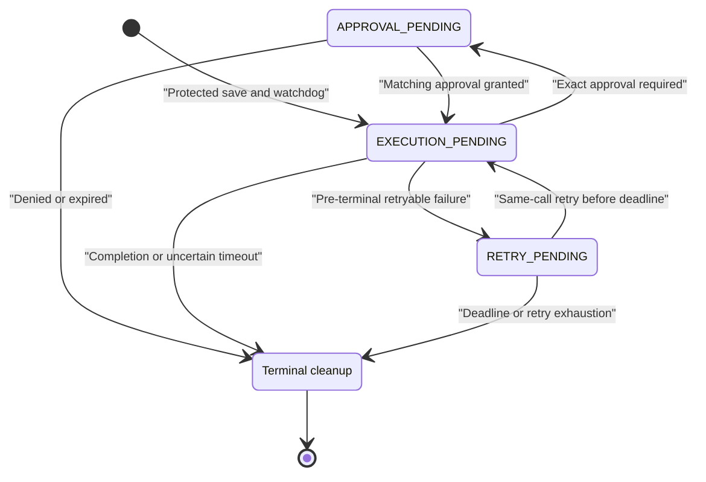
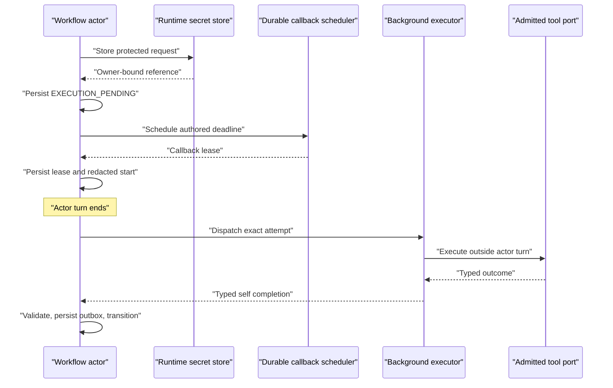

# Workflow ToolCall Async Continuation Design

## Context

`ToolCallModule` historically awaited `IWorkflowTool.ExecuteAsync` inside the workflow
actor turn. A slow provider therefore prevented the same actor from consuming its timeout,
approval, terminal, or cancellation messages. Moving the await to an untracked `Task.Run`
would release the turn, but would leave crash windows around dispatch, lose completion when
self-publication failed, and make process-local task state the accidental authority.

The request needed for approval and recovery may contain tool arguments, workflow input,
file references, an external invocation specification, and an idempotency key. Persisting
that payload directly in `PendingToolCallExecutionState`,
`PendingToolCallApprovalState`, or `WorkflowToolCallStartedEvent` would copy it into the
actor journal, committed state roots, projections, and operational tooling. The continuation
must therefore remain durable without making raw request material observable.

This design covers direct workflow `tool_call` execution. It composes with the start-once
admission rules in ADR-0046 and the existing workflow completion outbox; it does not create a
second tool admission ledger or a generic background-job framework.

## Binding Invariants

- `WorkflowRunGAgent` and its persisted `ToolCallModuleState` remain the only authority for
  pending phase, deadline, attempt, and terminal adoption.
- Provider execution never occupies an actor turn. Background work can only return a typed
  self continuation; it cannot mutate actor state.
- No external terminal is dispatched until the exact pending call and its authored-deadline
  watchdog are durably recoverable.
- Recovery and retry always reuse the original call id, execution id, idempotency key,
  protected request material, and continuation lineage. They never mint a new identity to
  escape the admitted start-once ledger.
- The authored deadline is computed once. Approval, activation, retry, and completion
  delivery cannot extend it.
- Raw request material is absent from newly written actor state, committed state events,
  state roots, projections, started events, public APIs, and logs.
- A local task or cancellation-token registry is resource ownership only. Its presence or
  absence is never interpreted as a business fact.
- Completion, timeout, approval, retry, and recovery signals are strongly typed Protobuf
  messages and are correlated exactly; stale or forged envelopes do not advance the actor.

## Ownership And Durable State

`PendingToolCallExecutionState` owns the safe control plane:

- run, step, call, and execution identities;
- protected-material reference and SHA-256 digest;
- issued time, authored deadline, timeout callback id, and callback lease;
- typed phase, attempt, retry due time, retry callback id, and retry lease;
- approval request id and terminal decision; and
- a random continuation id that fences stale signals for the same public identities.

`PendingToolCallApprovalState` owns the same protected-material reference and digest while
the call is suspended. The reference is reused when the approved call returns to execution;
phase is deliberately mutable and is not part of the protected payload or its digest.

The existing `WorkflowToolCallCompletionOutboxEntry` owns a terminal result after the actor
accepts a completion. A process-local executor task owns no durable facts.

## Pending Phases

| Phase | Meaning | Dispatch allowed | Deadline result |
|---|---|---|---|
| `APPROVAL_PENDING` | The exact call awaits an actor-owned approval grant; no external terminal is in flight. | No | Confirmed denial/expiry path |
| `EXECUTION_PENDING` | The exact terminal may be executing or may have crossed its start-once boundary. | Initial dispatch or same-identity `ActorRecovery` only | `OUTCOME_UNCERTAIN` |
| `RETRY_PENDING` | The actor accepted `TerminalInvoked=false, Retryable=true`; no external terminal is in flight. | Only the matching bounded retry before the deadline | Confirmed pre-terminal failure |
| `UNSPECIFIED` | Invalid or legacy-incomplete control state. | No | Fail closed |

The phase records whether an external terminal can presently be in flight. It does not claim
that a process-local task exists, nor does `EXECUTION_PENDING` prove that the provider received
the request. That deliberately conservative distinction drives timeout classification.

## Start, Save, And Dispatch Ordering

A new execution follows this order:

1. Resolve the admitted tool and freeze the exact request identities and authored timeout.
2. Build deterministic `ToolCallProtectedMaterial`, store it behind an owner-bound runtime
   secret reference, and compute its SHA-256 digest.
3. Persist `PendingToolCallExecutionState` in `EXECUTION_PENDING` with that reference,
   digest, stable identities, attempt `1`, continuation id, and absolute deadline.
4. Schedule the durable deadline callback, then persist its callback lease against the same
   pending identity.
5. Publish only a redacted `WorkflowToolCallStartedEvent`. Its deprecated arguments field is
   empty; the event is observation, not execution permission or recovery authority.
6. End the actor turn and dispatch provider execution through the background executor.

If protected-material storage, pending persistence, or watchdog installation fails, the
provider is not called. A callback lease created for a pending state that has since changed is
cancelled as orphaned. Every dispatch path rechecks the absolute deadline immediately before
creating the provider task.

## Protected Request Material

`ToolCallProtectedMaterial` is a versioned Protobuf payload containing the exact run, step,
execution, tool, call, and approval identities plus arguments, input, input file references,
idempotency key, external invocation specification, and display name. It is serialized
deterministically before hashing. The runtime-secret entry is non-consume-once, scoped to the
owning run and step, uses the dedicated workflow ToolCall purpose, and has a bounded TTL.

Before every initial execution continuation, approved resume, retry, or activation recovery,
the module must:

1. require the expected secret purpose and owner identity;
2. resolve the exact reference from the runtime secret store;
3. parse the expected schema version;
4. compare the deterministic SHA-256 digest in constant time; and
5. match run, step, execution, and call identities to pending actor state.

Any failure blocks dispatch. Before the first pending save, this is a confirmed pre-terminal
failure because no side effect can have started. During `APPROVAL_PENDING` or `RETRY_PENDING`,
it also remains confirmed because those phases exclude an in-flight terminal. During recovered
`EXECUTION_PENDING`, unresolved material cannot be used to replay the call and the actor must
preserve the possibility that the earlier process crossed the terminal boundary; it therefore
fails with uncertain outcome rather than claiming no side effect.

The committed-state redaction hook removes protected references and digests from published
state roots as defense in depth. Raw request fields retained only as deprecated Protobuf field
numbers are cleared on every new write and are never used as a fallback.

## Completion Continuation And Durability

The background executor converts every tool outcome into
`WorkflowToolCallAttemptCompletedEvent`. It carries typed success, approval-required, or
failure data plus run, step, call, execution, attempt, and continuation id. The actor accepts
the envelope only when all of the following match:

- topology audience is self;
- publisher is the workflow actor itself;
- delivery operation id is derived from the exact completion identity;
- durable pending identities and continuation id match; and
- the attempt equals the current durable attempt.

A caller-created payload, a self-shaped envelope with the wrong publisher or operation id, a
duplicate attempt, and a late result after timeout are ignored without mutation.

The executor first publishes the completion to the actor inbox. If that fails, it schedules
the same payload as an immediate durable self callback. If both operations fail, it retains the
known result for a fixed small number of immediate yield-and-retry attempts, bounded by both the
attempt count and authored deadline. Module-local delay or backoff is forbidden; if neither
transport accepts a retry, the already-installed authored-deadline watchdog remains authoritative.
The executor does not silently abandon a known result after one pair of transport failures.

After accepting a terminal completion, the actor removes the pending execution and persists a
`WorkflowToolCallCompletionOutboxEntry` before publishing `WorkflowToolCallCompletedEvent` and
`StepCompletedEvent`. Each publication has a stable operation identity and durable retry; only
after both required publications succeed is the entry compressed to its tombstone. The outbox
stores the admitted result and safe failure only, never protected request material.

## Activation Recovery

Activation derives work only from durable pending state:

- Every pending execution restores an absent/in-memory deadline callback for the remaining
  authored duration.
- `APPROVAL_PENDING` restores only suspension publication. It never schedules execution.
- `RETRY_PENDING` restores its exact retry callback for the persisted due time, bounded by the
  remaining authored duration.
- `EXECUTION_PENDING` schedules a typed
  `WorkflowToolCallExecutionRecoveryFiredEvent`. Its handler revalidates phase, identities,
  attempt, continuation id, deadline, and protected material before an off-turn recovery.
- If the current module instance already owns the call/execution cancellation key, recovery
  does not launch a second local task.

Recovery uses the original physical call identity and marks the admitted execution attempt as
`ActorRecovery`. For admitted `IAgentTool` calls, a normal duplicate
`tool_execution_already_started` result is interpreted through that recovery path rather than
causing a fresh call id. The start-once ledger, not activation timing, remains the authority
that decides whether the raw terminal can run.

Failure to schedule a recovery continuation does not clear pending actor state. The deadline
watchdog remains authoritative, and a later activation can reconstruct the same recovery work.

## Deadline And Race Semantics

The effective authored timeout is resolved once from the step timeout and ToolCall timeout
parameters, clamped to the platform bounds, and stored as an absolute Unix-millisecond
deadline. Retry backoff and callback due times are capped by the remaining duration. Immediately
before every initial, approved, retry, and activation dispatch, an elapsed deadline terminates
the pending state instead of invoking the provider.

The actor inbox serializes the relevant race:

| First accepted transition | Result | Later message |
|---|---|---|
| Completion while `EXECUTION_PENDING` | Adopt typed tool outcome | Timeout is stale |
| Deadline while `EXECUTION_PENDING` | `tool_outcome_unknown`, `OUTCOME_UNCERTAIN`, outer retry forbidden | Completion is late and ignored |
| Retryable pre-terminal failure | Persist `RETRY_PENDING` | Prior-attempt duplicates are stale |
| Deadline while `RETRY_PENDING` | Confirmed pre-terminal failure, outer retry forbidden | Retry callback is stale |
| Matching retry before deadline | Persist `EXECUTION_PENDING`, then dispatch same identity | Prior callback is stale |

Cancellation cannot upgrade an uncertain timeout to a confirmed failure. A remote provider may
have ignored cancellation after receiving the request.

## Same-Call Retry Safety

Internal retry is allowed only when the accepted typed failure explicitly has both
`TerminalInvoked=false` and `Retryable=true`. The current policy permits at most five total
attempts with bounded exponential backoff beginning at 250 milliseconds and capped at four
seconds, always within the original deadline.

Transition to `RETRY_PENDING` occurs before the durable retry is scheduled. The retry handler
then resolves the same protected material, clears the consumed retry lease, persists
`EXECUTION_PENDING`, checks the deadline again, and dispatches with the same call id, execution
id, idempotency key, approval grant identity, and continuation id. It changes only the typed
attempt number and phase.

A terminal-invoked failure, denial, invalid safety classification, retry exhaustion, or elapsed
deadline cannot enter this path. When the module consumes its internal retry budget, its final
step completion forbids workflow-kernel outer retry so the kernel cannot create a different
physical call identity. This does not change explicitly safe pre-dispatch validation failures
that never entered the pending execution protocol.

## Approval Continuation

An approval-required attempt does not publish a failed step. The actor transitions from
`EXECUTION_PENDING` to `APPROVAL_PENDING`, reuses the same protected-material reference and
digest, persists the exact approval reconciliation identities, and publishes the existing
redacted `WorkflowSuspendedEvent.tool_approval` through its durable publication path.

Resume input carries only run/step plus `execution_id`, `tool_call_id`, and
`approval_request_id`. It cannot replace the tool, arguments, digest, or owner. A matching
approval resolves protected material and constructs the exact `AgentToolApprovalGrant` before
transitioning back to `EXECUTION_PENDING`; rejection or expiry terminalizes without dispatch.
Mismatched, stale, or duplicate resume events are ignored or produce the typed resume-rejected
observation without exposing request material.

## Cancellation And Terminal Cleanup

Each active local call owns a module-scoped `CancellationTokenSource` keyed by call and
execution identity. The token is passed through to `IWorkflowTool.ExecuteAsync` and is cancelled
best-effort when:

- the authored deadline wins;
- the workflow reaches a terminal boundary;
- the actor deactivates;
- execution modules are disabled; or
- the bridge is rebound or the module instance is replaced.

The registry deduplicates work only inside the current process and module instance. It is never
persisted and never substitutes for phase, callback, or admission state. Cancellation stops
local waiting and releases resources; it does not assert that a provider-side effect was rolled
back or never started.

Success, confirmed failure, uncertain timeout, denial, retry exhaustion, approval termination,
and workflow terminal cleanup all request revocation of the protected reference before clearing
module ownership. Revocation failure is observable but does not rewrite an already known tool
outcome; bounded secret expiry remains the cleanup backstop.

## Consequences

- A slow tool no longer blocks workflow timeout, approval, stop, or completion handling.
- Crash recovery is actor-state-driven and preserves the admitted start-once identity.
- Requests needed for recovery remain available without entering committed workflow history or
  projections.
- Typed phase makes timeout honesty explicit: only a possibly in-flight execution is uncertain.
- Completion transport has a durable callback fallback; if both transports reject the result,
  the preinstalled deadline watchdog remains the liveness authority. An accepted result retains
  the existing durable publication outbox.
- Best-effort cancellation improves resource behavior without being mistaken for side-effect
  certainty.
- Runtime-secret storage becomes a hard dependency for new direct ToolCall dispatch. Its
  unavailability fails closed before execution.

## Verification

Deterministic tests must cover:

- provider execution does not block the actor turn;
- protected-material store, resolve, schema, owner, digest, and identity failures never dispatch;
- raw marker values are absent from committed state events and state roots;
- approval reuses one protected reference and revokes it after either decision;
- authentic completion envelopes succeed while forged publisher/operation identities fail;
- simultaneous completion publish and durable-schedule failures leave pending state owned by the
  authored-deadline watchdog without local polling or a permanent hang;
- activation recovers `EXECUTION_PENDING` with the same call identity and does not duplicate a
  locally owned task;
- retry callbacks cannot dispatch after the deadline and retry exhaustion forbids outer retry;
- `EXECUTION_PENDING` and `RETRY_PENDING` deadline races produce uncertain and confirmed
  outcomes respectively;
- cancellation reaches the tool on timeout, deactivation, module replacement, and terminal
  cleanup; and
- late completion, stale attempt, stale token, and duplicate callbacks do not change state.

Related decisions and canonical contracts:

- [ADR-0046: Admitted Agent Tool Execution](../../adr/0046-admitted-agent-tool-execution.md)
- [Workflow Primitives](../../canon/workflow-primitives.md)
- [Workflow Tool Failure Outcome Design](./2026-07-21-workflow-tool-failure-outcome-design.md)
- [Workflow Runtime](../../canon/workflow-runtime.md)
