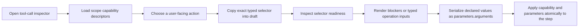

# Workflow Configuration Guidance Design

## Summary

The Workflow Activity vNext inspector currently presents runtime configuration as if it were a user task. A novice opening a `tool_call` step sees a required `Tool` text field containing `nyxid_proxy`, but the interface does not explain what the value represents, which values are valid, what action will run, or which inputs that action needs.

The inspector will instead lead with the user's intent: choose an action, understand whether it is usable, and provide the action's inputs. Runtime details remain inspectable, but no longer occupy the primary configuration path. The first complete specialization is the external-operation form of `tool_call`; every node type also receives a clearer shared inspector hierarchy.

## Problem Definition

This is a semantic mismatch across five surfaces, not an isolated copy issue:

- **Label:** `Tool` names a runtime mechanism rather than the user's action.
- **Placement:** raw implementation details appear before purpose, readiness, and required inputs.
- **Ownership:** the UI asks the user to reconstruct values owned by capability discovery.
- **Contract:** the current frontend draft model carries only `parameters`, even though external-operation identity belongs to the typed step-level `capability` selector.
- **Mental model:** the UI suggests that entering any string is enough to make a tool executable, while the runtime requires an exact discoverable operation and valid authorization/readiness.

The canonical contract is:

```yaml
type: tool_call
capability:
  nyxid_operation:
    user_service_id: us-home-alpha
    endpoint_id: list-states
parameters:
  tool: nyxid_proxy
  arguments: '{"query":{},"headers":{},"response_mode":"text"}'
```

`nyxid_proxy` is an internal adapter. `user_service_id` and `endpoint_id` are an exact backend-owned selector. The user-facing concept is the discovered connected-service operation.

## Design Principles

1. **Start with the decision the user can make.** The first control answers “What should this step do?” rather than “Which runtime adapter should execute it?”
2. **Never ask users to guess identifiers or credentials.** Exact selectors are copied from backend discovery, and credentials never enter the workflow document.
3. **Reveal requirements progressively.** Required action inputs follow selection; optional behavior and technical details follow afterward.
4. **Report readiness honestly.** Drafts may remain incomplete, but the UI must distinguish ready, setup-required, unavailable, and indeterminate states.
5. **Keep expert access without making expertise mandatory.** Raw JSON and runtime fields remain available under explicit advanced/technical sections.
6. **Preserve the typed identity boundary.** Capability identity belongs to `step.capability`; invocation values belong to `step.parameters.arguments`.
7. **Let the backend own truth.** The frontend consumes typed discovery and readiness contracts and does not fabricate a catalog, infer selectors from labels, or guess operation schemas.

## Considered Approaches

### 1. Shared inspector shell with semantic node adapters

Create one consistent inspector hierarchy, then allow node-specific editors to replace generic runtime fields with user-facing concepts. For external `tool_call`, use backend capability discovery/readiness, an action picker, and contract-driven inputs.

This is the recommended approach. It fixes the actual semantic problem, preserves a coherent configuration experience across node types, and allows future specializations without duplicating an entire inspector.

### 2. Copy and generic-schema polish only

Rename fields, add placeholders, and add helper text to the current schema-driven form.

This costs less, but it still asks the user to know a valid runtime tool name, cannot enumerate usable actions, cannot distinguish unavailable connections, and cannot generate the selected operation's required inputs. It would make the wrong mental model friendlier without making it correct.

### 3. A bespoke wizard for every node type

Replace the inspector with a unique multi-step wizard per primitive.

This can maximize tailoring, but duplicates navigation, validation, discard handling, technical details, and accessibility behavior. It also makes simple nodes unnecessarily slow to configure. The maintenance and consistency cost is not justified.

## Information Architecture

### Header

- Show a human-readable step name as the title. Until editable names exist, derive it from the action or the humanized node type.
- Show the node type as secondary context, for example `Tool call`.
- Do not show the raw step ID as the header subtitle; move it to Technical details.
- Keep the close control icon-only with an accessible name and tooltip.

### Purpose and status

- Begin the body with one sentence describing what this node type does.
- For external actions, show one compact readiness state:
  - `Choose an action`: no selector yet.
  - `Checking availability`: readiness request is in progress.
  - `Ready`: the selected action is currently usable in the editing context.
  - `Needs setup`: the action exists but readiness returns actionable blockers.
  - `Unavailable`: the selector is stale, inaccessible, or no longer discoverable.
  - `Could not check`: the readiness request failed; this is not misreported as a workflow validation failure.

### Required settings

- Required settings appear before all optional fields.
- Every control has a user-oriented label, concise helper text where the expected value is not self-evident, and an example or placeholder based on the selected contract.
- Validation is shown next to the field it concerns. The footer may summarize that the step needs attention, but it does not become the sole error location.

### Optional settings

- Optional operation inputs are shown after required inputs.
- When a node type has no optional settings, no empty section is rendered.
- Advanced response behavior appears only when the selected contract offers more than one valid choice.

### Technical details

The collapsed Technical details section contains:

- step ID;
- runtime step type;
- target role;
- next step and branches;
- runtime tool adapter, such as `nyxid_proxy`;
- exact `user_service_id` and `endpoint_id` selector values.

These values are selectable/copyable but not casually editable in the guided path.

### Advanced JSON

- Preserve the existing raw JSON editor as an expert escape hatch.
- Explain its scope as runtime parameters, not the entire step definition.
- Applying raw JSON and returning to guided mode must retain supported values.
- Common external-operation configuration must never require this editor.

### Footer

- `Cancel` closes the inspector and retains the existing discard confirmation for unapplied changes.
- The primary action is `Apply step`, because it applies an inspector draft to the workflow document rather than persisting the whole workflow.
- The button remains available for incomplete drafts only when the document can be represented safely. Its nearby status makes clear that incomplete external capability setup will block later publication or execution.

## External Tool Call Experience

### Entry states

The editor distinguishes three tool-call shapes:

1. **No tool selected:** show an `Action` picker first. Choosing a connected-service operation creates `parameters.tool = "nyxid_proxy"` and the exact typed selector.
2. **Existing `nyxid_proxy`:** resolve its typed selector against discovery and show the selected action. If no selector exists, show `Choose an action`; never present `nyxid_proxy` as a user choice.
3. **Other registered tool:** retain a guided `Tool` field for compatibility in this iteration, with clearer helper text and examples. Do not pretend the external operation catalog represents all internal agent tools.

### Action picker

- Label: `Action`.
- Prompt: `Choose what this step should do`.
- Search by operation display name and source/service display text.
- Group or annotate results by connected service/source when that information is available.
- Each option shows the backend-provided `display_name` and one truthful risk label:
  - `Read only` when `read_only` is true;
  - `Destructive` when `destructive` is true;
  - `Writes data` otherwise.
- The selected value is a frontend-stable opaque key derived from the serialized typed selector for UI reconciliation only. On apply, the original selector object returned by discovery is copied without reconstructing IDs from the display name or key.
- An empty catalog says that no connected actions are available and provides backend diagnostics when they include a safe message.
- Discovery failure offers `Retry`; it does not clear an already selected selector.

### Selection and readiness

When an action is selected:

1. The draft stores the exact `capability.nyxid_operation` selector.
2. The draft sets the runtime adapter to `parameters.tool = "nyxid_proxy"`.
3. The frontend requests readiness in interactive execution mode.
4. The response's `selected_selector` must match the requested selector. A mismatch is treated as an invalid response.
5. The frontend uses `selected_capability.nyx_id_user_service` as the operation contract for input rendering.
6. A stale response is ignored when the user has selected another action in the meantime.

The UI does not request or store bearer tokens, credential IDs, proof fields, source stamps, grants, or admission digests.

### Operation inputs

Readiness exposes path, query, and header parameter contracts plus an optional JSON body contract. The editor maps them to a canonical invocation object:

```json
{
  "path_params": {},
  "query": {},
  "headers": {},
  "body": {},
  "response_mode": "text"
}
```

- Only sections required by the operation or containing a value are serialized.
- Required path/query/header properties use individual fields.
- Optional properties render after required properties within their location group.
- String, integer, number, and boolean leaf schemas use an appropriate text, number, or boolean control.
- A finite `allowed_values` set uses a select control.
- Object/array inputs that cannot be represented without losing schema meaning use a labeled JSON editor with local JSON/type validation.
- Workflow expressions such as `${steps.lookup.output}` remain valid string input even for non-string operation schemas; they are not prematurely coerced in the browser.
- Header inputs are operation-declared business headers only. Authentication headers are never shown.
- `response_mode` is hidden when only one mode is allowed and selectable when both text and file artifact are allowed.

Existing valid `parameters.arguments` are decoded into the generated form. Unknown keys are preserved during guided edits so that opening and applying the inspector does not silently destroy forward-compatible runtime values. Invalid JSON remains visible in Advanced JSON with an inline recovery message; the guided fields do not overwrite it until the user explicitly changes a guided value.

### Readiness blockers

- Render every backend `safe_message`; do not derive a diagnosis from enum names alone.
- Show the readiness status in plain language and retain the typed status for deterministic UI behavior.
- Render backend remediation `label` as an action only when `trusted_locator` is a supported, same-product destination. Unknown or external locator schemes remain descriptive text and are never opened blindly.
- `Connect credential`, `Register service`, `Request access`, and similar states are setup issues, not input validation errors.
- Destructive operations remain visibly marked while configuring. This inspector does not grant durable authorization and does not replace execution-time approval.

## Shared Inspector Metadata

Add a small presentation metadata registry keyed by step type:

- humanized label;
- one-sentence purpose;
- optional guided-editor kind.

This registry is presentation-only. It must not become a second runtime schema or redefine workflow semantics. Unknown node types fall back to the existing humanized type label and a neutral purpose sentence.

The existing node configuration field schema remains the generic editor for node types without a semantic adapter. Field definitions gain optional helper text where needed, but the shared inspector owns section ordering, status, technical details, and advanced JSON.

## API Contract

The frontend must not call agent tools. Add narrow, authenticated host endpoints over the existing application ports:

### List actions

```http
GET /api/scopes/{scopeId}/workflow-capabilities
```

Response:

```json
{
  "capabilities": [
    {
      "displayName": "PostHog / List dashboards",
      "readOnly": true,
      "destructive": false,
      "selector": {
        "kind": "nyxid_operation",
        "userServiceId": "us-posthog-alpha",
        "endpointId": "list-dashboards"
      },
      "source": {
        "kind": "nyxid_user_services",
        "sourceId": "...",
        "sourceVersion": 7,
        "observedAt": "...",
        "freshUntil": "..."
      }
    }
  ],
  "candidateCount": 4,
  "rejectedCount": 1,
  "diagnostics": [
    {
      "code": "unsupported_schema",
      "safeMessage": "One operation was omitted because its input schema is unsupported.",
      "count": 1
    }
  ]
}
```

The first frontend specialization filters to `selector.kind = "nyxid_operation"`, while the host mapping remains exhaustive and rejects unsupported/unspecified selector shapes rather than returning ambiguous partial data.

### Inspect readiness

```http
POST /api/scopes/{scopeId}/workflow-capabilities:readiness
Content-Type: application/json

{
  "selector": {
    "kind": "nyxid_operation",
    "userServiceId": "us-posthog-alpha",
    "endpointId": "list-dashboards"
  },
  "executionMode": "interactive"
}
```

The response exposes:

- status;
- exact selected selector;
- safe blockers and remediation descriptors;
- source freshness;
- the selected connected-service operation contract, including method/path, typed parameters, request-body schema, response policy, and execution policy.

HTTP DTOs use explicit camel-case enums rather than protobuf-generated numeric enum values. The frontend decoder validates every object, discriminant, collection, and identity string before the data reaches the inspector.

Both endpoints:

- enforce the existing scope access policy;
- build `ExternalWorkflowCapabilityAccessContext` from the authenticated caller and current forwarded credentials;
- delegate discovery/readiness to `IExternalWorkflowCapabilityListPort` and `IExternalWorkflowCapabilityReadinessPort`;
- return only safe contract fields;
- map expected access/validation failures to the host's existing problem response conventions;
- contain no capability-selection business logic in the Host layer.

## Frontend Document Contract

Introduce a typed external capability union on `StudioWorkflowStepDocument`:

```ts
type StudioWorkflowCapability = {
  readonly nyxid_operation: {
    readonly user_service_id: string;
    readonly endpoint_id: string;
  };
};
```

Use document field names exactly as persisted by workflow YAML/JSON. API DTOs remain camelCase and are translated exactly once at the API/document boundary.

`StudioStepInspectorDraft` gains a `capability` value. `createStepInspectorDraft` clones it from the step; `applyStepInspectorDraft` writes or removes it without routing it through `parametersText`. The inspector change callback accepts the complete inspector draft change needed to update both capability and parameters atomically.

No variable named `workflowId`, `memberId`, or `publishedServiceId` is reused for selector identity. Values remain explicitly named `userServiceId`, `endpointId`, or `capabilitySelector`.

## Data Flow



Discovery is cached per scope through the frontend's existing query/data-fetching convention if one exists on the page. Readiness is keyed by scope, exact selector, and execution mode. Selection changes cancel or logically invalidate older readiness responses.

## Loading, Empty, and Error States

- The inspector shell and existing draft values render immediately; discovery never blocks opening the modal.
- While discovery loads, the action control shows a stable-height skeleton/loading row so the layout does not jump.
- A selected operation continues to display from its saved descriptor/selector representation while the latest catalog is loading.
- An empty successful list is distinct from a failed list.
- Discovery and readiness errors are recoverable inline and retain the draft.
- A malformed server response fails closed with a generic safe error and is reported through existing client diagnostics; unchecked data is never rendered.
- Applying another node's generic configuration does not depend on capability endpoints.

## Accessibility and Responsive Behavior

- Every field has an associated visible label; helper and error text are connected with `aria-describedby`.
- Status is conveyed by text and icon, never color alone.
- The action picker is fully keyboard navigable and its search results expose risk labels to assistive technology.
- The modal traps focus through the existing Ant Design behavior, returns focus on close, and keeps the close button accessible.
- On narrow viewports, labels and fields use a single column, technical rows wrap, and footer actions remain visible without covering form content.
- Stable control heights prevent loading, badges, and validation text from shifting unrelated controls.
- No text is truncated without a tooltip or an accessible full value.

## Validation and Test Strategy

### Backend endpoint tests

- list endpoint forwards authenticated scope/caller context and maps an exact operation descriptor;
- list endpoint maps safe diagnostics without leaking credentials or deprecated capability payloads;
- readiness endpoint parses the typed selector and interactive execution mode;
- readiness response maps input schemas, response policy, execution policy, blockers, and remediations;
- invalid/unsupported selectors and execution modes fail before the application port is called;
- scope access denial follows the existing endpoint behavior;
- route registration includes both new paths.

### Frontend model and API tests

- strict decoders accept canonical list/readiness payloads and reject malformed discriminants, duplicate or empty selector identities, and incomplete schemas;
- draft creation/application round-trips `capability` independently of `parameters`;
- removing a selection removes the typed capability without removing unrelated parameters;
- argument parsing/serialization preserves unknown keys and workflow expressions.

### Inspector component tests

- an unconfigured external tool call leads with `Action`, not an editable `nyxid_proxy` field;
- a saved selector resolves to the matching display name;
- selecting an action writes the exact selector and adapter atomically;
- readiness loading, ready, setup-required, unavailable, empty, failure, retry, and stale-response states render correctly;
- required/optional operation inputs map into the canonical arguments object;
- destructive and read-only risk labels are visible;
- generic non-external tools and other node types retain a usable fallback editor;
- technical details contain runtime identities and the header does not expose the raw step ID;
- discard confirmation and Apply step behavior remain intact;
- controls have accessible names and validation associations.

Local frontend verification remains restricted to dependency-related tests and changed-file static checks. Full frontend suite, typecheck when no affected target exists, and production build are delegated to GitHub CI.

## Rollout Scope

This change delivers:

- the shared inspector information hierarchy and node-purpose presentation;
- typed capability list/readiness REST endpoints;
- strict frontend contracts and draft capability round-trip;
- the complete discovered external-operation editor for direct `tool_call` nodes;
- existing generic configuration and raw JSON as fallbacks.

The structure permits later guided adapters for `llm_call`, conditionals, loops, and file operations without requiring them in this change.

## Non-Goals

- Redesigning the workflow canvas, node library, run console, or whole Workflow Activity vNext shell.
- Creating or editing connected services inside the inspector.
- Inventing an internal agent-tool catalog where no authoritative discovery contract exists.
- Editing authored arbitrary NyxID request selectors in the guided UI.
- Granting durable authorization or bypassing execution-time approval for destructive actions.
- Changing `ToolCallModule` runtime semantics or moving capability identity into parameters.
- Making every workflow primitive bespoke in the first release.

## Success Criteria

A first-time user can open an external Tool call step and, without knowing `nyxid_proxy`, `user_service_id`, `endpoint_id`, or raw argument-envelope syntax:

1. understand what the step is for;
2. choose a recognizable connected-service action;
3. see whether the action is ready or what setup is missing;
4. fill its declared inputs with examples and inline validation;
5. apply the step without exposing credentials or corrupting typed identity;
6. inspect runtime details only when they deliberately open the technical section.
