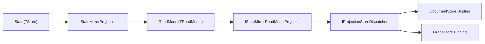

# Aevatar.CQRS.Projection.StateMirror

通用 `State -> ReadModel` 镜像组件。

- 默认实现：`JsonStateMirrorProjection<TState, TReadModel>`。
- 支持字段忽略：`StateMirrorProjectionOptions.IgnoredFields`。
- 支持字段重命名：`StateMirrorProjectionOptions.RenamedFields`。
- 一站式执行器：`IStateMirrorReadModelProjector<TState,TReadModel,TKey>`。

## 目标架构



## DI 入口

- `services.AddJsonStateMirrorProjection<TState, TReadModel>(configure?)`
  仅注册 `State -> ReadModel` 映射器。
- `services.AddJsonStateMirrorReadModelProjector<TState, TReadModel>(configure?)`
  注册映射器和默认 `string` 键的一站式执行器。
- `services.AddJsonStateMirrorReadModelProjector<TState, TReadModel, TKey>(configure?)`
  注册映射器和自定义键类型执行器。

## 示例

```csharp
services.AddProjectionReadModelRuntime();
services.AddJsonStateMirrorReadModelProjector<MyState, MyReadModel>(options =>
{
    options.RenamedFields[nameof(MyState.ActorId)] = nameof(MyReadModel.Id);
});
```
