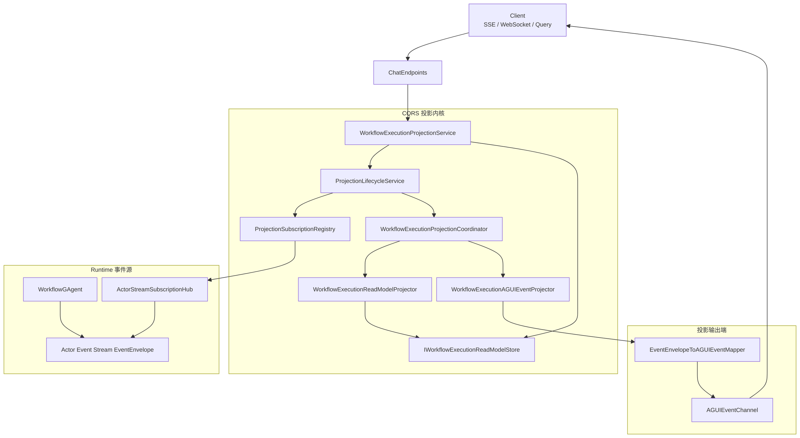
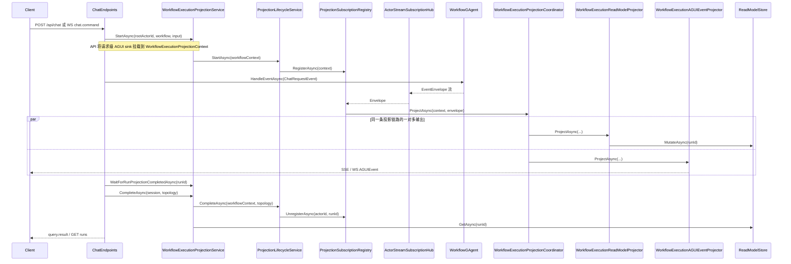

# Aevatar.CQRS.Projections

本文档整合原 CQRS 架构文档，作为 CQRS 子项目的唯一架构说明入口。

## 目录结构

- `Configuration/`：功能配置（`WorkflowExecutionProjectionOptions`）
- `DependencyInjection/`：DI 组合入口（`AddWorkflowExecutionProjectionCQRS`）
- `Orchestration/`：run 级投影编排与生命周期
- `Projectors/`：内置 read-model projector
- `Reducers/`：事件折叠 reducer 与 mutation 逻辑
- `Stores/`：读模型存储实现
- `Streaming/`：Actor stream 订阅复用组件

## 项目边界

- `Aevatar.CQRS.Projections.Abstractions`
  - 通用投影契约（`IProjection*`）
  - workflow 执行域别名契约（`IWorkflowExecution*`）
  - run context/session 契约
  - read-model 契约（`WorkflowExecutionReport/*`）
- `Aevatar.CQRS.Projections`
  - 协调器、projector、reducer、store 实现
  - DI 组合与扩展注册

## CQRS 架构关系（当前实现）

当前实现遵循以下约束：

1. 运行时仅一条 `EventEnvelope` 投影链路。
2. CQRS 查询读模型与 AGUI 实时输出为同链路的一对多 projector。
3. API 层不维护独立 AGUI projection 生命周期。

### 当前默认装配

- `Aevatar.CQRS.Projections` 内置注册：
  - `WorkflowExecutionProjectionService`
  - `ProjectionLifecycleService<,>`
  - `ProjectionSubscriptionRegistry<,>`
  - `WorkflowExecutionProjectionCoordinator`
  - `WorkflowExecutionReadModelProjector`
- `Aevatar.Hosts.Api` 在宿主层追加注册：
  - `WorkflowExecutionAGUIEventProjector`
  - 通过 `WorkflowExecutionProjectionContext` 属性挂载请求级 `IAGUIEventSink`

### 1. 依赖分层与总览图

#### 1.1 依赖规则

1. `Aevatar.Hosts.Api` 负责 HTTP/SSE/WS 编排，不承载 CQRS 投影核心。
2. `Aevatar.CQRS.Projections` 负责 run 生命周期、订阅、协调与读模型。
3. `AGUI` 实时输出通过 `WorkflowExecutionAGUIEventProjector` 作为同一链路分支输出。

### 2. 接口与实现映射

| 抽象接口 | 当前实现 | 位置 |
|---|---|---|
| `IProjectionLifecycleService<TContext, TCompletion>` | `ProjectionLifecycleService<TContext, TCompletion>` | `src/Aevatar.CQRS.Projections/Orchestration/` |
| `IProjectionSubscriptionRegistry<TContext>` | `ProjectionSubscriptionRegistry<TContext, TCompletion>` / `WorkflowExecutionProjectionSubscriptionRegistry` | `src/Aevatar.CQRS.Projections/Orchestration/` |
| `IProjectionCoordinator<TContext, TTopology>` | `WorkflowExecutionProjectionCoordinator` | `src/Aevatar.CQRS.Projections/Orchestration/` |
| `IProjectionProjector<WorkflowExecutionProjectionContext, Topology>` | `WorkflowExecutionReadModelProjector` / `WorkflowExecutionAGUIEventProjector` | `src/Aevatar.CQRS.Projections/Projectors/` / `src/Aevatar.Hosts.Api/Projection/` |
| `IProjectionEventReducer<WorkflowExecutionReport, WorkflowExecutionProjectionContext>` | `StartWorkflowEventReducer` 等 reducer | `src/Aevatar.CQRS.Projections/Reducers/` |
| `IProjectionReadModelStore<WorkflowExecutionReport, string>` | `InMemoryWorkflowExecutionReadModelStore` | `src/Aevatar.CQRS.Projections/Stores/` |
| `IWorkflowExecutionProjectionService` | `WorkflowExecutionProjectionService` | `src/Aevatar.CQRS.Projections/Orchestration/` |
| `IWorkflowExecutionProjector` | `WorkflowExecutionReadModelProjector` / `WorkflowExecutionAGUIEventProjector` | `src/Aevatar.CQRS.Projections/Projectors/` / `src/Aevatar.Hosts.Api/Projection/` |

### 3. 运行时调用链

### 4. 关键设计结论

1. `CQRS` 与 `AGUI` 不是两套并行生命周期，而是同一投影链路的两类 projector 输出。
2. 读模型查询（`/runs`）与实时展示（SSE/WS）共享同一 `EventEnvelope` 处理时序。
3. API 层职责收敛为 orchestrator，不管理 AGUI 独立订阅器生命周期。

### 5. 当前约束

1. 默认 `InMemoryWorkflowExecutionReadModelStore`，进程重启后读模型丢失。
2. 去重基于 run 内 `EventEnvelope.Id` 内存状态，未持久化 checkpoint。
3. `WorkflowExecutionProjectionOptions` 的 `Enabled` / `EnableRunQueryEndpoints` / `EnableRunReportArtifacts` 控制读侧能力开关。
4. AGUI sink 为请求级上下文属性，不做跨进程持久化与断线重放。

## 扩展与 OCP

- 内置 reducer/projector 由程序集自动发现注册。
- 外部模块可无侵入扩展：
  - `AddWorkflowExecutionProjectionReducer<TReducer>()`
  - `AddWorkflowExecutionProjectionProjector<TProjector>()`
  - `AddWorkflowExecutionProjectionExtensionsFromAssembly(assembly)`
- 通用扩展点以 `IProjectionEventReducer<,>` 与 `IProjectionProjector<,>` 暴露，便于模型无关组合。
- 自动发现仅注册公共具体类型，确保插件边界稳定可控。
