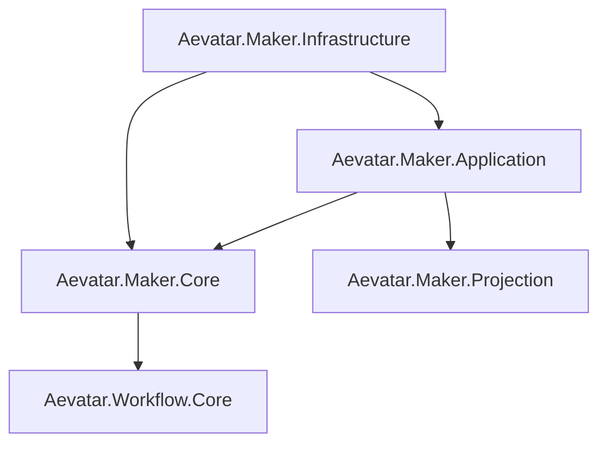

# Aevatar.Maker Subsystem

`src/maker` 是与 `src/workflow` 平行的子系统，实现 MAKER 领域能力并复用统一运行时与 CQRS 约束。

## 分层

- `Aevatar.Maker.Core`：领域模块（`maker_recursive`、`maker_vote`）与模块工厂。
- `Aevatar.Maker.Projection`：运行报告投影累加器与 JSON/HTML 报告写出。
- `Aevatar.Maker.Application.Abstractions`：应用层契约与模型。
- `Aevatar.Maker.Application`：命令执行应用服务（基于 `IActorRuntime + EventEnvelope`）。
- `Aevatar.Maker.Infrastructure`：DI 组合入口（`AddMakerSubsystem` / `AddMakerInfrastructure`）。

## 关系图

