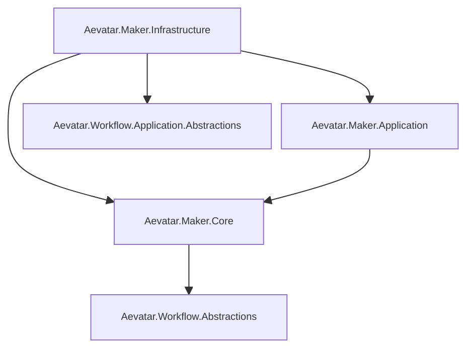

# Aevatar.Maker Capability

`src/maker` 提供 MAKER 能力实现，并复用统一运行时与 CQRS 约束。

## 能力继承约束

- 允许：`Maker -> Workflow` 抽象层依赖（`Workflow.Abstractions`、`Workflow.Application.Abstractions`）。
- 禁止：`Maker -> Workflow` 实现层直连（`Workflow.Core/Projection/Presentation.AGUIAdapter`）。
- 禁止：`Maker -> Workflow.Host.Api`（宿主入口不作为能力继承目标）。
- 禁止：`Workflow -> Maker` 反向依赖。

## 分层

- `Aevatar.Maker.Core`：领域模块（`maker_recursive`、`maker_vote`）与模块工厂。
- `demos/Aevatar.Demos.Maker/Reporting`：Demo 报告累加器与 JSON/HTML 写出（仅 demo 使用，不在 Maker Host 主链路）。
- `Aevatar.Maker.Application.Abstractions`：应用层契约与模型。
- `Aevatar.Maker.Application`：命令执行应用服务（通过 `IMakerRunExecutionPort` 编排）。
- `Aevatar.Maker.Infrastructure`：Maker 侧 DI 与能力 API；执行委托给 `IWorkflowExecutionCapability`，不再直接编排 Workflow Actor/Projection。

## 关系图

