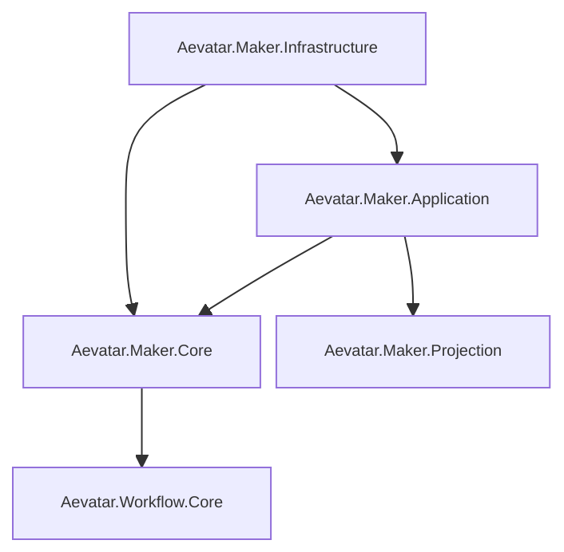

# Aevatar.Maker Capability

`src/maker` 提供 MAKER 能力实现，并复用统一运行时与 CQRS 约束。

## 分层

- `Aevatar.Maker.Core`：领域模块（`maker_recursive`、`maker_vote`）与模块工厂。
- `Aevatar.Maker.Projection`：运行报告投影累加器与 JSON/HTML 报告写出。
- `Aevatar.Maker.Application.Abstractions`：应用层契约与模型。
- `Aevatar.Maker.Application`：命令执行应用服务（通过 `IMakerRunExecutionPort` 编排）。
- `Aevatar.Maker.Infrastructure`：DI 组合入口与能力 API 定义（`AddMakerCapability(IServiceCollection, IConfiguration)` / `AddMakerCapability(WebApplicationBuilder)` / `AddMakerInfrastructure` / `MapMakerCapabilityEndpoints`）。

## 关系图

