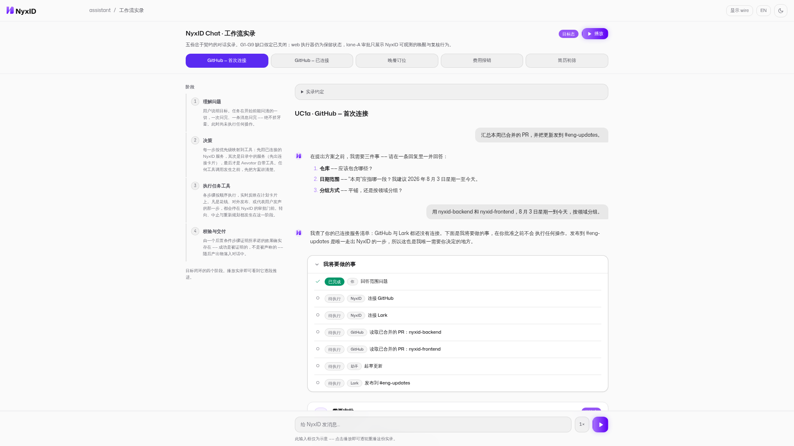

# DESIGN.md: NyxID Chat workflow transcript

## Source

- URL: https://nyx-chat-wf.surge.sh/?lang=zh#uc1a
- Capture date: 2026-08-06
- Evidence: Firecrawl branding/images/markdown scrape, full-page screenshot, live browser DOM and interaction inspection

## Reference Screenshot



Use the screenshot as the visual source of truth for layout, hierarchy, density, and interaction emphasis. The Admin implementation keeps Aevatar branding and real production data contracts; it does not copy NyxID trademarks or demo-only playback controls.

## Design Summary

The page is a quiet operational transcript with confident workspace scale. A substantial session sidebar supports navigation, while a generous conversation column carries user messages, plan state, approvals, connection journeys, tool progress, verification, and final delivery in one chronological stream. Deep teal identifies the current action, terracotta adds restrained brand contrast, and green, amber, blue, and red communicate proven outcomes.

## Design Tokens

### Colors

- Background: `#F6F8F7` (Admin implementation)
- Panel: `#FFFFFF` (observed)
- Primary action: `#0F766E` deep teal
- Secondary brand contrast: `#DF6B45` terracotta
- Text: `#17201D` / `#52605B`
- Border: `#DCE4E0`
- Success: `#16875F`
- Warning/error: amber and red semantic accents (inferred from cards)

### Typography

- Body and headings: Mona Sans
- Identifiers and wire facts: JetBrains Mono
- Admin implementation body: 15px; operational metadata: 11-13px; compact card headings: 14-15px; empty-state title: 28px
- Letter spacing: `0`; weights: 400, 500, 600, 700

### Spacing And Layout

- Reference main container: `1022px` (measured evidence, not an Admin implementation constraint)
- Admin workspace: up to `1400px` with 24px responsive gutters
- Admin grid: `264px` sidebar, `36px` gap, fluid conversation column
- Conversation and composer: the same `900px / 48px gutter` content line; assistant cards: up to `860px` inside the avatar-aware message grid
- Base spacing: 4px; common gaps: 8, 12, 16, 24, 32, 36px
- Card radius: 8-12px; high-frequency controls: 36-40px; composer: 60px minimum height
- Borders are preferred over shadows; fixed composer uses a translucent background and blur

## Components

- Top bar: brand, current conversation, services, run details, connection, and account controls; hidden inside the Admin shell
- Session sidebar: current and recent transcripts without a second task-lifecycle display; wide enough for unambiguous session scanning
- Message row: 28px avatar, readable 15px copy, right-aligned user bubble
- Plan card: revision, current step, typed source, effect evidence, retry/skip controls
- Pending input: question in the transcript; answer through the shared composer
- Approval card: action, target, actor, reversibility, expiry, approve/reject controls
- Connect card: NyxID-owned browser journey, explicit continuation report, actor postcondition proof
- Tool activity: ordered calls and receipts with collapsed detail
- Composer: stable 900px input with 60px minimum height, optional answer choices, attachment/services, send/steer/stop modes
- Inspector: off-canvas run facts and raw events so the transcript width never changes
- Request trajectory: every top-level text request creates a conversation-local
  trace container, not one atomic trajectory record. `clientRequestId` is the
  stable browser identity until the server's `runId` is attached; visible
  request numbers are never used for lookup. Inside the container, an ordered
  operation ledger creates one selectable record for the input, each model
  response, and each tool call. Live typed Model/Tool start/end frames upsert
  those operations by their own identity; even a model response whose only
  output is tool calls remains a Model record. A typed `MODEL_CALL_START` frame
  carries the exact server-authorized tool names actually loaded for that model
  round. The ledger row summarizes them, search indexes them, and the operation
  inspector exposes the full list without inferring it from later calls. The
  persisted `toolCatalogCaptured` fact distinguishes an exact zero-tool round
  from an older operation that never recorded this catalog.
  Steering, approval, and
  continuation commands advance the owning task instead of inventing unrelated
  top-level containers.
- Trajectory overview: a compact, shared time domain above the ledger with
  distinct `Input`, `Model`, and `Tools` lanes, spanning every request container
  in the conversation rather than one selected request. A bar and its ledger row
  carry the same stable operation identity. Model bars may distinguish TTFT from
  decoding only when both timings were recorded. Dragging selects a time
  interval and dims ledger records outside it, the wheel zooms the domain, and a
  right-button drag pans an already zoomed viewport.
- Trajectory ledger: one continuous, dense, single-line record table with a
  fixed `Event` column and a fluid `Content` column. A request is a numbered
  section inside that ledger — a boundary rule, a `Req N` fold control and a
  left rail on the active container — not a separate navigation rail. Content
  reads as `request → result` on one line; the recorded duration is the row's
  only timing claim.
- Trajectory toolbar: recorded-duration against equal-width projection, fold all
  requests, fold a model record's tool calls, and live ledger search.
- Operation inspector: opens in the trajectory's own resizable details pane.
  Input shows captured content/source; Model shows output, model/provider,
  usage, and timing; Tool shows payload, result, schema, and timing. Tabs and
  fields appear only when backed by the operation's captured facts; missing
  facts are labeled unavailable. The Input record does not have an independent
  typed start/completion lifecycle and therefore has no honest operation
  Duration bar.

## Page Patterns

- Desktop uses the available Admin canvas instead of shrinking to the reference capture width; session navigation stays visible and the conversation remains centered while run details open in a drawer.
- Mobile collapses navigation and inspector into drawers, keeps all controls within viewport width, and stacks pending-input choices above the composer.
- The composer command changes with authoritative actor state: new `text`, pending `input.resolve`, active `task.steer`, or explicit `task.stop`.
- Task completion is displayed only from committed actor/current-state facts. A browser journey or transport ACK is never presented as verified success.
- Conversation and trajectory are sibling views of the same request stream.
  SSE frames incrementally create or update operations inside the active trace
  container; multiple model responses and tool calls never collapse into the
  container row. Selecting an older container or one of its operations changes
  inspection only and grants no controls over that historical request. A
  duration bar requires the operation's recorded start and completion. An
  in-flight operation with only a real start renders a start marker/running
  state; absent timing is unavailable and is never synthesized from browser
  receipt time. The ledger survives a reload from two committed sources: a
  terminal turn appends its operation ledger with its chat history turn, and the
  in-flight turn is rebuilt from the conversation actor's current-state step
  ledger. Recovered containers are keyed by the server's `turnId`, never inferred
  from message positions, and a live container already owning that turn is never
  replaced. Persisted operation content is a sanitized, size-bounded preview; a
  truncated preview is labelled as an archived fragment rather than presented as
  the complete payload. Tool result bodies are deliberately not archived: they
  are untrusted external text, and conversation actor state is re-read when
  rebuilding model input, so a restored Tool record carries its identity, status
  and timing but reports its output as uncaptured. A Model record's loaded tool
  names are copied into the terminal operation ledger, so the live SSE and
  reload paths render the same captured catalog.

## Content Style

- Chinese operational copy is short, literal, and status-first.
- Explanations describe the current fact or required decision, not product features or tutorials.
- IDs and protocol details are available in the inspector, not in the primary reading flow.

## Agent Build Instructions

- Preserve the single `/api/chat` and actor current-state contracts.
- Do not infer task, approval, connection, or effect success from local browser state.
- Keep task and step status inside the chronological transcript; do not add a parallel lifecycle rail.
- Keep trace containers inside their owning conversation. Never key them by
  `actorId`, infer them from message position, or merge them because two
  requests later resolve to the same actor/run context.
- Keep Input/Model/Tool operations inside their owning trace container, with a
  stable operation identity shared by the three-lane overview, ledger row, and
  inspector. Do not use the container ID as every operation ID.
- Treat timing, model/provider, usage, the model-visible loaded tool catalog,
  tool payload/result, and tool schema as
  recorded facts. Render unavailable when absent; do not infer them from event
  arrival time, adjacent records, display text, or mutable conversation state.
- Do not assign an independent Input duration until the protocol provides a
  typed Input start/completion lifecycle; request/container timing is not a
  substitute.
- Send clarification as one typed `input.resolve` from the shared composer.
- Keep `task.steer`, `task.stop`, `step.retry`, and `step.skip` explicit and identity/version guarded.
- Render final verification only when actor-owned postcondition or terminal facts prove it.
- Keep the `1400px / 264px / 900px` Admin scale system and verify both `1280x720` desktop and `390x844` mobile without horizontal overflow.

## Rerun Inputs

```text
workflow: firecrawl-website-design-clone
source_url: https://nyx-chat-wf.surge.sh/?lang=zh#uc1a
target_stack: embedded HTML/CSS/JavaScript in Aevatar Workflow Host Admin
output: StudioAssistant/DESIGN.md
```
