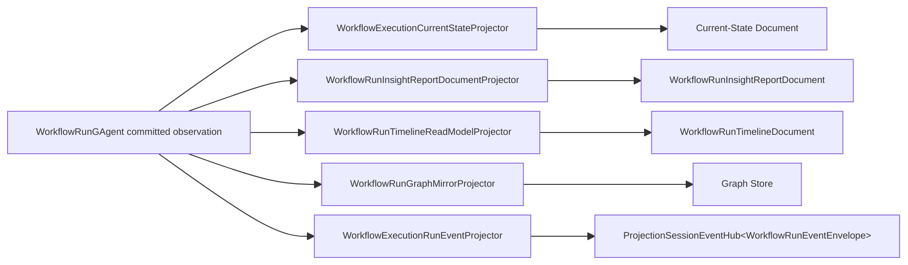

# Aevatar.Workflow.Projection

workflow 领域的 projection/readmodel 实现。当前架构已经回到单一 authority：

- authority：`WorkflowRunGAgent + WorkflowRunState + root committed events`
- durable artifacts：current-state / report / timeline / graph
- session observation：AGUI / live workflow run events

## 主链

## 组成

### durable materialization

- [WorkflowExecutionReadModelPort.cs](/Users/auric/aevatar/src/workflow/Aevatar.Workflow.Projection/Orchestration/WorkflowExecutionReadModelPort.cs)
- [WorkflowExecutionCurrentStateProjector.cs](/Users/auric/aevatar/src/workflow/Aevatar.Workflow.Projection/Projectors/WorkflowExecutionCurrentStateProjector.cs)
- [WorkflowRunInsightReportDocumentProjector.cs](/Users/auric/aevatar/src/workflow/Aevatar.Workflow.Projection/Projectors/WorkflowRunInsightReportDocumentProjector.cs)
- [WorkflowRunTimelineReadModelProjector.cs](/Users/auric/aevatar/src/workflow/Aevatar.Workflow.Projection/Projectors/WorkflowRunTimelineReadModelProjector.cs)
- [WorkflowRunGraphMirrorProjector.cs](/Users/auric/aevatar/src/workflow/Aevatar.Workflow.Projection/Projectors/WorkflowRunGraphMirrorProjector.cs)

### session observation

- [WorkflowExecutionProjectionPort.cs](/Users/auric/aevatar/src/workflow/Aevatar.Workflow.Projection/Orchestration/WorkflowExecutionProjectionPort.cs)
- [WorkflowExecutionRunEventProjector.cs](/Users/auric/aevatar/src/workflow/Aevatar.Workflow.Presentation.AGUIAdapter/WorkflowExecutionRunEventProjector.cs)

### shared artifact support

- [WorkflowExecutionArtifactProjectionSupport.cs](/Users/auric/aevatar/src/workflow/Aevatar.Workflow.Projection/Projectors/WorkflowExecutionArtifactProjectionSupport.cs)

## 关键约束

- 不存在 `WorkflowRunInsightGAgent` secondary chain
- current-state/report/timeline/graph 都直接消费 root committed observation
- session release 不会停止 durable materialization
- session activation 只保留 `rootActorId + commandId`
- graph 直接读取 graph store，不再从 report document 派生
