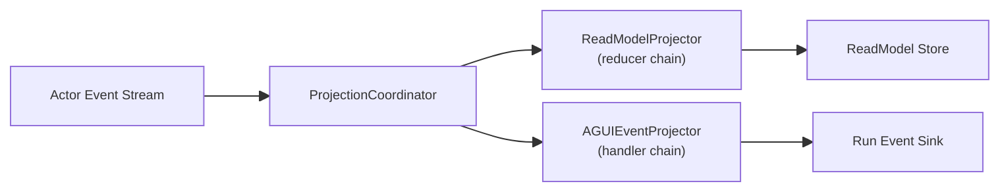

# Aevatar.Workflow.Projection

工作流 CQRS 读侧投影层。负责将事件流还原为 ReadModel、驱动 run 级投影生命周期、为 AGUI 输出与查询提供统一数据源。

## 目录结构

```
Aevatar.Workflow.Projection/
├── DependencyInjection/
│   └── ServiceCollectionExtensions.cs        # AddWorkflowExecutionProjectionCQRS()
├── Configuration/
│   └── WorkflowExecutionProjectionOptions.cs # 功能开关与超时配置
├── Abstractions/
│   ├── IWorkflowExecutionRunIdResolver.cs            # 从事件解析 runId
│   └── IWorkflowExecutionProjectionContextFactory.cs # 创建 run 级上下文
├── ReadModels/
│   ├── WorkflowExecutionReadModel.cs         # 内部 ReadModel 体系
│   └── WorkflowExecutionReadModelMapper.cs   # 内部 ReadModel -> Application 查询模型
├── Stores/
│   ├── InMemoryWorkflowExecutionReadModelStore.cs    # 默认内存存储
│   └── WorkflowExecutionReadModelNotFoundException.cs
├── RunIdResolvers/
│   ├── WorkflowCoreRunIdResolver.cs          # 从 workflow 核心事件解析 runId
│   └── AIChatSessionRunIdResolver.cs         # 从 AI chat session 事件解析 runId
├── Reducers/
│   ├── WorkflowExecutionEventReducerBase.cs          # reducer 基类
│   ├── WorkflowExecutionProjectionMutations.cs       # ReadModel 变更辅助方法
│   ├── StartWorkflowEventReducer.cs          # StartWorkflowEvent -> 初始化 ReadModel
│   ├── StepRequestEventReducer.cs            # StepRequestEvent -> 步骤轨迹
│   ├── StepCompletedEventReducer.cs          # StepCompletedEvent -> 步骤完成
│   ├── TextMessageEndEventReducer.cs         # TextMessageEndEvent -> 角色回复
│   ├── WorkflowSuspendedEventReducer.cs      # WorkflowSuspendedEvent -> 挂起态
│   └── WorkflowCompletedEventReducer.cs      # WorkflowCompletedEvent -> 最终状态
├── Projectors/
│   └── WorkflowExecutionReadModelProjector.cs # 主 projector：驱动 reducer 链更新 ReadModel
└── Orchestration/
    ├── WorkflowExecutionProjectionService.cs         # 门面：IWorkflowExecutionProjectionPort
    ├── WorkflowExecutionProjectionSession.cs         # run 级 session
    ├── WorkflowExecutionProjectionContext.cs         # run 级上下文（ReadModel + run event sink）
    ├── WorkflowExecutionProjectionContextRunEventExtensions.cs # 上下文扩展方法
    ├── DefaultWorkflowExecutionProjectionContextFactory.cs
    └── WorkflowCompletedEventProjectionCompletionDetector.cs  # 完成信号检测
```

## 统一投影链路

CQRS ReadModel 与 AGUI 输出共享同一投影管线，避免双轨实现：



1. `StartAsync`：创建 projection context，注册 actor stream 订阅  
2. 每条 `EventEnvelope` 进入 `ProjectionCoordinator`，一对多调用已注册 projector  
3. `WorkflowExecutionReadModelProjector`：驱动 reducer 链生成/更新 ReadModel  
4. `WorkflowExecutionAGUIEventProjector`（位于 `Aevatar.Workflow.Presentation.AGUIAdapter`）：映射 AGUI 事件并推入 run event sink  
5. `WaitForRunProjectionCompletionStatusAsync`：返回明确状态（Completed/TimedOut/Failed/...）  
6. `CompleteAsync`：解除订阅并完成 run 生命周期  

## 核心类型

### WorkflowExecutionProjectionService

`IWorkflowExecutionProjectionPort` 实现。应用层门面，管理：
- `StartAsync`：生成 runId、创建上下文、启动 lifecycle
- `WaitForRunProjectionCompletionStatusAsync`：等待投影完成信号
- `CompleteAsync`：完成 lifecycle、从 store 获取 ReadModel、经 mapper 转换为应用层模型
- `ListRunsAsync`/`GetRunAsync`：查询已投影的 run 数据

### WorkflowExecutionReport (ReadModel)

内部 ReadModel，包含：
- 基本信息：workflow 名称、actorId、runId、时间戳、持续时间
- 投影元数据：scope、topology source、completion status
- 步骤轨迹：`List<WorkflowExecutionStepTrace>`（每步的请求/完成时间、输出预览、参数）
- 角色回复：`List<WorkflowExecutionRoleReply>`（LLM 回复内容）
- 时间线：`List<WorkflowExecutionTimelineEvent>`（全量事件时间线）
- 拓扑：`List<WorkflowExecutionTopologyEdge>`（Agent 父子关系）
- 统计摘要：`WorkflowExecutionSummary`（步骤数、完成数、类型分布）

### Reducer 体系

每个 reducer 处理特定事件类型，对 ReadModel 做增量变更：

| Reducer | 处理事件 | 变更内容 |
|---------|----------|----------|
| `StartWorkflowEventReducer` | `StartWorkflowEvent` | 初始化 ReadModel 基本字段 |
| `StepRequestEventReducer` | `StepRequestEvent` | 创建步骤轨迹、记录请求时间 |
| `StepCompletedEventReducer` | `StepCompletedEvent` | 更新步骤完成信息、输出预览 |
| `TextMessageEndEventReducer` | `TextMessageEndEvent` | 记录角色 LLM 回复 |
| `WorkflowSuspendedEventReducer` | `WorkflowSuspendedEvent` | 记录挂起类型/提示词/超时信息 |
| `WorkflowCompletedEventReducer` | `WorkflowCompletedEvent` | 设置最终状态、输出、结束时间 |

## 扩展方式

### 新增 reducer

实现 `IProjectionEventReducer<WorkflowExecutionReport, WorkflowExecutionProjectionContext>` 并 DI 注册：

```csharp
services.AddWorkflowExecutionProjectionReducer<MyCustomReducer>();
```

### 新增 projector

实现 `IProjectionProjector<WorkflowExecutionProjectionContext, IReadOnlyList<WorkflowExecutionTopologyEdge>>` 并 DI 注册：

```csharp
services.AddWorkflowExecutionProjectionProjector<MyCustomProjector>();
```

### 替换存储

默认使用 `InMemoryWorkflowExecutionReadModelStore`。替换为持久化实现：

```csharp
services.AddWorkflowExecutionProjectionReadModelStore<PostgresReadModelStore>();
```

### 批量注册

从自定义程序集批量扫描并注册 reducer/projector：

```csharp
services.AddWorkflowExecutionProjectionExtensionsFromAssembly(typeof(MyExtension).Assembly);
```

## 配置

`WorkflowExecutionProjectionOptions`：

| 选项 | 默认 | 说明 |
|------|------|------|
| `Enabled` | `true` | 投影总开关 |
| `EnableRunQueryEndpoints` | `true` | 是否暴露 run 查询端点 |
| `RunProjectionCompletionWaitTimeoutMs` | `30000` | 等待投影完成信号超时 |
| `EnableRunEventIsolation` | `false` | 是否按 run 隔离事件流 |

## DI 入口

```csharp
services.AddWorkflowExecutionProjectionCQRS(opt =>
{
    opt.Enabled = true;
    opt.EnableRunEventIsolation = false;
});
```

## 分层边界

- `Aevatar.Workflow.Host.Api` 通过 `Aevatar.Workflow.Application` 调用本项目，不直接编排投影内核细节
- API 层仅负责协议适配（SSE/WebSocket/HTTP Query）

## 依赖

- `Aevatar.Workflow.Application.Abstractions`
- `Aevatar.Workflow.Core`
- `Aevatar.CQRS.Projection.Abstractions`、`Aevatar.CQRS.Projection.Core`
- `Aevatar.AI.Abstractions`、`Aevatar.Foundation.Abstractions`
- `Google.Protobuf`
- `Microsoft.Extensions.DependencyInjection`
