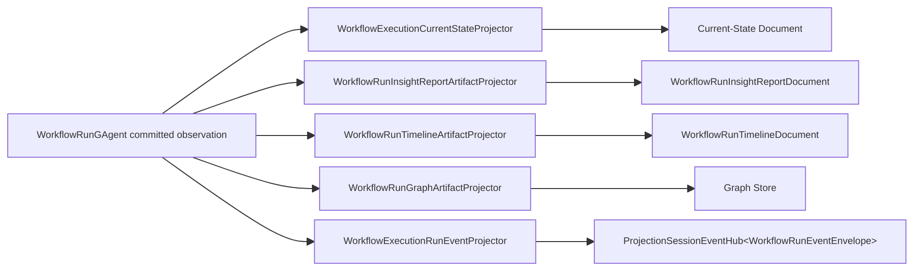

# Aevatar.Workflow.Projection

workflow 领域的 projection/readmodel 实现。当前 durable materialization 已显式拆分为 authority current-state replica 和 derived artifacts：

- authority：`WorkflowRunGAgent + WorkflowRunState + root committed events`
- current-state replica：`WorkflowExecutionCurrentStateDocument`
- durable artifacts：report / timeline / graph / actor binding
- session observation：AGUI / live workflow run events

## 主链

## 组成

### durable materialization

- [WorkflowExecutionMaterializationPort.cs](/Users/auric/aevatar/src/workflow/Aevatar.Workflow.Projection/Orchestration/WorkflowExecutionMaterializationPort.cs)
- [WorkflowExecutionCurrentStateQueryPort.cs](/Users/auric/aevatar/src/workflow/Aevatar.Workflow.Projection/Orchestration/WorkflowExecutionCurrentStateQueryPort.cs)
- [WorkflowExecutionArtifactQueryPort.cs](/Users/auric/aevatar/src/workflow/Aevatar.Workflow.Projection/Orchestration/WorkflowExecutionArtifactQueryPort.cs)
- [WorkflowExecutionCurrentStateProjector.cs](/Users/auric/aevatar/src/workflow/Aevatar.Workflow.Projection/Projectors/WorkflowExecutionCurrentStateProjector.cs)
- [WorkflowRunInsightReportArtifactProjector.cs](/Users/auric/aevatar/src/workflow/Aevatar.Workflow.Projection/Projectors/WorkflowRunInsightReportArtifactProjector.cs)
- [WorkflowRunTimelineArtifactProjector.cs](/Users/auric/aevatar/src/workflow/Aevatar.Workflow.Projection/Projectors/WorkflowRunTimelineArtifactProjector.cs)
- [WorkflowRunGraphArtifactProjector.cs](/Users/auric/aevatar/src/workflow/Aevatar.Workflow.Projection/Projectors/WorkflowRunGraphArtifactProjector.cs)
- [WorkflowRunGraphArtifactMaterializer.cs](/Users/auric/aevatar/src/workflow/Aevatar.Workflow.Projection/ReadModels/WorkflowRunGraphArtifactMaterializer.cs)

### session observation

- [WorkflowExecutionProjectionPort.cs](/Users/auric/aevatar/src/workflow/Aevatar.Workflow.Projection/Orchestration/WorkflowExecutionProjectionPort.cs)
- [WorkflowExecutionRunEventProjector.cs](/Users/auric/aevatar/src/workflow/Aevatar.Workflow.Presentation.AGUIAdapter/WorkflowExecutionRunEventProjector.cs)

### shared artifact support

- [WorkflowExecutionArtifactMaterializationSupport.cs](/Users/auric/aevatar/src/workflow/Aevatar.Workflow.Projection/Projectors/WorkflowExecutionArtifactMaterializationSupport.cs)

## 关键约束

- 不存在 `WorkflowRunInsightGAgent` secondary chain
- current-state 只承认 actor-scoped current-state replica
- report/timeline/graph 明确属于 derived durable artifacts
- current-state/report/timeline/graph 都直接消费 root committed observation
- session release 不会停止 durable materialization
- session activation 只保留 `rootActorId + commandId`
- graph 直接读取 graph store，不再从 report document 派生
