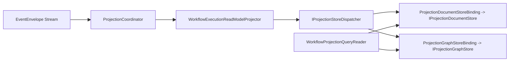

# Aevatar.Workflow.Projection

`Aevatar.Workflow.Projection` 是 Workflow 领域的 CQRS 读侧实现层。

## 职责

- Workflow ReadModel 与 Reducer/Projector
- Projection 生命周期编排（启动、订阅、释放）
- Query 映射（Snapshot/Timeline/Graph）
- 与 Runtime Store Dispatcher 集成

## 统一投影链路

## 关键约束

1. `WorkflowExecutionReadModelProjector` 通过 `IProjectionStoreDispatcher` 同步写入 Document + Graph。
2. Query 来源是 Document Store（`Get/List`）；Graph 用于关系查询与子图遍历。
3. Document 与 Graph Provider 为平行关系，不存在主从继承关系。

## Provider 组合（Host 层）

- 由 `Aevatar.Workflow.Extensions.Hosting` 装配。
- 同类 Provider 只允许一个：
  - Document: `Elasticsearch` 或 `InMemory`
  - Graph: `Neo4j` 或 `InMemory`
- 一个 ReadModel 同时写入 Document + Graph（一对多）。

## 配置

- `Projection:Document:Providers:Elasticsearch:Enabled`
- `Projection:Document:Providers:InMemory:Enabled`
- `Projection:Graph:Providers:Neo4j:Enabled`
- `Projection:Graph:Providers:InMemory:Enabled`
- `Projection:Policies:DenyInMemoryGraphFactStore`

