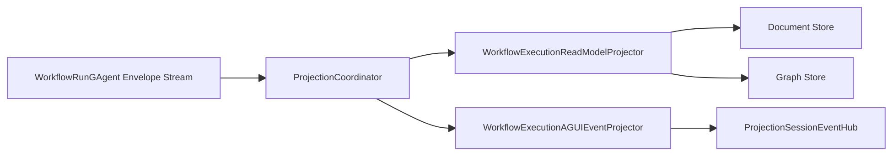

# Aevatar.Workflow.Projection

Workflow 领域的 CQRS 读侧实现。当前投影已经切到 run-isolated 语义：

- Projection root 是 `WorkflowRunGAgent` actor id
- `WorkflowExecutionReport.ProjectionScope = RunIsolated`
- ReadModel / Graph / AGUI 都消费同一条 run actor envelope 流

口径说明：

- 这里消费的是 run actor 的 runtime message stream。
- `EventEnvelope` 不是 Event Sourcing 的 `StateEvent`；Projection 当前面向的是运行时 envelope 主链路。

## 组成

- `WorkflowExecutionReadModelProjector`
- `WorkflowExecutionAGUIEventProjector`
- `WorkflowProjectionActivationService`
- `WorkflowProjectionReleaseService`
- `WorkflowProjectionQueryReader`
- `WorkflowProjectionReadModelUpdater`

## 主链路

## 关键约束

- 不新增第二条 workflow read-side pipeline
- 不使用中间层进程内事实映射管理投影生命周期
- projection ownership 继续由 coordinator actor/分布式状态串行裁决
- query 返回的是 run actor 快照，不再是 definition actor 共享会话

## ReadModel 语义

`WorkflowExecutionReport` 当前表达的是单次 run：

- `Id = RootActorId = run actor id`
- `CommandId` 标识该次启动请求
- `Topology` 记录 run actor 与角色/子 workflow actor 的关系
- `Steps` / `Timeline` / `RoleReplies` 记录该 run 的执行过程

## Query

Query reader 对外仍保留 `/api/actors/*` 这组接口名，但语义已经切成：

- actor = run actor
- graph root = run actor
- snapshot/timeline/subgraph 全部按 run-isolated 返回
