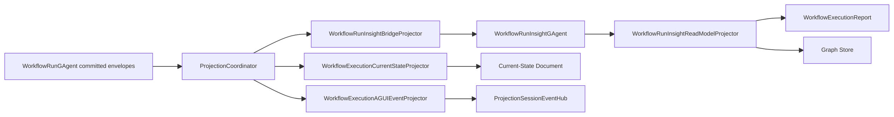

# Aevatar.Workflow.Projection

Workflow 领域的 CQRS 读侧实现。当前投影已经切到 run-isolated 语义：

- Projection root 是 `WorkflowRunGAgent` actor id
- `WorkflowExecutionReport.ProjectionScope = RunIsolated`
- current-state / insight report / graph / AGUI 都消费同一条 committed observation 主链

口径说明：

- current-state readmodel 直接消费 `EventEnvelope<CommittedStateEventPublished>` 中的 committed state。
- workflow insight/report 不再由 projection 自己维护第二套状态机；run events 会先桥接到 `WorkflowRunInsightGAgent`，再由 insight actor 的 committed state 物化成 report readmodel。

## 组成

- `WorkflowExecutionProjectionPort`
- `WorkflowRunInsightBridgeProjector`
- `WorkflowRunInsightReadModelProjector`
- `WorkflowExecutionAGUIEventProjector`
- `ContextProjectionActivationService<WorkflowExecutionRuntimeLease, WorkflowExecutionProjectionContext, IReadOnlyList<WorkflowExecutionTopologyEdge>>`
- `ContextProjectionReleaseService<WorkflowExecutionRuntimeLease, WorkflowExecutionProjectionContext, IReadOnlyList<WorkflowExecutionTopologyEdge>>`
- `WorkflowProjectionQueryReader`

`WorkflowRunInsightBridgeProjector` 现在只负责把 committed workflow/AI events 转成 `WorkflowRunInsightGAgent` 的输入，不再在 projection 层直接维护 report 状态机。

## 主链路

## 关键约束

- 不新增第二条 workflow read-side pipeline
- 不使用中间层进程内事实映射管理投影生命周期
- projection ownership 继续由 coordinator actor/分布式状态串行裁决
- query 返回的是 run actor 快照，不再是 definition actor 共享会话

## ReadModel 语义

`WorkflowExecutionReport` 当前表达的是单次 run：

- `Id = RootActorId = run actor id`
- `CommandId` 标识该次启动请求
- `Topology` 记录 insight actor 持有的 run actor 与角色/子 workflow actor 的关系
- `Steps` / `Timeline` / `RoleReplies` 记录 insight actor 拥有的执行语义

## Query

Query reader 对外仍保留 `/api/actors/*` 这组接口名，但语义已经切成：

- actor = run actor
- graph root = run actor
- snapshot/timeline/subgraph 全部按 run-isolated 返回
