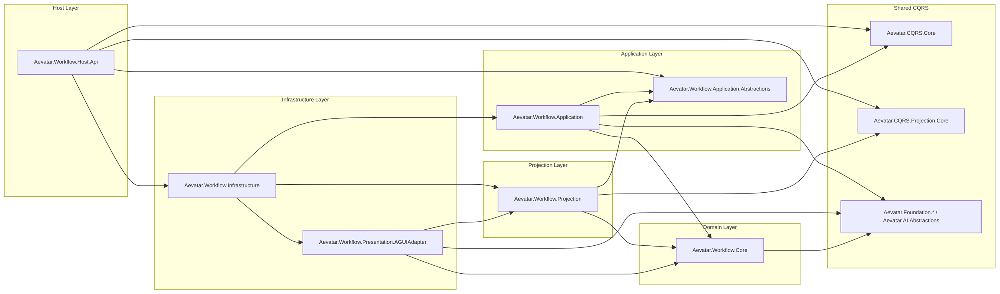
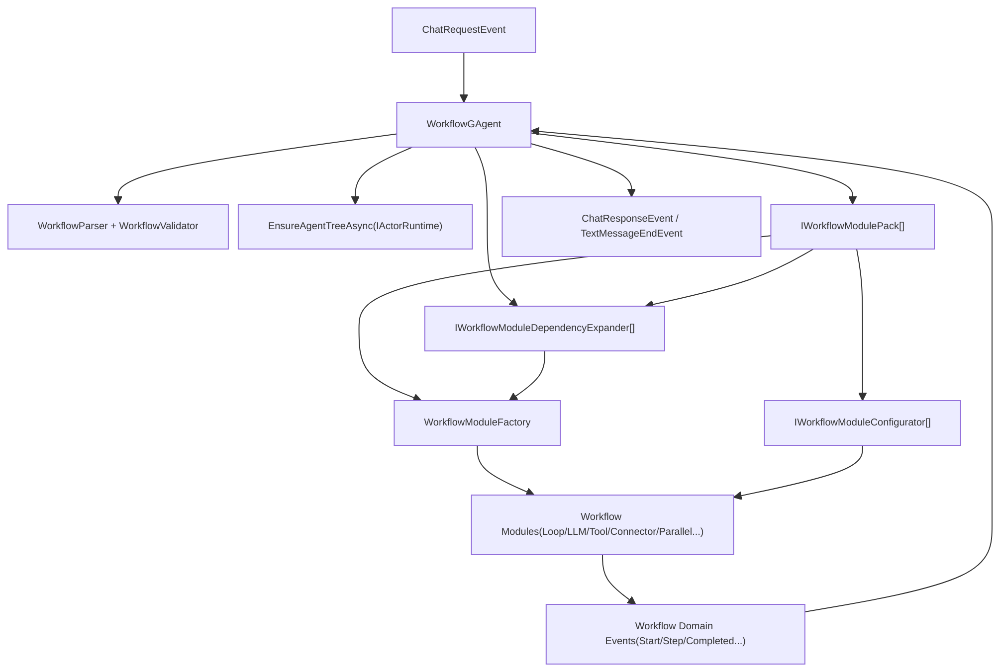
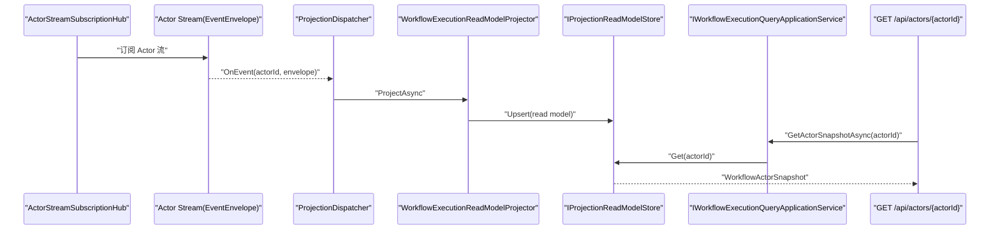

# Workflow 能力架构（`src/workflow`）

本文档描述 `src/workflow` 的完整实现关系。当前语义是：一次 `Run` 本质上就是向 `WorkflowGAgent` 触发一次 `ChatRequestEvent`，后续全部通过事件流驱动执行与投影。`commandId` 保留在 CQRS/Application 侧，不注入 Actor 事件 payload 或 Envelope metadata。

## 0. 运行语义约束（2026-02-19 更新）

- 一个 `Workflow` 对应一个 `WorkflowGAgent`（一个 Actor）。
- Actor 首次创建时绑定 workflow；绑定后不允许切换到另一个 workflow。
- 带 `actorId` 的 run 请求只能“继续在该 Actor 上运行”；不能借同一个 `actorId` 切 workflow。
- 若需要执行另一个 workflow，必须创建新的 Actor。

## 1. 分层与项目依赖图

## 2. Run 执行主链路（命令侧）

## 3. 统一 Projection Pipeline（读侧 + AGUI）

```mermaid
%%{init: {"maxTextSize": 100000, "flowchart": {"useMaxWidth": false, "nodeSpacing": 10, "rankSpacing": 50}, "themeVariables": {"fontSize": "10px"}}}%%
flowchart LR
  ES["Actor Event Stream(EventEnvelope)"]
  LIFE["ProjectionLifecycleService"]
  REG["ProjectionSubscriptionRegistry"]
  HUB["ActorStreamSubscriptionHub(EventEnvelope)"]
  DIS["ProjectionDispatcher"]
  COOR["ProjectionCoordinator"]

  RM["WorkflowExecutionReadModelProjector"]
  RED["Reducers(Start/Step/TextEnd/Completed)"]
  STORE["IProjectionReadModelStore(WorkflowExecutionReport)"]

  AGP["WorkflowExecutionAGUIEventProjector"]
  MAP["EventEnvelopeToAGUIEventMapper + Handlers"]
  BUS["ProjectionSessionEventHub<WorkflowRunEvent>\nworkflow-run:{actorId}:{commandId}"]
  CH["WorkflowRunEventChannel"]

  QP["WorkflowExecutionProjectionService(IWorkflowExecutionProjectionPort)"]
  QS["WorkflowExecutionQueryApplicationService"]
  APIQ["/api/actors/* Query Endpoints"]

  LIFE --> REG
  REG --> HUB
  HUB --> ES
  ES --> DIS
  DIS --> COOR

  COOR --> RM
  RM --> RED
  RED --> STORE

  COOR --> AGP
  AGP --> MAP
  MAP --> BUS
  QP --> BUS
  BUS --> CH

  STORE --> QP
  QP --> QS
  QS --> APIQ
```

## 4. Workflow Core 内部类关系

## 5. ReadModel 查询链路

## 6. 关键实现约束

- Host 仅做协议适配与 DI 组合，不承载业务编排。
- 一个 workflow 对应一个 actor；workflow 与 actor 绑定后不可变。
- 传入 `actorId` 的 run 请求不允许切换 workflow；workflow 变更必须创建新 actor。
- `WorkflowGAgent` 子 Actor ID 使用 `"{parentActorId}:{roleId}"` 命名空间，避免跨 workflow 根 Actor 冲突。
- Actor 事件域不承载 CQRS 命令语义：不在 `EventEnvelope` metadata 与 `StartWorkflowEvent` 中传递 `commandId`。
- `WorkflowExecutionProjectionService` 以 `ActorId` 为共享投影上下文键，同一 Actor 多次触发共享读模型与事件流。
- Projection 启动并发（`Ensure/Release`）由 `projection:{rootActorId}` 协调 Actor 串行裁决，不依赖进程内 `SemaphoreSlim`。
- `AttachLiveSink/DetachLiveSink` 通过 `workflow-run:{actorId}:{commandId}` 事件流订阅/退订，不在 `WorkflowExecutionProjectionContext` 维护 sink 事实态。
- CQRS 与 AGUI 复用同一输入事件流（统一 `ProjectionCoordinator`），通过不同 Projector 分支输出。
- AGUI `runId` 优先使用 `correlationId`（命令维度），`threadId` 维持 actor 维度。
- Workflow 能力执行状态查询统一由 Projection ReadModel 提供，不引入独立状态机层。
- `/api/agents` 仅返回 `WorkflowGAgent`，避免混入其他能力 Actor。
- workflow 文件加载为启动期 fail-fast：重复名称或未知 YAML 字段直接失败，不做静默覆盖。
- Workflow 内建模块与扩展模块统一走 `IWorkflowModulePack` 注册；`WorkflowModuleFactory` 聚合创建并对同名模块冲突 fail-fast。

## 7. Metadata 语义备注（防混淆）

- `EventEnvelope.Metadata` 是包络级传输/追踪元信息，参与内部传播策略，不等同业务结果字段。
- `StepCompletedEvent.Metadata` 是业务事件级元信息（如 `maker.*`、`connector.*`、`parallel.*`）。
- Workflow ReadModel 记录的是 `StepCompletedEvent.Metadata`（`CompletionMetadata` 与 timeline `Data`）。
- 实时输出链路当前仅保证 run/step 基本事件；`StepCompletedEvent.Metadata` 默认不直接透传到 `WorkflowRunEvent`。
