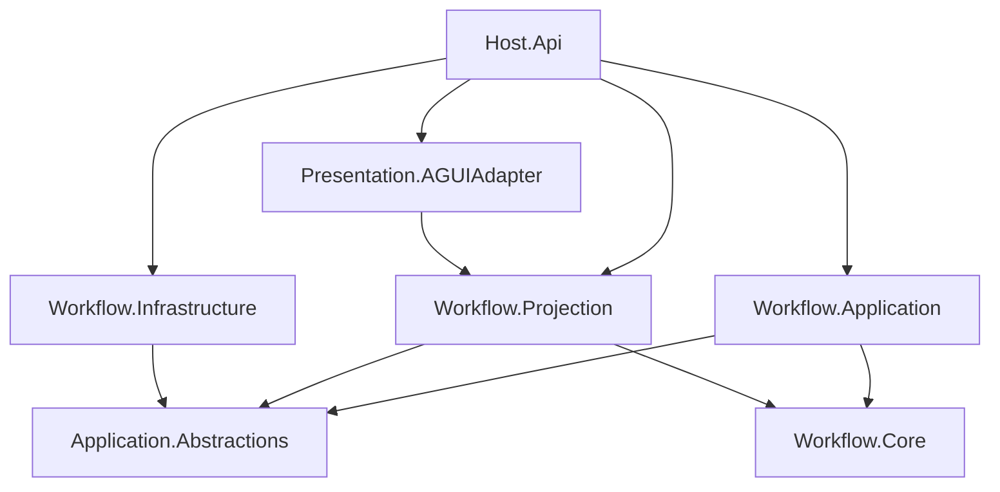

# Workflow 子系统

`src/workflow/` 是 Aevatar 的工作流引擎子系统，负责 YAML 工作流的解析、编排、执行、投影与协议输出。

## 项目一览

| 项目 | 层级 | 职责 |
|------|------|------|
| `Aevatar.Workflow.Core` | Domain | 工作流引擎内核：`WorkflowGAgent`、步骤模块、Connector、YAML DSL |
| `Aevatar.Workflow.Application` | Application | 用例编排：run 启动/流式输出/完成收敛、查询门面、workflow 注册表 |
| `Aevatar.Workflow.Application.Abstractions` | Application 契约 | 稳定端口：`IWorkflowChatRunApplicationService`、Query/Run/Report 契约 |
| `Aevatar.Workflow.Projection` | Application (CQRS 读侧) | 投影管线：ReadModel、Reducer、Projector、run 生命周期编排 |
| `Aevatar.Workflow.Presentation.AGUIAdapter` | Presentation 适配 | `EventEnvelope -> AGUIEvent -> WorkflowRunEvent` 协议转换 |
| `Aevatar.Workflow.Infrastructure` | Infrastructure | 文件加载、报告落盘、启动装配 |

## 分层依赖关系



关键约束：

- `Core` 不依赖 `Application`；`Infrastructure` 不依赖 `Application` 实现。
- `Presentation.AGUIAdapter` 依赖 `Projection`，但不依赖 `Application` 实现。
- `Host` 做组合与协议适配，不承载业务编排。

## 执行链路概览

```
POST /api/chat
  -> WorkflowChatRunApplicationService.ExecuteAsync
     -> WorkflowRunActorResolver: 解析/创建 WorkflowGAgent
     -> WorkflowExecutionRunOrchestrator.StartAsync: 启动投影 run
     -> WorkflowRunRequestExecutor: 投递 ChatRequestEvent
     -> WorkflowGAgent: 编译 YAML、创建角色树、安装模块
        -> WorkflowLoopModule: 按步骤顺序派发
           -> LLMCallModule / ConnectorCallModule / ParallelFanOutModule / ...
     -> 事件 -> 统一 Projection Pipeline
        -> WorkflowExecutionReadModelProjector (ReadModel 分支)
        -> WorkflowExecutionAGUIEventProjector (AGUI 输出分支)
     -> WorkflowRunOutputStreamer: 读取 run 事件 -> WorkflowOutputFrame
     -> WorkflowExecutionRunOrchestrator.FinalizeAsync: 等待投影收敛、生成报告
  <- SSE 流返回客户端
```

## 内置步骤模块

| 类别 | 步骤类型 | 模块类 | 别名 |
|------|----------|--------|------|
| 引擎 | `workflow_loop` | `WorkflowLoopModule` | - |
| 流程 | `conditional` | `ConditionalModule` | - |
| | `while` | `WhileModule` | `loop` |
| | `workflow_call` | `WorkflowCallModule` | `sub_workflow` |
| | `checkpoint` | `CheckpointModule` | - |
| | `assign` | `AssignModule` | - |
| 并行 | `parallel_fanout` | `ParallelFanOutModule` | `parallel`、`fan_out` |
| 共识 | `vote_consensus` | `VoteConsensusModule` | `vote` |
| 迭代 | `foreach` | `ForEachModule` | `for_each` |
| 执行 | `llm_call` | `LLMCallModule` | - |
| | `tool_call` | `ToolCallModule` | - |
| | `connector_call` | `ConnectorCallModule` | `bridge_call` |
| 数据 | `transform` | `TransformModule` | - |
| | `retrieve_facts` | `RetrieveFactsModule` | - |

## 模块装配机制

`WorkflowGAgent` 不内嵌硬编码的模块推断逻辑，而是通过组合策略扩展：

1. **依赖推导**（`IWorkflowModuleDependencyExpander`）：根据 workflow 定义推导所需模块集合。
   - `WorkflowLoopModuleDependencyExpander`：始终引入 `workflow_loop`
   - `WorkflowStepTypeModuleDependencyExpander`：按 step type 推导
   - `WorkflowImplicitModuleDependencyExpander`：补齐隐式依赖（如 `parallel -> llm_call`）
2. **实例配置**（`IWorkflowModuleConfigurator`）：对已创建的模块实例做初始化。
   - `WorkflowLoopModuleConfigurator`：向 `WorkflowLoopModule` 注入编译后的 workflow

新增模块：实现 `IEventModule` + DI 注册 `AddWorkflowModule<T>("name", "alias")` 即可。

## DI 组合示例

宿主启动时组合全部层：

```csharp
services
    .AddAevatarWorkflow()                          // Core: 模块、工厂、connector registry
    .AddWorkflowApplication()                      // Application: 用例编排
    .AddWorkflowExecutionProjectionCQRS()           // Projection: CQRS 读侧
    .AddWorkflowExecutionAGUIAdapter()              // Presentation: AGUI 输出
    .AddWorkflowInfrastructure()                    // Infrastructure: 报告落盘
    .AddWorkflowDefinitionFileSource();             // Infrastructure: 文件加载
```

## 代码统计

| 项目 | .cs 文件数 | 主要关注点 |
|------|-----------|-----------|
| Core | ~35 | 引擎内核，模块数量最多 |
| Application | ~21 | 用例编排，run 生命周期 |
| Application.Abstractions | ~8 | 稳定契约，变更频率最低 |
| Projection | ~24 | CQRS 投影，reducer/projector 最多 |
| Presentation.AGUIAdapter | ~4 | 协议适配，handler chain |
| Infrastructure | ~7 | IO 操作，配置加载 |
