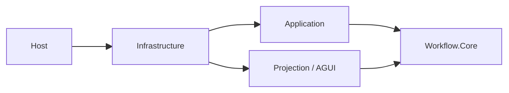
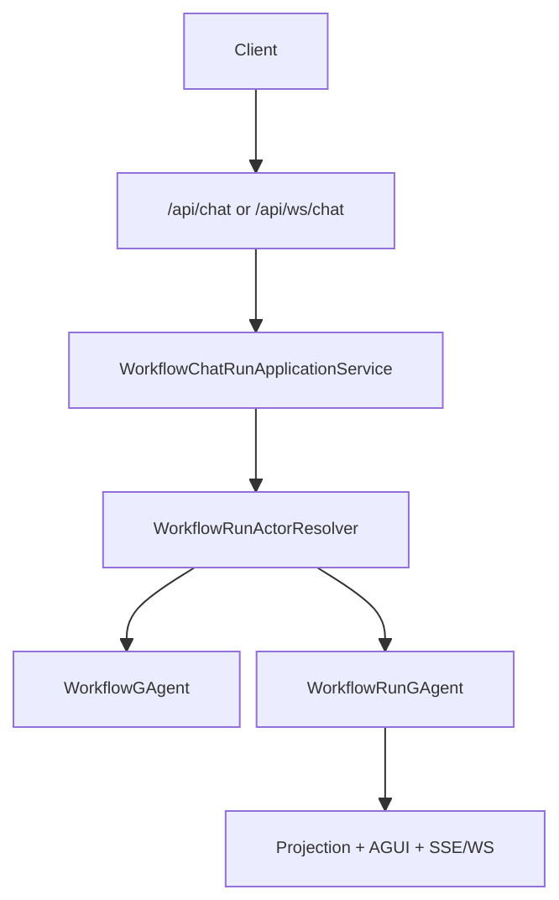

# Workflow 能力架构

`src/workflow` 现在基于“definition actor + run actor + unified projection pipeline”运行。

最重要的边界：

1. `WorkflowGAgent` 只负责 workflow definition/binding。
2. `WorkflowRunGAgent` 只负责单次 accepted run 的持久事实与执行推进。
3. Host/Application 只做入口编排与 live sink 生命周期管理，不持有跨请求事实态。
4. Projection 与 AGUI 继续共享同一条事件输入链路。

## 1. 子系统分层



目录职责：

- `Aevatar.Workflow.Core`
  definition actor、run actor、workflow DSL、内置原语、connector 桥接
- `Aevatar.Workflow.Application`
  run context 构建、definition/run actor 解析、命令编排、输出流化
- `Aevatar.Workflow.Infrastructure`
  HTTP/WS capability API、run actor port、宿主协议适配
- `Aevatar.Workflow.Projection`
  read model projector、query/read ports、projection lifecycle
- `Aevatar.Workflow.Presentation.AGUIAdapter`
  `EventEnvelope -> WorkflowRunEvent` 映射与 AGUI 实时事件分支

## 2. 运行语义

### 2.1 Definition 与 Run 分离

- definition actor:
  - 持久化 workflow YAML、workflow name、compiled 状态、执行计数
  - 对外暴露 definition snapshot
- run actor:
  - 持久化一次 run 的 `run_id/status/variables/active_step`
  - 持久化所有 pending async facts
  - 负责 callback、signal、human gate、sub-workflow completion 对账

### 2.2 中间层不保存事实态

Application / Projection / Host 中不允许：

- `runId -> actor/context` 字典事实态
- `sessionId -> waiter` 字典事实态
- `actorId -> live sink` 作为唯一事实源

跨请求一致性事实必须在 actor state 或分布式状态中。

## 3. 主链路



1. `WorkflowRunActorResolver` 解析 definition 来源并创建 `WorkflowRunGAgent`。
2. `WorkflowRunContextFactory` 建立 projection lease 和 live sink。
3. `WorkflowRunExecutionEngine` 向 run actor 投递 `ChatRequestEvent`。
4. run actor 发布 workflow 事件，投影管线把它们转成 read model 与 `WorkflowRunEvent`。

## 4. 当前可扩展面

唯一保留的 workflow runtime 扩展面是 `IWorkflowModulePack`：

```csharp
public interface IWorkflowModulePack
{
    string Name { get; }
    IReadOnlyList<WorkflowModuleRegistration> Modules { get; }
}
```

约束：

1. pack 只注册无状态原语。
2. 旧 `DependencyExpander` / `Configurator` 扩展点已移除。
3. 若原语需要跨事件 pending 或恢复语义，必须进入 `WorkflowRunState` 和 `WorkflowRunGAgent`，不能只靠 module。

## 5. 对外控制句柄

启动请求可能同时涉及两个 actor id：

- `definitionActorId`
  绑定来源句柄
- `runActorId`
  运行控制句柄

后续所有运行态控制都只接受 `runActorId`：

- `/api/workflows/resume`
- `/api/workflows/signal`
- read/query/live sink

`resume` 使用 `resumeToken`，`signal` 使用 `waitToken`。

## 6. 推荐阅读顺序

1. `docs/WORKFLOW.md`
2. `src/workflow/Aevatar.Workflow.Core/README.md`
3. `docs/WORKFLOW_LLM_STREAMING_ARCHITECTURE.md`
4. `docs/architecture/workflow-runtime-actorized-run-persistent-state-refactor-blueprint-2026-03-07.md`
