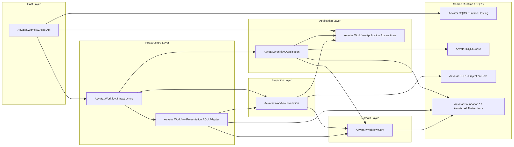
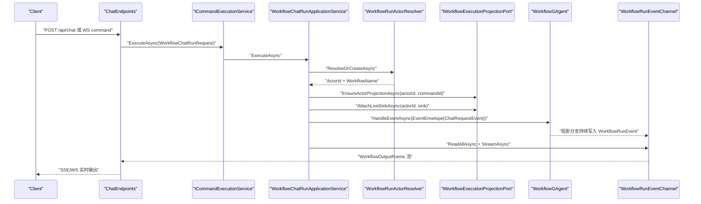
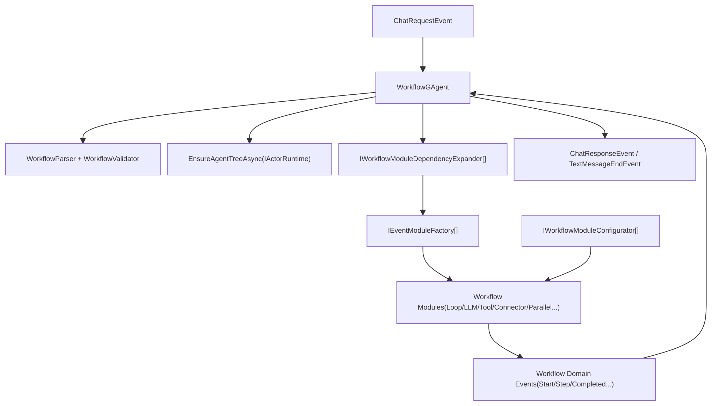

# Workflow 子系统架构（`src/workflow`）

本文档描述 `src/workflow` 的完整实现关系。当前语义是：一次 `Run` 本质上就是向 `WorkflowGAgent` 触发一次命令事件（`ChatRequestEvent`），后续全部通过事件流驱动执行与投影。

## 1. 分层与项目依赖图

## 2. Run 执行主链路（命令侧）

## 3. 统一 Projection Pipeline（读侧 + AGUI）

```mermaid
%%{init: {"maxTextSize": 100000, "flowchart": {"useMaxWidth": false, "nodeSpacing": 10, "rankSpacing": 50}, "themeVariables": {"fontSize": "10px"}}}%%
flowchart LR
  ES["Actor Event Stream(EventEnvelope)"]
  LIFE["ProjectionLifecycleService"]
  REG["ProjectionSubscriptionRegistry"]
  HUB["ActorStreamSubscriptionHub(EventEnvelope)"]
  COOR["ProjectionCoordinator"]

  RM["WorkflowExecutionReadModelProjector"]
  RED["Reducers(Start/Step/TextEnd/Completed)"]
  STORE["IProjectionReadModelStore(WorkflowExecutionReport)"]

  AGP["WorkflowExecutionAGUIEventProjector"]
  MAP["EventEnvelopeToAGUIEventMapper + Handlers"]
  CTX["WorkflowExecutionProjectionContext.LiveSinks"]
  CH["WorkflowRunEventChannel"]

  QP["WorkflowExecutionProjectionService(IWorkflowExecutionProjectionPort)"]
  QS["WorkflowExecutionQueryApplicationService"]
  APIQ["/api/actors/* Query Endpoints"]

  LIFE --> REG
  REG --> HUB
  HUB --> ES
  ES --> COOR

  COOR --> RM
  RM --> RED
  RED --> STORE

  COOR --> AGP
  AGP --> MAP
  MAP --> CTX
  CTX --> CH

  STORE --> QP
  QP --> QS
  QS --> APIQ
```

## 4. Workflow Core 内部类关系

## 5. 关键实现约束

- Host 仅做协议适配与 DI 组合，不承载业务编排。
- `WorkflowExecutionProjectionService` 以 `ActorId` 为共享投影上下文键，同一 Actor 多次触发共享读模型与事件流。
- CQRS 与 AGUI 复用同一输入事件流（统一 `ProjectionCoordinator`），通过不同 Projector 分支输出。
