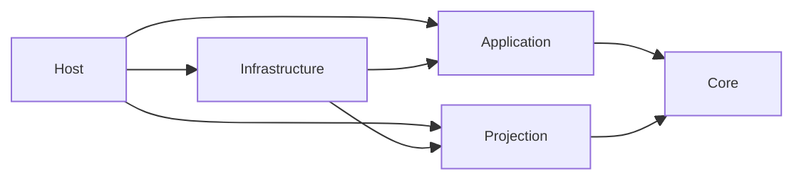

# Workflow 能力架构（`src/workflow`）

`src/workflow` 已切换到“定义 Actor + 运行 Actor”的单一执行主干：

- `WorkflowGAgent` 只承载 workflow definition facts。
- `WorkflowRunGAgent` 一次 run 一个 actor，承载全部运行事实。
- `IEventModule` 只做事件处理与 effect adapter，不再持有权威运行态。
- workflow 读侧与 AGUI 继续共用同一条 Projection Pipeline。

更完整的设计说明见：

- `docs/architecture/workflow-run-actorized-state-boundary-blueprint-2026-03-08.md`
- `docs/architecture/workflow-run-actorized-target-architecture-2026-03-08.md`

## 当前运行语义

- 一个 workflow definition 对应一个 `WorkflowGAgent`。
- 一次 workflow run 对应一个 `WorkflowRunGAgent`。
- `POST /api/chat` 会解析 workflow source，然后创建新的 run actor 执行。
- `/api/workflows/resume` 与 `/api/workflows/signal` 必须指向 run actor id，而不是 definition actor id。
- run actor 的投影、实时输出、查询默认都以 run actor id 为作用域。

## 分层关系

## 命令侧主链路

1. Host/API 把输入规范化为 `WorkflowChatRunRequest`。
2. Application 通过 `WorkflowRunActorResolver` 解析 workflow source。
3. Infrastructure 通过 `IWorkflowRunActorPort` 创建 definition actor 或复用 source binding，并创建新的 run actor。
4. Application 为 run actor 建立 projection lease 与 live sink。
5. `WorkflowRunExecutionEngine` 向 run actor 发送 `ChatRequestEvent`。
6. `WorkflowRunGAgent` 在自己的事件管线中驱动 `StartWorkflowEvent -> StepRequestEvent -> StepCompletedEvent -> WorkflowCompletedEvent`。
7. Projection 与 AGUI 从同一条 run actor 事件流投影出查询模型和实时事件。

## 状态边界

- definition facts：
  - `WorkflowName`
  - `WorkflowYaml`
  - `InlineWorkflowYamls`
  - 编译结果与版本
- run facts：
  - `RunId`
  - `DefinitionActorId`
  - `Status/Input/FinalOutput/FinalError`
  - 子工作流绑定与调用关系
  - 所有模块运行态（通过 `module_state_json` 由 run actor 持久化）

模块私有字段不再作为 `run/step/session` 的事实源。`delay / wait_signal / workflow_loop / human_* / parallel* / map_reduce / llm_call` 等运行态都必须落到 run actor 状态里。

## Projection 语义

- Projection root 是 run actor id。
- 读侧 `ProjectionScope` 为 `RunIsolated`。
- `/api/agents` 返回的是 workflow run snapshots，不再表示 definition actors 列表。
- Graph/Timeline/Snapshot 查询都围绕 run actor 展开。

## API 语义

- `ChatInput.AgentId` 表示 workflow source actor id。推荐传 definition actor id；如果传的是已绑定 workflow 的 run actor，系统会读取其 definition binding 再创建新的 run actor。
- `WorkflowChatRunStarted.ActorId` 是新创建的 run actor id。
- resume/signal 请求中的 `ActorId` 必须是 run actor id。

## 目录概览

- `Aevatar.Workflow.Core`
  - definition actor、run actor、模块工厂、内置步骤模块、workflow primitives
- `Aevatar.Workflow.Application`
  - run 用例编排、actor 解析、projection lease 建立、查询门面
- `Aevatar.Workflow.Infrastructure`
  - actor port、capability API、workflow 文件加载、报告落盘
- `Aevatar.Workflow.Projection`
  - workflow read model、projector/reducer、query reader、projection lifecycle
- `Aevatar.Workflow.Presentation.AGUIAdapter`
  - workflow projection 到 AGUI 事件的适配
